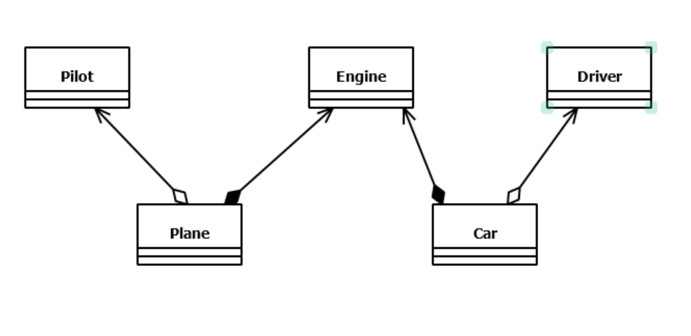
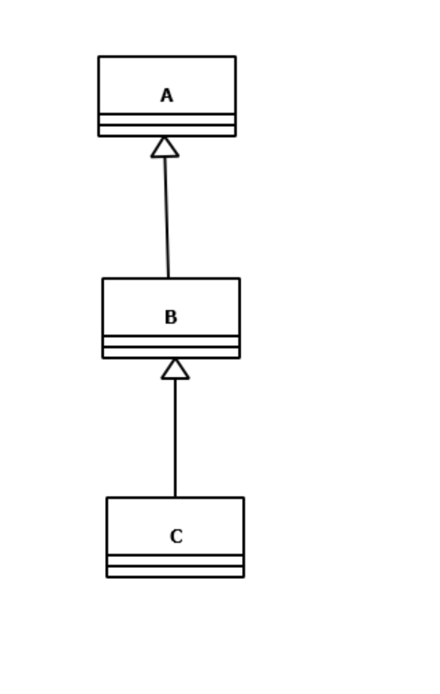
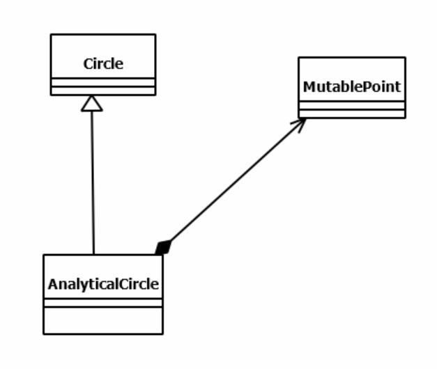
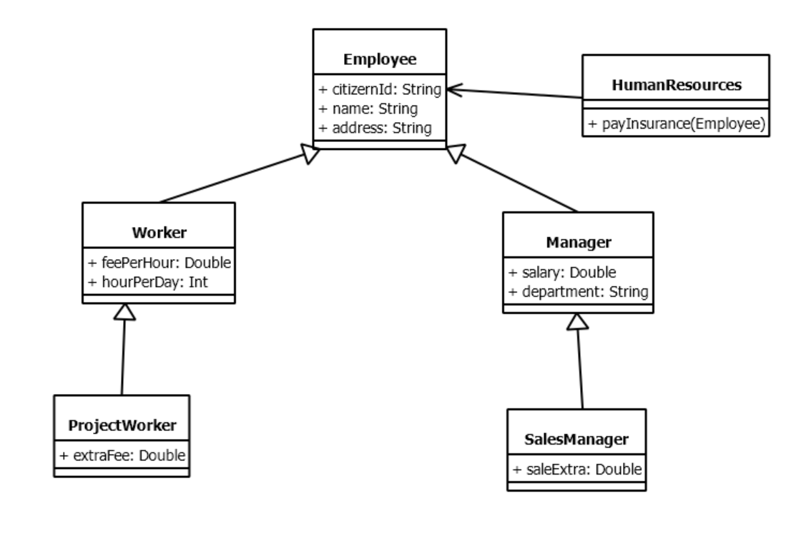
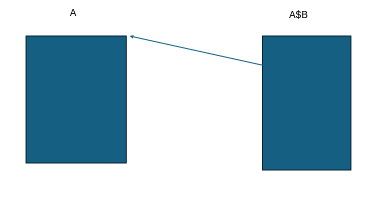
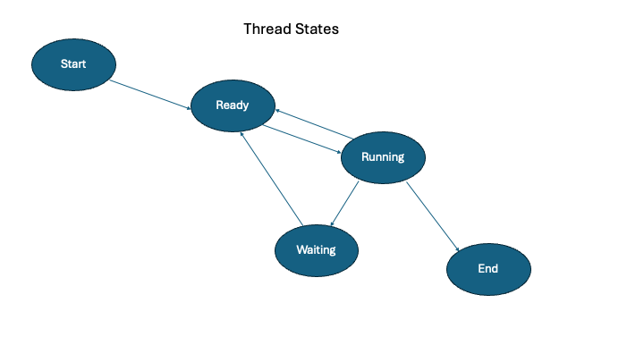

### C ve Sistem Programcıları Derneği

### Java Programcıları için Kotlin Programlama Dili
### Eğitmen: Oğuz KARAN

#### Düzenleyenler: Anıl Bozkırlı, Bartu Çankaya, Eda Akyıl, Yılmaz Kurtuluş

**_Anahtar Notlar:_** Burada ağırlıklı olarak KotlinJVM üzerinde durulacaktır.

>Hello, World programı
>
>`Kotlin 1.3` versiyonundan itibaren main fonksiyonunun parametresi olmak zorunda değildir.

```kotlin
package org.csystem.app

fun main() {
    println("Hello, World")
}
```

**Anahtar Notlar:** Kotlin'de bir fonksiyon fun anahtar sözcüğü ile bildirilir. Kotlin'de bir fonksiyonun geri dönüş değeri fonksiyon isminden önce yazılmaz. Bir fonksiyonun geri dönüş değeri yoksa herhangi bir geri dönüş değeri bilgisi yazılmayabilir.

>Bir fonksiyonu çağıran fonksiyon (caller) ile çağrılan fonksiyon (callee) aynı pakette ise paket ismi kullanılmayabilir. Yani aynı `.kt` uzantılı dosyada bulunan veya farklı dosyada fakat aynı paket altında bulunan fonksiyonlar doğrudan çağrılabilir.

```kotlin
package org.csystem.app

fun main() {
    println("Hello, World")
    foo()
    println("Goodbye, World")
}

fun foo() {
    println("foo")
    bar()
}

fun bar() {
    println("bar")
}
```

>Bir fonksiyonun geri dönüş değeri fonksiyon bildiriminde gövde yazılmadan önce, :'den sonra yazılmalıdır. Unit C, C++, Java ve C#'daki void anahtar sözcüğüne karşılık getirilebilir. `Kotlin 1.1` versiyonundan sonra geri dönüş değeri olmayan fonksiyonlar için Unit yazılması zorunlu değildir

```kotlin
package org.csystem.app

fun main() : Unit {
    println("Hello, World")
    foo()
    println("Goodbye, World")
}

fun foo() {
    println("foo")
    bar()
}

fun bar() : Unit {
    println("bar")
}
```

#### Kotlin Programlama Dilinde Temel Türler ####

| Tür ismi | Uzunluk (byte) | Sınır Değerler                                 |
| -------- | -------------- | ---------------------------------------------- |
| Short    | 2              | `[-32768, 32767]`                              |
| Int      | 4              | `[-2147483648, +2147483647]`                   |
| Long     | 8              | `[-9223372036854775808, +9223372036854775807]` |
| Byte     | 1              | `[-128, +127]`                                 |
| Float    | 4              | `[±3.6 * 10-38, ±3.6 * 10+38]`                 |
| Double   | 8              | `[±1.6 * 10-308, ±1.6 * 10+308]`               |
| Char     | 2              | `[0, 65535]`                                   |
| Boolean  | 1              | `true, false`                                  |

**Anahtar Notlar:** Kotlin'de temel türler (primitive/built-in/pre-defined types) sınıf ile temsil edilmiştir.

**Anahtar Notlar:** Kotlin'de "işaretsiz (unsigned)" tamsayı türleri de bulunur. Bunlar ileride ele alınacaktır.

>Yerel değişken bildirimi var veya val anahtar sözcüğü ile yapılabilir. Bir değişkenin türü değişken isminden sonra `:` ile birlikte yazılır. Değişken bildirim noktasında değer verilmesi durumunda (initialization) tür yazılmayabilir.
>
>Bu durumda tür atanan ifadenin türü olarak derleyici tarafından tespit edilir (type inference/deduction)

```kotlin
package org.csystem.app

fun main() {
    var a: Int
    var b = 3.4
    val c: Char = 'a'
    var d = c

    //...
}
```

>println fonksiyonu bir değişkenin içeriğini ekrana basar

```kotlin
package org.csystem.app

fun main() {
    val a : Int

    a = 34

    println(a)
}
```

>val ile bildirilen değişkenler içerisine bir kez değer verilebilir

```kotlin
package org.csystem.app

fun main() {
    val PI : Double

    PI = 3.14

    //...

    PI = 3.15; //error
}
```

**_Anahtar Notlar:_** Kotlin'de faaliyet alanı (scope) boyunca bir kez değer verilen bir değişkenin val olarak bildirilmesi
iyi bir tekniktir

>İki tırnak içerisindeki ifadeler (string literals), "string template" biçimindedir. Bu ifadeler içerisinde `$` ile yazılan bir ifade string oluşturulurken hesaplanır ve değeri yazı içerisinde formatlanır

```kotlin
package org.csystem.app

fun main() {
    val a =  10
    val b = 3.4

    println("a = $a, b = $b")
    println("a = %d, %f".format(a, b)) // System.out.println(String.format("a = %d, b = %f", a, b)); ~ System.out.println("a = %d, b = %f".formatted(a, b));
}
```

>İki tırnak içerisindeki ifadeler "string template" biçimindedir. Bu ifadeler içerisinde $ ile yazılan bir ifade string oluşturulurken hesaplanır ve değeri yazı içerisine eklenir

```kotlin
package org.csystem.app

fun main() {
    val a = 10
    val b = 3.4
    val msg = "a = $a, b = $b"

    println(msg)
}
```

>İki tırnak içerisindeki ifadeler "string template" biçimindedir. Bu ifadeler içerisinde $ ile yazılan bir ifade string oluşturulurken hesaplanır ve değeri yazı içerisine eklenir

```kotlin
package org.csystem.app

fun main() {
    val a = 10
    val b = 4

    println("$a + $b = ${a + b}")
}
```

>string template içerisinde $ karakteri formatlanmak (yani yazı içerisinde çıkartılmak) istenirse ters bölü ile(escape sequence) olarak yazılmalıdır. Eğer $ tek başına yazı içerisinde kullanılırsa doğrudan yazılabilir.

```kotlin
package org.csystem.app

fun main() {
    val amount = 100

    println("Amount:$amount \$s")
}
```

>Aşağıdaki örnekte en soldaki $ karakteri için ters bölü kullanılmasına gerek yoktur

```kotlin
package org.csystem.app

fun main() {
    val amount = 100

    println("Amount:$$amount")
}
```

>Aşağıdaki örnekte metot içerisinde bir alt blok bildirimi yapılmamıştır. Aşağıdaki örnekte yapılanın ne olduğu ileride ele alınacaktır

```kotlin
package org.csystem.app

fun main() {
    {
        val a = 10

        println(a)
    }
}
```

>Yukarıdaki örnekte blok olarak kullanılmak isteniyorsa run fonksiyonu aşağıdaki gibi çağrılabilir. run fonksiyonu ve aşağıdaki gibi fonksiyon çağırma detayları ileride ele alınacaktır. Örnekteki kodun Java karşılığı:

```java
package org.csystem.app;

class App {
    public static void main(String[] args)
    {
        {
            int a = 10;
    
            System.out.println(a);
        }
    }
}
```

```kotlin
package org.csystem.app

fun main() {
    run {
        val a = 10

        println(a)
    }
}
```

>Yukarıdaki örnek aşağıdaki gibi de yapılabilir. Detaylar ileride ele alınacaktır

```kotlin
package org.csystem.app

fun main() {
    {
        val a = 10

        println(a)
    }()
}
```

>Kapsayan bloklarda aynı isimli yerel değişken bildirimi geçerlidir. Bu durumda içteki blokta o blok içerisinde bildirilen değişken kapsayan bloktaki değişken ismini maskeler (shadowing). Bu durumda birçok derleyici ve IDE uyarı verir. Aslında aşağıdaki işlemin burada ankatıldığından daha farkjlı bir detayı vardır. Bu durum ileride ele alınacaktır

```kotlin
package org.csystem.app

fun main() {
    val a: Int

    a = 45

    run {
        println("a = $a")
        val a: Double = 23.6;

        println("a = $a")
    }

    println("a = $a")
}
```

>Temel türler kategori olarak değer türündendir (value type). Yani temel türden değişkenler içerisinde adres tutulmaz

```kotlin
package org.csystem.app

fun main() {
    var a = 10
    val b = a

    println("a = $a")
    println("b = $b")

    a = 45

    println("a = $a")
    println("b = $b")
}
```

>Klavyeden (aslında stdin'den) Int türden değer okuma kalıbı. Örnekteki bazı operatörler ileride ele alınacaktır

```kotlin
package org.csystem.app

fun main() {
    print("Bir sayı giriniz:")
    val a = readLine()!!.toInt()

    println("${a * a}")
}
```

>Kotlin 1.6 ile birlikte klavyeden (aslında stdin'den) enter basılana kadar girilen yazıyı bir String olarak okuyan readln fonkiyonu eklenmiştir

```kotlin
package org.csystem.app

fun main() {
    print("Bir sayı giriniz:")
    val a = readln().toInt()

    println("${a * a}")
}
```

>Klavyeden Double türden değer okuma kalıbı

```kotlin
package org.csystem.app

fun main() {
    print("Bir sayı giriniz:")
    val a = readln().toDouble()

    println("${a * a}")
}
```

>Klavyeden Long türden değer okuma kalıbı

```kotlin
package org.csystem.app

fun main() {
    print("Bir sayı giriniz:")
    val a = readln().toLong()

    println("${a * a}")
}
```

>Klavyeden değer okunması

```kotlin
package org.csystem.app

fun main() {
    print("Birinci sayıyı giriniz:")
    val a = readln().toDouble()

    print("İkinci sayıyı giriniz:")
    val b = readln().toDouble()

    println("$a + $b = ${a + b}")
}
```

>**_Sınıf Çalışması:_** Klavyeden girilen iki tamsayının toplamını, çarpımını ve farkını ekrana yazdıran programı yazınız.

```kotlin
package org.csystem.app

fun main() {
    print("Birinci sayıyı giriniz:")
    val a = readln().toInt()

    print("İkinci sayıyı giriniz:")
    val b = readln().toInt()

    println("$a + $b = ${a + b}")
    println("$a * $b = ${a * b}")
    println("$a - $b = ${a - b}")

    println("Tekrar yapıyor musunuz?")
}
```

>Kotlin'de de değer verilmemiş bir değişken kullanılamaz. Yerel değişkenlere değer verilmesi programcının sorumluluğundadır

```kotlin
package org.csystem.app

fun main() {
    var a: Int
    var b = a * 2 //error

    println(a) //error
}
```

### Sabitler

>Sayı nokta içermiyorsa ve hiçbir sonek almamışsa Int veya Long türlerinden ilk olarak hangisinin sınırları içerisindeyse o türdendir. Sayı Long türü sınırları dışındaysa error oluşur

```kotlin
package org.csystem.app

fun main() {
    var a : Int = 2000000000
    var b : Long = 4000000000

    //...
}
```

>Sayı nokta içermiyorsa ve L sonekini almışsa Long türdendir. Sayı Long türü sınırları dışındaysa error oluşur. Küçük harf L kullanılması geçersizdir

```kotlin
package org.csystem.app

fun main() {
    var b : Long = 4000000000L
    var a = 10L

    //...
}
```

>Kotlin'de bir sabitin sonunda D veya d soneki geçersizdir

```kotlin
package org.csystem.app

fun main() {
    val a = 3D //error

    //...
}
```

>Sayı nokta içersin ya da içermesin F veya f sonekini almışsa Float türdendir

```kotlin
package org.csystem.app

fun main() {
    var a : Float = 4000000000F
    var b : Float = 3.4f

    //...
}
```

>Sayı nokta içeriyorsa ve hiçbir sonek almamışsa Double türdendir

```kotlin
package org.csystem.app

fun main() {
    var a: Double = 3.4

    //...
}
```

>Kotlin'de nokta içeren bir sabitin noktadan önceki kısmı (tam kısmı) sıfır ise sıfır yazılmayabilir.Ancak noktadan sonraki kısmı (ondalık kısmı) sıfır ise noktadan sonra bir şey yazmamak geçersizdir

```kotlin
package org.csystem.app

fun main() {
    var a = .3
    var b = 4. //error
}
```

>Kotlin' de hexadecimal sabitler 0x veya 0X ile yazılabilir

```kotlin
package org.csystem.app

fun main() {
    val a = 0xA

    println("a = $a")
}
```

>Kotlin'de octal sabit yoktur. Sayının başına sıfır konması da geçersizdir

```kotlin
package org.csystem.app

fun main() {
    val a = 012 //error

    println("a = $a")
}
```

>Kotlin'de binary sabit 0b veya 0B ile kullanılabilmektedir

```kotlin
package org.csystem.app

fun main() {
    val a = 0b1010

    println("a = $a")
}
```

>Kotlin' de gerçek sayı sabitleri üstel olarak yazılabilir. Sayının değeri ne olursa olsun üstel olarak yazılansabitler Double türdendir

```kotlin
package org.csystem.app

fun main() {
    val avogadroNumber: Double = 6.02E23

    println("Avogadro Number = $avogadroNumber")
}
```

>Kotlin'de karakter sabitleri tek tırnak ile yazılabilir

```kotlin
package org.csystem.app

fun main() {
    val ch: Char = 'c'

    println("ch = $ch")
}
```

>Kotlin'de tek tırnak içerisinde özel durumlar dışında birden fazla karakter yazılamaz

```kotlin
package org.csystem.app

fun main() {
    val ch: Char = 'ab' //error

    println("ch = $ch")
}
```

>Kotlin'de `\u` (ters bölü u) kullanımı

```kotlin
package org.csystem.app

fun main() {
    val ch = '\uACB3'

    println(ch)
}
```

>Kotlin'de desteklenene "escape sequence" karakterler. Kotlin'de bazı programlama dillerinde desteklenen escape sequence karakterler desteklenmez. Örneğin `\0` ile gösterilen null karakter Kotlin'de geçersizdir. Ancak kullanılmak istenirseaşağıdaki gibi `\u0000` biçiminde yazılabilir

```kotlin
package org.csystem.app

fun main() {
    var ch1 = '\''
    var ch2 = '"'
    var ch3 = '\"'
    var ch4 = '\\'
    var ch5 = '$'
    var ch6 = '\$'
    var ch7 = '\t'
    var ch8 = '\n'
    var ch9 = '\r'
    var ch19 = '\u0000' //null character

    //...
}
```

>Kotlin'de backtic '`'  karakteri ile bir anahtar sözcük tek başına değişken ismi yapılabilir.

```kotlin
package org.csystem.app

fun main() {
    val `val` = 10

    println(`val`)
}
```

**_Anahtar Notlar:_** Şüphesiz bir anahtar sözcüğün doğrudan değişken ismi olarak kullanımı pratikte çok anlamlı değildir. IntelliJ gibi bazı IDE'lerin Java ile yazılmış bir kodu Kotlin ile yazılmış bir kod dönüştüren translator eklentileri vardır. Bu translator'lar dönüşümde Java'da değişken ismi olarak yapılmış ancak Kotlin'de anahtar sözcük olan isimleri backtic karakteri sarmalayarak Kotlin kod üretirler.

>Kotlin'de aşağıdaki iki durum dışında değişken isimlendirme kuralları Java ile aynıdır.
>1. backtic kullanımı
>2. Kotlin'de alttire karakteri tek başına değişken ismi olarak kullanılamaz
>
>Anımsanacağı gibi Java 9 öncesinde alttire karakteri tek başına değişken ismi olarak kullanılabilmekteydi.\
>İki tane iki tırnak karakteri arasında ters bölü tek başına kullanıldığında escape sequence karakter bekler

```kotlin
package org.csystem.app

fun main() {
    println("C:\test\numbers.dat")
}
```

>İki tane iki tırnak karakteri arasında ters bölü karakterinin kullanımı

```kotlin
package org.csystem.app

fun main() {
    println("C:\\test\\numbers.dat")
}
```

>`$` karakterinin yazıda kullanımı

```kotlin
package org.csystem.app

fun main() {
    println("\$a")
}
```

>Sabitlerin basamakları arasında alttire karakteri istenildiği kadar kullanılabilir.

```kotlin
package org.csystem.app

fun main() {
    val a = 4_000_000_000

    println("a = $a")
}
```

>Sabitlerde alttire kullanımı

```kotlin
package org.csystem.app

fun main() {
    val a = 1__________________0

    println("a = $a")
}
```

>Sabitlerde alttire kullanımı

```kotlin
package org.csystem.app

fun main() {
    val a = 0b0100_1000__0001_1000

    println("a = $a")
}
```

>Kotlin'de tek bir ifade içeren fonksiyonlar (single expression functions) için gövde yazmaya gerek yoktur. Tek ifadeli fonksiyonlar için geri dönüş değeri bilgisi yazılmayabilir

```kotlin
package org.csystem.app

fun main() {
    print("Input a number:")
    val a = readln().toInt()

    print(isEven(a))
    print(isOdd(a))
}

fun isEven(a: Int) = a % 2 == 0
fun isOdd(a: Int): Boolean = !isEven(a)
```

>Fonksiyonların parametreleri ve argümanlar ile çağrılması

```kotlin
package org.csystem.app

fun main() {
    display(10, 4.5)
    println(add(10, 20))
}

fun add(a: Int, b: Int) = a + b
fun display(a: Int, b: Double) = println("a = $a, b = $b")
```

>Fonksiyonların parametre değişkenleri var veya val anahtar sözcüğü ile bildirilemez

```kotlin
fun foo(val a: Int, var b: Double) = println("a = $a, b = $b") //error
```

>Fonksiyonların parametre değişkenlerinin fonksiyon içerisinde değerin değiştirilmesi geçersizdir

```kotlin
fun foo(a: Int, b: Double) {
    a *= 2 //error
    println("a = $a, b = $b")
}
```

>Bir fonksiyon içerisinde bir parametre değişken ismi ile aynı olaran yerel değişken bildirimi geçerlidir. Ancak bazı programcılar bu durumu özellikle kullanmaz

```kotlin
package org.csystem.app

fun main() {
    foo(10, 4.5)
}

fun foo(a: Int, b: Double) {
    var a = a
    var b = b

    a *= 2
    b -= 4
    println("a = $a, b = $b")
}
```

>Yukarıdaki örnek aşağıdaki gibi de yapılabilir

```kotlin
package org.csystem.app

fun main() {
    foo(10, 4.5)
}

fun foo(a: Int, b: Double) {
    var x = a
    var y = b

    x *= 2
    y -= 4
    println("a = $x, b = $y")
}
```

>Fonksiyonların çağrılması

```kotlin
package org.csystem.app

fun main() {
    print("Birinci sayıyı giriniz:")
    val a = readln().toInt()

    print("İkinci sayıyı giriniz:")
    val b = readln().toInt()

    println("$a + $b = ${add(a, b)}")
}

fun add(a: Int, b: Int) = a + b

```

>Bir fonksiyonun default argümanları olabilir. Programcı default argümanları anlamlı olacak şekilde belirlemelidir. Örneğin bir fonksiyonun hiç bir parametresinin default argümanı almayabilir

```kotlin
package org.csystem.app

fun main() {
    println(add(10, 20))
    println(add(23))
}

fun add(a:Int, b: Int = 0) = a + b
```

>Bir fonksiyonun default argümanları olabilir. Programcı default argümanları anlamlı olacak şekilde belirlemelidir. Örneğin bir fonksiyonun hiç bir parametresinin default argümanı almayabilir

```kotlin
package org.csystem.app

fun main() {
    println(add(10, 20))
    println(add(23))
    println(add())
}

fun add(a:Int = 0, b: Int = 0) = a + b
```

>Bir fonksiyon çağrılırken isimli argümanlar (named argument) verilebilir

```kotlin
package org.csystem.app

fun main() {
    display(10, 20)
    display(b = 10, a = 20)
}

fun display(a: Int, b: Int) = println("a = $a, b = $b")
```

>Bir fonksiyon çağrılırken isimli argümanlar verilebilir

```kotlin
package org.csystem.app

fun main() {
    foo(10, c = 's', b = 3.8)
    foo(c = 'd', b = 3.4, a = 10)
}

fun foo(a: Int, b: Double, c: Char) = println("a = $a, b = $b, c = $c")
```

>İsimli argümanların default argüman alan fonksiyonlarda kullanımına çok sık rastalanır. Zaten çoğu zaman da isimli argüman kullanımı default argümanlar ile anlamlıdır

```kotlin
package org.csystem.app

fun main() {
    foo(b = 3.4, c = 'd')
}

fun foo(a: Int = 67, b: Double, c: Char) = println("a = $a, b = $b, c = $c")
```

>İsimli argümanların default argüman alan metotlarda kullanımına çok sık rastalanır. Zaten çoğu zaman da
isimli argüman kullanımı default argümanlar ile anlamlıdır*

```kotlin
package org.csystem.app

fun main() {
    foo(b = 3.4, c = 'd')
    foo(23)
    foo(c = 'Z');
}

fun foo(a: Int = 67, b: Double = 0.1, c: Char = 'C') = println("a = $a, b = $b, c = $c")
```

>Aşağıdaki örneği inceleyiniz

```kotlin
package org.csystem.app

fun main() {
    foo(b = 23, c = 30)
    foo(a = 23, c = 45)
    foo(34)
    foo(c = 67)
}

fun foo(a: Int = 10, b: Int = 20, c: Int = 30) = println("a = $a, b = $b, c = $c")
```

>Aşağıdaki örneği inceleyiniz. bar metodunun parametresinin default argümanı olan add metodu çağrısı, bar default arguman ile çağrıldığında çağrılır

```kotlin
package org.csystem.app

fun main() {
    bar()
    println("--------------------------------")
    bar(10)
}

fun add(a: Int, b: Int): Int {
    println("add");

    return a + b
}

fun bar(a: Int = add(10, 20)) = println("a = $a")
```

>Aşağıdaki örneği inceleyiniz. `**` ile belirtilen çağrıda "tam uyum (best match)" dolayısıyla parametresiz foo çağrılır. Aşağıdaki Int parametreli fonksiyon için parametresiz foo varken default argüman anlamlı mıdır? Şüphesiz bu soru örnek özelinde düşünülmeldir

```kotlin
package org.csystem.app

fun main() {
    foo() //**
    foo(34)
    foo(0)
}

fun foo(a: Int = 0) = println("a = $a")
fun foo() = println("foo")
```

**_Anahtar Notlar:_** Kotlin'e `1.2` versiyonundan itibaren matematiksel işlemler yapan ayrı bir grup fonksiyon eklenmiştir.
Programcı bu fonksiyonları kullanmalıdır. Kotlin math kütüphanesi ileride kullanılacaktır

**_Anahtar Notlar:_** Aslında Kotlin JVM programcısı, yapacağı işleme yönelik fonksiyonlar Kotlin'de standart olarak varsa
onu kullanmalıdır. Yoksa zaten JavaSE'yi kullanacaktır

>Aşağıdaki örneği inceleyiniz

```kotlin
package org.csystem.app

import kotlin.math.sqrt

fun main() {
    print("Input number:")
    val a = readln().toDouble()

    println("sqrt($a) = ${sqrt(a)}")
}
```

>Kotlin'de fonksiyon içerisinde fonksiyon bildirimi yapılabilir. İçteki fonksiyon bildirildiği yerden bildirildiği bloğun sonuna kadar çağrılabilir. Başka bir yerden çağrılamaz. Bu tür fonksiyonlara "yerel (local) fonksiyonlar" denir

```kotlin
package org.csystem.app

fun main() {
    foo()
}

fun foo() {
    fun bar() {
        //...
        println("bar")
    }
    println("foo")
    bar()
}
```

>Yerel fonksiyonlar

```kotlin
package org.csystem.app

fun main() {
    print("Bir sayı giriniz:")
    val a = readln().toInt()

    displayStatus(a)
}

fun displayStatus(a: Int) {
    fun isEven(x: Int) = x % 2 == 0

    if (isEven(a))
        println("$a is even")
    else
        println("$a is odd")
}
```

>Yerel fonksiyonlar içerisinde kendisinden önce bildirilen yerel değişkenler ve parametre değişkenleri kullanılabilir. Bu kavrama "capture" denir

```kotlin
package org.csystem.app

fun main() {
    print("Bir sayı giriniz:")
    val a = readln().toInt()

    displayStatus(a)
}

fun displayStatus(a: Int) {
    fun isEven() = a % 2 == 0

    if (isEven())
        println("$a is even")
    else
        println("$a is odd")

    if (isEven())
        println("$a is even")
    else
        println("$a is odd")
}
```

>Aşağıdaki örneği inceleyiniz

```kotlin
package org.csystem.app

import kotlin.math.sqrt
import kotlin.math.pow

fun main() {
    print("Koordinatları giriniz:")
    val x1 = readln().toDouble()
    val y1 = readln().toDouble()
    val x2 = readln().toDouble()
    val y2 = readln().toDouble()

    printDistance(x1, y1, x2, y2)
}

fun distance(x1: Double, y1: Double, x2: Double, y2: Double) = sqrt((x1 - x2).pow(2) + (y1 - y2).pow(2))

fun printDistance(x1: Double, y1: Double, x2: Double, y2: Double) {
    fun distance() = sqrt((x1 - x2).pow(2) + (y1 - y2).pow(2))
    println(distance())

    //...

    println(distance(x1, y1, x2, y2))
}
```

>Yerel fonksiyonlar içerisinde kendisinden önce bildirilen yerel fonksiyonlar da çağrılabilir

```kotlin
package org.csystem.app

fun main() {
    print("Bir sayı giriniz:")
    val a = readln().toInt()

    foo(a)
}

fun foo(a: Int) {
    fun mod(x: Int, y: Int) = x % y
    fun isEven() = mod(a, 2) == 0

    if (isEven())
        println("$a is even")
    else
        println("$a is odd")
}
```

>Yerel fonksiyonlar içerisinde kendisinden önce bildirilen yerel değişkenler kullanılabilir hatta değiştirilebilir.

**_Anahtar Notlar:_** Java'da yakalanan (capture) değişkenlere faaliyet alanları boyunca bir kez değer verilebilir. Bu
değerin yakalanmadan önce yapılması zorunludur (effectively final)

```kotlin
package org.csystem.app

fun main() {
    print("Bir sayı giriniz:")
    val a = readln().toInt()

    foo(a)
}

fun foo(a: Int) {
    var temp = a
    fun isEven() = ++temp % 2 == 0

    if (isEven())
        println("$temp is even")
    else
        println("$temp is odd")

    println("temp = $temp")

    if (isEven())
        println("$temp is even")
    else
        println("$temp is odd")

    println("temp = $temp")
}
```

>Yerel fonksiyonlar

```kotlin
package org.csystem.app

fun main() {
    display(20, 45)
}

fun display(min: Int, max:Int) {
    //...
    for (value in min..max) {
        fun isEven() = value % 2 == 0
        if (isEven())
            print("$value ")
    }

    println()
}
```

#### ****Operatörler****

*Kotlin'de her operatörün karşılık geldiği bir fonksiyon bulunmaktadır. Bu şekilde tasarım ilgili fonksiyonun olduğu türlere ilişkin değerlerin o operatörle kullanılabilmesi anlamına gelir. Yani örneğin Complex isimli bir sınıfın operator fun plus(z: Complex) parametreli bir fonksiyonu uygun şekilde yazılmışsa `z1` ve `z2` Complex türden referansları için:*
>
>`z1 + z2 ya da z1.plus(z2)`
>
>biçiminde kullanılabilir. Temel türlerin de uygun operatör fonksiyonları yazılıdığından işlemler yapılabilir

>Aritmetik `+` operatörü ve plus fonksiyonu

```kotlin
package org.csystem.app

fun main() {
    val a : Int = 10
    val b : Int = 3
    var sum = a + b

    println("sum = $sum")
    sum = a.plus(b)
    println("sum = $sum")
}
```

>Aritmetik `` operatörü ve times fonksiyonu

```kotlin
package org.csystem.app

fun main() {
    val a : Int = 10
    val b : Int = 3
    var result = a * b

    println("result = $result")
    result = a.times(b)
    println("result = $result")
}
```

>Aritmetik `-` operatörü ve minus fonksiyonu

```kotlin
package org.csystem.app

fun main() {
    val a : Int = 10
    val b : Int = 3
    var result = a - b

    println("result = $result")
    result = a.minus(b)
    println("result = $result")
}
```

>Aritmetik `/` operatörü ve div fonksiyonu

```kotlin
package org.csystem.app

fun main() {
    val a : Int = 10
    val b : Int = 3
    var result = a / b

    println("result = $result")

    result = a.div(b)

    println("result = $result")
}
```

>Mod operatörünün birinci operandı negatif ise sonuç her zaman negatif çıkar.
>
>Yani mod operatörünün ürettiği değerin işareti birinci operandının işareti ile aynıdır

```kotlin
package org.csystem.app

fun main() {
    print("Birinci sayıyı giriniz:")
    val a = readln().toInt()

    print("İkinci sayıyı giriniz:")
    val b = readln().toInt()

    println("$a % $b = ${a % b}")
}
```

>Aritmetik `%` operatörü ve rem fonksiyonu

```kotlin
package org.csystem.app

fun main() {
    print("Birinci sayıyı giriniz:")
    val a = readln().toInt()

    print("İkinci sayıyı giriniz:")
    val b = readln().toInt()

    println("$a % $b = ${a.rem(b)}")
    println("$a % $b = ${a % b}")
}
```

**_Anahtar Notlar:_** `%` operatörüne karşılık gelen fonksiyon Kotlin'in ilk sürümlerinde "mod" isimli bir fonksiyondu. Daha sonra mod fonksiyonu "rem" fonksiyonu olarak değiştirildi. Ancak `Kotlin 1.5` ile birlikte bir çok eklenen matematiksel (extension olarak yazılan) fonksiyon ile birlikte Matematikteki mod işlemine karşılık "mod" isimli fonksiyon da eklendi. Bu anlamda mod fonksiyonu operatör fonksiyonu değildir

>mod fonksiyonu

```kotlin
package org.csystem.app

fun main() {
    print("Birinci sayıyı giriniz:")
    val a = readln().toInt()

    print("İkinci sayıyı giriniz:")
    val b = readln().toInt()

    println("$a % $b = ${a.mod(b)}")
}
```

>**_Sınıf Çalışması:_** Parametresi ile aldığı 3 basamaklı Int türden bir sayının basamakları toplamını döndüren 
> sum3Digits fonksiyonunu ve test kodunu yazınız. 
> Açıklamalar: 
1. > Fonksiyon basamak sayısı kontrolü yapmayacaktır.
2. > Sayı negatif ise sonuç pozitif olarak elde edilecektir
   

```kotlin
package org.csystem.app

import kotlin.math.abs

fun main() = runSum3DigitsTest()

fun runSum3DigitsTest() {
    print("3 basamaklı bir sayı giriniz:")
    val value = readln().toInt()

    println("$value sayısının basamakları toplamı:${sum3Digits(value)}")
}

fun sum3Digits(value: Int) : Int {
    val a = value / 100
    val b = value / 10 % 10
    val c = value % 10

    return abs(a + b + c)
}
```

>Yukarıdaki örnek operatör fonksiyonları kullanılarak aşağıdaki gibi de yapılabilir

```kotlin
package org.csystem.app

import kotlin.math.abs

fun main() = runSum3DigitsTest()

fun runSum3DigitsTest() {
    print("3 basamaklı bir sayı giriniz:")
    val value = readln().toInt()

    println("$value sayısının basamakları toplamı:${sum3Digits(value)}")
}

fun sum3Digits(value: Int) : Int {
    val a = value.div(100)
    val b = value.div(10).rem(10)
    val c = value.rem(10)

    return abs(a + b + c)
}
```

>İşaret `-` operatörü ve unaryMinus fonksiyonu

```kotlin
package org.csystem.app

fun main() {
    print("Bir sayı giriniz:")
    val a = readln().toInt()
    var b = -a

    println("b = $b")
    b = a.unaryMinus()
    println("b = $b")
}
```

>İşaret `+` operatörü ve unaryPlus fonksiyonu

```kotlin
package org.csystem.app

fun main() {
    print("Bir sayı giriniz:")
    val a = readln().toInt()
    var b = +a

    println("b = $b")
    b = a.unaryPlus()
    println("b = $b")
}
```

>`++` operatörünün kullanımı nasıl olursa olsun değişkeni bir artırır

```kotlin
package org.csystem.app

fun main() {
    var a = 10

    a++
    print("a = $a")
}
```

>`++` operatörünün kullanımı nasıl olursa olsun değişkeni bir artırır

```kotlin
package org.csystem.app

fun main() {
    var a = 10

    ++a
    print("a = $a")
}
```

>`++` operatörünün prefix kullanımı

```kotlin
package org.csystem.app

fun main() {
    var a = 10
    val b = ++a

    println("a = $a")
    println("b = $b")
}
```

>`++` operatörünün postfix kullanımı

```kotlin
package org.csystem.app

fun main() {
    var a = 10
    val b = a++

    println("a = $a")
    println("b = $b")
}
```

>`++` operatörünün fonksiyon karşılığı olan inc fonksiyonu artırılmış değeri döndürür. Temel türlere ilişkin sınıflar immutable olduğundan inc fonksiyonu artırma işlemini yapmaz. Artırılmış değere geri döner

```kotlin
package org.csystem.app

fun main() {
    val a : Int = 10
    val b = a.inc() //val b = a + 1

    println("a = $a")
    println("b = $b")
}
```

>`++` operatörünün fonksiyon karşılığı

```kotlin
package org.csystem.app

fun main() {
    var a = 10

    a = a.inc() //a = a + 1
    println("a = $a")
}
```

>`++` operatörünün fonksiyon karşılığı

```kotlin
package org.csystem.app

fun main() {
    var a = 10
    val b = a

    a = a.inc()

    println("a = $a")
    println("b = $b")
}
```
>`++` operatörünün fonksiyon karşılığı

```kotlin
package org.csystem.app

fun main() {
    var a = 10

    a = a.inc()
    val b = a

    println("a = $a")
    println("b = $b")
}
```
>`--` operatörünün fonksiyon karşılığı. dec fonksiyonu azaltılmış değeri döndürür. Temel türlere ilişkin sınıflar immutable olduğundan dec fonksiyonu artırma işlemini yapmaz. Artırılmış değere geri döner

```kotlin
package org.csystem.app

fun main() {
    val a = 10
    val b = a.dec() //b = a - 1

    println("a = $a")
    println("b = $b")
}
```

>`--` operatörünün fonksiyon karşılığı

```kotlin
package org.csystem.app

fun main() {
    var a = 10

    a = a.dec() //a = a - 1
    println("a = $a")
}
```

> `==` ve `!=` operatörleri. Bu operatörlerin fonksiyon karşılıkları ileride ele alınacaktır

```kotlin
package org.csystem.app

fun main() {
    print("Birinci sayıyı giriniz:")
    val a = readln().toInt()

    print("İkinci sayıyı giriniz:")
    val b = readln().toInt()

    val resEquals = a == b
    val resNotEquals = a != b

    println("resEquals = $resEquals, resNotEquals = $resNotEquals")
}
```

>`>`, `<=`, `<`, `>=` operatörlerinin fonksiyon karşkları compareTo fonksiyonudur

```kotlin
package org.csystem.app

fun main() {
    print("Birinci sayıyı giriniz:")
    val a = readln().toInt()

    print("İkinci sayıyı giriniz:")
    val b = readln().toInt()

    println("$a > $b -> ${a > b}")
    println("$a > $b -> ${a.compareTo(b) > 0}")
    println("$a <= $b -> ${a <= b}")
    println("$a <= $b -> ${a.compareTo(b) <= 0}")
    println("$a < $b -> ${a < b}")
    println("$a < $b -> ${a.compareTo(b) < 0}")
    println("$a >= $b -> ${a >= b}")
    println("$a >= $b -> ${a.compareTo(b) >= 0}")
}
```

>Mantıksal operatörlerin kısa devre davranışı (short circuit behavior)

```kotlin
package org.csystem.app

fun main() {
    val result = foo() || bar()

    println("result = $result")
}

fun foo() : Boolean {
    println("foo")

    return true
}

fun bar() : Boolean {
    println("bar")

    return false
}
```

>Mantıksal operatörlerin kısa devre davranışı (short circuit behavior)

```kotlin
package org.csystem.app

fun main() {
    val result = bar() && foo()

    println("result = $result")
}

fun foo() : Boolean {
    println("foo")

    return true
}

fun bar() : Boolean {
    println("bar")

    return false
}
```

>Mantıksal operatörlerin fonksiyon karşılıkları. Aşağıdaki örnekte bar fonksiyonu çağrılmadan or fonksiyonunun çağrılamayacağına dikkat ediniz. Bu durumda kısa devre davranışından faydalanılmaz

```kotlin
package org.csystem.app

fun main() {
    val result = foo().or(bar())

    println("result = $result")
}

fun foo(): Boolean {
    println("foo")

    return true
}

fun bar(): Boolean {
    println("bar")

    return false
}
```

>`&&` ve `||` operatörleri klasik öncelik kuralına uymazlar. Bu operatörlerin aynı ifadede olması durumunda her zaman işlem soldan başlar, ancak öncelik kuralına uyulsa çıkacak sonucun aynısına ulaşılır. Yani bu operatörlerin temel amacı doğru sonuca en kısa yoldan ulaşmaktır. Şüphesiz bu kısa devre davranışı ile sağlanır

```kotlin
package org.csystem.app

fun main() {
    val result = foo() || bar() && tar()

    println("result = $result")
}

fun foo(): Boolean {
    println("foo")

    return true
}

fun bar(): Boolean {
    println("bar")

    return false
}

fun tar(): Boolean {
    println("tar")

    return false
}
```

>Aşağıdaki örnekte yine en kısa yoldan doğru sonuca ulaşılacak şekilde derleyici tarafından kod üretilir. Yine işlem soldan başlar ancak örnekte işlem sırasıyla operatör öncelik sırası aynıdır

```kotlin
package org.csystem.app

fun main() {
    val result = bar() && tar() || foo()

    println("result = $result")
}

fun foo(): Boolean {
    println("foo")

    return true
}

fun bar(): Boolean {
    println("bar")

    return false
}

fun tar(): Boolean {
    println("tar")

    return false
}
```

>Mantıksal operatörlerin kısa devre davranışı göreli olarak programın hızını artırır

```kotlin
package org.csystem.app

import kotlin.math.abs

fun main() {
    run()
}

fun run() {
    print("a kenarını giriniz:")
    val a = readln().toDouble()

    print("b kenarını giriniz:")
    val b = readln().toDouble()

    print("c kenarını giriniz:")
    val c = readln().toDouble()

    if (isTriangle(a, b, c))
        println("$a, $b, $c bir üçgen oluşturur")
    else
        println("$a, $b, $c bir üçgen oluşturamaz")
}

fun isTriangle(a: Double, b: Double, c: Double) =
    a + b > c && a + c > b && b + c > a && abs(a - b) < c && abs(a - c) < b && abs(b - c) < a
```

>Mantıksal NOT operatörü ve not fonksiyonu

```kotlin
package org.csystem.app  
  
fun main() {  
    print("Input a flag value as true or false:")  
    var flag = readln().toBoolean()  
    println("flag = $flag")  
  
    flag = !flag  
  
    println("flag = $flag")  
    println("flag = ${flag.not()}")  
}
```

>Atama operatörü

```kotlin
package org.csystem.app

fun main() {
    print("Bir sayı giriniz:")
    val a = readln().toInt()
    val b: Int

    b = a
    println("a = $a")
    println("b = $b")
}
```

>Atama operatörü Kotlin'de bir ifade (expression) biçiminde ele alınmaz. Dolayısıyla aşağıdaki işlem geçersizdir. Atama operatörü bir değer üretmez

```kotlin
package org.csystem.app

fun main() {
    var a: Int
    var b: Int
    val c: Int = 10

    a = b = c //error
}
```

>İşlemli atama operatörleri (augmented/compound assignment operators)

```kotlin
package org.csystem.app  
  
fun main() {  
    var a: Int = 10  
    val b: Int = 20  
  
    a += b  
    println("a = $a")  
    println("b = $b")  
}
```

>İşlemli atama operatörleri işlem önceliğinden dolayı daha yalın kodların yazılmasını sağlayabilir

```kotlin
package org.csystem.app  
  
fun main() {  
    var a = 10  
    val b = 13 
    
    a *= b + 1 //a = a * (b + 1)  
    println("a = $a")  
}
```

>Kotlin'de bir bir sonraki satıra geçmek ve noktalı virgül `;` sonlandırıcı (terminator) olarak kullanılabilir. Bir sonraki satıra geçmek sonlandırıcı olarak kullanılıyorsa noktalı virgül konması önerilmez

```kotlin
package org.csystem.app  
  
fun main() {  
    var a = 10; //; burada önerilmez  
    var b = 10  
    a *= b; b++ //Burada a *= b nin sonuna yazılan noktalı virgül gereklidir  
  
    println("a = $a")  
    println("b = $b")  
}
```
**_Anahtar Notlar:_** Kotlin'de pek çok deyim aynı zamanda ifade biçimindedir. Bu tip deyimlere programlamada ifadesel deyim (expression statament) de denilmektedir. Örneğin Kotlin'de if bir ifadesel deyimdir. Standartlarda İngilizce karşılık olarak "if expression" biçiminde ele alınır

>`if` expression'ın deyim olarak kullanımı

```kotlin
package org.csystem.app  
  
fun main() {  
    print("Bir sayı giriniz:")  
    val a = readln().toInt()  
  
    if (a % 2 == 0)  
        println("Çift")  
    else  
        println("Tek")  
}
```


>`if` ifadesinin koşul operatörü yerine kullanımı

**_Anahtar Notlar:_** Kotlin'de koşul operatörü (conditional operator) yoktur.

```kotlin
package org.csystem.app  
  
fun main() {  
    print("Bir sayı giriniz:")  
    val a = readln().toInt()  
  
    println(if (a % 2 == 0) "Çift" else "Tek")  
}
```

>**_Sınıf Çalışması:_** Klavyeden katsayıları girilen ikinci dereceden bir denklemin köklerini bulan programı yazınız.
>
>**_Açıklama:_** Programda yeni nesil sqrt global fonksiyonunu kullanınız.
>
>İkinci dereceden (quadratic) denklem:
>
>$$ax^2 + bx + c = 0$$
>
>delta ($\Delta$) (discriminant) hesabı:
>
>$$\Delta = b^2 - 4ac$$
>
>Köklerın hesaplanması:
>
>1. if $\Delta > 0$
>
>$$x_1 = \frac{-b + \sqrt{\Delta}}{2a}$$
>
>$$x_2 = \frac{-b - \sqrt{\Delta}}{2a}$$
>
>2.	if $\Delta = 0$
>
>$$x_1 = x_2 = \frac{-b}{2a}$$
>
>3.	if $\Delta < 0$
>
>		Gerçek kök yok!

```kotlin
package org.csystem.app  
  
import kotlin.math.sqrt  
  
fun main() = runQuadraticEquationRootsApp()  
  
fun runQuadraticEquationRootsApp() {  
    print("Input a:")  
    val a = readln().toDouble()  
  
    print("Input b:")  
    val b = readln().toDouble()  
  
    print("Input c:")  
    val c = readln().toDouble()  
  
    findQuadraticEquationRoots(a, b, c)  
}  
  
fun findQuadraticEquationRoots(a: Double, b: Double, c: Double) {  
    fun calculateDelta() = b * b - 4 * a * c  
    fun findByDeltaPositive(delta: Double) {  
        val sqrtDelta = sqrt(delta)  
        val x1 = (-b + sqrtDelta) / (2 * a)  
        val x2 = (-b - sqrtDelta) / (2 * a)  
  
        println("x1 = $x1, x2 = $x2")  
    }  
  
    fun findByDeltaZero() = println("x1 = x2 = ${-b / (2 * a)}")  
  
    val delta = calculateDelta()  
  
    if (delta > 0)  
        findByDeltaPositive(delta)  
    else if (delta == 0.0)  
        findByDeltaZero()  
    else  
        println("No real root!...")  
}
```

>**_Sınıf Çalışması:_** Klavyeden katsayıları girilen ikinci dereceden bir denklemin köklerini bulan programı yazınız.
>
>**_Açıklama:_** Programda yeni nesil sqrt global fonksiyonunu kullanınız.
>
>İkinci dereceden (quadratic) denklem:
>
>$$ax^2 + bx + c = 0$$
>
>delta ($\Delta$) (discriminant) hesabı:
>
>$$\Delta = b^2 - 4ac$$
>
>Köklerın hesaplanması:
>
>1. if $\Delta > 0$
>
>$$x_1 = \frac{-b + \sqrt{\Delta}}{2a}$$
>
>$$x_2 = \frac{-b - \sqrt{\Delta}}{2a}$$
>
>2.	if $\Delta = 0$
>
>$$x_1 = x_2 = \frac{-b}{2a}$$
>
>3.	if $\Delta < 0$
>
>		Gerçek kök yok!

```kotlin
package org.csystem.app  
  
import kotlin.math.sqrt  
  
fun main() = runQuadraticEquationRootsApp()  
  
fun runQuadraticEquationRootsApp() {  
    print("Input a:")  
    val a = readln().toDouble()  
  
    print("Input b:")  
    val b = readln().toDouble()  
  
    print("Input c:")  
    val c = readln().toDouble()  
  
    println(findQuadraticEquationRoots(a, b, c))  
}  
  
fun findQuadraticEquationRoots(a: Double, b: Double, c: Double): String {  
    fun calculateDelta() = b * b - 4 * a * c  
    val delta = calculateDelta()  
  
    fun calculateRoots(): String {  
        val sqrtDelta = sqrt(delta)  
        return "x1 = ${(-b + sqrtDelta) / (2 * a)}, x2 = ${(-b - sqrtDelta) / (2 * a)}"  
    }  
  
    return if (delta > 0)  
        calculateRoots()  
    else if (delta == 0.0)  
        "x1 = x2 = ${-b / (2 * a)}"  
    else  
        "No real root"  
}
```
>**_Sınıf Çalışması:_** Klavyeden katsayıları girilen ikinci dereceden bir denklemin köklerini bulan programı yazınız.
>
>**_Açıklama:_** Programda yeni nesil sqrt global fonksiyonunu kullanınız.
>
>İkinci dereceden (quadratic) denklem:
>
>$$ax^2 + bx + c = 0$$
>
>delta ($\Delta$) (discriminant) hesabı:
>
>$$\Delta = b^2 - 4ac$$
>
>Köklerın hesaplanması:
>
>1. if $\Delta > 0$
>
>$$x_1 = \frac{-b + \sqrt{\Delta}}{2a}$$
>
>$$x_2 = \frac{-b - \sqrt{\Delta}}{2a}$$
>
>2.	if $\Delta = 0$
>
>$$x_1 = x_2 = \frac{-b}{2a}$$
>
>3.	if $\Delta < 0$
>
>		Gerçek kök yok!

```kotlin
package org.csystem.app  
  
import kotlin.math.sqrt  
  
fun main() = runQuadraticEquationRootsApp()  
  
fun runQuadraticEquationRootsApp() {  
    print("Input a:")  
    val a = readln().toDouble()  
  
    print("Input b:")  
    val b = readln().toDouble()  
  
    print("Input c:")  
    val c = readln().toDouble()  
  
    println(findQuadraticEquationRoots(a, b, c))  
}  
  
fun findQuadraticEquationRoots(a: Double, b: Double, c: Double): String {  
    fun calculateDelta() = b * b - 4 * a * c  
  
    val delta = calculateDelta()  
  
    fun calculateRoots(): String {  
        val sqrtDelta = sqrt(delta)  
          
        return "x1 = ${(-b + sqrtDelta) / (2 * a)}, x2 = ${(-b - sqrtDelta) / (2 * a)}"  
    }  
  
    return if (delta >= 0)  
        calculateRoots()  
    else  
        "No real root"  
}

```


>Aşağıdaki örnekte else içteki `if` deyimine ilişkindir (dangling else)

```kotlin
package org.csystem.app  
  
fun main() {  
    print("a?")  
    val a = readln().toInt()  
  
    if (a % 2 == 0)  
        if (a > 0)  
            println("Çift pozitif")  
    else  
        println("Çift sayı değil")  
}
```

>Yukarıdaki problem bileşik deyim (blok) konarak çözülebilir

```kotlin
package org.csystem.app

fun main() {
    print("a?")
    val a = readln().toInt()

    if (a % 2 == 0) {
        if (a > 0)
            println("Çift pozitif")
    }
    else
        println("Çift sayı değil")
}
```

>Aşağıdaki durumda dangling `else` yoktur

```kotlin
package org.csystem.app

fun main() {
    print("a?")
    val a = readln().toInt()

    if (a % 2 == 0)
        if (a > 0)
            println("Çift pozitif")
        else
            println("Çift pozitif değil")
    else
        println("Çift sayı değil")
}
```

>Aşağıdaki örnekte `if` ifadesel deyimi ifade biçiminde koşul operatörü gibi kullanılmıştır

```kotlin
package org.csystem.app  
  
fun main() {  
    print("Birinci sayıyı giriniz:")  
    val a = readln().toInt()  
  
    print("İkinci sayıyı giriniz:")  
    val b = readln().toInt()  
  
    println("max($a, $b) = ${max(a, b)}")  
}  
  
fun max(a: Int, b: Int) = if (a > b) a else b
```

>Kotlin programlama dilinde döngüler 2(iki) gruba ayrılır:
>1. `while` döngü deyimleri
>- Kontrolün başta yapıldığı while döngü deyimi (while döngüsü)
>- Kontrolün sonda yapıldığı while döngü deyimi (do-while döngüsü)
>2. `for` döngü deyimi

**_Anahtar Notlar:_** Buradaki for döngü deyimi Java'daki klasik for döngüsü değildir. Java'daki for-each döngü deyiminin daha yetenekli bir biçimi olarak düşünülebilir. Kotlin'de klasik for döngüsü yoktur. Ancak klasik for döngüsünün olmaması bir eksiklik değildir. Kotlin'deki for döngü deyimiyle çeşitli operatörler ve infix fonksiyonlar yardımıyla klasik for döngü deyimi ihtiyacı karşılanabilmektedir. İleride detaylı olarak ele alınacaktır

>Kontrolün başta yapıldığı while döngüleri (while döngüsü)

```kotlin
package org.csystem.app  
  
fun main() {  
    print("Bir sayı giriniz:")  
    val n = readln().toInt()  
    var i = 0  
  
    while (i < n) {  
        print("$i ")  
        ++i  
    }  
  
    println()  
}
```

>`while` döngü deyiminin parantezi içerisinde atama yapılması geçersizdir. Anımsanacağı gibi atama operatörü bir ifade oluşturmaz. Dolayısıyla değer üretmez

```kotlin
package org.csystem.app  
  
fun main() {  
    var a: Int  
    var count = 0  
  
    while ((a = readln().toInt()) != 0) //error  
        ++count  
  
    println("count=$count")  
}
```

>`while` döngü deyimi ile n-kez dönen döngü kalıbı

```kotlin
package org.csystem.app  
  
fun main() {  
    print("Bir sayı giriniz:")  
    var n = readln().toInt()  
  
    while (n-- > 0)  
        print("$n ")  
  
    println()  
    println("Döngü sonrası n = $n")  
}
```


>**_Sınıf Çalışması:_** Klavyeden sıfır girilene kadar alınan sayıların toplamını bulan programı yazınız. Örnekte break deyimini kullanabilirsiniz.

**_Anahtar Notlar:_** Kotlin'de break deyiminin etiketsiz kullanımı Java ile aynıdır

```kotlin
package org.csystem.app  
  
fun main() = runApp()  
  
fun runApp() {  
    println("Sayıları girmeye başlayınız:")  
    var total = 0  
  
    while (true) {  
        val a = readln().toInt()  
  
        if (a == 0)  
            break  
  
        total += a  
    }  
  
    println("Toplam:$total")    
}
```

>`do-while` döngü deyimi

```kotlin
package org.csystem.app  
  
fun main() {  
    print("Bir sayı giriniz:")  
    val n = readln().toInt()  
    var i = 0  
  
    do {  
        println("i = $i")  
        ++i  
    } while (i < n)  
  
    println("Tekrar yapıyor musunuz?")  
}
```

>`do-while` döngü deyiminde Java ve C#'dan farklı olarak `do-while` döngü deyimi içerisinde bildirilmiş olan bir değişkenin while parantezi içerisinde kullanımı geçerlidir

```kotlin
package org.csystem.app  
  
fun main() {  
    do {  
        val a = readln().toInt()  
  
        println("a = $a")  
    } while (a != 0)  
      
    println("Tekrar yapıyor musunuz?")  
}
```

>**_Sınıf Çalışması:_** Parametresi ile aldığı Int türden bir sayının basamak sayısını döndüren countDigits isimli fonksiyonu döngü kullanarak yazınız ve aşağıdaki kod ile test ediniz.

```kotlin
package org.csystem.app  
  
fun main() = runCountDigitsTest()  
  
fun runCountDigitsTest() {  
    while (true) {  
        print("Bir sayı giriniz:")  
        val value = readln().toInt()  
  
        println("$value sayısının basamak sayısı:${countDigits(value)}")  
  
        if (value == 0)  
            break  
    }  
  
    println("Tekrar yapıyor musunuz?")  
}  
  
fun countDigits(a: Int): Int {  
    var count = 0  
    var temp = a  
  
    do {  
        ++count  
        temp /= 10  
    } while (temp != 0)  
  
    return count  
}
```

>**_Sınıf Çalışması:_** Parametresi ile aldığı Int türden bir sayının basamakları toplamını döndüren sumDigits fonksiyonunu yazınız ve aşağıdaki kod ile test ediniz.
>**Açıklama:** Fonksiyon negatif sayılar için de pozitif değere geri dönecektir

```kotlin
package org.csystem.app  
  
import kotlin.math.abs  
  
fun main() = runSumDigitsTest()  
  
fun runSumDigitsTest() {  
    while (true) {  
        print("Bir sayı giriniz:")  
        val value = readln().toInt()  
  
        println("$value sayısının basamakları toplamı:${sumDigits(value)}")  
  
        if (value == 0)  
            break  
    }  
  
    println("Tekrar yapıyor musunuz?")  
}  
  
fun sumDigits(a: Int): Int {  
    var total = 0  
    var temp = a  
  
    while (temp != 0) {  
        total += temp % 10  
        temp /= 10  
    }  
  
    return abs(total)  
}
```

>**_Sınıf Çalışması:_** Parametresi ile aldığı Int türden bir sayının tersini döndüren reverse isimli fonksiyonu yazınız ve aşağıdaki kod ile test ediniz.
>
>**_Algoritma:_** 123 -> 3 -> 3  10 + 2 = 32 -> 32  10 + 1 = 321

```kotlin
package org.csystem.app  
  
fun main() = runReverseTest()  
  
fun runReverseTest() {  
    while (true) {  
        print("Bir sayı giriniz:")  
        val value = readln().toInt()  
  
        println("$value sayısının tersi:${reverse(value)}")  
  
        if (value == 0)  
            break  
    }  
  
    println("Tekrar yapıyor musunuz?")  
}  
  
fun reverse(a: Int): Int {  
    var result = 0  
    var temp = a  
  
    while (temp != 0) {  
        result = result * 10 + temp % 10  
        temp /= 10  
    }  
  
    return result  
}
```

>**_Sınıf Çalışması:_** Parametresi ile aldığı Int türden bir sayının palindrom olup olmadığını test eden isPalindrome fonksiyonunu yazınız ve aşağıdaki kod ile test ediniz.

```kotlin
package org.csystem.app  
  
fun main() = runReverseTest()  
  
fun runReverseTest() {  
    while (true) {  
        print("Bir sayı giriniz:")  
        val value = readln().toInt()  
  
        println("$value sayısı ${if (isPalindrome(value)) "palindromdur" else "palindrom değildir"}")  
  
        if (value == 0)  
            break  
    }  
  
    println("Tekrar yapıyor musunuz?")  
}  
  
fun isPalindrome(a: Int) = reverse(a) == a  
  
fun reverse(a: Int): Int {  
    var result = 0  
    var temp = a  
  
    while (temp != 0) {  
        result = result * 10 + temp % 10  
        temp /= 10  
    }  
  
    return result  
}
```

>Aşağıdaki örnekte, Java'daki for döngü deyiminin karşılığı olan deyim yazılmıştır:

**_Anahtar Notlar:_** `..` ile belirtilen operatör "range" sınıfları türünden referans üretir. Bu sınıflar `Iterable` arayüzünü desteklediği için for döngüsü ile dolaşılabilir. Iterable arayüzü ileride ele alınacaktır. Aslında Kotlin'deki for döngü deyimi Java'nın "for-each/enhanced for loop"'udur.

```kotlin
package org.csystem.app  
  
fun main() {  
    for (i in 1..10) //[1, 10]  
        print("$i ")  
  
    println()  
}
```

>for döngü deyimi

```kotlin
package org.csystem.app  
  
fun main() {  
    print("Bir sayı giriniz:")  
    val n = readln().toInt()  
  
    for (i in 1..n) //[1, n]  
        print("$i ")  
  
    println()  
}
```

>for döngü deyimi

```kotlin
package org.csystem.app  
  
fun main() {  
    print("min değerini giriniz:")  
    val min = readln().toInt()  
  
    print("max değerini giriniz:")  
    val max = readln().toInt()  
  
    for (i in min..max)  
        print("$i ")  
  
    println()  
}
```

>Dikkat aşağıdaki örnek azalarak ilerlemez. Dolayısıyla tersten dolaşmak anlamına gelmez

```kotlin
package org.csystem.app

fun main() {
    for (i in 10..1)
        print("$i ")

    println()
}
```

>Aşağıdaki örnek ikişer ikişer artarak ilerleyen bir for döngüsü gibi düşünülebilir. Bu döngü teknik olarak IntProgression sınıfı türünün infix step fonksiyonu kullanılarak yapılmıştır

```kotlin
package org.csystem.app  
  
fun main() {  
    print("Bir sayı giriniz:")  
    val n = readln().toInt()  
  
    for (i in 1..n step 2)  
        print("$i ")  
  
    println()  
}
```

>**_Sınıf Çalışması:_** Parametresi ile aldığı a ve b Int türden değerleri için a nın b-inci kuvvetini döndüren pow fonksiyonunu yazınız ve aşağıdaki kod ile test ediniz.
>
>**_Açıklama:_** Math sınıfının pow metodu veya Kotlin kütüphanesindeki pow fonksiyonu kullanılmayacaktır.

```kotlin
package org.csystem.app  
  
fun main() = runPowTest()  
  
fun runPowTest() {  
    while (true) {  
        print("Tabanı giriniz:")  
        val a = readln().toInt()  
  
        if (a == 0)  
            break;  
  
        print("Üssü giriniz:")  
        val b = readln().toInt()  
  
        println("pow($a, $b) = ${pow(a, b)}")  
    }  
  
    println("Tekrar yapıyor musunuz?")  
}  
  
fun pow(a: Int, b: Int): Int {  
    var result = 1  
  
    for (i in 1..b)  
        result *= a  
  
    return result  
}
```

>**_Sınıf Çalışması:_** Parametresi ile aldığı a ve b Int türden değerleri için a nın b-inci kuvvetini döndüren pow fonksiyonunu yazınız ve aşağıdaki kod ile test ediniz.
>
>**_Açıklama:_** Math sınıfının pow metodu veya Kotlin kütüphanesindeki pow fonksiyonu kullanılmayacaktır.

```kotlin
package org.csystem.app  
  
fun main() = runPowTest()  
  
fun runPowTest() {  
    while (true) {  
        print("Tabanı giriniz:")  
        val a = readln().toInt()  
  
        if (a == 0)  
            break;  
  
        print("Üssü giriniz:")  
        val b = readln().toInt()  
  
        println("pow($a, $b) = ${pow(a, b)}")  
    }  
  
    println("Tekrar yapıyor musunuz?")  
}  
  
fun pow(a: Int, b: Int): Int {  
    var result = 1  
    var n = b  
  
    while (n-- > 0)  
        result *= a  
  
    return result  
}
```

>**_Sınıf Çalışması:_** Parametresi ile aldığı bir sayının basamaklarının basamak sayıncı kuvvetleri toplamının kendisine eşit olup olmadığını test eden isArmstrong isimli fonksiyonu yazınız ve aşağıdaki kod ile test ediniz. Fonksiyon negatif değerler için false değerini döndürecektir.
>
>**_Açıklama:_** Kuvvet alma işlemi için bir önceki örnekte yazılan pow fonksiyonu kullanılacaktır.

```kotlin
package org.csystem.app  
  
fun main() = runIsArmstrongTest()  
  
fun runIsArmstrongTest() {  
    for (a in -10..99999)  
        if (isArmstrong(a))  
            println(a)  
  
    println("Tekrar yapıyor musunuz?")  
}  
  
fun isArmstrong(a: Int): Boolean {  
    fun digitsPowSum(): Int {  
        var temp = a  
        val n = countDigits(a)  
        var result = 0  
  
        while (temp != 0) {  
            result += pow(temp % 10, n)  
            temp /= 10  
        }  
  
        return result  
    }  
  
    return digitsPowSum() == a  
}  
  
fun pow(a: Int, b: Int): Int {  
    var result = 1  
  
    for (i in 1..b)  
        result *= a  
  
    return result  
}  
  
fun countDigits(a: Int): Int {  
    var count = 0  
    var temp = a  
  
    do {  
        ++count  
        temp /= 10  
    } while (temp != 0)  
  
    return count  
}
```

>**_Sınıf Çalışması:_** Parametresi ile aldığı bir sayının basamaklarının basamak sayıncı kuvvetleri toplamının kendisine eşit olup olmadığını test eden isArmstrong isimli fonksiyonu yazınız ve aşağıdaki kod ile test ediniz. Fonksiyon negatif değerler için false değerini döndürecektir.
>
>**_Açıklama:_** Kuvvet alma işlemi için bir önceki örnekte yazılan pow fonksiyonu kullanılacaktır.

```kotlin
package org.csystem.app  
  
fun main() = runIsArmstrongTest()  
  
fun runIsArmstrongTest() {  
    for (a in -10..99999)  
        if (isArmstrong(a))  
            println(a)  
  
    println("Tekrar yapıyor musunuz?")  
}  
  
fun isArmstrong(a: Int) = digitsPowSum(a) == a  
  
fun digitsPowSum(a: Int): Int {  
    var temp = a  
    val n = countDigits(a)  
    var result = 0  
  
    while (temp != 0) {  
        result += pow(temp % 10, n)  
        temp /= 10  
    }  
  
    return result  
}  
fun pow(a: Int, b: Int): Int {  
    var result = 1  
  
    for (i in 1..b)  
        result *= a  
  
    return result  
}  
  
fun countDigits(a: Int): Int {  
    var count = 0  
    var temp = a  
  
    do {  
        ++count  
        temp /= 10  
    } while (temp != 0)  
  
    return count  
}
```

>**_Sınıf Çalışması:_** Klavyeden sıfır girilene kadar alınan sayılardan pozitif ve negatif olanlarının ayrı ayrı toplamlarını ve kaçar tane olduklarını bulan programı yazınız.
>
>**_Not:_** Örnek Kotlin'de şu ana kadar görülen konular kullanılarak yazılmıştır.

```kotlin
package org.csystem.app  
  
fun main() = runPosNegCountApp()  
  
fun runPosNegCountApp() {  
    var posCount = 0  
    var negCount = 0  
    var posTotal = 0  
    var negTotal = 0  
  
    while (true) {  
        print("Bir sayı giriniz:")  
        val value = readln().toInt()  
  
        if (value == 0)  
            break  
  
        if (value > 0) {  
            posTotal += value  
            ++posCount  
        }  
        else {  
            negTotal += value  
            ++negCount  
        }  
    }  
  
    printResult(posCount, negCount, posTotal, negTotal)  
}  
  
fun printResult(posCount: Int, negCount: Int, posTotal: Int = 0, negTotal: Int) {  
    if (posCount > 0)  
        println("$posCount adet pozitif sayı girdiniz. Toplamları:$posTotal")  
    else  
        println("Hiç pozitif sayı girmediniz")  
  
    if (negCount > 0)  
        println("$negCount adet pozitif sayı girdiniz. Toplamları:$negTotal")  
    else  
        println("Hiç negatif sayı girmediniz")  
}
```

>Bir sayının asal olup olmadığını test eden isPrime fonksiyonu ve test kodu
>
>(Yavaş versiyon)

```kotlin
package org.csystem.app  
  
fun main() = runIsPrimeTest()  
  
fun runIsPrimeTest() {  
    for (n in 1L..100)  
        if (isPrime(n))  
            print("$n ")  
    println()  
    println(if (isPrime(1_000_003)) "Asal" else "Asal değil")  
}  
  
fun isPrime(a: Long): Boolean {  
    if (a <= 1)  
        return false  
  
    for (i in 2..a / 2)  
        if (a % i == 0L)  
            return false  
  
    return true}
```

>Bir sayının asal olup olmadığını test eden isPrime fonksiyonu ve test kodu
>
>(Hızlı versiyon)
>
>**_Kural:_** Bir sayının asal olması için karekökünden daha küçük olan asal sayıların hiçbirisine bölünememesi gerekir

```kotlin
package org.csystem.app  
  
fun main() = runIsPrimeTest()  
  
fun runIsPrimeTest() {  
    for (n in 1L..100)  
        if (isPrime(n))  
            print("$n ")  
    println()  
    println(if (isPrime(1_000_003)) "Asal" else "Asal değil")  
}  
  
fun isPrime(a: Long): Boolean {  
    if (a <= 1)  
        return false  
  
    if (a % 2 == 0L)  
        return a == 2L  
  
    if (a % 3 == 0L)  
        return a == 3L  
  
    if (a % 5 == 0L)  
        return a == 5L  
  
    if (a % 7 == 0L)  
        return a == 7L  
  
    var i = 11  
  
    while (i * i <= a) {  
        if (a % i == 0L)  
            return false  
  
        i += 2  
    }  
  
    return true  
}
```

>Yukarıdaki iki fonksiyonun basit bir karşılaştırması

```kotlin
package org.csystem.app  
  
fun main() {  
    println(if (isPrime(1_000_003)) "Asal" else "Asal değil")  
    println(if (isPrimeSlow(1_000_003)) "Asal" else "Asal değil")  
}  
  
fun isPrimeSlow(a: Long): Boolean {  
    if (a <= 1)  
        return false  
  
    val halfValue = a / 2  
  
    var count = 0  
  
    for (i in 2..halfValue) {  
        ++count  
        if (a % i == 0L)  
            return false  
    }  
  
    println("isPrimeSlow:count=$count")  
    return true  
}  
  
fun isPrime(a: Long): Boolean {  
    if (a <= 1)  
        return false  
  
    if (a % 2 == 0L)  
        return a == 2L  
  
    if (a % 3 == 0L)  
        return a == 3L  
  
    if (a % 5 == 0L)  
        return a == 5L  
  
    if (a % 7 == 0L)  
        return a == 7L  
  
    var i = 11L  
  
    var count = 0L  
  
    while (i * i <= a) {  
        ++count  
        if (a % i == 0L)  
            return false  
  
        i += 2  
    }  
  
    println("isPrime:count = $count")  
  
    return true  
}
```

>Yukarıdaki isPrime fonksiyonlarını, özellikle hızlı versiyonunu aşağıdaki sayılar ile test ediniz ve sonuçları gözlemleyiniz:

    6750161072220585911
    1603318868174368979
    6584583408148485263
    6245098347044246839
    6285871677077738093
    5697859706174583067
    710584055392819667
    4935060337471977161
    3728803592870153407
    4331452335614730577
    1386437196678024971
    1677990107453991593
    4765603950744460867
    4498306523077899307
    4434895834573449257

>`downTo` infix fonksiyonu ile for döngüsü içerisinde ters sırada dönen bir döngü yazılabilir

```kotlin
package org.csystem.app  
  
fun main() {  
    print("Input first number:")  
    val a = readln().toInt()  
  
    print("Input second number:")  
    val b = readln().toInt()  
  
    for (i in b downTo a)   
        print("$i ")  
  
    println()  
}
```

>Aşağıdaki örnekte `downTo` ve `step` fonksiyonları birlikte kullanılmıştır

```kotlin
package org.csystem.app  
  
fun main() {  
    print("Input first number:")  
    val a = readln().toInt()  
  
    print("Input second number:")  
    val b = readln().toInt()  
  
    for (i in b downTo a step 2)  
        print("$i ")  
  
    println()  
}
```

>`until` infix fonksiyonu ile `[a, b)` aralığında döngü deyimi oluşturulabilir

```kotlin
package org.csystem.app  
  
fun main() {  
    print("Input first number:")  
    val a = readln().toInt()  
  
    print("Input second number:")  
    val b = readln().toInt()  
  
    for (i in a until b)  
        print("$i ")  
  
    println()  
}
```

>`until` infix fonksiyonu ile step fonksiyonunun kullanımı

```kotlin
package org.csystem.app  
  
fun main() {  
    print("Input first number:")  
    val a = readln().toInt()  
  
    print("Input second number:")  
    val b = readln().toInt()  
  
    for (i in a until b step 2)  
        print("$i ")  
  
    println()  
}
```

>Aşağıdaki örnekte exception oluşur. step'e verilen argüman pozitif bir değer olmalıdır. Buradaki örnek geriye doğru dolaşmak anlamına gelmez

```kotlin
package org.csystem.app

fun main() {
    val a = 10
    val b = 1

    for (i in a..b step -1)
        print("$i ")

    println()
}
```

>Kotlin 1.9 ile birlikte rangeUntil operatörü eklenmiştir

```kotlin
package org.csystem.app  
  
fun main() {  
    print("Input first number:")  
    val a = readln().toInt()  
  
    print("Input second number:")  
    val b = readln().toInt()  
  
    for (i in a..<b)
        print("$i ")  
  
    println()  
}
```


>**_Sınıf Çalışması:_** Parametresi ile aldığı Int türden bir n sayısı için n-inci asal sayıyı döndüren getPrime isimli fonksiyonu yazınız ve aşağıdaki kod ile test ediniz. 
>**Açıklamalar:** 
>- Fonksiyon n'nin pozitif olmayan değerleri için kontrol yapmayacaktır.
>- Fonksiyonu isPrime fonksiyonunun etkinliğini düşünerek yazınız

```kotlin
package org.csystem.app  
  
fun main() = runGetPrimeTest()  
  
fun runGetPrimeTest() {  
    while (true) {  
        print("Bir sayı giriniz:")  
        val n = readln().toInt()  
  
        if (n <= 0)  
            break  
  
        println("${n}. asal sayı: ${getPrime(n)}")  
    }  
  
    println("Tekrar yapıyor musunuz?")  
}  
  
fun getPrime(n: Int): Long {  
    var count = 0  
    var a = 2L  
  
    while (true) {  
        if (isPrime(a))  
            ++count  
  
        if (count == n)  
            return a  
  
        ++a  
    }  
}  
  
fun isPrime(a: Long): Boolean {  
    if (a <= 1)  
        return false  
  
    if (a % 2 == 0L)  
        return a == 2L  
  
    if (a % 3 == 0L)  
        return a == 3L  
  
    if (a % 5 == 0L)  
        return a == 5L  
  
    if (a % 7 == 0L)  
        return a == 7L  
  
    var i = 11L  
  
    while (i * i <= a) {  
        if (a % i == 0L)  
            return false  
        i += 2  
    }  
  
    return true  
}
```

>Etiketli break (labeled break) kullanımı. Dikkat `break@<etiket ismi>` deyimi boşluk içeremez.
>
>Etiket bildirimi sonunda `@` atomu yazılmalıdır. Etiket ismi ile @ atomu bitişik olarak yazılmalıdır. Aşağıdaki içiçe döngünün Java'da yazılmış bir biçimi şu şekildedir

```java
EXIT_LOOP:
for (int i = 10; i <= 20; ++i) {
    for (int k = 2; k <= 34; ++k) {
        System.out.printf("(%d, %d)%n", i, k);

        if ((i + k) % 11 == 0)
            break EXIT_LOOP;
    }
}
```

>Örnek konuyu anlatmak için yazılmıştır

```kotlin
package org.csystem.app  
  
fun main() {  
    EXIT_LOOP@  
    for (i in 10..20) {  
        for (k in 2..34) {  
            println("($i, $k)")  
            if ((i + k) % 11 == 0)  
                break@EXIT_LOOP  
        }  
    }  
  
    println("Tekrar yapıyor musunuz?")  
}
```

>Etiketli break (labeled break) kullanımı
>
>Örnek konuyu anlatmak için yazılmıştır

```kotlin
package org.csystem.app  
  
fun main() {  
    EXIT_FIRST_LOOP@  
    for (i in 10..30) {  
        EXIT_SECOND_LOOP@  
        for (j in 45..89) {  
            for (k in 2..34) {  
                println("($i, $j, $k)")  
                if ((i + j + k) % 11 == 0)  
                    break@EXIT_SECOND_LOOP  
  
                if ((i + j + k) % 13 == 0)  
                    break@EXIT_FIRST_LOOP  
            }  
        }  
    }  
  
    println("Tekrar yapıyor musunuz?")  
}
```

>**_Sınıf Çalışması:_** Klavyeden alınan a ve b Int türden değerleri için [a, b] aralığında tek ve çift sayıları ayrı ayrı toplayan programı yazınız. Örnekte isEven fonksiyonun "capture" yaptığına dikkat ediniz.

```kotlin
package org.csystem.app  
  
fun main() = runApplication()  
  
fun runApplication() {  
    print("a?")  
    val a = readln().toInt()  
  
    print("b?")  
    val b = readln().toInt()  
  
    findTotals(a, b)  
}  
  
fun findTotals(a: Int, b: Int) {  
    var evenTotal = 0  
    var oddTotal = 0  
  
    for (n in a..b) {  
        fun isEven() = n % 2 == 0  
  
        if (isEven())  
            evenTotal += n  
        else  
            oddTotal += n  
    }  
  
    println("Çift sayıların toplamı:$evenTotal")  
    println("Tek sayıların toplamı:$oddTotal")  
}
```

>Kotlin'de switch deyimi yoktur. Ancak benzer şekilde kullanılabilecek `when` ifadesi (when expression) vardır. `Java 14` ile birlikte switch'in ifade olarak kullanımı da Java'ya eklenmiştir (switch expression). Bu anlamda switch de artık ifadesel deyim olarak kullanılabilir. switch expression, when expression'a oldukça benzemektedir

>when ifadesinde aşağı düşme (fall through) özelliği yoktur. Aşağıdaki when ifadesinin switch deyimi karşılığı şu şekildedir:

``` java
switch (a) {
    case 1:
        System.out.println("Bir");
        break;
    case 3:
    case 5:
    case 6:
        System.out.println("3, 5 veya 6");
        break;
    default:
        System.out.println("Geçersiz değer!...");
}
```

*Aşağıdaki when ifadesinin switch expression karşılığı şu şekildedir:*

``` java
switch (a) {
    case 1 -> System.out.println("Bir");
    case 3, 5, 6 -> System.out.println("3, 5 veya 6");
    default -> System.out.println("Geçersiz değer!...");
}
```

```kotlin
package org.csystem.app  
  
fun main() {  
    print("Bir sayı giriniz:")  
    val a = readln().toInt()  
  
    when (a) {  
        1 -> println("Bir")  
        3, 5, 6 -> println("3, 5 veya 6")  
        else -> println("Geçersiz değer!...")  
    }  
}
```

>when ifadesi

```kotlin
package org.csystem.app  
  
fun main() {  
    print("Telefon kodunu giriniz:")  
    val code = readln().toInt()  
  
    when (code) {  
        212, 216 -> println("İstanbul")  
        312 -> println("Ankara")  
        372 -> println("Zonguldak")  
        else -> println("Geçersiz telefon kodu!...")  
    }  
}
```

>`when` ifadesinin parantezsiz kullanımı. Bu kullanımda koşulların -> atomundan önce yazıldığına dikkat ediniz. Java'da switch bu şekilde kullanılamaz

```kotlin
package org.csystem.app  
  
fun main() {  
    print("Bir sayı giriniz:")  
    val a = readln().toInt()  
  
    when {  
        a > 0 -> println("Pozitif")  
        a == 0 -> println("Sıfır")  
        else -> println("Negatif")  
    }  
}
```

>`when` ifadesinin ürettiği değerin kullanılması. when ifadesinin değer üretmesi durumunda else
>kısmı olmalıdır

```kotlin
package org.csystem.app  
  
fun main()  {  
    print("Bir sayı giriniz:")  
    val a = readln().toInt()  
  
    val message = when {  
        a > 0 -> "Pozitif"  
        a == 0 -> "Sıfır"  
        else -> "Negatif"  
    }  
  
    println(message)  
}
```

>`when` ifadesinin ürettiği değerin kullanılması

```kotlin
package org.csystem.app  
  
fun main() {  
    print("Bir sayı giriniz:")  
    val a = readln().toInt()  
  
    println(  
        when {  
            a > 0 -> "Pozitif"  
            a == 0 -> "Sıfır"  
            else -> "Negatif"  
        }  
    )  
}
```

>**_Sınıf Çalışması:_** Klavyeden katsayıları girilen ikinci dereceden bir denklemin köklerini bulan programı yazınız.
>
>**_Açıklamalar:_**
>`if` expression yerine `when` expression kullanılacaktır
>
>İkinci dereceden (quadratic) denklem:
>
>$$ax^2 + bx + c = 0$$
>
>delta ($\Delta$) (discriminant) hesabı:
>
>$$\Delta = b^2 - 4ac$$
>
>Köklerın hesaplanması:
>
>1. if $\Delta > 0$
>
>$$x_1 = \frac{-b + \sqrt{\Delta}}{2a}$$
>
>$$x_2 = \frac{-b - \sqrt{\Delta}}{2a}$$
>
>2.	if $\Delta = 0$
>
>$$x_1 = x_2 = \frac{-b}{2a}$$
>
>3.	if $\Delta < 0$
>
>		Gerçek kök yok!

```kotlin
package org.csystem.app  
  
import kotlin.math.sqrt  
  
fun main() = runQuadraticEquationRootsApp()  
  
fun runQuadraticEquationRootsApp() {  
    print("Input a:")  
    val a = readln().toDouble()  
  
    print("Input b:")  
    val b = readln().toDouble()  
  
    print("Input c:")  
    val c = readln().toDouble()  
  
    println(findQuadraticEquationRoots(a, b, c))  
}  
  
fun findQuadraticEquationRoots(a: Double, b: Double, c: Double): String {  
    fun calculateDelta() = b * b - 4 * a * c  
  
    val delta = calculateDelta()  
  
    fun calculateRoots(): String {  
        val sqrtDelta = sqrt(delta)  
  
        return "x1 = ${(-b + sqrtDelta) / (2 * a)}, x2 = ${(-b - sqrtDelta) / (2 * a)}"  
    }  
  
    return when {  
        delta >= 0 -> calculateRoots()  
        else -> "Not real root"  
    }  
}
```

>`when` ifadesinin `in` ve `!in` (not in) operatörleri ile kullanımı. `in` ve `!in` operatörleri ileride ele alınacaktır

```kotlin
package org.csystem.app  
  
fun main() {  
    print("Bir sayı giriniz:")  
    val value = readln().toInt()  
  
    when (value) {  
        in 10..20 -> println("10 <= value <= 20")  
        !in 1..3 -> println("value < 1 || value > 3")  
        else -> println("Geçersiz değer")  
    }  
}
```

>**_Sınıf Çalışması:_** Parametresi ile aldığı gün, ay ve yıl bilgisine ilişkin tarihin haftanın hangi gününe geldiğini döndüren getDayOfWeek global fonksiyonunu aşağıdaki açıklamalara uygun olarak yazınız.
>
>**_Açıklama:_**
>- Programda tarih zamana ilişkin sınıflar kullanılmayacaktır.
>- getDayOfWeek fonksiyonu 1.1.1900 tarihinden sonraki tarihler için çalışacaktır.
>- Fonksiyon geçersiz bir tarih için -1 değerine geri dönecektir
>- Haftanın günü bilgisi, 1.1.1900 ile verilen tarih arasındaki toplam gün sayısı hesaplanıp 7 değerine göre modu alınarak bulunabilir. Bu değer, sıfır pazar, 1 pazartesi, ..., 6 Cumartesi olacak şekilde elde edilir.
>- Ay bilgisi,  Ocak 1, Şubat 2, ...., Aralık 12 biçiminde verilebilecektir.
>- Programda dizi kullanılmayacaktır.
>- Çözüm şu ana kadar gördüğümüz konular kullanılarak yapılacaktır.
>
>(İleride daha iyisi yazılacaktır)

```kotlin
package org.csystem.app  
  
fun isLeapYear(year: Int) = year % 4 == 0 && year % 100 != 0 || year % 400 == 0  
  
fun getDays(month: Int, year: Int) = when (month) {  
    4, 6, 9, 11 -> 30  
    2 -> if (isLeapYear(year)) 29 else 28  
    else -> 31  
}  
  
fun isValidDate(day: Int, month: Int, year: Int) = day in 1..31 && month in 1..12 && year >= 1990 &&  
        day <= getDays(month, year)  
  
fun getDayOfYear(day: Int, month: Int, year: Int): Int {  
    var dayOfYear = day  
  
    for (m in month - 1 downTo 1)  
        dayOfYear += getDays(m, year)  
  
    return dayOfYear  
}  
  
fun getTotalDays(day: Int, month: Int, year: Int): Int {  
    var totalDays = getDayOfYear(day, month, year)  
  
    for (y in 1900..<year)  
        totalDays += if (isLeapYear(y)) 366 else 365  
  
    return totalDays  
}  
  
fun getDayOfWeek(day: Int, month: Int, year: Int) =  
    if (isValidDate(day, month, year)) getTotalDays(day, month, year) % 7 else -1  
  
fun getDayOfWeekStr(dayOfWeekValue: Int) = when (dayOfWeekValue) {  
    0 -> "Sunday"  
    1 -> "Monday"  
    2 -> "Tuesday"  
    3 -> "Wednesday"  
    4 -> "Thursday"  
    5 -> "Friday"  
    6 -> "Saturday"  
    else -> ""  
}  
  
fun printDate(day: Int, month: Int, year: Int) {  
    val dayOfWeekValue = getDayOfWeek(day, month, year)  
  
    if (dayOfWeekValue != -1)  
        println("%02d/%02d/%04d %s".format(day, month, year, getDayOfWeekStr(dayOfWeekValue)))  
    else  
        println("Invalid date")  
}  
  
fun runDateApp() {  
    while (true) {  
        print("Day?")  
        val day = readln().toInt()  
  
        if (day == 0)  
            break  
  
        print("Month?")  
        val month = readln().toInt()  
  
        print("Year?")  
        val year = readln().toInt()  
  
        printDate(day, month, year)  
    }  
}  
  
fun main() = runDateApp()
```

###### **Farklı Türler Arasındaki Dönüşümler**

>T1 ve T2 türleri için

    var a: T1
    var b: T2
    değişkenleri için
    a = b

>işleminde b'nin türüne kaynak tür (source type), a'nın türüne hedef tür (target type) denir. Bu ifadede bir doğrundan atama (dönüşüm) (implicit conversion) vardır. Kotlin'de de "implicit ve explicit conversion" kuralları belirlidir. Ancak Kotlin'de genel olarak farklı türler birbirine doğrudan atanamaz.

>Kotlin'de genel olarak farklı türler birbirine doğrudan (implicit) atanamaz

```kotlin
package org.csystem.app  
  
fun main() {  
    val a = 10  
    var b: Long  
  
    b = a //error  
  
    //...
}
```

>Aşağıdaki örnekte istisna bir durum vardır. Int türden  bir sabit Long türüne doğrudan atanabilir veya ilkdeğer olarak verilebilir.

```kotlin
package org.csystem.app  
  
fun main() {  
    var a: Long = 10  
  
    //...  
}
```

>Kotlin'de de Java' da olduğu gibi Byte ve Short türden sabit yoktur ancak sınırlar içerisinde kalması koşuluyla Int türden bir sabit Byte veya Short türüne doğrudan atanabilir.

```kotlin
package org.csystem.app  
  
fun main() {  
    var a: Short = 10  
  
    a = 10L //error: Sabit long türden  
    a = 40000 //error: Short türünün sınırları dışında  
  
    //...
}
```

>Yukarıdaki istisna durum Java'da char türü için de vardır. Ancak Kotlin'de Char türü için bu durum geçersizdir.

```kotlin
package org.csystem.app  
  
fun main() {  
    var a: Char = 67  
  
    //...  
}
```

>Temel türlere ilişkin sınıfların toXXX fonksiyonları ile birbirlerine dönüşümleri sağlanabilir. Ancak Kotlin 1.4 ile bazı metotlarda değişiklikler olmuştur. Bunlar konular içerisinde ele alınacaktır.

```kotlin
package org.csystem.app  
  
fun main() {  
    val a = 10  
    val b : Long = a.toLong()  
  
    println("b = $b")  
}
```

>Anımsanacağı gibi küçük tamsayı türünden büyük tamsayı türüne yapılan dönüşümde kaynak türe ilişkin değer pozitif ise sayının eklenen yüksek anlamlı byte değerlerine ilişkin bitler sıfır ile beslenir. Sayının işareti negatif ise işaretin kaybolmaması için sayının yüksek anlamlı byte değerlerine ilişkin bitler 1(bir) ile beslenir

```kotlin
package org.csystem.app  
  
fun main() {  
    while (true) {  
        print("Bir sayı giriniz:")  
        val a = readln().toShort()  
  
        if (a == 0.toShort())  
            break  
  
        val b = a.toInt()  
  
        println("a = %d".format(a))  
        println("a = 0x%04X".format(a))  
        println("b = %d".format(b))  
        println("b = 0x%08X".format(b))  
    }  
}
```

>Anımsanacağı gibi küçük tamsayı türünden büyük tamsayı türüne yapılan dönüşümde kaynak türe ilişkin değer pozitif ise sayının eklenen yüksek anlamlı byte değerlerine ilişkin bitler sıfır ile beslenir. Sayının işareti negatif ise işaretin kaybolmaması için sayının yüksek anlamlı byte değerlerine ilişkin bitler 1(bir) ile beslenir

```kotlin
package org.csystem.app  
  
fun main() {  
    while (true) {  
        print("Bir sayı giriniz:")  
        val a = readln().toByte()  
  
        if (a == 0.toByte())  
            break  
  
        val b = a.toInt()  
  
        println("a = %d".format(a))  
        println("a = 0x%02X".format(a))  
        println("b = %d".format(b))  
        println("b = 0x%08X".format(b))  
    }  
}
```

>Temel türlere ilişkin toChar metotları

```kotlin
package org.csystem.app  
  
fun main() {  
    val ch: Char = 67.toChar()  
  
    println("ch = ${ch}")  
}
```

**_Anahtar Notlar:_** Double ve Float sınıflarının toChar metotları `Kotlin 1.5` ile birlikte deprecated olmuşlardır. Bu fonksiyonların Kotlin 2.3 ile birlikte tamamen kaldırılacağı belirtilmiştir. Bu dönüşümün yapılması istendiğinde önce toInt metodu çağrılıp, sonra toChar metodu çağrılabilir.

>İki Char türden değer toplama işlemine sokulamaz. Yani Char türünün Char türden parametreli toplama (plus) operatör fonksiyonu yoktur

```kotlin
package org.csystem.app  
  
fun main() {  
    val ch1 = 'a'  
    val ch2 = 'b'  
  
    var ch = ch1 + ch2 //error  
  
    //...}
```

>İki Char birbirinden çıkartılabilir. Bu durumda sonuç Int türden elde edilir. Bu bize iki karakterin karakter tablosundaki sıra numarası farkını verir. Şüphesiz yine bu işlem Char sınıfının Char parametreli minus operatör fonksiyonu ile yapılmaktadır

```kotlin
package org.csystem.app  
  
fun main() {  
    val ch1 = 'D'  
    val ch2 = 'd'  
    val result = ch1 - ch2  
  
    println(result.javaClass.name) //Int  
    println(result)  
}
```

>Char türü ile Int türünün toplanması durumunda sonuç Char türden çıkar. Şüphesiz bu işlem Char sınıfının Int parametreli plus fonksiyonu ile yapılmaktadır

```kotlin
package org.csystem.app  
  
fun main() {  
    val ch1 = 'D'  
    val ch = ch1 + 32  
  
    println(ch.javaClass.name) //Char  
    println(ch)  
}
```

>Aşağıdaki örnekte Int sınıfının Char parametreli plus fonksiyonu olmadığından error oluşur

```kotlin
package org.csystem.app  
  
fun main() {  
    val ch1 = 'D'  
    val ch = 32 + ch1   //error
}
```

>Long türünden Int türüne dönüşüm. Aşağıdaki örnekte çeşitli değerler girip sonucu gözlemleyiniz

```kotlin
package org.csystem.app  
  
fun main() {  
    while (true) {  
        print("Bir sayı giriniz:")  
        val a = readln().toLong()  
        val b: Int = a.toInt()  
  
        println("a = %d".format(a))  
        println("a = %016X".format(a))  
        println("b = %d".format(b))  
        println("b = %08X".format(b))  
  
        if (a == 0L)  
            break  
    }  
}
```

>Byte sınıfının toChar metodu `Kotlin 1.5` ile birlikte deprecated durumdadır. Bu metot yerine Int türüne dönüştürülüp toChar metodu çağrılmalıdır:
>
>`a.toInt().toChar()`
>
>Char sınıfının toInt metodu da deprecated olmuştur. Bunun Char türünün code property elemanı ile karaktere karşılık gelen sıra numarası Int türden elde edilebilir
>
>Aşağıdaki örnekte çeşitli değerler girerek sonuçları gözlemleyiniz

```kotlin
package org.csystem.app  
  
fun main() {  
    while (true) {  
        print("Bir sayı giriniz:")  
        val a = readln().toByte()  
        val b: Char = a.toInt().toChar() //a.toChar() deprecated  
  
        println("a = %d".format(a))  
        println("a = %02X".format(a))  
        println("b = %c".format(b))  
        println("b = %02X".format(b.code.toShort()))  
  
        if (a.toInt() == 0)  
            break  
    }  
}
```

**_Anahtar Notlar:_** Gerçek sayı türlerinden Short ve Byte türlerine dönüştüren toShort ve toByte fonksiyonları kaldırılmıştır. Ayrıca gerçek sayı türlerinin toChar fonksiyonları da deprecated olmuştur. Bu anlamda bu 3 tür için toInt fonksiyonu çağrılarak Int türüne dönüştürme yapıp sonradan ilgili türlere dönüştürecek fonksiyonların çağrılması gerekir. Bu anlamda gerçek sayı türlerinden tamsayı türlerine dönüşüm ya Int türüne ya da Long türüne yapılabilmektedir.

>Gerçek sayı türünden tamsayı türüne dönüşüm aşağıdaki gibi gerçekleşir:
>
>1. Sayının noktadan sonraki kısmı atılır.
>2. Elde edilen sayı hedef türün sınırları içerisindeyse doğrudan atanır. Elde edilen sayı hedef türün sınırları içerisinde değilse
>
>- Hedef tür Int türü ise sayının pozitif ve negatif olması durumuna göre Int türünün en büyük veya en küçük değeri alınır ve atanır
>- Hedef tür Long türü ise sayının pozitif veya negatif olma durumuna göre Long türünün en büyük ya da en küçük değer alınır ve atanır.

```kotlin
package org.csystem.app  
  
fun main() {  
    print("Bir sayı giriniz:")  
    val a = readln().toDouble()  
    val b: Byte = a.toByte() //error  
    var c: Short = a.toShort() //error  
}
```

```kotlin
package org.csystem.app

fun main() {
    print("Bir sayı giriniz:")
    val a = readln().toDouble()
    val b: Char = a.toChar() //deprecated since Kotlin 1.5, error since 2.3

}
```

```kotlin
package org.csystem.app

fun main() {
    val a = 300.4
    val b = a.toInt()

    println(b)
}
```

```kotlin
package org.csystem.app  
  
fun main() {  
    val a: Double = 4_000_000_000.456  
    val b: Int = a.toInt()  
    val c: Int = 4_000_000_000.toInt()  
    val d: Int = Int.MAX_VALUE  
  
    println("a = $a")  
    println("b = $b")  
    println("c = $c")  
    println("d = $d")  
}
```

```kotlin
package org.csystem.app  
  
fun main() {  
    val a: Double = -4_000_000_000.456  
    val b: Int = a.toInt()  
    val c: Int = (-4_000_000_000).toInt()  
    val d: Int = Int.MIN_VALUE  
  
    println("a = $a")  
    println("b = $b")  
    println("c = $c")  
    println("d = $d")  
}
```

**_Anahtar Notlar:_** Kotlin'de temel türlere ilişkin dönüşümler (explicit veya implicit) aslında operatör fonksiyonları ile yapılır. Burada basitleştirmek için işlem öncesi otomatik tür denüşümü diyeceğiz.

>İşlem öncesi otomatik tür dönüşümlerine ilişkin operatör fonksiyonları

```kotlin
package org.csystem.app  
  
fun main() {  
    val a: Int = 10  
    val b: Long = 456  
    val c = a + b // a.plus(b)  
    val d = b + a //b.plus(a)  
  
    println(c.javaClass.name)  
  
    println("c = $c")  
    println("d = $d")  
}
```

>Bazen tür dönüştürme işlemi yapılmazsa bilgi kaybı oluşabilir. Aşağıdaki örnekte a için toLong çağrılmasaydı bilgi kaybı oluşabilirdi

```kotlin
package org.csystem.app  
  
fun main() {  
    print("Birinci sayıyı giriniz:")  
    val a = readln().toInt()  
  
    print("İkinci sayıyı giriniz:")  
    val b = readln().toInt()  
    val c = a.toLong() + b  
  
    println("c = $c")  
}
```

>**_Sınıf Çalışması:_** Klavyeden sıfır girilene kadar alınan Int türden sayıların ortalamasını bulup ekrana yazdıran programı yazınız.

```kotlin
package org.csystem.app  
  
fun main() = runAverageApplication()  
  
fun runAverageApplication() {  
    var total = 0L  
    var count = 0  
  
    while (true) {  
        print("Bir sayı giriniz:")  
        val a = readln().toInt()  
  
        if (a == 0)  
            break  
  
        total += a  
        ++count  
    }  
  
    println("Ortalama:${total.toDouble() / count}")  
}
```

>Kotlin'de bir User Defined Type (UDT) bildiriminde UDT''nin içerisinde herhangi bir bildirim yoksa bu durumda {}'leri yazılmayabilir

```kotlin
class SerialPort

class DeviceInfo

class Person {
    //...
}
```

>Kotlin'de new operatörü yoktur. Nesne yaratılması aşağıdaki gibi yapılabilir

```kotlin
package org.csystem.app  
  
fun main() {  
    var d = DeviceInfo()  
  
    //...  
}  
  
class DeviceInfo {  
    //...  
}
```

**_Anahtar Notlar:_** Kotlin'de sınıfın bir elemanına (member) herhangi bir erişim belirleyici anahtar sözcük yazmamak (no-modifier) `public` anlamına gelir. Biz yazmamayı tercih edeceğiz.

**_Anahtar Notlar:_** Anımsanacağı gibi Java'da no-modifier bir eleman aynı paketteki diğer sınıflar için `public`, farklı paketteki sınıflar için `private` anlamındadır.

>Kotlin'de new operatörü yoktur. Nesne yaratılması aşağıdaki gibi yapılabilir

```kotlin
package org.csystem.app

fun main() {
    val d = DeviceInfo()

    d.connect("192.167.56.23", 33000)
}

class DeviceInfo {
    fun connect(host: String, port: Int) {
	    //...
        println("Connect to device on $host:$port")
    }
}
```

>Kotlin'de bir sınıfın ctor'ları temel olarak iki gruba ayrılabilir:
>- Primary ctor
>- Secondary ctor
>Bir sınıfta primary ctor ya hiç olmayabilir ya da bir tanedir, secondary ctor ya hiç olmayabilir ya da herhangi sayıda olabilmektedir
>Sınıfın public primary ctor'u

```kotlin
package org.csystem.app  
  
fun main() {  
    var s = Sample(10, 3.4)  
  
    //...  
}  
  
class Sample(a: Int, b: Double) {  
    //...  
}
```

>Sınıfın primary ctor'unun bildiriminde constructor anahtar sözcüğü kullanılabilir

```kotlin
package org.csystem.app  
  
fun main() {  
    var s = Sample(10, 3.4)  
  
    //...  
}  
  
class Sample constructor(a: Int, b: Double) {  
    //...  
}
```

>Sınıfın primary constructor bildiriminde sınıf isminden sonra,  ctor bildiriminden önce bildirime ilişkin bazı özellikler yazılacaksa constructor anahtar sözcüğü zorunludur. Örneğin erişim belilrleyicisi yazılacaksa constructor anahtar sözcüğü zorunludur

```kotlin
package org.csystem.app

class Sample private constructor(a: Int, b: Double)
```

>primary constructor'ın parametreleri var veya val olarak bildirildiklerinde sınıfın property elemanları bildirilmiş olur. property elemanı doğrudan veri elemanı değildir. Property'nin aşağıdaki gibi kullanımı veri elemanı biçiminde düşünülebilir

```kotlin
package org.csystem.app  
  
fun main() {  
    val s = Sample(10, 3.4)  
  
    println("s.a = ${s.a}, s.b = ${s.b}")  
}  
  
class Sample (var a: Int, val b: Double) {  
    //...  
}
```

>primary constructor'ın parametreleri var veya val olarak bildirildiklerinde sınıfın property elemanları bildirilmiş olur. property elemanı doğrudan veri elemanı değildir. Property'nin aşağıdaki gibi kullanımı veri elemanı biçiminde düşünülebilir

```kotlin
package org.csystem.app

fun main() {
    val s = Sample(10, 3.4)

    println("s.a = ${s.a}")

    ++s.a

    println("s.a = ${s.a}")
}

class Sample(var a: Int, b: Double)
```

>Sınıfın property elemanları primary ctor içerisinde bildirilmişse erişim belirleyicisi de verilebilir. Şüphesiz default erişim belirleyici public'tir

```kotlin
package org.csystem.app  
  
fun main() {  
    val s = Sample(10, 3.4)  
  
    println("s.a = ${s.a}")  
    println("s.b = ${s.b}") //error  
}  
  
class Sample(var a: Int, private var b: Double) {  
    //...  
}
```

>Sınıfın primary constructor'ının kodları init isimli bir blok içerisinde yazılabilir. init bloğu içerisinde primary constructor'ın parametrelerine veya primary constructor ile bildirilmiş property elemanlarına erişilebilir

```kotlin
package org.csystem.app  
  
fun main() {  
    val s = Sample(10, 3.4)  
      
    println("------------------------------")  
    var k = Sample(3, 6.7)  
  
}  
  
class Sample(var a: Int, var b: Double) {  
    init {  
        println("I am a primary ctor with values a = $a, b = $b")  
    }  
    //...  
}
```

>Sınıfın primary ctor'u. Aşağıdaki örnek tamamen konuyu anlatmak için yazılmıştır. Sınıf ileride daha profesyonel olarak yazılacaktır

```kotlin
package org.csystem.app  
  
import kotlin.math.abs  
  
fun main() {  
    val c1 = Circle(10.3)  
    val c2 = Circle()  
  
    //...  
}  
  
class Circle(private var radius: Double = 0.0) {  
    init {  
        radius = abs(radius)  
    }  
    //...  
}
```

>Bir sınıfın  primary ctor'u olmak zorunda değildir. Bu kural bazı sınıflar için geçerli değildir. Örneğin "data sınıfları (data class)" için primary ctor yazmak zorunludur. "data sınıfları" ileride ele alınacaktır

```kotlin
package org.csystem.app

fun main() {
    var s = Sample()

    //...
}

class Sample {
    //...
}
```

>Sınıfın  secondary ctor'u constructor anahtar sözcüğü ile bildirilir. Sınıfın secondary ctor'u overload edilebilir. primary ctor bir tanedir

```kotlin
package org.csystem.app  
  
fun main() {  
    var s = Sample(3)  
    var k = Sample(2.3)  
  
    //...  
}  
  
class Sample {  
    constructor(a: Int) {  
        println("I am a secondary ctor with parameter type: Int")  
        println("a = $a")  
        //...  
    }  
  
    constructor(a: Double) {  
        println("I am a secondary ctor with parameter type: Double")  
        println("a = $a")  
        //...  
    }  
  
    //...  
}
```

>Sınıfın primary ctor'u varsa tüm secondary ctor'ların doğrudan ya da dolaylı olarak bu ctor'u çağırıyor olmaları gerekir. Bu işlem `:this` ctor sentaksı ile yapılır

```kotlin
package org.csystem.app  
  
fun main() {  
    var s1 = Sample(3)  
    println("################################################")  
    var s2 = Sample(2.3)  
    println("################################################")  
    var s3 = Sample(10.toShort())  
  
    //...  
}  
  
class Sample(a: Double) {  
    init {  
        println("------------------------------------------------------")  
        println("I am a primary ctor with parameter type Double")  
        println("------------------------------------------------------")  
    }  
    constructor(a: Short): this(a.toInt()) {  
        println("------------------------------------------------------")  
        println("I am a secondary ctor with parameter type Short")  
        println("------------------------------------------------------")  
    }  
  
    constructor(a: Int): this(a.toDouble()) {  
        println("------------------------------------------------------")  
        println("I am a secondary ctor with parameter type Int")  
        println("------------------------------------------------------")  
    }  
  
    //...  
}
```

>Sınıfın secondary constructor'larının parametreleri property elemanı olamaz. Yani var veya val anahtar sözcükleri bu değişkenler için kullanılamaz

```kotlin
package org.csystem.app

class Sample(var a: Int) {
    constructor(var b: Double) : this(12) //error
    {

    }
}
```

>Secondary ctor'lar gövdesiz olabilir

```kotlin
package org.csystem.app  
  
fun main() {  
    var s = Sample(34)  
    var k = Sample(3.5)  
    //...  
  
}  
  
class Sample(var a: Double) {  
    init {  
        println("primary ctor")  
        println("a = $a")  
    }  
  
    constructor(b: Int) : this(b.toDouble())  
}
```

>Aşağıdaki örnekte default ctor primary ctor yapılmıştır

```kotlin
package org.csystem.app  
  
fun main() {  
    var s1 = Sample(10)  
    println("---------------------------")  
    var s2 = Sample(4.5)  
    println("---------------------------")  
    var s3 = Sample()  
    println("---------------------------")  
  
    //...  
}  
  
class Sample() {  
    init {  
        println("primary constructor")  
    }  
  
    constructor(b: Double) : this() {  
        println("constructor(Double)")  
    }  
  
    constructor(b: Int) : this(b.toDouble()) {  
        println("constructor(Int)")  
    }  
}
```

>Aşağıdaki örnekte hem default hem de int/Int parametreli ctor Java/Kotlin arakodunda bulunacaktır. Kotlin ile yazılan kodların Java'dan kullanımı ve Java'da yazılan kodların Kotlin'den kullanımı detayları ileride ele alınacaktır

```kotlin
package org.csystem.app  
  
fun main() {  
    val s = Sample()  
    val k = Sample(20)  
  
    //...  
}  
  
class Sample(a: Int = 10) {  
    init {  
        println("primary constructor: a = $a")  
    }  
}
```

>Aşağıdaki örneği inceleyiniz. Örnekte default constructor yazılmıştır. Dolayıysıyla secondary default ctor çağrılır (best match). Örnek için primary ctor'un parametresi için verilen default argüman artık kullanışsızdır

```kotlin
package org.csystem.app  
  
fun main() {  
    val s = Sample()  
    println("--------------------------------")  
    val k = Sample(30)  
  
    println("s.a = ${s.a}")  
    println("k.a = ${k.a}")  
  
}  
  
class Sample(val a: Int = 10) {  
    init {  
        println("primary constructor: $a")  
    }  
  
    constructor() : this(20) {  
        println("default constructor")  
    }  
}
```

>Aşağıdaki iskelet kodu inceleyiniz:
>
>Aşağıdaki Time sınıfının yaklaşık Java karşılığı:

```java
package org.csystem.app;

class Time {
    private int m_hour, m_minute, m_second, m_millisecond;

    //...

    public Time(int h, int m)
    {
        this(h, m, 0);
    }

    public Time(int h, int m, int s)
    {
        this(h, m, s, 0);
    }

    public Time(int h, int m, int s, int ms)
    {
        //...
    }
}
```

```kotlin
package org.csystem.app

class Time(var hour: Int, var min: Int, var sec: Int, var msec: Int) {
    init {
        //...
    }
    constructor(h: Int, m: Int, s: Int) : this(h, m, s, 0)
    constructor(h: Int, m: Int) : this(h, m, 0)

    //...
}
```

>Örnek, default argüman kullanılarak daha Kotlin mantığıyla yazılabilir

>Aşağıdaki Time sınıfının yaklaşık Java karşılığı:

```java
package org.csystem.app;

class Time {
    private int m_hour, m_minute, m_second, m_millisecond;

    //...

    public Time(int h, int m)
    {
        this(h, m, 0);
    }

    public Time(int h, int m, int s)
    {
        this(h, m, s, 0);
    }

    public Time(int h, int m, int s, int ms)
    {
        //...
    }
}
```

```kotlin
package org.csystem.app

class Time(var hour: Int, var min: Int, var sec: Int = 0, var msec: Int = 0) {
    init {
        //...
    }
    //...
}
```

>primary ctor olmasa bile init bloğu yazılabilir. Bu durumda tüm ctor'ların başında bu blok çalıştırılır. Java'daki non-static initializer ile neredeyse aynı anlamdadır

```kotlin
package org.csystem.app  
  
fun main() {  
    var s = Sample()  
    println("--------------------------")  
    var k = Sample(10)  
    //...  
}  
  
class Sample {  
    init {  
        println("init")  
    }  
  
    constructor() {  
        println("default constructor")  
    }  
  
    constructor(a: Int) {  
        println("Int constructor")  
    }  
}
```


>Point sınıfı

```kotlin
package org.csystem.app

fun main() {
    val p1 = Point(100.0, 100.0)
    val p2 = Point(100, 100)
    val p3 = Point()

    println("(${p1.x}, ${p1.y})")
    println("(${p2.x}, ${p2.y})")
    println("(${p3.x}, ${p3.y})")
}
```

```kotlin
package org.csystem.app

fun main() {
    val p1 = Point(234.0, -456.7)
    val p2 = Point(230.0, -453.7)

    println("Distance: ${p1.distance(p2)}");
    println("Distance: ${p1.distance()}");

}
```

```kotlin
package org.csystem.app  
  
import kotlin.math.sqrt  
  
fun main() {  
    val p = Point(100.0, 100.0)  
  
    println("(${p.x}, ${p.y})")  
  
    p.offset(20.0, -20.0)  
  
    println("(${p.x}, ${p.y})")  
  
    p.offset(30.0)  
  
    println("(${p.x}, ${p.y})")  
  
}  
  
class Point(var x: Double = 0.0, var y: Double = 0.0) {  
    constructor(x: Int, y: Int) : this(x.toDouble(), y.toDouble()) //optional  
  
    fun distance(a: Double = 0.0, b: Double = 0.0) = sqrt((x - a) * (x - a) + (y - b) * (y - b))  
    fun distance(other: Point) = distance(other.x, other.y)  
  
    fun offset(dx: Double, dy: Double = dx) {  
        x += dx  
        y += dy  
    }  
  
    fun offset(dx: Int, dy: Int = dx) = offset(dx.toDouble(), dy.toDouble()) //optional  
}
```

>Aşağıdaki kodda iki anlamlılıktan (ambiguity) dolayı error oluşur

```kotlin
package org.csystem.app  
  
fun main() {  
    val s = Sample();  
  
    //...  
    s.foo() //error: ambiguity  
}  
  
  
class Sample {  
    fun foo(a: Int = 0, b: Double = 4.5) = println("foo(Int, Double)")  
    fun foo(s: Sample = Sample(), b: Int = 34) = println("foo(Sample, Int)")  
}
```

>Aşağıdaki kodda tam uyumdan (best match) dolayı error oluşmaz

```kotlin
package org.csystem.app  
  
fun main() {  
    val s = Sample();  
  
    //...  
    s.foo()  
}  
  
class Sample {  
    fun foo(a: Int = 0, b: Double = 4.5) = println("foo(Int, Double)")  
    fun foo(s: Sample = Sample(), b: Int = 34) = println("foo(Sample, Int)")  
    fun foo() = println("foo()")  
}
```

>Aşağıdaki kodda iki anlamlılıktan dolayı ambiguity oluşur

```kotlin
package org.csystem.app  
  
fun main() {  
    val s = Sample();  
  
    //...  
    s.foo(10) //error: ambiguity  
}  
  
class Sample {  
    fun foo(a: Int = 34, b: Float = 4.5F) = println("foo(Int, Float)")  
    fun foo(a: Int = 0, b: Double = 4.5) = println("foo(Int, Double)")  
    fun foo() = println("foo()")  
}
```

>Aşağıdaki örnekte Int, Float ve Long, Double parametreli foo fonksiyoları "uygun (applicable)" fonksiyonlardır. Çünkü fonksiyon çağrısında argüman olarak verilen Int türden ifade bir sabit olduğundan Long türüne de doğrudan (implicit) dönüşebilir. Örneği Int parametreli foo fonksiyonunu kaldırarak ayrıca gözlemleyiniz

```kotlin
package org.csystem.app  
  
fun main() {  
    val s = Sample();  
  
    //...  
    s.foo(10)  
}  
  
class Sample {  
    fun foo(a: Int = 34, b: Float = 4.5F) = println("foo(Int, Float)")  
    fun foo(a: Long = 0, b: Double = 4.5) = println("foo(Long, Double)")  
    fun foo() = println("foo()")  
}
```

>Aşağıdaki örneği inceleyiniz

```kotlin
package org.csystem.app  
  
fun main() {  
    val s = Sample();  
    val a = 10  
  
    //...  
    s.foo(a)  
}  
  
class Sample {  
    fun foo(a: Int = 34, b: Float = 4.5F) = println("foo(Int, Float)")  
    fun foo(a: Long = 0, b: Double = 4.5) = println("foo(Long, Double)")  
    fun foo() = println("foo()")  
}
```


>Aşağıdaki örneği inceleyiniz

```kotlin
package org.csystem.app  
  
fun main() {  
    val s = Sample();  
    val a = 10  
  
    //...  
    s.foo(a) //error: applicable function yok
}  
  
class Sample {      
    fun foo(a: Long = 0, b: Double = 4.5) = println("foo(Long, Double)")  
    fun foo() = println("foo()")  
}
```

>Bir property elemanının set bölümü ona atama yapıldığında çalışır. get bölümü ise değeri kullanılmak istendiğinde çalışır. Bir property elemanı için genel olarak arka planda yaratılan bir veri elemanı (backing field) bulunmaktadır. Property elemanı içerisinde, ilişkin olduğu veri elemanına erişmek için field bağlamsal anahtar sözcüğü (contextual keyword) kullanılabilir.
>
>Aşağıdaki Sample sınıfının Java karşılığı yaklaşık olarak aşağıdaki gibidir:

```java
class Sample {  
    private int field1;  
    private double field2;  
  
    public int getX()  
    {      
        System.out.println("getX");  
        return field1;  
    }  
  
    public void setX(int value)  
    {  
        System.out.println("set");  
        field1 = value;  
    }  
  
    public double getY()  
    {  
        System.out.println("getY");  
        return field2;  
    }  
  
    public void setY(double value)  
    {  
        System.out.println("setY");  
        field2 = value;  
    }  
}
```

```kotlin
package org.csystem.app  
  
fun main() {  
    val s = Sample()  
  
    s.x = 10
    println("---------------------------------------------------")  
    s.y = 3.4  
    println("---------------------------------------------------")  
  
    println("s.x = ${s.x}")  
    println("---------------------------------------------------")  
    println("s.y = ${s.y}")  
    println("---------------------------------------------------")  
    println(s.x * 2)  
    println("---------------------------------------------------")  
    ++s.x //s.x = s.x + 1  
    println("---------------------------------------------------")  
    println("s.x = ${s.x}")  
    println("---------------------------------------------------")  
    println("s.y = ${s.y}")  
    println("---------------------------------------------------")  
}  
  
class Sample {  
    var x: Int = 0  
        set(value) {  
            println("setX")  
            field = value  
        }  
        get() {  
            println("getX")  
  
            return field  
        }  
    var y: Double = 0.0  
        set(value) {  
            println("setY")  
            field = value  
        }  
        get() {  
            println("getY")  
  
            return field  
        }  
}
```

>Aşağıdaki örnekte x ve y property elemanları için get ve set bölümleri otomatik olarak yazılmıştır. z property elemanı ise get bölümü otomatik olarak yazılmıştır

```kotlin
package org.csystem.app  
  
fun main() {  
    val s = Sample()  
  
    s.z = 3.4  
    s.x = 34  
    s.y = 345  
  
    println("${s.x}, ${s.y}, ${s.z}")  
}  
  
  
class Sample {  
    var x = 0  
    var y: Int  
    var z: Double = 0.0  
        set(value) {  
            //...  
            field = value //backing field  
        }  
  
    init {  
        y = 20  
    }  
}
```

>Aşağıdaki örnekte x property elemanı için private set yapılarak sınıf içerisinde atama yapılabilir ancak sınıf dışında readonly duruma getirilmiş olur

```kotlin
package org.csystem.app  
  
fun main() {  
    val s = Sample()  
  
    s.x = 23 //error  
  
    println(s.x)  
}  
  
class Sample {  
    var x: Int = 0  
        private set
        
	init {  
        x = 34  
    }  
  
    fun foo(a: Int) {  
        x = a  
    }  
}
```


>Aşağıdaki örnekte Sample sınıfının val olarak bildirilmiş property elemanına ilkdeğer (initialization) verilmediği için tüm ctor'larda değer verilmek zorundadır. Sample sınıfında default ctor içerisinde `:this` ctor sentaksı kullanıldığından, dolaylı olarak değer verilmiş olur. Mample sınıfında ise val olarak bildirilmiş x property elemanı için ilkdeğer verildiğinden ctor'lar içerisinde (aslında hiç bir yerde) değer verilemez. Test sınıfında ise init bloğu içerisinde val olarak bildirilmiş x property elemanına değer verildiğinden artık ctor'lar içerisinde (aslında hiçbir yerde) değer verilemez

```kotlin
package org.csystem.app  
  
fun main() {  
    val s = Sample()  
  
    s.x = 23 //error  
  
    println(s.x)  
}  
  
class Test {  
    val x: Int  
  
    init {  
        x = 0  
    }  
  
    constructor(a: Int) {  
        //...  
        x = a //error  
    }  
  
    constructor(): this(0) {  
        //...  
    }  
  
    //...  
}  
  
class Mample {  
    val x: Int = 10  
  
    constructor(a: Int) {  
        //...  
        x = a //error  
    }  
  
    constructor(): this(0) {  
        //...  
    }  
}  
  
class Sample {  
    val x: Int  
  
    constructor(a: Int) {  
        //...  
        x = a;  
    }  
  
    constructor(): this(0) {  
        //...  
    }  
  
    //...  
}
```

>Dikkat aşağıdaki örnekte radius değeri yalnızca ctor içerisinde kontrol edilmiştir. Atama durumunda kontrol işlemi yazılmamıştır Bu anlamda Circle sınıfı iyi olarak tasarlanmamıştır

```kotlin
package org.csystem.app  
  
import kotlin.math.abs  
  
fun main() {  
    val c = Circle(-3.9)  
  
    println(c.radius)  
  
    c.radius = 3.4  
  
    println(c.radius)  
  
    c.radius = -4.9 // Dikkat pozitif yapılmıyor  
  
    println(c.radius)
}  
  
class Circle(var radius: Double) {  
    init {  
        radius = abs(radius)
    }  
}
```

>Circle sınıfı ve test kodu
>
>(Daha karmaşık ve tam olarak Kotlin mantığıyla tasarlanmamış versiyon)
>
>Aşağıdaki yaklaşımda backing field yani set kısmı gereksizdir

```kotlin
package org.csystem.app  
  
import kotlin.math.PI  
import kotlin.math.abs  
  
fun main() {  
    val c = Circle(-3.4)  
  
    println(c.area)  
    println(c.circumference)  
    println("------------------------------")  
  
    c.r = -4.4  
    println(c.area)  
    println(c.circumference)  
    println("------------------------------")  
}  
  
class Circle(radius: Double = 0.0) {  
    var r: Double = abs(radius)  
        set(value) {  
            field = abs(value)  
            area = PI * field * field  
            circumference = 2 * PI * field  
        }  
  
    var area: Double = PI * r * r  
        private set  
        get() = PI * r * r  
  
    var circumference: Double = 2 * PI * r  
        private set  
        get() = 2 * PI * r;  
}
```

>Circle sınıfı ve test kodu\
>(Daha profesyonel versiyon)\
>Aşağıdaki örnekte area ve circumference property elemanları için backing field yaratılmaz\
>**Not:** Circle sınıfı ileride göreceğimiz konular ile daha profesyonel yazılacaktır.\
>Aşağıdaki Circle sınıfının yaklaşık Java karşılığı şu şekildedir:

```java
package org.csystem.math.geometry;

public class Circle {
    private double m_r;

    public Circle()
    {}

    public Circle(double r)
    {
        setRadius(r);
    }

    public double getRadius()
    {
        return m_r;
    }

    public void setRadius(double r)
    {
        m_r = abs(r);
    }

    public double getArea()
    {
        return PI * m_r * m_r;
    }

    public double getCircumference()
    {
        return 2 * PI * m_r;
    }
}
```

```kotlin
package org.csystem.app  
  
import kotlin.math.PI  
import kotlin.math.abs  
  
fun main() {  
    val c = Circle(-3.4)  
  
    println(c.area)  
    println(c.circumference)  
    println("------------------------------")  
  
    c.radius = -4.4  
  
    println(c.area)  
    println(c.circumference)  
    println("------------------------------")  
}  
  
class Circle(radius: Double = 0.0) {  
    var radius: Double = abs(radius)  
        set(value) {  
            field = abs(value)  
        }  
  
    val area: Double  
        get() = PI * radius * radius  
  
    val circumference: Double  
        get() = 2 * PI * radius  
}
```


>**_Sınıf Çalışması:_** Bir karmaşık sayıyı temsil eden MutableComplex isimli sınıfı yazınız. Sınıf karmaşık sayının `0 + 0i` sayısına uzaklığı olan Norm bilgisini de verecektir:
>`|a + bi| = `$\sqrt[2]{a ^ 2+ b ^ 2}$

```kotlin
package org.csystem.app  
  
import kotlin.math.sqrt  
  
fun main() {  
    val z = MutableComplex(3.0, 4.5)  
  
    println("|${z.real} + ${z.imag}| = ${z.norm}")  
    println("|${z.real} + ${z.imag}| = ${z.length}")  
  
    z.real = 5.6  
    z.imag = 8.9  
    println("|${z.real} + ${z.imag}| = ${z.norm}")  
    println("|${z.real} + ${z.imag}| = ${z.length}")  
}  
  
class MutableComplex(var real: Double = 0.0, var imag: Double = 0.0) {  
    val norm: Double  
        get() = sqrt(real * real + imag * imag)  
    val length: Double  
        get() = norm  
    val conjugate: MutableComplex  
        get() = MutableComplex(real, -imag)  
}
```


>**_Sınıf Çalışması:_** Bir karmaşık sayıyı temsil eden Complex isimli immutable sınıfı yazınız. Sınıf karmaşık sayının `0 + 0i` sayısına uzaklığı olan Norm bilgisini de verecektir:
>`|a + bi| = `$\sqrt[2]{a ^ 2+ b ^ 2}$

```kotlin
package org.csystem.app  
  
import kotlin.math.sqrt  
  
fun main() {  
    val z = Complex(3.0, 4.5)  
  
    println("|${z.real} + ${z.imag}| = ${z.norm}")  
    println("|${z.real} + ${z.imag}| = ${z.length}")  
}  
  
class Complex(val real: Double = 0.0, val imag: Double = 0.0) {  
    val norm: Double  
        get() = sqrt(real * real + imag * imag)  
    val length: Double  
        get() = norm  
    val conjugate: Complex  
        get() = Complex(real, -imag)  
}
```

>Kotlin JVM'de rasgele üretimi için java.util paketi içerisinde Random sınıfı kullanılabilse de, Kotlin'inin standart kütüphanesi içerisinde de random sayı üretimi yapan "object" ve fonksiyonlar vardır. Bu araçlar JavaSE'deki Random sınıfı ile aynı algoritmayı kullanmazlar. Programcı rasgele sayı üretiminde özel bir durum yoksa Kotlin'in rasgele sayı üretimi yapan object ve fonksiyonlarını kullanmalıdır

>Random "object"'inin nextInt metotları

```kotlin
package org.csystem.app  
  
import kotlin.random.Random  
  
fun main() {  
    print("Bir sayı giriniz:")  
    val count = readln().toInt()  
  
    for (i in 0..<count)  
        print("${Random.nextInt(100)} ") //[0, 100)  
  
    println()  
}
```

>Random "object"'inin nextInt metotları

```kotlin
package org.csystem.app  
  
import kotlin.random.Random  
  
fun main() {  
    print("Kaç tane sayı üretmek istiyorsunuz:")  
    val count = readln().toInt();  
  
    print("Birinci sayıyı giriniz:")  
    val a = readln().toInt();  
  
    print("İkinci sayıyı giriniz:")  
    val b = readln().toInt();  
  
    for (i in 0..<count)  
        print("${Random.nextInt(a, b)} ") //[a, b)  
  
    println()  
}
```

>Random "object"'inin nextBoolean metodu

```kotlin
package org.csystem.app  
  
import kotlin.random.Random  
  
fun main() {  
    print("Bir sayı giriniz:")  
    val count = readln().toInt()  
  
    for (i in 0..<count)  
        print("${Random.nextBoolean()} ")  
  
    println()  
}
```

>**_Sınıf Çalışması:_** Hilesiz bir paranın yazı gelme olasığını yaklaşık olarak hesaplayan basit bir simülasyon programını yazınız.

```kotlin
package org.csystem.app  
  
import kotlin.random.Random  
  
fun main() = runCoinSimulationApp()  
  
fun runCoinSimulationApp() {  
    print("Bir sayı giriniz:")  
    val n = readln().toInt()  
    println("p = ${calculateCoinProbability(n)}")  
}  
  
fun calculateCoinProbability(n: Int): Double {  
    var count = 0  
  
    for (i in 1..n)  
        count += Random.nextInt(2)  
  
    return count.toDouble() / n  
}
```

>**_Sınıf Çalışması:_** Bir paranın yazı gelme olasığını yaklaşık olarak hesaplayan basit bir simülasyon programını yazınız.

```kotlin
package org.csystem.app  
  
import kotlin.random.Random  
  
fun main() = runCoinSimulationApp()  
  
fun runCoinSimulationApp() {  
    print("Bir sayı giriniz:")  
    val n = readln().toInt()  
    println("p = ${calculateCoinProbability(n)}")  
}  
  
fun calculateCoinProbability(n: Int): Double {  
    var count = 0  
  
    for (i in 1..n)  
        if (Random.nextBoolean())  
            ++count  
  
    return count.toDouble() / n  
}
```

>**_Sınıf Çalışması:_** Hilesiz iki zar atma deneyinde çift (ikisinin aynı olması) gelme olasılığını yaklaşık olarak hesaplayan basit simülasyon programını yazınız.

```kotlin
package org.csystem.app  
  
import kotlin.random.Random  
  
fun main() = runSameDiceSimulationApp()  
  
fun runSameDiceSimulationApp() {  
    print("Bir sayı giriniz:")  
    val n = readln().toInt()  
    println("p = ${calculateSameDiceProbability(n)}")  
}  
  
fun calculateSameDiceProbability(n: Int): Double {  
    fun areSame() = Random.nextInt(1, 7) == Random.nextInt(1, 7)  
    var count = 0  
  
    for (i in 1..n)  
        if (areSame())  
            ++count  
  
    return count.toDouble() / n  
}
```


>Random "object"'inin nextDouble fonksiyonu

```kotlin
package org.csystem.app  
  
import kotlin.random.Random  
  
fun main() {  
    print("Bir sayı giriniz:")  
    val count = readln().toInt()  
  
    for (i in 1..count)  
        println(Random.nextDouble()) //[0, 1)  
}
```

>Random "object"'inin nextDouble fonksiyonu

```kotlin
package org.csystem.app  
  
import kotlin.random.Random  
  
fun main() {  
    print("Bir sayı giriniz:")  
    val bound = readln().toDouble()  
  
    for (i in 1..10)  
        println(Random.nextDouble(bound)) //[0, bound)  
}
```

>Random "object"'inin nextDouble fonksiyonu

```kotlin
package org.csystem.app  
  
import kotlin.random.Random  
  
fun main() {  
    print("Birinci sayıyı giriniz:")  
    val a = readln().toDouble()  
  
    print("İkinci sayıyı giriniz:")  
    val b = readln().toDouble()  
  
    for (i in 1..10)  
        println(Random.nextDouble(a, b)) //[min, max)  
}
```

>Tohum değeri Random fonksiyonu ile verilerek istenilen tohum değerinden başlayan bir Random referansı elde edilebilir

```kotlin
package org.csystem.app  
  
import kotlin.random.Random  
  
fun main() {  
    while (true) {  
        print("Tohum değerini giriniz:")  
        val seed = readln().toLong()  
  
        val r = Random(seed)  
  
        for (i in 1..10)  
            print("${r.nextInt(0, 100)} ")  
  
        println()  
  
        if (seed == 0L)  
            break  
    }  
}
```

**_Anahtar Notlar:_** Aslında Kotlin'de random sayı üretimi Random isimli abstract bir sınıf ile yapılmaktadır. Random fonksiyonu da Random referansına geri döner. object olarak kullandığımız Random ise Random sınıfı içerisinde bir companion object'tir. Bu kavramlar ileride detaylı olarak ele alınacaktır

**_Anahtar Notlar:_** `java.util` paketindeki Random sınıfıyla kotlin.random paketindeki Random object'inin içsel algoritmaları aynı olmak zorunda değildir.

```kotlin
package org.csystem.app  
  
import kotlin.random.Random  
  
fun main() {  
    print("Tohum değerini giriniz:")  
    val seed = readln().toLong()  
    val randomKotlin = Random(seed)  
    val randomJava = java.util.Random(seed)  
  
    for (i in 1..10)  
        print("${randomKotlin.nextInt(99) + 1} ")  
  
    println()  
  
    for (i in 1..10)  
        print("${randomJava.nextInt(99) + 1} ")  
  
    println()  
}
```

>Kotlin'de referans türleri için `==` ve `!=` operatörlerinin operatör fonksiyonu Any sınıfından equals metodudur. Yani aslında eşitlik karşılaştırması equals metodu çağrılarak yapılır. Any sınıfının equals metodu referans karşılaştırması yapar. Ancak sınıfta equals metodu override edilmişse bu durumda referans karşılaştırması yapılmaz. Bu durumda programcı referans karşılaştırması için bu operatörleri kullanılırsa bu işlem garanti olmayabilir. Buradaki kavramların bazıları ileride ele alınacaktır.
>
>data sınıflarının equals metodu içerisinde property elemanlarını `==` şlemine sokacak şekilde otomatik olarak override edildiğinden örnekte `==` operatörü true değer üretir. Yani artık referans karşılaştırması yapmaz. data sınıfları ileride detaylı olarak ele alınacaktır.
>
>Aşağıdaki örneği sınıf bildiriminde data anahtar sözcüğünü kaldırarak test ediniz ve sonucu gözlemleyiniz.

```kotlin
package org.csystem.app;  
  
fun main() {  
    val s = Sample(10)  
    val k = Sample(10)  
  
    println(if (s == k) "Aynı nesne" else "Farklı nesneler")  
}  
  
data class Sample(var value: Int)
```

>Kotlin'de referans karşılaştırmasının kesin olarak yapılabilmesi için iki tane ek eşitlik karşılaştırma operatörleri bulunmaktadır:
>   
>`===`, `!==`
>
>Bu durumda programcı kesinlikle referans karşılaştırması yapmak istiyorsa bu operatörleri tercih etmelidir.

```kotlin
package org.csystem.app;  
  
fun main() {  
    val s = Sample(10)  
    val k = Sample(10)  
  
    println(s === k)  
    println(s !== k)  
}  
  
data class Sample(var value: Int)
```

>Her ne kadar temel türler (yani temel türlere ilişkin sınıflar) için de `===`, `!==` operatörleri kullanılabilse de anlamsız bir durum oluştuğundan bu operatörlerin temel türler için kullanımı deprecated olmuştur

```kotlin
package org.csystem.app;  
  
fun main() {  
    print("Birinci sayıyı giriniz:")  
    val a = readln().toInt()  
  
    print("İkinci sayıyı giriniz:")  
    val b = readln().toInt()  
  
    println(a === b) //Deprecated  
    println(a == b)  
}
```

>Kotlin'in kendi standart kütüphanesi içerisinde String sınıfı bulunmaktadır. Bu sınıf genel olarak Java'nın String sınıfına benzemekle birlikte ek bir takım özelliklere de sahiptir. Kotlin'de de String sınıfı immutable'dır

>İki tırnak içerisindeki ifadeler (string literals) String türündendir

```kotlin
package org.csystem.app;  
  
fun main() {  
    val s: String = "ankara"  
  
    println(s)  
}
```

>Klavyeden String okunması

```kotlin
package org.csystem.app;  
  
fun main() {  
    print("Bir yazı giriniz:")  
    val s: String = readln()  
  
    println(s)  
}
```

>String sınıfının length property elemanı ile karakter sayısı elde edilebilir

```kotlin
package org.csystem.app  
  
fun main() {  
    print("Input text:")  
    val s = readln()  
  
    println("Length:${s.length}")  
}
```

>Klavyeden String okunması durumunda elde edilen nesneler farklıdır

```kotlin
package org.csystem.app;  
  
fun main() {  
    print("Birinci yazıyı giriniz:")  
    val s = readln()  
  
    print("İkinci yazıyı giriniz:")  
    val k = readln()  
  
    println(if (s === k) "Aynı nesne" else "Farklı nesneler" )  
}
```

>Özdeş String atomları için aynı adres kullanılır

```kotlin
package org.csystem.app  
  
fun main() {  
    val s1 = "ankara"  
    val s2 = "ankara"  
  
    println(s1 == s2)  
    println(s1 != s2)  
    println(s1 === s2)  
    println(s1 !== s2)  
}
```

>String sınıfının compareTo metodu

```kotlin
package org.csystem.app  
  
fun main() {  
    print("Birinci yazıyı giriniz:")  
    val s = readln()  
  
    print("İkinci yazıyı giriniz:")  
    val k = readln()  
  
    println(s.compareTo(k))  
}
```

>String sınıfının compareTo metodunun ignoreCase parametresi ile büyük küçük harf duyarsız (case insensitive) karşılaştırma yapılabilir

```kotlin
package org.csystem.app  
  
fun main() {  
    print("Birinci yazıyı giriniz:")  
    val s = readln()  
  
    print("İkinci yazıyı giriniz:")  
    val k = readln()  
  
    println(s.compareTo(k, true))  
}
```

>İki yazının aynı olup olmadığı `==` veya `!=` operatörleri ile test edilebilir

```kotlin
package org.csystem.app  
  
fun main() {  
    print("Birinci yazıyı giriniz:")  
    val s = readln()  
  
    print("İkinci yazıyı giriniz:")  
    val k = readln()  
  
    println(if (s == k) "Aynı yazı" else "Farklı yazılar")  
    //println(if (s === k) "Aynı nesne" else "Farklı nesneler")  
}
```

>İki yazının eşitliğinin case insensitive olarak karşılaştırılması

```kotlin
package org.csystem.app  
  
fun main() {  
    print("Birinci yazıyı giriniz:")  
    val s = readln()  
  
    print("İkinci yazıyı giriniz:")  
    val k = readln()  
  
    println(if (s.equals(k, true)) "Aynı yazı" else "Farklı yazılar")  
}
```

>String sınıfının toUpperCase metodu `Kotlin 1.5` ile birlikte deprecated olmuştur. Bu fonksiyon yerine upperCase fonksiyonu kullanılmalıdır

```kotlin
package org.csystem.app;  
  
fun main() {  
    print("Bir yazı giriniz:")  
    val s1 = readln()  
    val s2 = s1.uppercase()  
  
    println(s1)  
    println(s2)  
}
```

>String sınıfının toLowerCase metodu `Kotlin 1.5` ile birlikte deprecated olmuştur. Bu fonksiyon yerine lowerCase fonksiyonu kullanılmalıdır

```kotlin
package org.csystem.app;  
  
fun main() {  
    print("Bir yazı giriniz:")  
    val s1 = readln()  
    val s2 = s1.lowercase()  
  
    println(s1)  
    println(s2)  
}
```

>String sınıfının indexOf metotları

```kotlin
package org.csystem.app  
  
fun main() {  
    val s1 = "İyi bir Android programcısı olmak için çok çalışmak gerekir. Çok çok çalışmak gerekir"  
    val s2 = "Çok"  
  
    println(s1.indexOf(s2))  
    println(s1.indexOf(s2, 62))  
    println(s1.indexOf(s2, ignoreCase = true))  
    println(s1.indexOf(s2, 62, ignoreCase = true))  
}
```

>String sınıfının lastIndexOf fonksiyonları

```kotlin
package org.csystem.app;  
  
fun main() {  
    val s1 = "İyi bir Android programcısı olmak için çok çalışmak gerekir. Çok çok çalışmak gerekir"  
    val s2 = "çok"  
    val index = s1.lastIndexOf(s2)  
  
    println(index)  
}
```

>**_Sınıf Çalışması:_** Parametresi ile aldığı iki yazıdan birincisi içerisinde ikincisinden kaç tane olduğunu döndüren countString isimli fonksiyonu ignoreCase parametresi de içerecek şekilde yazınız.

```kotlin
package org.csystem.app;  
  
fun main() = runCountStringTest()  
  
fun runCountStringTest() {  
    while (true) {  
        print("Input first text:")  
        val s1 = readln()  
  
        if ("quit" == s1)  
            break  
  
        print("Input second text:")  
        val s2 = readln()  
  
        println("Count:${countString(s1, s2)}")  
        println("Count (Ignore case):${countString(s1, s2, true)}")  
    }  
}  
  
fun countString(s1: String, s2: String, ignoreCase: Boolean = false): Int {  
    var count = 0  
  
    var index = -1  
  
    while (true) {  
        index = s1.indexOf(s2, index + 1, ignoreCase)  
  
        if (index == -1)  
            break  
  
        ++count  
    }  
  
    return count  
}
```

>`isBlank` ve `isEmpty` fonksiyonları. isBlank fonksiyonu yazının tamamı boşluk (whitespace) karakterlerinden oluşuyorsa true döndürür. `isEmpty` fonksiyonu yerine: 
>
>`s == ""` 
>
>karşılaştırması kullanılabilir

```kotlin
package org.csystem.app  
  
fun main() {  
    print("Bir yazı giriniz:")  
    val s = readln()  
  
    println(if (s.isBlank()) "Blank" else "Not blank")  
    println(if (s.isEmpty()) "Empty" else "Not empty")  
    println(if (s == "") "Empty" else "Not empty")  
}
```

>Kotlin'e ait bazı sınıflarda isXXX metotlarının isNotXXX versiyonları da bulundurulur. Okunabilirlik açısından "mantıksal değil operatörü" ile isXXX çağırmak yerine isNotXXX çağrılmalıdır

```kotlin
package org.csystem.app  
  
fun main() {  
    print("Bir yazı giriniz:")  
    val s = readln()  
  
    println(if (s.isNotBlank()) "Not blank" else "Blank") //println(if (!s.isBlank()) "Not blank" else "Blank")  
    println(if (s.isNotEmpty()) "Not empty" else "Empty") //println(if (!s.isEmpty()) "Not empty" else "Empty")  
    println(if (s != "") "Not Empty" else "Empty")  
}
```

>String sınıfının indexer elemanı ile yazının bir indeksteki karakteri elde edilebilir. indexer elemanı aslında [] operatör fonksiyonudur. Operatör fonksiyonları ileride ele alınacaktır

```kotlin
package org.csystem.app  
  
fun main() {  
    print("Bir yazı giriniz:")  
    val s = readln()  
  
    for (i in 0..<s.length)  
        print("${s[i]} ")  
  
    println()  
}
```

>String sınıfının tüm karakterleri `for` döngüsü ile elde edilebilir. Yani String sınıfı "iterable"'dır. Iterable kavramı ileride ele alınacaktır

```kotlin
package org.csystem.app  
  
fun main() {  
    print("Bir yazı giriniz:")  
    val s = readln()  
  
    for (c in s)  
        print("${c} ")  
  
    println()  
}
```


>String sınıfına ilişkin indeks değerleri indices property elemanı ile elde edilbilir. Aslında indices property elemanı CharSequence arayüzünden gelmektedir. CharSequence arayüzü ileride ele alınacaktır

```kotlin
package org.csystem.app  
  
fun main() {  
    print("Bir yazı giriniz:")  
    val s = readln()  
  
    for (i in s.indices)  
        print("${s[i]} ")  
  
    println()  
}
```

**_Anahtar Notlar:_** Yazılarla işlem yapan, mutable olan ve String sınıfına yardımcı iki tane temel sınıf bulunmaktadır:`StringBuilder, StringBuffer`. Bu sınıflar genel olarak aynıdır. Aralarındaki farklar ileride ele alınacaktır. Farkların sözkonusu olduğu koldar dışında `StringBuilder` sınıfı kullanılmalıdır. Bu sınıflar içerisinde Char türden dizi tutulduğundan yazı üzerinde değişiklik yapılabilmektedir. Bu sınıflar genel olarak String sınıfının immutable olmasının dezavantajlı olduğu durumlarda kullanılır. `StringBuffer` sınıfının farkı ileride ele alınacaktır

>Aşağıdaki örnekte StringBuilder kullanılarak nesne yaratma maliyeti görece ortadan kaldırılmıştır

```kotlin
package org.csystem.app  
  
import kotlin.random.Random  
  
fun main() = runGenerateRandomTextENTest()  
  
fun runGenerateRandomTextENTest() {  
    while (true) {  
        print("Input count:")  
        val count = readln().toInt()  
  
        if (count <= 0)  
            break  
  
        val text = generateRandomTextEN(count)  
  
        println(text)  
    }  
}  
  
fun generateRandomTextEN(count: Int, random: Random = Random): String {  
    val sb = StringBuilder(count)  
  
    for (i in 1..count)  
        sb.append((if (random.nextBoolean()) 'A' else 'a') + random.nextInt(26))  
  
    return sb.toString()  
}
```

>Aşağıdaki örneği inceleyiniz. StringBuilder kullanılmasaydı ne olurdu?

```kotlin
package org.csystem.app  
  
fun main() = runReverseTest()  
  
fun runReverseTest() {  
    while (true) {  
        print("Input text:")  
        val s = readln()  
  
        if (s == "quit")  
            break  
  
        val str = reverse(s)  
  
        println("($str)")  
    }  
}  
  
fun reverse(s: String) = StringBuilder(s).reverse().toString()
```

>Char türünün bazı isXXX metotları

```kotlin
package org.csystem.app  
  
fun main() {  
    print("Bir karakter giriniz:")  
    val ch = readln()[0]  
  
    println(if (ch.isDigit()) "rakam" else "rakam değil")  
    println(if (ch.isWhitespace()) "boşluk" else "boşluk değil")  
    println(if (ch.isLetter()) "alfabetik" else "alfabetik değil")  
}
```

>Char türünün uppercase ve lowercase metotları String'e geri döner. Char dondüren versiyonları için upperCaseChar ve lowerCaseChar metotları kullanılmalıdır. uppercaseChar ve lowercaseChar metotları Kotlin 1.5 ile eklenmiştir

```kotlin
package org.csystem.app  
  
fun main() {  
    print("Bir karakter giriniz:")  
    val ch = readln()[0]  
  
    println(ch.uppercase())  
    println(ch.uppercaseChar())  
    println(ch.lowercase())  
    println(ch.lowercaseChar())  
}
```


>**_Sınıf Çalışması:_** Parametresi ile aldığı bir yazının büyük harfleri küçük, küçük harleri büyük harf yapılmış ve geri kalan karakteler aynı olacak şekilde yeni bir yazıya geri dönen changeCase isimli fonksiyonu yazınız ve aşağıdaki kod ile test ediniz.

```kotlin
package org.csystem.app  
  
fun main() = runChangeCaseTest()  
  
fun runChangeCaseTest() {  
    while (true) {  
        print("Input text:")  
        val s = readln()  
  
        if ("quit" == s)  
            break  
  
        println(changeCase(s))  
    }  
}  
  
fun changeCase(s: String): String {  
    val sb = StringBuilder(s)  
  
    for (i in s.indices)  
        sb[i] = if (sb[i].isUpperCase())  
            sb[i].lowercaseChar()  
        else  
            sb[i].uppercaseChar()  
  
    return sb.toString()  
}
```

>**_Sınıf Çalışması:_** Parametresi ile aldığı bir yazının büyük harfleri küçük, küçük harleri büyük harf yapılmış ve geri kalan karakteler aynı olacak şekilde yeni bir yazıya geri dönen changeCase isimli fonksiyonu yazınız ve aşağıdaki kod ile test ediniz.

```kotlin
package org.csystem.app  
  
fun main() = runChangeCaseTest()  
  
fun runChangeCaseTest() {  
    while (true) {  
        print("Input text:")  
        val s = readln()  
  
        if ("quit" == s)  
            break  
  
        println(changeCase(s))  
    }  
}  
  
fun changeCase(s: String): String {  
    val sb = StringBuilder(s)  
  
    for (i in s.indices)  
        sb[i] = when {  
            sb[i].isUpperCase() -> sb[i].lowercaseChar()  
            else -> sb[i].uppercaseChar()  
        }  
  
    return sb.toString()  
}
```

>String sınıfının substring metotları

```kotlin
package org.csystem.app  
  
fun main() {  
    val s = "ankara"  
  
    println(s.substring(2))  
    println(s.substring(2, 5)) //[2, 5)  
    println(s.substring(2..4)) //[2, 4]  
    println(s.substring(2..<5)) //[2, 5)  
    println(s.substring(2 until 5)) //[2, 5)  
}
```

>**_Sınıf Çalışması:_** Parametresi ile aldığı bir yazının baş harfini büyük geri kalan harflerini küçük yapan capitalize isimli fonksiyonu yazınız ve test ediniz.
>
>**_Örnek:_** profesyonel Bir Android Programcısı olmak için çok çalışmak gerekir -> Profesyonel bir android programcısı olmak için çok çalışmak gerekir.

```kotlin
package org.csystem.app  
  
fun main() = runCapitalizeTest()  
  
fun runCapitalizeTest() {  
    while (true) {  
        print("Input text:")  
        val s = readln()  
  
        if ("quit" == s)  
            break  
  
        println(capitalize(s))  
    }  
}  
  
fun capitalize(s: String) = if (s != "") s[0].uppercase() + s.substring(1).lowercase() else ""
```


**_Anahtar Notlar:_** String sınıfının capitalize fonksiyonu Kotlin 1.5 ile birlikte deprecated olmuştur. capitalize işlemi replaceFirstChar isimli bir fonksiyon kullanılarak da yapılabilmektedir. Bu fonksiyon "High Order Function"'dır. High order function kavramı ileride detaylı olarak ele alınacağından replaceFirstChar fonksiyonu da gösterilecektir

>String sınıfının substringBefore ve substringAfter metotları

```kotlin
package org.csystem.app  
  
fun main() {  
    val s = "ankara-istanbul-izmir"  
  
    println(s.substringAfter('-'))  
    println(s.substringBefore('-'))  
}
```

>String sınıfının substringBefore ve substringAfter metotlarının  missingDelimiterValue parametreleri String türdendir. Ayraç bulunamazsa default olarak yazının kendisini döner. Programcı bu parametre için, ayraç bulamadığında döneceği yazıyı argüman olarak geçebilir

```kotlin
package org.csystem.app  
  
fun main() {  
    print("Bir yazı giriniz:")  
    val s = readln()  
  
    println(s.substringAfter('-'))  
    println(s.substringAfter('-', "zonguldak"))  
    println(s.substringBefore('-'))  
    println(s.substringBefore('-', "izmir"))  
}
```

>String sınıfının substringBefore ve substringAfter metotları ayraç olarak bir String alabilirler

```kotlin
package org.csystem.app  
  
fun main() {  
    val s = "ankara-istanbul-;izmir"  
  
    println(s.substringAfter("-;"))  
    println(s.substringBefore("-;"))  
}
```

>String sınıfının substringAfterLast ve substringBeforeLast metotları

```kotlin
package org.csystem.app  
  
fun main() {  
    print("Bir yazı giriniz:")  
    val s = readln()  
  
    println(s.substringAfterLast('-'))  
    println(s.substringBeforeLast('-'))  
}
```

>String sınıfının substringAfterXXX ve substringBeforeXXX metotlarının kullanımı

```kotlin
package org.csystem.app  
  
fun main() {  
    print("Input email:")  
    val s = readln()  
    val info = s.substringBefore('@', "Geçersiz email ismi")  
    val domain = s.substringAfter('@', "Geçersiz email domain'i")  
    val extension = s.substringAfterLast('.', "Geçersiz uzantı")  
  
    println("Info:${info}")  
    println("Domain:${domain}")  
    println("Extension:.${extension}")  
}
```

>String sınıfının substringAfterLast metodunun kullanımı

```kotlin
package org.csystem.app  
  
fun main() {  
    print("Dosya yol bilgisini giriniz:")  
    val path = readln()  
    val fileName = path.substringAfterLast('/');   
  
    println(fileName)  
}
```

>String template

```kotlin
package org.csystem.app  
  
fun main() {  
    val fahrenheit: Double = 60.0  
    val s = "Bugün hava ${5.0 / 9.0 * (fahrenheit - 32)} derece"  
    println(s)  
}
```

>İki tırnak içerisinde escape sequence kullanımı

```kotlin
package org.csystem.app  
  
fun main() {  
    val s = "c:\\test\\numbers.txt"  
  
    println(s)  
}
```


>""" ve """ arasındaki String'lere raw (regular) string denir. Bu string sabitlerinde escape sequence karakterler kullanılamaz

```kotlin
package org.csystem.app  
  
fun main() {  
    val s = """c:\test\numbers.txt"""  
  
    println(s)  
}
```

>İki tırnak arasında bulunan String sabitleri aynı satırda yazılmalıdır. Aksi durumda error oluşur

```kotlin
package org.csystem.app  
  
fun main() {  
    val s = "c:\test\numbers.txt  
    ali" //error  
  
    println(s)  
}
```

>Yukarıdaki problem raw string kullanılarak çözülebilir. Raw stringlerde genel olarak tüm karakterler kendi anlamındadır. WYSIWYG (What You See Is What You Get)

```kotlin
package org.csystem.app  
  
fun main() {  
    val s = """c:\test\numbers.txt  
                ali"""    
    
    println(s)  
}
```

>Raw string'lerde iki tırnak karakteri tek başına kullanılabilir

```kotlin
package org.csystem.app  
  
fun main() {  
    val s = """"ankara""""  
  
    println(s)  
}
```

>Raw string'lerde tek tırnak karakteri tek başına kullanılabilir

```kotlin
package org.csystem.app  
  
fun main() {  
    val s = """'ankara'"""  
  
    println(s)  
}
```

>Raw string içerisinde $ karakteri ile ifade yazımı (string template) yapılabilir

```kotlin
package org.csystem.app  
  
fun main() {  
    val a = 10  
    val s = """a = $a"""  
  
    println(s)  
}
```

>String sınıfının format metodu JavaSE'deki String sınıfının format format metoduna benzer. Kullanım olarak ise daha sonra eklenen formatted metodu gibidir

```kotlin
package org.csystem.app  
  
fun main() {  
    print("Bir sayı giriniz:")  
    val value = readln().toInt()  
    val s = "value = %X".format(value)  
  
    println(s)  
}
```

>String sınıfının format metodunun önemli bazı format karakterleri:

    Bazı format karakterleri:
    d       -> decimal tamsayı türü
    x, X    -> hexadecimal tamsayı türü
    o       -> octal tamsayı türü
    c       -> Char
    f       -> Float veya Double
    s       -> String
    b       -> Boolean

```kotlin
package org.csystem.app  
  
fun main() {  
    val x = 100  
    val y = 50  
    val s = "(%03d, %03d)".format(x, y)  
  
    println(s)  
}
```

>String sınıfının format metodunda format karakterlerinin kullanımı

```kotlin
package org.csystem.app  
  
fun main() {  
    print("Birinci sayıyı giriniz:")  
    val a = readln().toDouble()  
  
    print("İkinci sayıyı giriniz:")  
    val b = readln().toDouble()  
  
    val c = a + b  
  
    println("%f + %f = %.20f".format(a, b, c))  
}
```

>String sınıfının format metodunda format karakterlerinin kullanımı

```kotlin
package org.csystem.app

fun main() {
    var day = 11
    var mon = 7
    var year = 1983
    var hour = 12
    var minute = 9
    var second = 0

    println("%02d/%02d/%04d %02d:%02d:%02d".format(day, mon, year, hour, minute, second))
}
```

>****_Anahtar Notlar:_*** Aşağıda anlatılan import bildirimlerinde kullanılan "yıldızlı import bildirimi" ve "yıldızsız import bildirimi" terimleri sırasıyla "import on demand declaration" ve "import single type/name declaration" anlamında kullanılmaktadır. Türkçe karşılıkları tamamen Oğuz Karan tarafından uydurulmuştur

>Yıldızsız import bildiriminde (import single type declaration) ilgili isme takma isim (alias) verilebilir

```kotlin
package org.csystem.app  
  
import org.csystem.kotlin.util.console.readInt as readIntConsole  
import org.csystem.kotlin.util.io.readInt as readIntFile  
  
fun main() {  
    val a = readIntConsole("Birinci sayıyı giriniz:")  
    val b = readIntFile("test.dat")  
  
    //...  
}
```

>Aşağıdaki örneği inceleyiniz

```kotlin
package org.csystem.app  
  
import kotlin.random.Random as KRandom  
import java.util.Random as JRandom  
  
fun main() {  
    val rk = KRandom  
    val rj = JRandom()  
  
    for (i in 1..10)  
        print("%02d ".format(rk.nextInt(100)))  
  
    println()  
  
    for (i in 1..10)  
        print("%02d ".format(rj.nextInt(100)))  
}
```

>**_Sınıf Çalışması:_** Parametresi ile aldığı bir yazının pangram olup olmadığını test eden isPangramTR ve isPangramEN fonksiyonlarını stringUtil.kt dosyası içerisinde yazınız ve aşağıdaki kod ile test ediniz.
>
>**_Açıklama:_** Fonksiyonlar özel isim ve cümle anlamı kontrolü yapmayacaktır.
>
>**_Türkçe pangram:_** Pijamalı hasta yağız şoföre çabucak güvendi
>
>**_İngilizce pangram:_** The quick brown fox jumps over the lazy dog

```kotlin
package org.csystem.app  
  
import org.csystem.kotlin.util.string.isPangramEN  
import org.csystem.kotlin.util.string.isPangramTR  
  
fun main() = runIsPangramTest()  
  
fun runIsPangramTest() {  
    runIsPangramTRTest()  
    runIsPangramENTest()  
}  
  
fun runIsPangramTRTest() {  
    while (true) {  
        print("Bir yazı giriniz:")  
        val s = readln()  
  
        if ("elma" == s)  
            break  
  
        println(if (isPangramTR(s)) "Pangram" else "Pangram değil")  
    }  
}  
  
fun runIsPangramENTest() {  
    while (true) {  
        print("Input a text:")  
        val s = readln()  
  
        if ("quit" == s)  
            break  
  
        println(if (isPangramEN(s)) "Pangram" else "Not a Pangram")  
    }  
}
```

**_Anahtar Notlar:_** Kotlin dosyaları için tipik IDE programlar (IntelliJ Idea, Android Studio, Eclipse vb.) Java dosyalarında olduğu gibi ilgili sınıf (ya da fonksiyon) hangi paket içerisinde bulunuyorsa o dizinde bulunur zorunluluğunu uygulamaz. Ancak Kotlin JVM kullanan programcılar genelde Java'daki gibi dosyaları konumlandırırlar.

>Kotlin'de global değişkenler de bildirilebilir. Bu durumda global değişken tüm tüm fonksiyonlar içerisinde kullanılabilir. Genel olarak az kullanılsa da bazı durumlarda kullanılabilmektedir. 
>***_Anahtar Notlar:_*** Global değişkenler yapısallık, nesne yönelimlilik gibi programlama paradigmaları açısından çoğu zaman uygun olmamaktadır. Bu sebeple programcının buna dikkat etmesi gererkir. 
>Aşağıdaki demo örneği inceleyiniz

```kotlin
package org.csystem.app  
  
import kotlin.random.Random  
  
var a = 10  
  
fun main() {  
    println("a = $a")  
    foo(1, 100)  
    println("a = $a")  
}  
  
fun foo(origin: Int, bound: Int)  {  
    a = Random.nextInt(origin, bound)  
}
```


> Diziler Kotlin'de standart kütüphanede bulunan sınıflarla temsil edilmiştir. Temel türlere ilişkin dizi sınıfları şunlardır:
> - IntArray
> - LongArray
> - ShortArray
> - ByteArray
> - FloatArray
> - DoubleArray
> - CharArray
> - BooleanArray
> Ayrıca generic olarak bildirilmiş Array isimli bir sınıf da ayrıca bulunur. Array sınıfı generics konusu ile birlikte ele alınacaktır

> Dizilere ilk değer vermek (initialization) için global fonksiyonlar kullanılır. Temel türden dizilere ilişkin ilkdeğer verme fonksiyonları şunlardır:
> - intArrayOf
> - longArrayOf
> - shortArrayOf
> - byteArrayOf
> - floatArrayOf
> - doubleArrayOf
> - charArrayOf
> - booleanArrayOf
> Ayrıca generic olarak bildirilmiş arrayOf isimli global bir fonksiyon da bulunmaktadır. Örneğin String türden dizilere ilkdeğer vermek için bu fonksiyon kullanılabilir.
> Diziler dolaşılabilir (iterable) türlerdir.

>arrayOf generic fonksiyonu ile bir dizi ilk değer verme sentaksı biçiminde kullanılabilir. Diziler Kotlin'de de dolaşılabilir (iterable) olduğundan for döngü deyimi kullanılabilir


>Aşağıdaki demo örneği inceleyiniz

```kotlin
package org.csystem.app  
  
fun main() {  
    val ia = intArrayOf(1, 2, 3, 4)  
    var da = doubleArrayOf(3.4, 5.6, 8.9)  
    var ba = booleanArrayOf(false, true, false, false)  
    var ca = charArrayOf('a', 'b', 'c')  
  
    for (v in ia)  
        print("$v ")  
      
    println()  
    //...  
}
```


>Aşağıdaki demo örneği inceleyiniz

```kotlin
package org.csystem.app  
  
fun main() {  
    val cities = arrayOf("ankara", "istanbul", "izmir")  
  
    for (c in cities)  
        println(c)  
}
```

>Dizilerin eleman sayısına size property elemanı ile erişilebilir

```kotlin
package org.csystem.app  
  
fun main() {  
    val cities = arrayOf("ankara", "istanbul", "izmir")  
    val size = cities.size  
    var i = 0  
  
    while (i < size) {  
        println(cities[i])  
        ++i  
    }  
}
```

>Dizilerin eleman sayısı size property elemanı ile elde edilebilir

```kotlin
package org.csystem.app  
  
fun main() {  
    val cities = arrayOf("ankara", "istanbul", "izmir")  
    val size = cities.size  
  
    for (i in 0 until size)  
        println(cities[i])  
}
```

>Dizilerin eleman sayısı count isimli extension fonksiyon ile de elde edilebilir

```kotlin
package org.csystem.app  
  
fun main() {  
    val cities = arrayOf("ankara", "istanbul", "izmir")  
    val n = cities.count()  
  
    for (i in 0 until n)  
        println(cities[i])  
}
```

>Dizilerin indices property elemanı `[0, size)` aralığında bir IntRange referansına döner:
>
>Eşdeğer bir döngü:

```kotlin
for (i in 0 until a.size)
        a[i] *= a[i]
```

```kotlin
package org.csystem.app  
  
fun main() {  
    val a = arrayOf(10, 20, 30)  
  
    for (i in a.indices)  
        a[i] *= a[i];  
  
    for (value in a)  
        print("$value ")  
  
    println()  
}
```


>**_Sınıf Çalışması:_** Parametresi ile aldığı Int türden bir dizinin elemanlarını stdout'a yazdıran printArray isimli aşağıdaki fonksiyonu ve randomIntArray isimli aşağıdaki fonksiyonu sırasıyla console.kt ve arrayUtil.kt içerisinde yazınız ve aşağıdaki kod ile test ediniz.
>Fonksiyonlar:
>`fun printArray(a: DoubleArray, n: Int = 1, sep: String = " ", end: String = "\n")`
>`fun randomArray(count: Int, origin: Int, bound: Int, random: Random = Random): IntArray`


```kotlin
package org.csystem.app  
  
import org.csystem.kotlin.util.array.randomArray  
import org.csystem.kotlin.util.console.printArray  
import org.csystem.kotlin.util.console.readInt  
  
fun main() = runRandomIntArrayTest()  
  
fun runRandomIntArrayTest() {  
    while (true) {  
        val count = readInt("Dizinin eleman sayısını giriniz:")  
  
        if (count <= 0)  
            break  
        val a = randomArray(count, 0, 100)  
  
        printArray(a, 3)  
    }  
  
    println("Tekrar yapıyor musunuz?")  
}
```

> Aşağıdaki test kodunu ve ilgili fonksiyonları inceleyiniz

```kotlin
package org.csystem.app  
  
import org.csystem.kotlin.util.array.randomArray  
import org.csystem.kotlin.util.console.printArray  
import org.csystem.kotlin.util.console.readInt  
  
fun main() = runRandomIntArrayTest()  
  
fun runRandomIntArrayTest() {  
    while (true) {  
        val count = readInt("Dizinin eleman sayısını giriniz:")  
  
        if (count <= 0)  
            break  
  
        val a = randomArray(count, 2.345, 2.346)  
  
        printArray(a, 4)  
    }  
  
    println("Tekrar yapıyor musunuz?")  
}
```


>joinToString fonksiyonu ile dizi içerisindeki elemanlar bir ayraç veya bir ön ek veya bir son ek ile birleştirilebilir

```kotlin
package org.csystem.app  
  
import org.csystem.kotlin.util.array.randomArray  
import org.csystem.kotlin.util.console.printArray  
  
fun main() {  
    val a = randomArray(10, 0, 100)  
  
    printArray(a, 2)  
    val str = a.joinToString("-", "{", "}")  
  
    println(str)  
}
```

>joinToString fonksiyonu ile dizi içerisindeki elemanlar bir ayraç veya bir ön ek veya bir son ek ile birleştirilebilir

```kotlin
package org.csystem.app  
  
import org.csystem.kotlin.util.array.randomArray  
import org.csystem.kotlin.util.console.printArray  
  
fun main() {  
    val a = randomArray(10, 0, 100)  
  
    printArray(a, 2)  
    val str = a.joinToString(prefix ="{", separator =  "-", postfix = "}")  
  
    println(str)  
}
```

>joinToString fonksiyonu

```kotlin
package org.csystem.app  
  
import org.csystem.kotlin.util.array.randomArray  
import org.csystem.kotlin.util.console.printArray  
  
fun main() {  
    val a = randomArray(10, 0, 100)  
  
    printArray(a, 2)  
    val str = a.joinToString(prefix ="{", postfix = "}")  
  
    println(str)  
}
```

>**_Sınıf Çalışması:_** Parametresi ile aldığı Long türden bir sayının basamaklarından oluşan diziyi döndüren digits fonksiyonunu yazınız ve aşağıdaki kod ile test ediniz.
>
>**_Not:_** Sayı negatif olsa bile basamak değerleri pozitif olacaktır.

```kotlin
package org.csystem.app  
  
import org.csystem.kotlin.util.console.printArray  
import org.csystem.kotlin.util.console.readInt  
import org.csystem.kotlin.util.numeric.digits  
import kotlin.random.Random  
  
fun main() = runDigitsLongTest()  
  
fun runDigitsLongTest() {  
    val count = readInt("Bir sayı giriniz:")  
  
    for (i in 1..count) {  
        val value = Random.nextLong();  
        print("$value -> ")  
        printArray(digits(value))  
    }  
  
    println("Tekrar yapıyor musunuz?")  
}
```

>**_Sınıf Çalışması:_** Parametresi ile aldığı 1, 2 veya 3 basamaklı bir sayının Türkçe yazı karşılığını döndüren numToStr3DigitsTR fonksiyonunu yazınız ve aşağıdaki kod ile test ediniz.
>
>**_Açıklamalar:_**
>- Fonksiyon basamak sayısı kontrolü yapmayacaktır
>- Bu fonksiyonun daha geneli yazıldığında private olarak bildirilecektir. Şimdilik bunu görmezden geliniz

```kotlin
package org.csystem.app  
  
import org.csystem.kotlin.util.numeric.numToStr3DigitsTR  
  
fun main() = runNumToStrTest()  
  
fun runNumToStrTest() {  
    for (v in -999..999)  
        println("$v -> ${numToStr3DigitsTR(v)}")  
}
```

>**_Sınıf Çalışması:_** Parametresi ile aldığı Long türden bir sayıyı 3'erli basamaklara ayırarak bir diziye yerleştiren ve dizinin referansını döndüren digitsInThrees fonksiyonunu yazınız ve aşağıdaki kod ile test ediniz.
>
>**_Açıklama:_** Negatif sayılar için de dizinin elemanları pozitif olacaktır.

```
1234567 -> 1 234 567
1       -> 1
3456    -> 3 456
12456   -> 12 456
123456  -> 123 456
1000000 -> 1 0 0
```

```kotlin
package org.csystem.app  
  
import org.csystem.kotlin.util.console.printArray  
import org.csystem.kotlin.util.console.readInt  
import org.csystem.kotlin.util.numeric.digitsInThrees  
import kotlin.random.Random  
  
fun main() = runDigitsLongTest()  
  
fun runDigitsLongTest() {  
    val count = readInt("Bir sayı giriniz:")  
  
    for (i in 1..count) {  
        val value = Random.nextLong();  
        print("$value -> ")  
        printArray(digitsInThrees(value))  
    }  
  
    println("Tekrar yapıyor musunuz?")  
}
```

>Aşağıdaki demo örneği ve ilgili fonksiyonları inceleyiniz

```kotlin
package org.csystem.app  
  
import org.csystem.kotlin.util.console.printArray  
import org.csystem.kotlin.util.console.readInt  
import org.csystem.kotlin.util.numeric.digitsInTwos  
import kotlin.random.Random  
  
fun main() = runDigitsLongTest()  
  
fun runDigitsLongTest() {  
    val count = readInt("Bir sayı giriniz:")  
  
    for (i in 1..count) {  
        val value = Random.nextLong();  
        print("$value -> ")  
        printArray(digitsInTwos(value))  
    }  
  
    println("Tekrar yapıyor musunuz?")  
}
```

>**_Sınıf Çalışması:_** Parametresi ile aldığı gün, ay ve yıl bilgisine ilişkin tarihin haftanın hangi gününe geldiğini döndüren getDayOfWeek global fonksiyonunu aşağıdaki açıklamalara uygun olarak yazınız.
>**_Açıklama:_**
>- Aşağıdaki test kodu ile fonksiyonlarınız için genel bir test yapınız.
>- Programda tarih zamana ilişkin sınıflar kullanılmayacaktır.
>- getDayOfWeek fonksiyonu 1.1.1900 tarihinden sonraki tarihler için çalışacaktır.
>- Fonksiyonlar geçersiz bir tarih için -1 değerini döndürecektir.
>- Haftanın günü bilgisi, 1.1.1900 ile verilen tarih arasındaki toplam gün sayısı hesaplanıp 7 değerine göre modu alınarak bulunabilir. Bu değere göre sıfır pazar, 1 pazartesi, ..., 6 değeri de Cumartesi gününe karşılık gelir.
>- Programda dizi kullanılmayacaktır.
>- Aşağıdaki fonksiyonların kesinlikle yazılması koşuluyla istediğiniz fonksiyonu ekleyebilirsiniz.
>- Yazılmış fonksiyonlar içerisinde değişiklik yapabilirsiniz. Ancak test etmeniz gerektiğini unutmayınız.
>- Çözüm şu ana kadar gördüğümüz konular kullanılarak yapılacaktır.
>(İleride daha iyisi yazılacaktır)

```kotlin
package org.csystem.app  
  
val daysOfMonths = arrayOf(0, 31, 28, 31, 30, 31, 30, 31, 31, 30, 31, 30, 31)  
val daysOfWeek = arrayOf("Sunday", "Monday", "Tuesday", "Wednesday", "Thursday", "Friday", "Saturday")  
val months = arrayOf("", "January", "February", "March", "April", "May", "June", "July", "August", "September",  
    "October", "November", "December")  
  
fun isLeapYear(year: Int) = year % 4 == 0 && year % 100 != 0 || year % 400 == 0  
  
fun getDays(month: Int, year: Int) = if (month == 2 && isLeapYear(year)) 29 else daysOfMonths[month]  
  
fun isValidDate(day: Int, month: Int, year: Int) = day in 1..31 && month in 1..12 && year >= 1990 &&  
        day <= getDays(month, year)  
  
fun getDayOfYear(day: Int, month: Int, year: Int): Int {  
    var dayOfYear = day  
  
    for (m in month - 1 downTo 1)  
        dayOfYear += getDays(m, year)  
  
    return dayOfYear  
}  
  
fun getTotalDays(day: Int, month: Int, year: Int): Int {  
    var totalDays = getDayOfYear(day, month, year)  
  
    for (y in 1900..<year)  
        totalDays += if (isLeapYear(y)) 366 else 365  
  
    return totalDays  
}  
  
fun getDayOfWeek(day: Int, month: Int, year: Int) =  
    if (isValidDate(day, month, year)) getTotalDays(day, month, year) % 7 else -1  
  
fun getDaySuffix(day: Int) = when (day) {  
    1, 21, 31 -> "st"  
    2, 22 -> "nd"  
    3, 23 -> "rd"  
    else -> "th"  
}  
  
  
fun printDate(day: Int, month: Int, year: Int) {  
    val dayOfWeekValue = getDayOfWeek(day, month, year)  
  
    if (dayOfWeekValue != -1)  
        println("%d%s %s %04d %s".format(day, getDaySuffix(day), months[month], year, daysOfWeek[dayOfWeekValue]))  
    else  
        println("Invalid date")  
}  
  
fun runDateApp() {  
    while (true) {  
        print("Day?")  
        val day = readln().toInt()  
  
        if (day == 0)  
            break  
  
        print("Month?")  
        val month = readln().toInt()  
  
        print("Year?")  
        val year = readln().toInt()  
  
        printDate(day, month, year)  
    }  
}  
  
fun main() = runDateApp()
```


>**_Sınıf Çalışması:_** Parametresi ile aldığı bir yazının isogram olup olmadığını test eden `isIsogramTR` ve `isIsogramEN` fonksiyonlarını `stringUtil.kt` içerisinde yazınız ve aşağıdaki kod ile test ediniz.
>**_Isogram:_** Yazı içerisinde ilgili alfabenin her karakterinden yalnızca bir tane bulunan yazılara denir.
>**_Not:_** (İleride daha iyisi yazılacaktır)

```kotlin
package org.csystem.app  
  
import org.csystem.kotlin.util.console.readString  
import org.csystem.kotlin.util.string.isIsogramEN  
import org.csystem.kotlin.util.string.isIsogramTR  
  
fun main() = runIsIsogramTest()  
  
fun runIsIsogramTest() {  
    runIsIsogramTRTest()  
    runIsIsogramENTest()  
    println("Tekrar yapıyor musunuz?")  
}  
  
fun runIsIsogramTRTest() {  
    while (true) {  
        val s = readString("Bir yazı giriniz:")  
        if ("elma" == s)  
            break  
  
        println(if (isIsogramTR(s)) "Isogram" else "Isogram değil")  
    }  
}  
  
fun runIsIsogramENTest() {  
    while (true) {  
        val s = readString("Enter a text:")  
        if ("quit" == s)  
            break  
        println(if (isIsogramEN(s)) "Isogram" else "Not an isogram")  
    }  
}
```

>**Kotlin'de erişim belirleyiciler iki kategoriye ayrılırlar:**
>
>**Global düzeyde erişim belirleyiciler:**
>- Hiçbir şey yazmamak default erişimdir. public'dir.
>
>- public: Bir global elemanın dosyası dışından da erişilebilmesi demektir.
>
>- internal: Module düzeyinde erişimdir. Bu duruma ilgili global elemana yalnızca o modül içerisinde erişilebilir. Yani daha basit bir anlatımla internal bir eleman aynı module için public, farklı modüller için private anlamındadır.
>
>- private: Yalnızca kendi dosyası içerisinde erişilebilirdir.
>
>**Sınıf elemanlarının erişim belirleyicileri:**
>- Hiçbir şey yazmamak default erişimdir. public'dir.
>
>- public: Sınıf dışından da erişilebilirdir.
>
>- internal: Modül düzeyinde erişimdir. Bu duruma ilgili sınıf elemanına yalnızca o modül içerisinde erişilebilir. Yani daha basit bir anlatımla internal bir eleman aynı module için public, farklı modüller için private anlamındadır.
>
>- protected: Yalnızca türemiş sınıflar erişebilir. İleride ele alınacaktır.
>
>- private: Yalnızca kendi sınıfı içerisinde erişilebilir elemanlardır.
>
>***Anahtar Notlar:*** Kotlin'de Java'da ki gibi pakete özgü (package private) erişim belirleyiciler yoktur. Kotlin'de bu durum modül (module) düzeyinde ele alınmıştır.
>
>***Anahtar Notlar:*** Bir derleme birimindeki (compilation unit) bir user defined type bidirimi de global düzeyde bir bildirimdir.
>
>KConsoleLib, KMathLib ve KUtilLib kütüphanelerini inceleyiniz
>

> Aşağıdaki demo Time sınıfının Kotlin ve Java karşılıklarını inceleyiniz. Sınıfların detaylarına girilmemiştir yalnızca hour elemanının gizlenmesine odaklanınız

```java
//Time.java
package org.csystem.datetime;  
  
public class Time {  
    private int m_hour, m_minute, m_second, m_millisecond;  
  
    //...
  
    public void setHour(int value)  
    {  
        if (value < 0 || value > 59)  
            throw new IllegalArgumentException("Invalid value");  
  
        m_hour = value;  
  
        //...  
    }  
  
    public int getHour()  
    {  
        return m_hour;  
    }  
  
    //  
}

```

```kotlin
//Time.kt
package org.csystem.kotlin.datetime
  
class Time {  
    var hour: Int = 0  
        set(value) {  
            if (value < 0 || value > 59)  
                throw IllegalArgumentException("Invalid value")  
  
            field = value  
            //...  
        }  
  
    //...  
}
```

##### Encapsulation, Data/Information Hiding

>NYPT'de özellikle veri elemanlarının gizlenmesine **encapsulation** denilmektedir. Bu anlamda bu kavrama **veri/bilgi gizleme (data/information hiding**) de denilmektedir. Bu kavram aslında gerçek hayattan programlamaya aktarılmıştır. Örneğin, televizyon izleyen bir kişi televizyonun, kumandası ile nasıl haberleştiğini bilmek zorunda değildir. Yani  bunu bilmesi ya da bilmemesi izlemesini etkilemez. Bu durumda aslında kumanda ile haberleşme kısmı televizyonu izleyenden gizlenmiştir.  Çünkü gerek yoktur. Ancak televizyonu üreten açısından bunun bilinmesi gerekir.  
>
>Bir sınıf için iki bakış açısı söz konusudur: **yazan bakış açısı, kullanan bakış açısı.**  Sınıfı yazan, sınıfa ilişkin tüm detayları ve sınıfı kullanan bakış açısını da bilmelidir. Sınıfı kullanan ise içsel detayları bilmek zorunda değildir. Bu anlamda sınıfın bildirimine hizmet veren anlamında **server codes**, kullanan kodlara  ise hizmet alan anlamında **client codes** da denilmektedir. Aslında bu kavramlar geneldir, sınıf elemanlarının  gizlenmesi ile NYPT'de kullanılmaktadır.  
>
  Bir sınıfın veri elemanı gizlendiğinde, dışarıdan değerinin değiştirilmesi ve/veya değerinin elde edilmesi gerekebilir.  Bunun için veri elemanına erişen public metotların yazılması gerekir. Gizlenmiş bir veri elemanının değerini değiştirmek  için yazılan public metoda **set metodu (setter/mutator)** denir ve bir convention olarak (genelde) **set** öneki ile başlatılır.  Gizlenmiş bir veri elemanının değerini elde etmek için yazılan public metoda **get metodu (getter/accessor)** denir ve  bir convention olarak (genelde) **get** öneki ile başlatılır. Veri elemanı boolean türdense tipik olarak getter, **is** ile başlatılır. Gizlenenen bir eleman için mutator ve accessor metotlarının yazılıp yazılmayacağı sınıfa yani domain'e  bağlıdır. Bazı veri elemanları için hiç biri yazılmayabilirken, bazı veri elemanları için bir tanesi, bazı veri  elemanları için ise ikisi de yazılabilir. 
>
>Kotlinde mutator ve accessor metotlar için property'ler kullanıldığını ve  Kotlin'de genel olarak bir property elemanı için arka planda bir veri elemanı yaratıldığını dolayısıyla gizlendiğini anımsayınız.
>
>Bir sınıfın public ve protected bölümleri dökumante edilir. private ve no-modifier bölümleri dökumante edilmez. Bir sınıfın bir elemanının erişim belirleyicisi (yani aslında sınıfın bölümleri) diğer sınıflar için anlamldır. Sınıf  içerisinden erişimde elemanın hangi bölümde olduğunun önemi yoktur.
>
> Kotlin'de global fonksiyon ve global değişken kavramları da olduğunda globaş düzeyde gizleme de söz konusudur.

#### Kotlin enum sınıfları

>Kotlin'deki enum türü Java'dakine çok benzer.
>
>**_Anahtar Notlar:_** enum kullanımı Android programlamada bazı durumlarda performası olumsuz yönde etkileyebilir. Bu tip durumlar ileride detaylı olarak ele alınacaktır.
>
>enum türleri enum ve class anahtar sözcükleri ile bildirilir. enum sabitleri (enum constants) ait oldukları enum türünden referanslardır. Şüphesiz bu referanslar da aynı enum türünden yaratılmış olan nesnelerin adreslerini tutarlar

```kotlin
package org.csystem.app  
  
fun main() {  
    val favColor: Color = Color.BLUE  
  
    //...  
  
    printColor(favColor)  
}  
  
fun printColor(color: Color) = println(color.toString())  

enum class Color {  
    RED, GREEN, BLUE  
}
```

>Programcı enum class türünden nesneyi uygulama içersinde  hiç bir şekilde yaratamaz. Sabitlere ilişkin nesneler zaten yaratılmıştır. Bu durumda uygulamadaki bir enum türünden nesne sayısı ilgili enum class'ın sabitlerinin sayısı kadardır. Bu anlamda bir enum class içerisinde de ilgili enum class türünden nesne programcı tarafından yaratılamaz

```kotlin
package org.csystem.app  
  
fun main() {  
    val favColor = Color() //error  
} 

enum class Color {  
    RED, GREEN, BLUE  
}
```

>enum türlerinin ordinal property elemanı o enum referansına ilişkin sabitin bildirim sıra numarasını verir. ordinal numarası sıfır değerinden başlar

```kotlin
package org.csystem.app  
  
fun main() {  
    val favColor: Color = Color.BLUE  
  
    //...  
  
    printColorInfo(favColor)  
}  
  
fun printColorInfo(color: Color) = println("Ordinal of ${color.toString()} is ${color.ordinal}")  
  
enum class Color {  
    RED, GREEN, BLUE  
}
```

>enum türlerinin values metodu tüm enum sabitlerine ilişkin referanslardan oluşan dizi referansına geri döner. Aşağıdaki örnekte ** ile belirtilen values metodu çağrısının her generateRandomColor  çağrıdında yeni bir dizi yaratması durumu göz ardı edilmiştir

```kotlin
package org.csystem.app  
  
import org.csystem.kotlin.util.console.readInt  
import kotlin.random.Random  
  
fun main() {  
    val count = readInt("Input a number:")  
  
  
    for (i in 1..count)  
        printColorInfo(generateRandomColor())  
}  
  
fun generateRandomColor(random: Random = Random): Color {  
    val colors = Color.values() //** 
  
    return colors[random.nextInt(colors.size)]  
}  
  
fun printColorInfo(color: Color) = println("Color: ${color.toString()}")  
  
enum class Color {  
    RED, GREEN, BLUE  
}
```

> Aşağıdaki örnekte values metodunun her çağrısının yeni bir dizi yarattığı gösterilmiştir

```kotlin
package org.csystem.app  
  
fun main() {  
    val dayOfWeeks1 = DayOfWeek.values()  
    val dayOfWeeks2 = DayOfWeek.values()  
  
    println(if (dayOfWeeks1 === dayOfWeeks2) "Aynı nesne" else "Farklı nesneler")  
}  
  
enum class DayOfWeek {  
    SUN, MON, TUE, WED, THU, FRI, SAT  
}
```

>enum türlerinin sabitlere ilişkin referanslar values isimli metot ile elde edilebilir

```kotlin
package org.csystem.app  
  
fun main() {  
    for (dayOfWeek in DayOfWeek.values())  
        print("$dayOfWeek ")  
  
    println()  
}  
  
enum class DayOfWeek {  
    SUN, MON, TUE, WED, THU, FRI, SAT  
}
```

>Kotlin 1.9 ile birlikte values metodu yerine ilgili enum sınıfının entries property elemanı kullanılarak dizi elde edilebilir. Kotlin 1.9'dan itibaren programcının aşağıdaki şekilde dizi elde etmesi önerilir. Aşağıdaki örneği inceleyiniz

```kotlin
package org.csystem.app  
  
import org.csystem.kotlin.util.console.readInt  
import kotlin.random.Random  
  
fun main() {  
    val count = readInt("Input a number:")  
  
  
    for (i in 1..count)  
        printColorInfo(generateRandomColor())  
}  
  
fun generateRandomColor(random: Random = Random): Color {  
    val colors = Color.entries.toTypedArray()  
  
    return colors[random.nextInt(colors.size)]  
}  
  
fun printColorInfo(color: Color) = println("Color: ${color.toString()}")  
  
enum class Color {  
    RED, GREEN, BLUE  
}
```


>Aşağıdaki örneği inceleyiniz

```kotlin
package org.csystem.app  
  
fun main() {  
    val dayOfWeeks1 = DayOfWeek.entries.toTypedArray()  
    val dayOfWeeks2 = DayOfWeek.entries.toTypedArray()  
  
    println(if (dayOfWeeks1 === dayOfWeeks2) "Aynı nesne" else "Farklı nesneler")  
}  
  
enum class DayOfWeek {  
    SUN, MON, TUE, WED, THU, FRI, SAT  
}
```


>enum türlerinin valueOf metodu parametresi ile aldığı yazıya ilişkin bir enum sabiti varsa o sabitin tuttuğu adrese geri döner. Yoksa exception oluşur

```kotlin
package org.csystem.app  
  
import org.csystem.kotlin.util.console.readString  
  
fun main() {  
    val s = readString("Input the day of week as string with three characters:")  
    val dow = DayOfWeek.valueOf(s.uppercase())  
  
    println(dow)  
}  
  
enum class DayOfWeek {  
    SUN, MON, TUE, WED, THU, FRI, SAT  
}
```

>enum sabitlerine değer iliştirilmesi

```kotlin
package org.csystem.app  
  
import org.csystem.kotlin.util.console.readInt  
import kotlin.random.Random  
  
fun main() {  
    val colorValues = Color.entries.toTypedArray()  
    val monthValues = Month.entries.toTypedArray()  
    val count = readInt("Bir sayı giriniz:")  
  
    for (i in 1..count) {  
        val favColor = colorValues[Random.nextInt(colorValues.size)]  
        val month = monthValues[Random.nextInt(monthValues.size)]  
  
        println("-------------------------------------------------------")  
        println("${favColor.toString()}: (R=${favColor.r}, G=${favColor.g}, B=${favColor.b})")  
        println("${month.toString()}: ${month.textTR}, ${month.days}, ${month.textEN}")  
        println("-------------------------------------------------------")  
    }  
}  
  
enum class Month(val days: Int, val textTR: String, val textEN: String) {  
    JAN(31, "Ocak", "January"), FEB(28, "Şubat", "February"), MAR(31, "Mart", "March"), APR(30, "Nisan", "April"),  
    MAY(31, "Mayıs", "May"), JUN(30, "Haziran", "June"), JUL(31, "Temmuz", "July"), AUG(31, "Ağustos", "August"),  
    SEP(30, "Eylül", "September"), OCT(31, "Ekim", "October"), NOV(30, "Kasım", "November"), DEC(31, "Aralık", "December")  
}  
  
enum class Color(val r: Int = 0, val g: Int = 0, val b: Int = 0) {  
    RED(255), GREEN(g = 255), BLUE(b = 255), WHITE(255, 255, 255), BLACK  
}
```

>enum'ların eşitlik karşılaştırması `==`, `===`, `!=` veya `!==` operatörleri ile yapılabilir. 

```kotlin
package org.csystem.app  
  
import org.csystem.kotlin.util.console.readInt  
import kotlin.random.Random  
  
private val g_colors = Color.entries.toTypedArray()  
  
fun main() = runRandomColorGenerator()  
  
fun runRandomColorGenerator() {  
    val count = readInt("Kaç tane renk üretmek istersiniz:")  
  
    for (i in 1..count) {  
        val c1 = getRandomColor()  
        val c2 = getRandomColor()  
  
        println("---------------------------------------------------------------")  
        println("$c1: r = ${c1.r}, g = ${c1.g}, b = ${c1.b}")  
        println("$c2: r = ${c2.r}, g = ${c2.g}, b = ${c2.b}")  
        println(if (c1 === c2) "Aynı renk" else "Farklı renkler")  
        println(if (c1 == c2) "Aynı renk" else "Farklı renkler")  
        println(if (c1 !== c2) "Farklı renkler" else "Aynı renk")  
        println(if (c1 != c2) "Farklı renkler" else "Aynı renk")  
        println("---------------------------------------------------------------")  
    }  
}  
  
fun getRandomColor() = g_colors[Random.nextInt(g_colors.size)]  
  
enum class Color(val r: Int = 0, val g: Int = 0, val b: Int = 0) {  
    RED(255), GREEN(g = 255), BLUE(b = 255), WHITE(255, 255, 255), BLACK  
}
```

>enum'lara başka elemanlar da eklenebilmektedir. Bu durumda son enum sabitinden sonra noktalı virgül kullanılması zorunludur. Aşağıdaki örneği inceleyiniz

```kotlin
package org.csystem.app  
  
import org.csystem.kotlin.util.console.readInt  
import kotlin.random.Random  
  
fun main() {  
    val count = readInt("Bir sayı giriniz:")  
    val values = Month.entries.toTypedArray()  
    val size = values.size  
  
    for (i in 1..count) {  
        val month = values[Random.nextInt(size)]  
        val year = Random.nextInt(1999, 2150)  
  
        println("${year}, ${month.textTR}, ${month.getDaysByYear(year)}")  
    }  
}  
  
enum class Month(val days: Int, val textTR: String) {  
    JAN(31, "Ocak"), FEB(28, "Şubat"), MAR(31, "Mart"), APR(30, "Nisan"), MAY(31, "Mayıs"), JUN(30, "Haziran"),  
    JUL(31, "Temmuz"), AUG(31, "Ağustos"), SEP(30, "Eylül"), OCT(31, "Ekim"), NOV(30, "Kasım"), DEC(31, "Aralık");  
  
    companion object {  
        private fun isLeapYear(year: Int) = year % 4 == 0 && year % 100 != 0 || year % 400 == 0  
    }  
  
    fun getDaysByYear(year: Int) = if (ordinal == 1 && isLeapYear(year)) 29 else days  
}
```

>enum sınıfları ile Java' da olduğu gibi Kotlin'de de Singleton bir sınıf yazılabilir. Kotlin'de Singleton sınıf yazmanın daha kolay bir yöntemi de ileride anlatılacaktır

```kotlin
package org.csystem.app  
  
fun main() {  
    val repository1 = DeviceRepository.INSTANCE  
    val repository2 = DeviceRepository.INSTANCE  
  
    println(if (repository1 === repository2) "Aynı nesne" else "Farklı nesneler")  
}  
  
enum class DeviceRepository(var host: String, var port: Int) {  
    INSTANCE("localhost", 1024);  
    //...  
}
```

**_Anahtar Notlar:_** Kotlin'de sınıfların private property elemanlarını `m` öneki ile başlatacağız.

#### Nesne yönelimli programlamanın temel ilkeleri:

- **S**ingle Responsibility Principle (SRP)
- **O**pen Closed Principle (OCP)
- **L**iskov Substitution Principle (LSP)
- **I**nterface Segregation Principle (ISP)
- **D**ependency Inversion Principle (DIP)
#### Sınıflararası ilişkiler:

>Sınıflararası ilişkiler aslında nesneler arasındaki ilişkiler olarak düşünülmelidir. Örneğin araba ile motoru arasında bir ilişki vardır. Ya da insan ile kimlik kartı arasında da biri ilişki vardır. Bu ilişkiler aslında nesneler arasındadır. Ancak nesnelerin bu ilişkiler olacak şekilde yaratılabilmesi ve kullanılabilmesi için sınıfların uygun bir biçimde yazılması gerekir.
>
>Nesne yönelimli programlama tekniği kullanılarak geliştirilecek bir projenin kodlama aşamasına gelindiğinde önce sınıflar ve aralarındaki ilişkiler belirlenir. Sonra kodlamaya geçilir. İlişkiler belirlenirken sınıfların ve nesnelerin konuya (domain) ilişkin durumları düşünülür.

**_Anahtar Notlar:_** Bir projenin müşteri ile görüşülmesinden (requirements) teslimine (deployment) kadar geçen sürecin çeşitli şemalarla anlatılmasını sağlayan UML (Unified Modeling Language) denilen bir araç bazı durumlarda kullanılabilmektedir. Bu aracın önemli ve geliştiricileri ilgilendiren şemalarından birisi "sınıf şemaları (class diagrams)"'dır. Bu, genel olarak kodlamaya yönelik ve kodlamaya başlamadan önce yapılan bir şemadır. Bu şemada sınıfların detayları ve aralarındaki ilişkiler çizilir. 

***Anahtar Notlar:*** UML her zaman ve her detayıyla kullanılmalı mıdır? Bunun için verilebilecek cevap nettir: Hayır. Gerekiğinde ve gerektiği kadarlık kısmı kullanılmalıdır.

**_Anahtar Notlar:_** Kavram ya da kavramlar modellenirken genel durumlar düşünülür. İstisna niteliğinde olabilecek durumlar modelleme yapılırken - genel olarak - göz önünde bulundurulmaz. Aksi durumda hiçbir şey modellenemez. Örneğin, araba ile motoru arasındaki ilişki için şu durumlar söyleniyor olsun:
1. Araba nesnesine ait olan motor nesnesi başka bir araba nesnesi veya başka bir nesne tarafından kullanılamaz
2. Araba nesnesine ait motor nesnesinin ömrü hemen hemen araba ile başlayıp, araba ile son bulur.
Burada örneğin ikinci madde bazı durumlarda gerçekleşmeyebilir. Ama bu ilişkinin genel durumunu bozmaz.

> Bir kodun derlenebilmesi için başka bir bildirimin var olması ve erişilebilir olması gerektiği duruma "bağımlılık (dependency)" denir.
> 
> İki sınıf arasında genel olarak aşağıdaki ilişkilerden ya hiçbirisi yoktur ya da bir tanesi vardır:
>1. ***İçerme (Composition) (has a):*** A ile B arasındaki "A has a B" ilişkisi için aşağıdaki iki koşulun da gerçeklenmesi gerekir, ya da tersine aşağıdaki iki koşulun da gerçeklendiği ilişkidir:
	- A nesnesine ait B nesnesi başka bir nesne tarafından kullanılmayacak
	- A nesnesine ait B nesnesi ömrüne hemen hemen A ile başlayacak ve hemen hemen A nesnesi ile ömrü son bulacak\
	Bu ilişkide A nesnesi kendisine ait B nesnesini istediği bir durumda (birçok durumda ya da hemen her durumda) kullanabilmektedir. Bu tarz kullanıma bütünsel (whole) kullanım denir.
>2. ***Birleşme (Aggregation) (holds a):*** A ile B arasındaki "A holds a B" ilişkisi compostion ilişkisine ilişkin kuralların en az birisinin gerçeklenmediği bütünsel kullanım ilişkisidir.
>3. ***Çağrışım (Association):*** A nesnesinin B nesnesini ihtiyacı olduğunda kullanması, saklamaması ilişkisidir. Yani bütünsel bir kullanım yoktur. Bu kullanıma "parçalı (partial) kullanım" da denir.
>4. ***Türetme/Kalıtım (Inheritance) (is a):*** Biyoloji'den programlamaya aktarılmıştır. Biyoloji'de kalıtım ebeveynin (parent) özelliklerinin çocuğuna (child) aktarılmasıdır. Programlamaya ilişkin detayları ileride ele alınacaktır.

**_Anahtar Notlar:_** Bazı sınıfların implementasyonları gereği yukarıdaki ilişkilerden hiçbirisi olmayabilir. Ya da bazı özel durumlar dolayısıyla da yukarıdaki ilişkilerden biri olmayabilir. Ama ortada yine bir bağımlılık (dependency) söz konusudur. Bu da yine genel durumu bozmaz. Böylesi durumlar ileride ele alıncaktır.

>A ile B arasındaki composition (has a) ilişkisi

```kotlin
package org.csystem.app  
  
fun main() {  
    val a = A(/*...*/)  
  
    a.doWork1()  
    a.doWork2()  
}  
  
class A(/*...*/) {  
    private val mB: B  
  
    init {  
        //...  
        mB = B(/*...*/)  
        //...  
    }  
  
    fun doWork1() {  
        mB.doSomething()  
        //...  
    }  
  
    fun doWork2() {  
        mB.doSomething()  
        //...  
    }  
    //...  
}  
  
class B {  
    fun doSomething() {  
        //...  
    }  
}
```

>A ile B arasındaki aggregation (holds a) ilişkisi

```kotlin
package org.csystem.app  
  
fun main() {  
    val b1 = B(/*...*/)  
    val b2 = B(/*...*/)  
    val a = A(b1/*...*/)  
  
    a.doWork1()  
    a.doWork2()  
  
    a.b = b2  
  
    a.doWork1()  
    a.doWork2()  
}  
  
class A(b: B/*...*/) {  
    var b: B  
  
    init {  
        //...  
        this.b = b  
        //...  
    }  
  
    fun doWork1() {  
        b.doSomething()  
        //...  
    }  
  
    fun doWork2() {  
        b.doSomething()  
        //...  
    }  
    //...  
}  
  
class B {  
    fun doSomething() {  
        //...  
    }  
}
```


>Car, Engine, Driver, Plane, ve Pilot sınıfları arasındaki ilişkiler




**_Anahtar Notlar:_** Kotlin'de referans dizileri Array generic sınıfının bir açılımı olarak bildirilir. Bu konu ileride ele alınacaktır. Örnekte yalnızca sınıflararası ilişkilere odaklanınız.

```kotlin
package org.csystem.app  
  
fun main() = runDemoRaceApp()  
  
fun runDemoRaceApp() {  
    val driver1 = Driver("Ali Serçe", 234)  
    val driver2 = Driver("Güray Sönmez", 23)  
  
    val car = Car(driver1/*...*/)  
  
    car.run()  
  
    car.driver = driver2  
  
    car.run()  
  
    val pilots = arrayOf(Pilot("Kaan Aslan", 1), Pilot("Oğuz Karan", 2), Pilot("Hüseyin Büte", 3))  
    val plane = Plane(pilots, 4/*...*/)  
  
    plane.fly()  
}  
  
class Plane(var pilots: Array<Pilot>, engineCount: Int/*...*/) {  
    private val mEngines: Array<Engine>  
  
    init {  
        mEngines = Array(engineCount) {Engine(/*...*/)}  
    }  
  
    private fun startEngines() {  
        for (e in mEngines)  
            e.startEngine()  
    }  
  
    private fun stopEngines() {  
        for (e in mEngines)  
            e.stopEngine()  
    }  
  
    private fun accelerateEngines() {  
        for (e in mEngines)  
            e.accelerateEngine()  
    }  
  
    private fun slowEngines() {  
        for (e in mEngines)  
            e.slowEngine()  
    }  
  
    fun fly() {  
        println("Pilots:")  
  
        for (p in pilots)  
            println("${p.title}, ${p.name}")  
  
        startEngines()  
        accelerateEngines()  
        println("flying....")  
        slowEngines()  
        stopEngines()  
    }  
}  
  
class Pilot(var name: String, var title: Int) {  
    //...  
}  
  
class Car(var driver: Driver/*...*/) {  
    private val mEngine: Engine  
  
    init {  
        mEngine = Engine(/*...*/)  
        //...  
    }  
  
    fun brake() {  
        println("brake...")  
        mEngine.slowEngine()  
    }  
  
    fun run() {  
        println("Driver -> Name:${driver.name}, Rating: ${driver.rating}")  
        mEngine.startEngine()  
        mEngine.accelerateEngine()  
  
        println("running...")  
  
        brake()  
        mEngine.stopEngine()  
    }  
}  
  
class Driver(var name: String, var rating: Int) {  
    //...  
}  
  
class Engine {  
    //...  
    fun startEngine() {  
        //...  
        println("Start Engine")  
    }  
  
    fun stopEngine() {  
        //...  
        println("Stop Engine")  
    }  
  
    fun accelerateEngine() {  
        //...  
        println("Accelerate Engine")  
    }  
  
    fun slowEngine() {  
        //...  
        println("Slow Engine")  
    }  
}
```

>A ile B arasındaki association ilişkisi


```kotlin
package org.csystem.app  
  
fun main() {  
    val b = B(/*...*/)  
    val a = A(/*...*/)  
  
    a.doWork(b)  
  
    val b1 = B(/*...*/)  
  
    a.doWork(b1)  
}  
  
class A {  
    //...  
    fun doWork(b: B) {  
        //...  
        b.doSomething()  
        //...  
    }  
    //  
}  
  
  
class B {  
    fun doSomething() {  
        //...  
    }  
}
```

>Taxi, Driver ve Client arasındaki ilişkiler


```kotlin
package org.csystem.app  
  
fun main() {  
    val driver = Driver(/*...*/)  
    val taxi = Taxi(driver/*...*/)  
  
    //...  
  
    val client = Client(/*...*/)  
  
    taxi.take(client)  
  
    val client2 = Client(/*...*/)  
  
    taxi.take(client2)  
  
    //...  
}  
  
class Taxi(var driver: Driver /*...*/) {  
    //...  
  
    fun take(c: Client) {  
        //...  
    }  
}  
  
class Client {  
    //...  
}  
  
class Driver {  
    //...  
}
```

>Aşağıdaki örnekte Person sınıfı ile String sınıfı arasındaki ilişki ne tam bir composition ne de tam bir aggregation ilişkisidir. Buradaki durum istisnadır ve ilişki anlamında isimlendirilmesi gerekmez. Sonuçta bir dependency vardır

```kotlin
package org.csystem.app  
  
fun main() {  
    var name = "Ali"  
    val person = Person(name, 1)  
  
    name = "ali"  
    println("${person.name}, ${person.no}")  
}  
  
class Person(var name: String, var no: Int)
```
#### Türetme/Kalıtım 

>Türetme/Kalıtım (Inheritance) kavramı programlamada bir sınıfı kodlarına dokunmadan ve/veya kodlarını kopyalamadan genişletmek (extension) için kullanılır. Burada genişletme var olan özelliklere ekleme olarak düşünülebilir. Bu ilişkide B sınıfı A sınıfından türetilmişse "B **is a**n A" cümlesi geçerli olur.
>
>B sınıfı A sınıfından türetilmiş olsun. B sınıfına A sınıfının bir türemiş sınıfı (derived class) denir. A sınıfına da B sınıfının taban sınıfı (base class) denir. Bu iki terim nesne yönelimli programlama tekniğine ilişkin genel terimlerdir. Kotlin'de ve Java'da "base class" yerine **"super class"**, "derived class" yerine de **"sub class"** terimleri daha çok kullanılır.

**_Anahtar Notlar:_** Nesne yönelimli programlamda "base class" yerine Biyoloji'den gelen terim olan "parent class", "derived class" yerine de yine Biyoloji'den gelen "child class" terimleri de kullanılır.

>Bir dizi türetme söz konusu olabilir. Örneğin C sınıfı B sınıfından, B sınıfı da A sınıfından türetilmiş olsun. 


>Bu durumda C'nin taban sınıfı (super class) dendiğinde doğrudan taban sınıf (direct super class) olan B sınıfı anlaşılır. Bu hiyerarşide A sınıfı C'nin dolaylı taban sınıfıdır (indirect super class.) Örneğimizde "C nin taban sınıfları B ve A'dır" cümlesi teknik olarak doğru değildir. Doğrusu "C'nin taban sınıfı B'dir, dolaylı taban sınıflarından biri A'dır" cümlesidir.
>
>Kotlin'de ve Java'da bir sınıf birden fazla (doğrudan) taban sınıfa sahip olamaz. Yani çoklu türetme (multiple inheritance) yoktur. Bir sınıf yalnızca tek bir sınıftan türetilebilir.

**_Anahtar Notlar:_** Kotlin'de ve Java'da çoklu türetmenin gerektiği yerlerde kısmi (partial) olarak desteklenmesini sağlayan "interface" denilen bir tür bulunmaktadır. Çoklu türetmenin pratikteki gerekliliği "interface"'ler ile karşılanabilmektedir. "interface" konusu ileride ele alınacaktır.

>Türetme kavramı programlamada "bir sınıfın kodlarına dokunmadan o sınıfı genişletmek" anlamına gelir. Bu da OCP'nin "open for extension closed for modification" mottosuna uygun olduğunu gösterir.
>
>Anımsanacağı gibi Java'da bir sınıf final anahtar sözcüğü ile bildirilmemişse türetmeye açıktır. Yani bu durumda Java'da bir sınıf default olarak türetmeye açıktır denebilir. Ancak Kotlin'de bir sınıf default olarak türetmeya açık değildir. Bir sınıfın türtilebilir olması yani türetmeye açık olması için open anahtar sözcüğü ile bildirilmesi gerekir
>
>Türetme işlemi : atomu ile yapılır

```kotlin
package org.csystem.app

class B : A() {
    //...
}

open class A {
    //...
}
```

>Anımsanacağı gibi türemiş sınıf nesnesi içerisinde taban sınıf nesnesi kadarlık bir bellek bölgesi de bulunmaktadır. Bu anlamda türemiş sınıf nesnesi taban sınıf nesnesini kapsar durumdadır. Bu kapsama mantıksal değildir. Yani bellek kapsamadır

```kotlin
package org.csystem.app  
  
fun main() {  
    val b = B()  
  
    b.x = 10  
    b.y = 20  
  
    println("x = ${b.x}, y = ${b.y}")  
}  
  
class B : A() {  
    var y: Int = 0  
    //...  
}  
  
open class A {  
    var x: Int = 0  
    //...  
}
```

>Anımsanacağı gibi Java'da (dolayısıyla Kotlin JVM'de) bir nesnenin yaratılması adımları şunlardır:
>1. Bellekte yer ayrılır.
>2. non-static olan ve final olmayan veri elemanlarına default değerler atanır. Kotlin'de veri elemanlarının arka planda yaratıldığını anımsayınız.
>3. ctor çağrılır.
>
>Bir nesnenin yartılmasının tamamlanması yani adresinin elde edilmesi bu 3 adımın düzgün bir biçimde tamamlanmasıyla olur. Bu adımlaın herhangi birinde problem olursa nesne yaratılmamış olur. Örneğin ctor'da bir exception oluştuğunda nesne yaratılması adımları düzgün bir biçimde tamamlanmadığı için nesne yaratılmış olmaz


>Türemiş sınıf içerisinde taban sınıfın ctor'unun çağrılması durumu. Aşağıdaki örnekte taban sınıfın default ctor'u kullanılarak türetme yapıldığından B'nin mutlaka primary olarak default ctor'u olmalıdır

```kotlin
package org.csystem.app  
  
fun main() {  
    val x = B()  
    println("--------------------------------------------")  
    val y = B(10)  
    //...  
}  
  
class B() : A() {  
    init {  
        println("I am a default ctor of B")  
    }  
  
    constructor(a: Int) : this() {  
        println("I am a ctor of B with parameter type Int")  
    }  
}  
  
open class A {  
    constructor() {  
        println("I am a default ctor of A")  
    }  
}
```

>Taban sınıfın herhangi bir ctor'unun çağrılmasının sağlanması

```kotlin
package org.csystem.app  
  
fun main() {  
    var x = B(10)  
    println("-------------------------------------")  
    var y = B(1.0)  
    println("-------------------------------------")  
    var z = C()  
  
    //...  
}  
  
  
class C : A() {  
    init {  
        println("default ctor of C")  
    }  
}  
  
class B(x: Int) : A(x) {  
    init {  
        println("ctor(Int) of B")  
    }  
  
    constructor(x: Double) : this(x.toInt()) {  
        println("ctor(Double) of B")  
    }  
}  
  
open class A(c: Int) {  
    init {  
        println("ctor(Int) of A")  
    }  
  
    constructor() : this(10) {  
        println("default ctor of A")  
    }  
}
```

>Taban sınıfın herhangi bir ctor'unun super anahtar sözcüğü kullanılarak çağrılmasının sağlanması. Taban sınıfın primary ctor'u yoksa türetmede :'den sonra doğrudan sınıf ismi kullanılır

```kotlin
package org.csystem.app  
  
fun main() {  
    B()  
    println("-------------------------------------")  
    B(10)  
}  
  
class B : A {  
    constructor() { //: super() {  
        println("default ctor of B")  
    }  
  
    constructor(x: Int) : super(x) {  
        println("ctor(Int) of B")  
    }  
}  
  
open class A {  
    constructor(x: Int) {  
        println("ctor(Int) of A")  
    }  
  
    constructor() {  
        println("default ctor of A")  
    }  
}
```

>AnalyticalCircle sınıfı



```kotlin
package org.csystem.app  
  
import org.csystem.kotlin.math.geometry.AnalyticalCircle  
  
fun main() {  
    val ac = AnalyticalCircle()  
  
    println("Radius:${ac.radius}")  
    println("Area:${ac.area}")  
    println("Circumference:${ac.circumference}")  
    println("Center:${ac.x}, ${ac.y}")  
  
    ac.radius = -2.3  
    ac.x = 200.0  
    ac.y = 12.3  
  
    println("Radius:${ac.radius}")  
    println("Area:${ac.area}")  
    println("Circumference:${ac.circumference}")  
    println("Center:${ac.x}, ${ac.y}")  
}
```

```kotlin
package org.csystem.app  
  
import org.csystem.kotlin.math.geometry.AnalyticalCircle  
  
fun main() {  
    val ac = AnalyticalCircle(-2.3, 23.5, 56.7)  
  
    println("Radius:${ac.radius}")  
    println("Area:${ac.area}")  
    println("Circumference:${ac.circumference}")  
    println("Center:${ac.x}, ${ac.y}")  
  
    ac.radius = 2.3  
    ac.x = 200.0  
    ac.y = 12.3  
  
    println("Radius:${ac.radius}")  
    println("Area:${ac.area}")  
    println("Circumference:${ac.circumference}")  
    println("Center:${ac.x}, ${ac.y}")  
}
```

```kotlin
package org.csystem.app  
  
import org.csystem.kotlin.math.geometry.AnalyticalCircle  
  
fun main() {  
    val ac = AnalyticalCircle(x = 23.5, y = 56.7)  
  
    println("Radius:${ac.radius}")  
    println("Area:${ac.area}")  
    println("Circumference:${ac.circumference}")  
    println("Center:${ac.x}, ${ac.y}")  
  
    ac.radius = 2.3  
    ac.x = 200.0  
    ac.y = 12.3  
  
    println("Radius:${ac.radius}")  
    println("Area:${ac.area}")  
    println("Circumference:${ac.circumference}")  
    println("Center:${ac.x}, ${ac.y}")  
}
```

```kotlin
package org.csystem.app  
  
import org.csystem.kotlin.math.geometry.AnalyticalCircle  
  
fun main() {  
    val ac1 = AnalyticalCircle(3.0, 100.0, 200.0)  
    val ac2 = AnalyticalCircle(2.0, 97.0, 204.0)  
    val centerDistance = ac1.centerDistance(ac2)  
  
    println("Center distance:$centerDistance")  
    println(if (ac1.isTangent(ac2)) "Teğet" else "Teğet değil")  
}
```

>Aralarında türetme ilişkisi olmayan iki sınıf türünden referans birbirine doğrudan (implicit) atanamaz

```kotlin
package org.csystem.app  
  
fun main() {  
    val a = A()  
    val b: B  
  
    b = a //error  
  
}  
  
class A {  
    //...  
}  
  
class B {  
    //...  
}
```

>Aralarında türetme ilişkisi olmayan sınıflar türünden iki referans as operatörü ile birbirine atanabilir (explicit conversion/casting)
>
>Aşağıdaki kodda exception oluşur. as operatörü ileride detaylı olarak incelenecektir

***Anahtar Notlar:*** Bu durumun Java'da error olduğunu anımsayınız.

```kotlin
package org.csystem.app  
  
fun main() {  
    val a = A()  
    var b: B = a as B  
  
    //...  
}  
  
class A {  
    //...  
}  
  
class B {  
    //...  
}
```

>Türemiş sınıf (sub class) türünden  bir referans taban sınıf (super class) türünden bir referansa doğrudan (implicit) atanabilir (upcasting). Bu durumda türemiş sınıf nesnenin taban sınıf kısmının adresi taban sınıf referansına atanmış olur

```kotlin
package org.csystem.app  
  
fun main() {  
    val b = B(10, 34)  
    val a: A  
  
    a = b //upcasting
  
    println("b.x = ${b.x}, b.y = ${b.y}")  
    println("a.x = ${a.x}")  
    println("-----------------------------------")  
  
    ++a.x  
  
    println("b.x = ${b.x}, b.y = ${b.y}")  
    println("a.x = ${a.x}")  
    println("-----------------------------------")  
}  

class B(x: Int, var y: Int) : A(x) {  
    //...  
}  
  
open class A(var x: Int) {  
    //...  
}
```

>Aşağıdaki demo örnekte main fonksiyonunun türden bağımsız (type independent) yazıldığına dikkat ediniz. Yani bu senaryoda A hiyerarşisine herhangi bir sınıf eklendiğinde main fonksiyonunun kodlarında değişiklik yapılması gerekmez 

```kotlin
package org.csystem.app  
  
import kotlin.random.Random  
  
fun main() {  
    while (true) {  
        val a = generateA()  
  
        doWork(a)  
        Thread.sleep(500)  
    }  
}
  
fun generateA(random: Random = Random): A {  
    return when (random.nextInt(1, 6)) {  
        1 -> A(10)  
        2 -> B(20, 23)  
        3 -> C(30, 30)  
        4 -> D(40, 20, 30)  
        else -> E(50)  
    }  
}  
  
fun doWork(a: A) {  
    println(a.javaClass.name)  
    println("x = ${a.x}")  
    a.doSomething()  
    println("-----------------------------")  
}  
  
open class E(x: Int) : A(10) {  
    //...  
}  
  
open class D(x: Int, var y: Int, var z: Int) : A(x) {  
    //...  
}  
  
open class C(x: Int, var z: Int) : B(x, 10) {  
    //...  
}  
  
open class B(x: Int, var y: Int) : A(x) {  
    //...  
}  
  
open class A(var x: Int) {  
    //...  
    fun doSomething() {  
        println("A.doSomething")  
    }  
}
```


>DemoCompanyApp uygulaması. Örnekte payInsurance fonksiyonunun türden bağımsız yazıldığına dikkat ediniz



```kotlin
package org.csystem.app.demo.company.employee  
  
import org.csystem.app.demo.company.hr.HumanResources  
import kotlin.random.Random  
  
private fun getManager(): Manager {  
    val manager = Manager(300000.0, "Yazılım")  
  
    manager.citizenId = "12345678";  
    manager.name = "Ali Veli";  
    manager.address = "Mecidiyeköy";  
  
    return manager  
}  
  
private fun getWorker(): Worker {  
    val worker = Worker(1000.0, 8)  
  
    worker.citizenId = "12345679";  
    worker.name = "Selami Secati";  
    worker.address = "Şişli";  
  
    return worker  
}  
  
private fun getSalesManager(): SalesManager {  
    val salesManager = SalesManager(40000.0)  
  
    salesManager.citizenId = "12345679";  
    salesManager.name = "Mustafa Mehmet";  
    salesManager.address = "Fatih";  
    salesManager.salary = 3000000.0  
    salesManager.department = "Pazarlama"  
  
    return salesManager  
}  
  
  
private fun getProjectWorker(): Worker {  
    val worker = ProjectWorker(30000.0)  
  
    worker.citizenId = "12345677";  
    worker.name = "Ayşe Fatma";  
    worker.address = "Beylikdüzü";  
    worker.feePerHour = 2000.0  
    worker.hourPerDay = 6  
  
    return worker  
}  
  
private fun getEmployee(): Employee {  
    return when (Random.nextInt(4)) {  
        0 -> getManager()  
        1 -> getWorker()  
        2 -> getProjectWorker()  
        else -> getSalesManager()  
    }  
}  
  
fun runDemoCompanyApp() {  
    val hr = HumanResources()  
  
    while (true) {  
        println("----------------------------------------------------")  
        val employee = getEmployee()  
  
        hr.payInsurance(employee)  
        Thread.sleep(1000)  
        println("----------------------------------------------------")  
    }  
}
```

>Bir referansın iki tane türü vardır: **static type, dynamic type.*** 
>***static type:*** Referansın static türü bildirildiği türdür. Derleme zamanına (compile time) ilişkindir ve değişmez. Referansın türü dendiğinde static tür anlaşılır.
>
>***dynamic type:*** Referansın dinamik türü ise referansın gösterdiği nesnenin bellekte yaratıldığı gerçek türüdür. Çalışma zamanına ilişkindir. Değişebilir.

**_Anahtar Notlar:_** Java'da bir referansın dinamik tür bilgisi "fully qualified" olarak şu şekilde elde edilebilir:

        <referans>.getClass().getName()
        
Bunun Kotlin karşılığı:

        <referans>.javaClass.name
        
biçimindedir.

>Bir referansın dinamik türü o referansın çalışma zamanı sırasında bellekte gösterdiği gerçek nesnenin türüdür

```kotlin
package org.csystem.app  
  
import org.csystem.kotlin.util.console.readInt  
import kotlin.random.Random  
  
fun main() {  
    val count = readInt("Bir sayı giriniz:")  
    var x: A  
    for (i in 1..count) {  
        x = createRandomA()  
  
        println(x.javaClass.name)  
    }  
  
    println("Tekrar yapıyor musunuz?")  
}  
  
fun createRandomA(random: Random = Random): A {  
    return when (random.nextInt(5)) {  
        0 -> B()  
        1 -> C()  
        2 -> D()  
        3 -> E()  
        else -> A()  
    }  
}  
  
open class A {  
    //...  
}  
  
open class B : A() {  
    //...  
}  
  
open class C : B() {  
    //...  
}  
  
class D : A() {  
    //...  
}  
  
class E : C() {  
    //...  
}
```

>Taban sınıf türünden bir referans türemiş sınıf türünden bir referansa as operatörü ile atanabilir (downcasting). Bu işlem derleme zamanından geçmek içindir. Bu durumda çalışma zamanında kaynak referansın dinamik türünün as operatörüne verilen türü kapsayıp kapsamadığına bakılır. Kapsıyorsa haklı dönüşümdür, akış devam eder. Kapsamıyorsa haksız dönüşümdür, exception oluşur. Buradaki kapsama nesneseldir

```kotlin
package org.csystem.app  
  
import org.csystem.kotlin.util.console.readInt  
import kotlin.random.Random  
  
fun main() {  
    val count = readInt("Bir sayı giriniz:")  
  
    for (i in 1..count) {  
        val x: A = createRandomA()  
  
        println(x.javaClass.name)  
  
        val y: C = x as C  
  
        y.c = 10  
  
        println("y.c = ${y.c}")  
    }  
  
    println("Tekrar yapıyor musunuz?")  
}  
  
fun createRandomA(random: Random = Random): A {  
    return when (random.nextInt(5)) {  
        0 -> B()  
        1 -> C()  
        2 -> D()  
        3 -> E()  
        else -> A()  
    }  
}  
  
open class A {  
    //...  
}  
  
open class B : A() {  
    //...  
}  
  
open class C(var c: Int = 10) : B() {  
    //...  
}  
  
open class D : A() {  
    //...  
}  
  
open class E : C() {  
    //...  
}
```

>Any sınıfı tüm sınıfların doğrudan ya da dolaylı olarak taban sınıfı biçimindedir. Java ve C# daki Object sınıfının Kotlin'deki karşılığıdır. Bu durumda Kotlin'de tüm referanslar Any türden bir referansa doğrudan (implicit) olarak atanabilir

```kotlin
package org.csystem.app  
  
fun main() {  
    val a: Any = Sample()  
    var s: Sample = a as Sample  
  
    //...  
}  
  
class Sample {  
    //...  
}
```

>Temel türler de bir sınıf olarak temsil edildiğinden Kotlin anlamında zaten kutulama (boxing) yapılmış olur. Ancak aşağı seviyede kutulama (Java anlamında kutulama da denebilir) Any sınıfına atamada gerçekleşir

```kotlin
package org.csystem.app  
  
fun main() {  
    val a = 20  
    val any: Any = a //boxing  
  
    println(a.javaClass.name)  
    println(any.javaClass.name)  
  
    val value = any as Int //unboxing  
  
    println(value)  
}
```

>Anımsanacağı gibi bir referansın dinamik türünün bir türü kapsayıp kapsamadığı instanceof operatörü ile test edilebilir. Bu operatör "downcasting" işleminin güvenli bir biçimde yapılabilmesi için kullanılır. Kotlin'de bu işlem `is` ve `!is` operatörü ile yapılabilir. `is` operatörü instanceof operatörüne karşılık gelir. `!is` operatörü de Java'da aşağıdaki bir kontrolün karşılığı olarak düşünülebilir:

```java
if (!(a instanceof T))
```

*Kotlin'deki karşılığı:*
```kotlin
if (a !is T)
```

*Bu operatörün kullanımına ilişkin bazı  detaylar ileride ele alınacaktır*

>`is` operatörü

```kotlin
package org.csystem.app  
  
import org.csystem.kotlin.util.console.readInt  
import kotlin.random.Random  
  
fun main() {  
    val count = readInt("Bir sayı giriniz:")  
  
    for (i in 1..count) {  
        val x: A = createRandomA()  
  
        println("---------------------------------------")  
        println(x.javaClass.name)  
  
        if (x is C) {  
            val y: C = x as C  
            y.c = 10  
  
            println("y.c = ${y.c}")  
        } else  
            println("Haksız dönüşüm")  
  
        println("---------------------------------------")  
    }  
  
    println("Tekrar yapıyor musunuz?")  
}  
  
fun createRandomA(random: Random = Random): A {  
    return when (random.nextInt(5)) {  
        0 -> B()  
        1 -> C()  
        2 -> D()  
        3 -> E()  
        else -> A()  
    }  
}  
  
open class A {  
    //...  
}  
  
open class B : A() {  
    //...  
}  
  
open class C(var c: Int = 10) : B() {  
    //...  
}  
  
class D : A() {  
    //...  
}  
  
class E : C() {  
    //...  
}
```

>`!is` operatörü

```kotlin
package org.csystem.app  
  
import org.csystem.kotlin.util.console.readInt  
import kotlin.random.Random  
  
fun main() {  
    val count = readInt("Bir sayı giriniz:")  
  
    for (i in 1..count) {  
        val x: A = createRandomA()  
  
        println("---------------------------------------")  
        println(x.javaClass.name)  
  
        if (x !is C)  
            println("Haksız dönüşüm")  
        else {  
            val y: C = x as C  
            y.c = 10  
  
            println("y.c = ${y.c}")  
        }  
  
  
        println("---------------------------------------")  
    }  
  
    println("Tekrar yapıyor musunuz?")  
}  
  
fun createRandomA(random: Random = Random): A {  
    return when (random.nextInt(5)) {  
        0 -> B()  
        1 -> C()  
        2 -> D()  
        3 -> E()  
        else -> A()  
    }  
}  
  
open class A {  
    //...  
}  
  
open class B : A() {  
    //...  
}  
  
open class C(var c: Int = 10) : B() {  
    //...  
}  
  
class D : A() {  
    //...  
}  
  
class E : C() {  
    //...  
}
```

>Kotlin'de akıllı **dönüşüm (smart cast)** denilen bir kavram vardır. Örneğin derleyici downcasting ya da unboxing durumlarında hedef türe dönüştürmenin güvenli olduğunu anlarsa as operatörüne gerek kalmaksınız dönüşüme ilişkin kod derleme zamanında otomatik olarak yazılır. Akıllı dönüşüm diğer detaylarıyla birlikte ileride ele alınacaktır

```kotlin
package org.csystem.app  
  
import org.csystem.kotlin.util.console.readInt  
import kotlin.random.Random  
  
fun main() {  
    val count = readInt("Bir sayı giriniz:")  
  
    for (i in 1..count) {  
        val x: A = createRandomA()  
  
        println("---------------------------------------")  
        println(x.javaClass.name)  
  
        if (x is C) {  
            val y: C = x  
            y.c = 10  
  
            println("y.c = ${y.c}")  
        } else  
            println("Haksız dönüşüm")  
  
        println("---------------------------------------")  
    }  
  
    println("Tekrar yapıyor musunuz?")  
}  
  
fun createRandomA(random: Random = Random): A {  
    return when (random.nextInt(5)) {  
        0 -> B()  
        1 -> C()  
        2 -> D()  
        3 -> E()  
        else -> A()  
    }  
}  
  
open class A {  
    //...  
}  
  
open class B : A() {  
    //...  
}  
  
open class C(var c: Int = 10) : B() {  
    //...  
}  
  
class D : A() {  
    //...  
}  
  
class E : C() {  
    //...  
}

```

>Aşağıdaki örneği inceleyiniz

```kotlin
package org.csystem.app  
  
import org.csystem.kotlin.util.console.readInt  
import kotlin.random.Random  
  
fun main() {  
    val count = readInt("Bir sayı giriniz:")  
  
    for (i in 1..count) {  
        val x: A = createRandomA()  
  
        println("---------------------------------------")  
        println(x.javaClass.name)  
  
        if (x !is C)  
            println("Haksız dönüşüm")  
        else {  
            val y: C = x  
            y.c = 10  
  
            println("y.c = ${y.c}")  
        }  
  
  
        println("---------------------------------------")  
    }  
  
    println("Tekrar yapıyor musunuz?")  
}  
  
fun createRandomA(random: Random = Random): A {  
    return when (random.nextInt(5)) {  
        0 -> B()  
        1 -> C()  
        2 -> D()  
        3 -> E()  
        else -> A()  
    }  
}  
  
open class A {  
    //...  
}  
  
open class B : A() {  
    //...  
}  
  
open class C(var c: Int = 10) : B() {  
    //...  
}  
  
class D : A() {  
    //...  
}  
  
class E : C() {  
    //...  
}
```


>Any türünden bir dizide heterojen türler tutulabilir. is operatörü ile de dinamik tür kontrolü yapılabilir

**_Anahtar Notlar:_** Kotlin'de referans dizileri Array isimli generic bir sınıf ile yaratılabilir. Bu konu ileride ele alınacaktır.

>Aşağıdaki örneği inceleyiniz

```kotlin
package org.csystem.app.generator  
  
import org.csystem.kotlin.math.Complex  
import org.csystem.kotlin.math.geometry.Point  
import org.csystem.kotlin.util.console.readInt  
  
fun runDemoGeneratorApp() {  
    val count = readInt("Input count:")  
  
    val array = createArray(count)  
  
    for (a in array) {  
        println("------------------------------------------------------")  
        println(a.javaClass.name)  
  
        if (a is Point)  
            println("(${a.x}, ${a.y})")  
        else if (a is Complex)  
            println("|(${a.real}, ${a.real})| = ${a.norm}")  
        else if (a is Int)  
            println("$a * $a = ${a * a}")  
        else if (a is Boolean)  
            println("Not of:${!a}")  
        else if (a is Char)  
            println("Character:$a, Upper:${a.uppercase()}")  
        println("------------------------------------------------------")  
    }  
}
```

>Yukarıdaki örnek when expression ile de yapılabilir
```kotlin
package org.csystem.app.generator  
  
import org.csystem.kotlin.math.Complex  
import org.csystem.kotlin.math.geometry.Point  
import org.csystem.kotlin.util.console.readInt  
  
fun runDemoGeneratorApp() {  
    val count = readInt("Input count:")  
  
    val array = createArray(count)  
  
    for (a in array) {  
        println("------------------------------------------------------")  
        println(a.javaClass.name)  
  
        when (a) {  
            is Point -> println("(${a.x}, ${a.y})")  
            is Complex -> println("|(${a.real}, ${a.real})| = ${a.norm}")  
            is Int -> println("$a * $a = ${a * a}")  
            is Boolean -> println("Not of:${!a}")  
            is Char -> println("Character:$a, Upper:${a.uppercase()}")  
        }  
  
        println("------------------------------------------------------")  
    }  
}
```

```kotlin
package org.csystem.app.generator  
  
import org.csystem.kotlin.math.Complex  
import org.csystem.kotlin.math.geometry.Point  
import kotlin.random.Random  
  
private fun createObject(): Any {  
    return when (Random.nextInt(5)) {  
        0 -> Point(Random.nextDouble(-100.0, 100.0), Random.nextDouble(-100.0, 100.0))  
        1 -> Complex(Random.nextDouble(-10.0, 10.0), Random.nextDouble(-10.0, 10.0))  
        2 -> Random.nextInt(-128, 128)  
        3 -> Random.nextBoolean()  
        else -> (if (Random.nextBoolean()) 'A' else 'a') + Random.nextInt(26)  
    }  
}  
  
fun createArray(count: Int): Array<Any> {  
    val result = Array<Any>(count) { }  
  
    for (i in result.indices)  
        result[i] = createObject()  
  
    return result  
}
```

### Polymorphism:

>Biyolojiden programlamaya aktarılmıştır. Biyoloji'de "polymorphism", farklı doku ya da organların evrim süreci içerisinde temel hedefleri aynı kalması koşuluyla o hedefe nasıl ulaşılacağının değişebilmesidir.
>
>Programlamda polymorphism ikiye ayrılabilir: **run time polymorphism (RTP), compile time polymorphism (CTP)**. Bu bölümde anlatılan ve Biyoloji'den gelen "runtime polymophism"'dir. Polymorphism dendiğinde "runtime polymorphism" anlaşılır. Compile time polymorphism Kotlin'de "generic"'ler ile gerçekleştirilir. Bu konu ileride ele alınacaktır.
>
>RTP'nin programlama açısından 3(üç) şekilde betimlenebilir:
>**1. Biyolojik Tanım:** Taban sınıfın bir fonksiyonunun türemiş sınıfta yeniden gerçekleştirilmesi (implementation).
>
>**2. Yazılım Mühendisliği Tanımı:** Türden bağımsız kod yazmaktır.
>
>**3. Aşağı Seviyeli Tanım:** Önceden yazılmış kodların sonradan yazılmış kodları çağırabilmesidir.
>
>Çok biçimlilik **sanal metotlar (virtual method)** kullanılarak gerçekleştirilir. Kotlin'de bir metodun sanal olması için **"open"** anahtar sözcüğü ile bildirilmesi gerekir. Ayrıca türemiş sınıfta override edilen metot için de override anahtar sözcüğü kullanılmalıdır. open ile bildirilmiş sanal bir metodun türemiş sınıfta override edilmesi zorunlu değildir. private metotlar ve global fonksiyonlar sanal olamazlar.

**_Anahtar Notlar:_** Java'da non-static olan, final olmayan veya abstract olarak bildirilmiş bir metot sanaldır. Kotlin'de ise bir metodun sanal olması programcı tarafından belirtilmedlir. 

>Derleyici sanal bir metot çağrısı gördüğünde şu şekilde bir kod üretir: **Çalışma zamanında referansın dinamik türüne bak, dinamik türe ilişkin sınıfta sanal metot override edilmişse onu çağır., edilmemişse sırasıyla taban sınıfına ve dolaylı sınıflarına da bak ilk bulduğun metodu ilgili çağır***


>Aşağıdaki örneği çalıştırıp sonucu gözlemleyiniz

```kotlin
package org.csystem.app  
  
import org.csystem.kotlin.util.console.readInt  
import kotlin.random.Random  
  
fun main() {  
    val n = readInt("Input count:")  
    var x: A  
  
    for (i in 1..n) {  
        x = createRandomA()  
        println("-----------------------------------------------------------")  
        println(x.javaClass.name)  
        x.foo()  
        println("-----------------------------------------------------------")  
    }  
}  
  
fun createRandomA(random: Random = Random): A {  
    return when (random.nextInt(5)) {  
        0 -> A()  
        1 -> B()  
        2 -> C()  
        3 -> D()  
        else -> E()  
    }  
}  
  
open class E : A() {  
    //..  
}  
  
open class D : C() {  
    //...  
}  
  
open class C : B() {  
    override fun foo() { //override  
        println("C.foo")  
    }  
}  
  
open class B : A() {  
    override fun foo() { //override  
        println("B.foo")  
    }  
}  
  
open class A {  
    open fun foo() { //sanal metot (virtual method)  
        println("A.foo")  
    }  
}
```

>final override metot artık override işlemine kapatılmıştır

```kotlin
package org.csystem.app  
  
open class A {  
    open fun foo() {  
        println("A.foo")  
    }  
}  
  
open class B : A() {  
    final override fun foo() {  
        println("A.foo")  
    }  
}  
  
class C : B() {  
    override fun foo() { //error  
        println("C.foo")  
    }  
}
```

>Aşağıdaki örnek Kotlin'de geçersizdir

```kotlin
package org.csystem.app  
  
open class A {  
    open fun foo() {  
        println("A.foo")  
    }  
    //...  
}  
  
open class B : A() {  
    override fun foo() {  
        println("B.foo")  
    }  
}  
  
open class C : B() {  
    open fun foo() { //error  
        //...    }  
}
```

>Aşağıdaki örnek Kotlin'de geçersizdir

```kotlin
package org.csystem.app  
  
open class A {  
    open fun foo() {  
        println("A.foo")  
    }  
    //...  
}  
  
open class B : A() {  
    final override fun foo() {  
        println("B.foo")  
    }  
}  
  
open class C : B() {  
    open fun foo() { //error  
        //...    }  
}
```

**_Anahtar Notlar:_** print ve println metotlarının `Any?` parametreli overload'ları toString metodunu çağırırlar ve elde edilen yazıyı stdout'a basarlar.

>Any sınıfının toString metodu nesneye yönelik tekil bir yazıya döner. Bu yazının nasıl elde edildiğinin programcı açısından önemi yoktur

```kotlin
package org.csystem.app  
  
fun main() {  
    val s1 = Sample()  
    val s2 = Sample()  
  
    println(s1)  
    println(s2)  
}  
  
class Sample {  
    //...  
}
```

>Aşağıdaki örnekte toString metodu override edilmiştir. Bu durumda println tarafından override edilen çağrılmış olur

```kotlin
package org.csystem.app  
  
fun main() {  
    val s1 = Sample()  
    val s2 = Sample()  
  
    println(s1)  
    println(s2)  
}  
  
class Sample {  
    override fun toString() = "Sample"  
}

```

>Complex sınıfının toString metodu

```kotlin
package org.csystem.app  
  
import org.csystem.kotlin.math.Complex  
  
fun main() {  
    val z = Complex(2.3, -6.7)  
  
    println(z)  
}
```

>Point sınıfının toString metodu

```kotlin
package org.csystem.app  
  
import org.csystem.kotlin.math.geometry.Point  
  
fun main() {  
    val point = Point(3.4, -4.5)  
  
    println("Point:$point")  
}
```
>override edilen bir metot içerisinde taban sınıfın yin aynı metot çağrılmak istendiğinde super referansı kullanılır. Bu kavrama augmentation da denilmektedir. AnalyticalCircle sınfının toString metodunu inceleyiniz.

>Any sınıfının equals metodu bir sınıf türünden nesnelerin eşitlik karşılaştırması için kullanılır. Bu metot ilgili sınıfa göre override edilir. Bu metot aynı zamanda o sınıf türünden referansların `==` ve `!=` operatörleri ile kullanıldıklarında da çağrılır. Yani metot aslında ilgili sınıf için mantıksal eşitlik karşılaştırması için kullanılmaktadır. Any sınıfının equals metodu referans karşılaştırma yapar.
>
>Proje içerisindeki sınıfları ve equals metotlarını inceleyiniz

```kotlin
package org.csystem.app  
  
import org.csystem.kotlin.math.geometry.Point  
  
fun main() {  
    val p1 = Point(100.0, 100.0)  
    val p2 = Point(100.0, 100.0)  
  
    println(if (p1 == p2) "Aynı nokta" else "Farklı noktalar")  
    println(if (p1 === p2) "Aynı nesne" else "Farklı nesneler")  
}
```

***_Anahtar Notlar:_*** Bir sınıf için equals metodunun override edilmesi gerektiğinde Any sınfının hashCode isimli metodunun da override edilmesi gerekir. Bir sınıf içerisinde bu iki metot birlikte ya override edilir ya da ikisi birden override edilmez. hashCode metodu ileride ele alınacaktır. 

**_Anahtar Notlar:_** Temel türlere ilişkin sınıfların (Short, Int, Long, Byte, Float, Double, Boolean, Char) toString ve equals metotları da (hashCode metotları da) override edilmiştir. toString metotları ilgili değerin yazı karşılığına geri döner. equals metotları ise değerlerin eşitlik karşılaştırmasını yapar.

#### abstract Sınıflar ve abstract Metotlar

>Bazı sınıflar bir kavramın soyut halini temsil ederler. Tek başlarına nesne olmalarının anlamı yoktur. Ondan türeyen sınıfların anlamı vardır. Bu tarz sınıflar `abstract` olarak bildirilirler. Bu anlamda bu sınıfların bazı metotların gövdelerinin olması anlamsızdır. Bu durumda metot abstract olarak bildirilir. abstract metotların gövdeleri olmaz ve sanal metotlardır. Bu durumda abstract bir sınıf gören programcı o sınıfın abstract metotlarının olabileceğini ve somut (concrete) bir sınıf türetmek için o abstract metotları da override etmesi gerektiğini anlar. Ya da abstract bir sınıftan türetilmiş abstract olmayan (concrete) bir sınıf gördüğünde taban sınıfının tüm abstract metotlarının override edildiğini anlar.


>abstract sınıf türünden nesne programcı tarafından yaratılamaz. En az bir tane abstract metodu olan bir sınıf abstract olarak bildirilmelidir. abstract metotlar sanaldır

```kotlin
package org.csystem.app  
  
fun main() {  
    var a = A() //error  
}  
  
abstract class A {  
    abstract fun foo()  
  
}  
  
class B : A() {  
    override fun foo() {  
        println("B.foo")  
        super.foo() //error  
    }  
}
```

>companyDemoApp uygulaması

```kotlin
package org.csystem.app.demo.company.employee  
  
import org.csystem.app.demo.company.hr.HumanResources  
import kotlin.random.Random  
  
private fun getManager(): Manager {  
    val manager = Manager(300000.0, "Yazılım")  
  
    manager.citizenId = "12345678";  
    manager.name = "Ali Veli";  
    manager.address = "Mecidiyeköy";  
  
    return manager  
}  
  
private fun getWorker(): Worker {  
    val worker = Worker(1000.0, 8)  
  
    worker.citizenId = "12345679";  
    worker.name = "Selami Secati";  
    worker.address = "Şişli";  
  
    return worker  
}  
  
private fun getSalesManager(): SalesManager {  
    val salesManager = SalesManager(40000.0)  
  
    salesManager.citizenId = "12345679";  
    salesManager.name = "Mustafa Mehmet";  
    salesManager.address = "Fatih";  
    salesManager.salary = 3000000.0  
    salesManager.department = "Pazarlama"  
  
    return salesManager  
}  
  
  
private fun getProjectWorker(): Worker {  
    val worker = ProjectWorker(30000.0)  
  
    worker.citizenId = "12345677";  
    worker.name = "Ayşe Fatma";  
    worker.address = "Beylikdüzü";  
    worker.feePerHour = 2000.0  
    worker.hourPerDay = 6  
  
    return worker  
}  
  
private fun getEmployee(): Employee {  
    return when (Random.nextInt(4)) {  
        0 -> getManager()  
        1 -> getWorker()  
        2 -> getProjectWorker()  
        else -> getSalesManager()  
    }  
}  
  
fun runDemoCompanyApp() {  
    val hr = HumanResources()  
  
    while (true) {  
        println("----------------------------------------------------")  
        val employee = getEmployee()  
  
        hr.payInsurance(employee)  
        Thread.sleep(1000)  
        println("----------------------------------------------------")  
    }  
}
```


```kotlin
package org.csystem.app.demo.company.employee  
  
abstract class Employee(var citizenId: String = "", var name: String = "", var address: String = "") {  
    abstract fun calculateInsurancePayment(): Double  
}
```

```kotlin
package org.csystem.app.demo.company.hr  
  
import org.csystem.app.demo.company.employee.Employee  
  
class HumanResources {  
    //...  
    fun payInsurance(employee: Employee) {  
        println("Citizen Id:${employee.citizenId}")  
        println("Citizen Id:${employee.name}")  
        println("Citizen Id:${employee.address}")  
        println("Insurance Payment:${employee.calculateInsurancePayment()}")  
        //...  
    }  
}
```

```kotlin
package org.csystem.app.demo.company.employee  
  
open class Manager(var salary: Double = 0.0, var department: String = "") : Employee() {  
    //...  
    override fun calculateInsurancePayment() = salary * 30  
}
```

```kotlin
package org.csystem.app.demo.company.employee  
  
open class Worker(var feePerHour: Double = 0.0, var hourPerDay: Int = 0) : Employee() {  
    //...  
    override fun calculateInsurancePayment() = feePerHour * hourPerDay.toDouble() * 1.5  
}
```

```kotlin

```

```kotlin
package org.csystem.app.demo.company.employee  
  
class ProjectWorker(var extraFee: Double) : Worker() {  
    //...  
    override fun calculateInsurancePayment() = super.calculateInsurancePayment() + extraFee * 1.5  
}
```

```kotlin
package org.csystem.app.demo.company.employee  
  
class SalesManager(var saleExtra: Double) : Manager() {  
    //...  
    override fun calculateInsurancePayment() = super.calculateInsurancePayment() + saleExtra  
}
```

>abstract sınıfların property elemanı olabilir, ctor elemanı olabilir

```kotlin
package org.csystem.app  
  
fun main() {  
    val a: A = B("ankara", 6) //upcasting  
  
    a.foo()  
}  
  
class B(str: String, x: Int, var y: Int = 0) : A(str, x) {  
    override fun foo() {  
        println("B.foo")  
        println("y=$y")  
        super.bar()  
    }  
}  
  
abstract class A(val str: String = "", value: Int = 0) {  
    var x: Int = value  
  
    abstract fun foo()  
  
    fun bar() {  
        println("x=$x, str=$str")  
        println("A.bar")  
    }  
}
```

>abstract bir bir sınıftan türeyen sınıf en az bir tane abstract metodu override etmezse o da abstract bildirilmelidir

```kotlin
class D : A() { //error  
    override fun foo() {  
        //...  
    }  
}  
  
open class C : B() {  
    override fun bar() {  
        //...  
    }  
}  
  
abstract class B : A() {  
    override fun foo() {  
        //...  
    }  
}  
  
abstract class A(val str: String = "") {  
    abstract fun foo()  
    abstract fun bar()  
}
```

>abstract property elemanları. Aşağıdaki sınıfların Java karşılıkları şu şekilde yazılabilir:

```java
abstract class A {  
    abstract int getX();  
    abstract void setX(int value);  
    //...  
}  
  
class B extends A {  
    private int m_x;  
  
    @Override  
    public int getX()  
    {  
        return m_x;  
    }  
  
    @Override  
    public void setX(int value)  
    {  
        m_x = Math.abs(value);  
    }  
}
```

```kotlin
package org.csystem.app  
  
import kotlin.math.absoluteValue  
  
fun main() {  
    val a: A = B()  
  
    a.x = -5  
  
    println("a.x = ${a.x}")  
}  
  
class B : A() {  
    override var x: Int = 0  
        set(value) {  
            field = value.absoluteValue  
        }  
}  
  
abstract class A {  
    abstract var x: Int  
}
```

>Aşağıdaki örnekte A sınıfı içerisindeki x property elemanı "readonly" olduğundan error oluşur. Örnekte abstract bir readonly property elemanı read-write olarak override edilmiştir. Aşağıdaki sınıfların Java karşılıkları şu şekilde yazılabilir:

```java
package org.csystem.app.demo.java;  
  
abstract class A {  
    abstract int getX();  
    //...  
}  
  
class B extends A {  
    private int m_x;  
  
    @Override  
    public int getX()  
    {  
        return m_x;  
    }  
  
    public void setX(int value)  
    {  
        m_x = Math.abs(value);  
    }  
}
```

```kotlin
package org.csystem.app  
  
import kotlin.math.absoluteValue  
  
fun main() {  
    val a: A = B()  
  
    a.x = -5 //error  
  
    println("a.x = ${a.x}")  
  
    val b = B()  
  
    b.x = 10;  
}  
  
  
class B : A() {  
    override var x: Int = 0  
        set(value) {  
            field = value.absoluteValue  
        }  
}  
  
abstract class A {  
    abstract val x: Int  
}
```

>Taban sınıfta var olarak bildirilmiş bir property elemanı türemiş sınıfta val olarak bildirilemez

```kotlin
package org.csystem.app  
  
class B : A() {  
    override val x: Int = 0 //error:  
}  
  
abstract class A {  
    abstract var x: Int  
}
```

**_Anahtar Notlar:_** Yukarıdaki örneklerden de anlaşılacağı gibi taban sınıftaki property elemanı read-write anlamında yükseltilebilir, ancak düşürülemez.

> Kotlin'de protected bölüm Java'dakinden biraz faklıdır. Anımsanacağı gibi sınıfın protected bölümü aynı paketteki diğer sınıflar için public anlamındadır. Farklı paketteki diğer sınıflar için türetme söz konusu değilse private anlamındadır. Türetme söz konusu ise bu türemiş sınıf kendisine ait olan protected bölüme doğrudan erişebilir. Kotlin'de erişim belirleyiciler paketler düzeyinde ele alınmadığı için protected bölümün anlamı tüm diğer sınıflar aynıdır.

> Yukarıda kullanılan bazı sınıfların buraya kadar olan implementasyonları:

```kotlin
package org.csystem.kotlin.math.geometry  
  
import kotlin.math.abs   
import kotlin.math.sqrt  
  
class Point(val x: Double = 0.0, val y: Double = 0.0) {  
    fun distance(a: Double = 0.0, b: Double = 0.0) = sqrt((x - a) * (x - a) + (y - b) * (y - b))  
    fun distance(other: Point) = distance(other.x, other.y)  
  
    override fun equals(other: Any?) = other is Point && abs(x - other.x) < 0.00001 && abs(y - other.y) < 0.00001  
    override fun toString() = "($x, $y)"  
}
```

```kotlin
package org.csystem.kotlin.math.geometry  
  
import kotlin.math.abs  
import kotlin.math.sqrt  
  
class MutablePoint(var x: Double = 0.0, var y: Double = 0.0) {  
    fun distance(a: Double = 0.0, b: Double = 0.0) = sqrt((x - a) * (x - a) + (y - b) * (y - b))  
    fun distance(other: MutablePoint) = distance(other.x, other.y)  
  
    fun offset(dx: Double, dy: Double = dx) {  
        x += dx  
        y += dy  
    }  
	override fun equals(other: Any?) = other is MutablePoint && abs(x - other.x) < 0.00001 && abs(y - other.y) < 0.00001  

    override fun toString() = "($x, $y)"    
}
```

```kotlin
package org.csystem.kotlin.math  
  
import kotlin.math.abs  
import kotlin.math.sqrt  
  
class Complex(val real: Double = 0.0, val imag: Double = 0.0) {  
    val norm: Double  
        get() = sqrt(real * real + imag * imag)  
    val length: Double  
        get() = norm  
    val conjugate: Complex  
        get() = Complex(real, -imag)  
  
    override fun equals(other: Any?) = other is Complex && abs(real - other.real) < 0.00001 && abs(imag - other.imag) < 0.00001  
    override fun toString() = "($real, $imag)"  
}
```

```kotlin
package org.csystem.kotlin.math  
  
import kotlin.math.abs  
import kotlin.math.sqrt  
  
class MutableComplex(var real: Double = 0.0, var imag: Double = 0.0) {  
    val norm: Double  
        get() = sqrt(real * real + imag * imag)  
    val length: Double  
        get() = norm  
    val conjugate: MutableComplex  
        get() = MutableComplex(real, -imag)  
  
    override fun equals(other: Any?) = other is MutableComplex && abs(real - other.real) < 0.00001 && abs(imag - other.imag) < 0.00001  
    override fun toString() = "($real, $imag)"  
}
```

>**Data classes (Veri Sınıfları):** \
>Veri sınıfları data anahtar sözcüğü ile bildirilir.  Bir veri sınıfının  primary ctor elemanı olmak zorundadır. Bu ctor elemanında belirtilen parametreler ya val ya da var olarak bildirilmelidir. Yani data sınıflarının primary ctor elemanlarında property'ler bildirilmelidir. data sınıfları içerisinde bir takım metotlar otomatik olarak override edilmektedir. Örneğin toString metodu her bir property elemanı için toString metodunu çağırarak yazıyı oluşturur. equals metodu karşılıklı elemanlar için == karşılaştırması yapar. Programcı isterse yin bu metotları kendisi de override edebilir.

> Aşağıdaki örneği inceleyiniz
```kotlin
package org.csystem.app  
  
fun main() {  
    val device = Device(1, "test", "192.168.2.123")  
  
    println(device)  
}  
  
data class Device(val id: Int, var name: String, var ipAddress: String)
```

>Aşağıdaki örneği inceleyiniz

```kotlin
package org.csystem.app  
  
fun main() {  
    val device = Device(1, "test", "192.168.2.123")  
  
    println(device)  
}  
  
data class Device(var id: Int, var name: String, var ipAddress: String) {  
    override fun toString() = "{id : $id, name: $name, ipAddress: $ipAddress}"  
}
```

>Aşağıdaki örneği inceleyiniz
```kotlin
package org.csystem.app  
  
fun main() {  
    val d1 = Device(1, "test", "192.168.2.123")  
    val d2 = Device(1, "test", "192.168.2.123")  
  
    println(if (d1 == d2) "Aynı cihaz" else "Farklı cihazlar")  
    println(if (d1 != d2) "Farklı cihazlar" else "Aynı cihaz")  
}  
  
data class Device(var id: Int, var name: String, var ipAddress: String)
```

>Aşağıdaki örneği inceleyiniz

```kotlin
package org.csystem.app  
  
fun main() {  
    val d1 = Device(1, "mest", "192.168.2.125")  
    val d2 = Device(1, "test", "192.168.2.123")  
  
    println(if (d1 == d2) "Aynı cihaz" else "Farklı cihazlar")  
    println(if (d1 != d2) "Farklı cihazlar" else "Aynı cihaz")  
}  
  
data class Device(var id: Int, var name: String, var ipAddress: String) {  
    override fun equals(other: Any?) = other is Device && id == other.id  
}
```

>Complex sınıfı

```kotlin
package org.csystem.app  
  
import org.csystem.kotlin.math.Complex  
  
fun main() {  
    val z1 = Complex(2.3, 4.5)  
    val z2 = Complex(2.3, 4.5)  
  
    println(if (z1 == z2) "Aynı sayı" else "Farklı sayılar")  
}
```

>Aşağıdaki örnekte otomatik olarak yazılan equals metodunun ipAddress property elemanına bakması engellenmiştir. Ayrıca otomatik olarak override edilen toString metodu için yalnızca primary ctor'da bildirilen property elemanları kullanılır. Örnekteki toString metodunu kaldırarak sonucu gözlemleyiniz

```kotlin
package org.csystem.app  
  
fun main() {  
    val d1 = Device(1, "test", "192.168.2.34")  
    val d2 = Device(1, "test", "192.168.2.35")  
  
    println(if (d1 == d2) "Aynı cihaz" else "Farklı cihazlar")  
    println(d1)  
    println(d2)  
}  
  
data class Device(var id: Int, var name: String) {  
    var ipAddress: String = ""
  
    constructor(id: Int, name: String, ipAddress: String) : this(id, name) {  
        this.ipAddress = ipAddress  
    }  
  
    override fun toString() = "Device(id=$id, name=$name, ipAddress=$ipAddress)"  
}
```

>Yukarıdaki sınıf aşağıdaki gibi de yazılabilir

```kotlin
package org.csystem.app  
  
fun main() {  
    val d1 = Device(1, "test", "192.168.2.34")  
    val d2 = Device(1, "test", "192.168.2.35")  
  
    println(if (d1 == d2) "Aynı cihaz" else "Farklı cihazlar")  
    println(d1)  
    println(d2)  
}  
  
data class Device(var id: Int, var name: String, var ipAddress: String = "") {  
    override fun equals(other: Any?) = other is Device && id == other.id && name == other.name 
}
```

>data sınıfları componentN fonksiyonlarına sahiptir. Bu fonksiyonlar bildirim sırasına göre primary ctor ile bildirilen property elemanlarına ilişkin değerleri döndürürler

```kotlin
package org.csystem.app  
  
import org.csystem.kotlin.math.Complex  
  
fun main() {  
    val z = Complex(3.5, 4.8)  
  
    val re = z.component1()  
    val im = z.component2()  
  
    println("$re + $im * i")  
}
```

>component fonksiyonlarına sahip olan sınıflar aşağıdaki gibi parçalanabilir (destructing declaration)

```kotlin
package org.csystem.app  
  
import org.csystem.kotlin.math.Complex  
import kotlin.random.Random  
  
fun main() {  
    val (re, im) = createRandomComplex(-10.0, 10.0)  
  
    println("$re + $im * i")  
}  
  
fun createRandomComplex(min: Double, bound: Double, random: Random = Random) =  
    Complex(random.nextDouble(min, bound), random.nextDouble(min, bound))
```

>component fonksiyonlarına sahip olan sınıflar aşağıdaki gibi parçalanabilir

```kotlin
package org.csystem.app  
  
import org.csystem.kotlin.math.Complex  
import org.csystem.kotlin.util.console.readInt  
import kotlin.random.Random  
  
fun main() {  
    val n = readInt("Input a number:")  
  
    for ((re, im) in createRandomComplexNumbers(n, -10.0, 10.0))  
        println("$re + $im * i")  
}  
  
fun createRandomComplexNumbers(count: Int, min: Double, bound: Double, random: Random = Random) =  
    Array(count) { createRandomComplex(min, bound, random) }  
  
fun createRandomComplex(min: Double, bound: Double, random: Random = Random) =  
    Complex(random.nextDouble(min, bound), random.nextDouble(min, bound))
```

>Parçalanabilen bir sınıf için sıra önemli olarak tüm parçalar alınmayabilir

```kotlin
package org.csystem.app  
  
fun main() {  
    val (id, name, surname) = createPerson("ali", 1)  
  
    println("$name $surname, $id")  
}  
  
data class Person(val id: Int, var name: String, var surname: String, var address: String)  
  
fun createPerson(name: String, id: Int) = Person(id, name, "veli", "mecidiyeköy")
```


>Parçalama işleminde alınması istenmeyen ara parçalar için `_` karakteri kullanılabilir

```kotlin
package org.csystem.app  
  
fun main() {  
    val (_, name, _, address) = createPerson("ali", 1)  
  
    println("$name, $address")  
}  
  
data class Person(val id: Int, var name: String, var surname: String, var address: String)  
  
fun createPerson(name: String, id: Int) = Person(id, name, "veli", "mecidiyeköy")
```

>**_Sınıf Çalışması:_** Klavyeden katsayıları girilen ikinci dereceden bir denklemin köklerini bulan programı yazınız.
>
>İkinci dereceden (quadratic) denklem:
>
>$$ax^2 + bx + c = 0$$
>
>delta ($\Delta$) (discriminant) hesabı:
>
>$$\Delta = b^2 - 4ac$$
>
>Köklerın hesaplanması:
>
>1. if $\Delta > 0$
>
>$$x_1 = \frac{-b + \sqrt{\Delta}}{2a}$$
>
>$$x_2 = \frac{-b - \sqrt{\Delta}}{2a}$$
>
>2.	if $\Delta = 0$
>
>$$x_1 = x_2 = \frac{-b}{2a}$$
>
>3.	if $\Delta < 0$
>
>		Gerçek kök yok!

>Aşağıdaki örneği inceleyiniz:

```kotlin
package org.csystem.app  
  
import org.csystem.kotlin.math.equation.findQuadraticEquationRoots  
  
fun main() = runDemoQuadraticEquationRootsApp()  
  
fun runDemoQuadraticEquationRootsApp() {  
    print("Input a:")  
    val a = readln().toDouble()  
  
    print("Input b:")  
    val b = readln().toDouble()  
  
    print("Input c:")  
    val c = readln().toDouble()  
  
    val (x1, x2, exists) = findQuadraticEquationRoots(a, b, c)  
  
    if (exists)  
        println("x1 = $x1, x2 = $x2")  
    else  
        println("No real root")  
}
```

```kotlin
package org.csystem.kotlin.math.equation  
  
import kotlin.math.sqrt  
  
data class QuadraticRootInfo(val x1: Double, val x2: Double, val exists: Boolean)  
  
fun findQuadraticEquationRoots(a: Double, b: Double, c: Double) : QuadraticRootInfo {  
    fun calculateDelta() = b * b - 4 * a * c  
    val delta = calculateDelta()  
  
    if (delta >= 0) {  
        val sqrtDelta = sqrt(delta)  
  
        return QuadraticRootInfo((-b + sqrtDelta) / (2 * a), (-b - sqrtDelta) / (2 * a), true)  
    }  
  
    return QuadraticRootInfo(Double.NaN, Double.NaN, false)  
}
```


>Programcı data sınıfları için primary ctor'da bildirmediği property elemanları için de componentN fonksiyonlarını yazabilir. Bu fonksiyonlar aslında operatör fonksiyonu olduğundan operator anahtar sözcüğü ile bildirilmelidir. Aksi durumda fonksiyon operatör fonksiyonu olmaz, dolayısıyla parçalamada kullanılamaz. Programcı var olan componetN fonksiyonlarını kendisi implemente edemez

```kotlin
package org.csystem.app  
  
import org.csystem.kotlin.math.Complex  
import org.csystem.kotlin.util.console.readInt  
import kotlin.random.Random  
  
fun main() {  
    val n = readInt("Input a number:")  
  
    for ((re, im, _, conj) in createRandomComplexNumbers(n, -10.0, 10.0))  
        println("$re + $im * i -> $conj")  
}  
  
fun createRandomComplexNumbers(count: Int, min: Double, bound: Double, random: Random = Random) =  
    Array<Complex>(count) { createRandomComplex(min, bound, random) }  
  
fun createRandomComplex(min: Double, bound: Double, random: Random = Random) =  
    Complex(random.nextDouble(min, bound), random.nextDouble(min, bound))
```

>data sınıfları open olarak bildirilemez. Dolayısıyla türetmeye kapalıdır

```kotlin
package org.csystem.app  
  
class MyPerson(name: String, id: Int) : Person(name, id) //error  
open data class Person(var name: String, var id: Int) //error
```

>data sınıfı olamayan sınıflar için de componentN fonksiyonları yazılabilir. Bu durumda yine parçalama yapılabilir

```kotlin
package org.csystem.app  
  
fun main() {  
    val (id, name) = Person(1, "ali")  
  
    print("$id, $name")  
}  
  
open class Person(var id: Int, var name: String) {  
    operator fun component1() = id  
    operator fun component2() = name  
    //...  
}
```

>data sınıflarının copy isimli metotları bulunur. copy metodu data sınıfının bir kopyasını (klonunu) çıkartır. copy metodu data sınıfı içersinde programcı tarafından yazılamaz.. copy metodu parametre olarak primary ctor'da bildirilen property elemanlarına ilişkin parametrelere sınıf property elemanlarını default argüman olarak geçecek şekilde yazılır. 

>Örnek bir temsili sınıf:
 
```kotlin
class Person(var id: Int, var name: String) {
        fun copy(id: Int = this.id, name: String = this.name) = Person(id, name)
        //...
    } 
```

>Dikkat yukarıdaki temsili sınıf bir data sınıfı olmadığı için diğer default metotlar yazılmaz

```kotlin
package org.csystem.app  
  
fun main() {  
    val p = Person(1, "ali")  
    val pcopy = p.copy()  
  
    println(p == pcopy)     //true  
    println(p === pcopy)    //false  
    println(pcopy)  
    println("-------------------------------")  
  
    val pcopy2 = p.copy(name = "Veli")  
  
    println(pcopy)  
    println(p)  
    println(pcopy2)  
}  
  
data class Person(var id: Int, var name: String)
```

>Circle sınıfı data sınıfı olmamasına rağmen elemanları anlamlı olduğunda componentN fonksiyonları yazılmıştır

```kotlin
package org.csystem.app  
  
import org.csystem.kotlin.math.geometry.Circle  
  
fun main() {  
    val (r, a, c) = Circle(3.4)  
  
    println("r = $r, area = $a, circumference = $c")  
}
```

>Circle sınıfının copy metodu programcı tarafından yazılmıştır

```kotlin
package org.csystem.app  
  
import org.csystem.kotlin.math.geometry.Circle  
  
fun main() {  
    val c = Circle(-3.4)  
    val cc = c.copy()  
  
    println(c)  
    println(cc)  
    println(c == cc)  
    println(c === cc)  
}
```

>A sınıfının içerisinde B sınıfı türünden bir referans property elemanı (arka planda veri elemanı) tutuluyor olsun. A sınıfının bir kopyası çıkartılırken içerisindeki veri elemanın da bir kopyası çıkartırsa yani veri elemanı içerisindeki adres kopyalanırsa bu durumda nesnenin kopyası da aynı B nesnesini gösterir. Bu durumda A nesnesi için "sığ kopyalama (shallow copy)" yapılmış olur. Eğer A nesnesi kopyalanırken, gösterdiği B nesnesi de kopyalanıyor ve A'nı kopyası B'nin kopyasını gösterir duruma geliyorsa bu durumda "derin kopyalama (deep copy)" yapılmış olur. Şüphesiz bu durumda B'nin de kopyasının çıkartılabilir olması gerekir. A sınıfı bir data sınıfı ise ve B sınıfı türünden  referans da primary ctor'da bildirilmişse bu durumda kopyalama sığ olacaktır.

> Aşağıdaki örnekte shallow copy yapılmıştır

```kotlin
package org.csystem.app  
  
fun main() {  
    val b = B(10)  
    val a = A(b)  
  
    val ac = a.copy()  
    println(a.b.x)  
    println(ac.b.x)  
    println(b.x)  
    println("----------------------------")  
    ++a.b.x  
    println(a.b.x)  
    println(ac.b.x)  
    print(b.x)  
}  
  
data class B(var x: Int)  
data class A(var b: B)
```

>Kotlin'de referans türlerine bile null atanamaz

```kotlin
package org.csystem.app  
  
fun main() {  
    var p: Person = null //error  
  
}  
  
class Person
```

>Kotlin'de T bir tür olmak üzere `T?` nullable type olarak adlandırılır

```kotlin
package org.csystem.app  
  
fun main() {  
    var p: Person? = null  
}  
  
class Person
```

>Kotlin'de temel türler sınıf olarak bildirildiğinden temel türlere ilişkin sınıflar türünden nullable referanslar da olabilir

```kotlin
package org.csystem.app  
  
fun main() {  
    var a: Int? = null  
  
    //...  
}
```

>Kotlin'de nullable bir referans ile o referansa ilişkin sınıfın elemanlarına nokta operatörü erişilemez

```kotlin
package org.csystem.app  
  
fun main() {  
    val s: String? = "ankara"  
  
    println(s.length) //error  
}
```

>Kotlin'de nullable bir referans ile `?.` operatörü kullanılarak elemanlara erişilebilir

```kotlin
package org.csystem.app  
  
fun main() {  
    val s: String? = "ankara"  
  
    println(s?.length)  
}
```

>`?.` operatörünün kullanımında  hiç bir zaman NullPointerException (NPE) fırlatılmaz. Aşağıdaki örneği inceleyiniz:

```kotlin
package org.csystem.app  
  
import org.csystem.kotlin.util.console.readInt  
import org.csystem.kotlin.util.string.randomTextEN  
import kotlin.random.Random  
  
fun main() {  
    for (i in 1..readInt("Bir sayı giriniz:")) {  
        val s: String? = generateRandomText()  
        val len: Int? = s?.length  
  
        println(if (len != null) len else "text üretilemedi")
    }  
}  
  
fun generateRandomText(random: Random = Random) = if (random.nextBoolean()) randomTextEN(10) else null
```

>***Elvis Operatörü:** Bu operatör aslında "null coalecing operatör"'dür. Ancak Elvis Presley'nin gözleri ve saçına benzetildiği için "Elvis operator" de denilmektedir. Elvis operatörü kullanılarak yazılan ifadelere de "elvis expression" da denilmektedir.

>Aşağıdaki örneği inceleyiniz

```kotlin
package org.csystem.app  
  
import org.csystem.kotlin.util.console.readInt  
import org.csystem.kotlin.util.string.randomTextEN  
import kotlin.random.Random  
  
fun main() {  
    for (i in 1..readInt("Bir sayı giriniz:")) {  
        val s: String? = generateRandomText()  
        val len: Int? = s?.length  
        println(len ?: "text üretilemedi") //println(if (len != null) len else "text üretilemedi")  
    }  
}  
  
fun generateRandomText(random: Random = Random) = if (random.nextBoolean()) randomTextEN(10) else null
```

>Aşağıdaki örnekte `if` deyiminin doğru kısmında a'nın null olamayacağını derleyici anlamış smart cast yapılmıştır

```kotlin
package org.csystem.app  
  
import org.csystem.kotlin.util.console.readInt  
import kotlin.random.Random  
  
fun main() {  
    val n = readInt("n:")  
    val min = readInt("min:")  
    val max = readInt("max:")  
    val a = randomIntArray(n, min, max)  
  
    if (a != null) {  
        println("Length of an array:${a.size}")  
        printArray(a)  
    } else  
        println("Invalid Values")  
}  
  
fun printArray(a: IntArray) {  
    for (v in a)  
        print("%d ".format(v))  
  
    println()  
}  
  
fun randomIntArray(n: Int, min: Int, max: Int): IntArray? {  
    if (n <= 0 || min > max)  
        return null  
  
    val result = IntArray(n)  
  
    for (i in result.indices)  
        result[i] = Random.nextInt(min, max)  
  
    return result  
}
```

>`as?` operatörü nullable type'lar arası dönüştürme işlemlerinde kullanılabilir.

>Aşağıdaki örnekte `as?` kullanımını ve smart cast'i gözlemleyiniz

```kotlin
package org.csystem.app  
  
import org.csystem.kotlin.util.console.readInt  
import kotlin.random.Random  
  
fun main() {  
    for (i in 1..readInt("Input a number:")) {  
        val a: A? = createRandomA()  
        val b: B? = a as? B  
  
        if (b != null)  
            b.foo()  
        else  
            println("no object created")  
    }  
}  
  
fun createRandomA(random: Random = Random): A? {  
    return when (random.nextInt(3)) {  
        1 -> A()  
        2 -> B()  
        else -> null  
    }  
}  
  
  
class B : A() {  
    val x = 10  
}  
  
open class A {  
    fun foo() {  
        println("foo")  
    }  
}
```

> `!!` operatörü nullable type'dan ilgili normal türe dönüşüm için kullanılabilir fakat NPE fırlatabilir

```kotlin
package org.csystem.app  
  
fun main() {  
    val a: Int? = null  
    val b: Double = a!!.toDouble()  
  
    println(b)  
}
```

>Aşağıdaki örnekte b referansı null değerinde olduğunda foo çağrılmaz

```kotlin
package org.csystem.app  
  
import org.csystem.kotlin.util.console.readInt  
import kotlin.random.Random  
  
fun main() {  
    for (i in 1..readInt("Input a number:")) {  
        val a: A? = createRandomA()  
        val b: B? = a as? B  
  
        b?.foo() //if (b != null) b.foo() 
    }  
}  
  
fun createRandomA(random: Random = Random): A? {  
    return when (random.nextInt(3)) {  
        1 -> A()  
        2 -> B()  
        else -> null  
    }  
}  
  
  
class B : A() {  
    val x = 10  
}  
  
open class A {  
    fun foo() {  
        println("foo")  
    }  
}
```

> Aşağıdaki kodda programcı createAByValue metoduna geçilen argümanlar ile birlikte null döndürmeyeceğini garanti altına aldığından NPE hiç oluşmaz. Örneği createAByValue metoduna null döndürebilecek değerleri de arguman verip sonuçları gözlemleyiniz

```kotlin
package org.csystem.app  
  
import org.csystem.kotlin.util.console.readInt  
import kotlin.random.Random  
  
fun main() {  
    for (i in 1..readInt("Input a number:")) {  
        val a = createAByValue(Random.nextInt(1, 3))!!  
  
        a.foo()  
    }  
}  
  
fun createAByValue(value: Int): A? {  
    return when (value) {  
        1 -> A()  
        2 -> B()  
        else -> null  
    }  
}  
  
open class A {  
    fun foo() {  
        println("foo")  
    }  
}  
  
class B : A() {  
    val x = 10  
}
```

>`kotlin.io` paketi içerisinde bulunan readLine fonksiyonu String? türüne geri döner

```kotlin
package org.csystem.app  
  
fun main() {  
    print("Bir yazı giriniz:")  
    val s = readLine()!!  
  
    println(s.uppercase())  
}
```

>Aşağıdaki örnekte nullable referansa "optional" anlamında kullanılmıştır

```kotlin
package org.csystem.app  
  
fun main() {  
    val p1 = Person("Oğuz", lastName = "Karan")      
    val p2 = Person("Ali", "Vefa", "Serçe")  
  
    println(p1)  
    println(p2)  
}  
  
data class Person(var firstName: String, var middleName: String? = null, var lastName: String) {  
    override fun toString() = "$firstName${if (middleName == null) "" else " $middleName"} $lastName"}   
```

>Aşağıdaki Person sınıfı yukarıdakine benzemekle beraber tipik bazı farklılıkları söz konusudur. Yani bu iki yaklaşım tamamen aynı değildir. Şüphesiz örnek özelinde yukarıdaki yaklaşım aşağıdaki yaklaşıma göre daha iyidir

```kotlin
package org.csystem.app  
  
fun main() {  
    val p1 = Person(firstName = "Oğuz", lastName = "Karan")  
    val p2 = Person("Ali", "Vefa", "Serçe")  
    val p3 = Person("Oğuz", "Karan")  
  
    println(p1)  
    println(p2)  
    println(p3)  
}  
  
data class Person(var firstName: String, var lastName: String) {  
    var middleName: String? = null  
    constructor(firstName: String, middleName: String, lastName: String): this(firstName, lastName) {  
        this.middleName = middleName  
    }  
    //...  
    override fun toString() = "$firstName${if (middleName == null) "" else " $middleName"} $lastName"  
}
```

##### Exception işlemleri
> Programın çalışma zamanı sırasında oluşan, genel olarak hatalı durumlara exception denir. Aslında bir exception hata durumuna ilişkin olmayabilir. Bu durum nadiren karşımıza çıkar. Yani daha çok programın çalışma zamanında oluşan hatalı durumlara denir. Bu durumlara karşılık programcının kod içerisinde akışı belirlemesine "exception handling" denir. Kotlin'de Java'dan farklı olarak checked ve unchecked exception kavramları yoktur. Kotlin'de exception işlemleri şu anahtar sözcüklerle yapılır:
> 	throw, try, catch, finally
>throw deyiminin genel biçimi aşağıdaki gibidir:
> 	`throw <referans>`
>  Burada referans Throwable sınıfından doğrudan ya da dolaylı olarak türetilmiş bir sınıf türünden olmalıdır. Kotlin'de Throwable sınıfından Exception ve Error sınıfları türetilmiştir. Pratikte programclar Throwable sınıfından doğrudan türetme yapmazlar. Exception veya Error sınıfından doğrudan ya da dolaylı olarak türetme yaparlar. Error sınıfı ayrı bir throwable'dır. İleride ne için kullanıldığı ele alınacaktır. Java'da çok daha kritik öneme sahip olan RuntimeException isimli sınıftan da birçok sınıfı türetilmiştir. Throwable sınıfından doğrudan ya da dolaylı olarak türetilen sınıflara "exception classes" da denilmektedir.

>Bir kodun exception bakımından ele alınabilmesi (handling) için try bloğu içerisinde olması gerekir. try bloğunu bir veya birden fazla catch bloğu ile finally bloğu veya tek başına finally bloğu takip edebilir. Kotlin'de try hem deyim hem de ifade biçiminde kullanılabilmektedir (try expression statement). Bir exception fırlatıldığında akış fırlatılan fonksiyondan bir daha geri dönmemek üzere (non-resumptive) çıkar. Akış bir try bloğu içerisinde ise o try bloğuna ilişkin catch bloklarını yukarıdan aşağıya sırasıyla kontrol eder. Uygun biri catch bloğu bulursa o catch bloğunu çalıştırır. Uygun catch bloğu, fırlatılan exception nesnesine ilişkin referansın atanabildiği (implicit converetable) türden catch parametresine sahip bloktur. Eğer hiç uygun blok bulamazsa, onun try bloğunu kapsayan try bloklarına ait catch bloklarına sırasıyla bakar, ilk bulduğu catch bloğunu çalıştırır. Diğer catch blokları çalıştırılmaz. Eğer hiç uygun catch bloğu bulunamazsa ve artık kapsayan hiç try bloğu kalmamışsa exception'ın fırlatıldığı akış (thread) "abnormal" bir biçimde sonlanır. Akış try bloğundan nasıl çıkarsa çıksın finally bloğu çalıştırılır. try bloğu hiç exception fırlatılmadan sonlanırsa tüm catch blokları atlanaran (varsa finally bloğu da çalıştırılarak) akış yoluna devam eder.

>Kotlin'de checked ve unchecked exception kavramları yoktur. Aşağıdaki örneğin Java karşılığı geçersizdir

```kotlin
package org.csystem.app  
  
import java.io.IOException  
  
fun main() {  
    try {  
        //...  
    } catch (ex: IOException) {  
        //...  
    }  
}
```

>Aşağıdaki örneği inceleyiniz:

```kotlin
package org.csystem.app  
  
fun main() {  
    var a = 0.0;  
    var b = 0.0  
  
    while (true) {  
        try {  
            print("Input the first number:")  
            a = readln().toDouble()  
  
            print("Input the second number:")  
            b = readln().toDouble()  
  
            println(divide(a, b))  
        } catch (ex: NumberFormatException) {  
            println("Invalid values")  
        } catch (ex: IllegalArgumentException) {  
            println("Reason:${ex.message}")  
        }  
        if (a == 0.0)  
            break  
    }  
  
    println("Thanks")  
}  
  
fun divide(a: Double, b: Double): Double {  
    if (b == 0.0) {  
        val msg = when (a) {  
            0.0 -> "Undefined"  
            else -> "Indeterminate"  
        }  
  
        throw IllegalArgumentException(msg)  
    }  
  
    return a / b  
}
```

>Klavyeden geçerli değer okuyan fonksiyonlar. KConsoleLib kütüphanesini inceleyiniz

```kotlin
package org.csystem.app  
  
import org.csystem.kotlin.util.console.readInt  
  
fun main() {  
    val a = readInt("Birinci sayıyı giriniz:", "Hatalı giriş yaptınız:")  
    val b = readInt("İkinci sayıyı giriniz:", "Hatalı giriş yaptınız:")  
  
    println(a * b)  
}
```

>Klavyeden geçerli değer okuyan fonksiyonlar. KConsoleLib kütüphanesini inceleyiniz

```kotlin
package org.csystem.app  
  
import org.csystem.kotlin.util.console.readInt  
  
fun main() {  
    val a = readInt("Birinci sayıyı giriniz:", "Hatalı giriş yaptınız:", "\n")  
    val b = readInt("İkinci sayıyı giriniz:", "Hatalı giriş yaptınız:", "\n")  
  
    println(a * b)  
}
```

>Aşağıdaki örneği inceleyiniz:

```kotlin
package org.csystem.app  
  
import org.csystem.kotlin.util.console.readDouble  
  
fun main() {  
    var a = 0.0;  
    var b: Double  
  
    while (true) {  
        try {  
            a = readDouble("Input the first number:", "Invalid Value!...")  
            b = readDouble("Input the second number:", "Invalid value!...")  
  
            println(divide(a, b))  
        } catch (ex: IllegalArgumentException) {  
            println("Reason:${ex.message}")  
        }  
        if (a == 0.0)  
            break  
    }  
}  
  
fun divide(a: Double, b: Double): Double {  
    if (b == 0.0) {  
        val msg = when (a) {  
            0.0 -> "Undefined"  
            else -> "Indeterminate"  
        }  
  
        throw IllegalArgumentException(msg)  
    }  
  
    return a / b  
}
```


##### Extension Functions
>Kotlin'de bir User Defined Type'a (sınıf, interface vb.) ve temel türlere ilişkin bir sınıfa programcı fonksiyonlar ekleyebilir. Yani adeta sınıf bildirimine ekleme yapmış gibi fonksiyonlar yazılabilir. Bu tarz fonksiyonlara eklenti fonksiyonlar (extension functions) denir. Eklenti fonksiyon bildiriminin genel biçimi şu şekildedir:
>`fun <UDT ismi>.<fonksiyon ismi>([parametre listesi]) {
>	//. . . 
>}`
>Burada ilgili türe ilişkin değer parametre olarak verilmez, fonksiyon içerisinde `this` anahtar sözcüğü ile erişim sağlanır

>Aşağıdaki örneği inceleyiniz

```kotlin
package org.csystem.app  
  
import org.csystem.kotlin.util.console.readInt  
  
fun main() {  
    while (true) {  
        val a = readInt("Bir sayı giriniz:")  
  
        println(a.square())  
        if (a == 0)  
            break  
    }  
}  
  
fun Int.square() = this * this
```

>Aşağıdaki örneği inceleyiniz

```kotlin
package org.csystem.app  
  
import org.csystem.kotlin.util.numeric.isPrime  
  
fun main() {  
    for (n in 0L..100)  
        if (n.isPrime())  
            print("$n ")  
  
    println()  
}
```

>Aşağıdaki örneği inceleyiniz

```kotlin
package org.csystem.app  
  
import org.csystem.kotlin.util.array.randomArray  
import org.csystem.kotlin.util.console.printArray  
import org.csystem.kotlin.util.console.readInt  
import kotlin.random.Random  
  
fun main() = runRandomIntArrayTest()  
  
fun runRandomIntArrayTest() {  
    while (true) {  
        val count = readInt("Dizinin eleman sayısını giriniz:")  
  
        if (count <= 0)  
            break  
        val a = Random.randomArray(count, 0, 100)  
  
        a.printArray()  
    }  
  
    println("Tekrar yapıyor musunuz?")  
}
```

>extension fonksiyon ile aynı imzaya sahip üye bir fonksiyon varsa çağrıda önceliklidir. Yani extension yaparak üye fonksiyon gölgelenemez (shadowing)

```kotlin
package org.csystem.app  
  
fun main() {  
    val x = A()  
  
    x.foo()  
}  
  
class A {  
    //...  
    fun foo() {  
        println("member foo")  
    }  
}  
  
fun A.foo() {  
    println("extension foo")  
}
```

>Aşağıdkai örneği inceleyiniz

```kotlin
package org.csystem.app  
  
import a.A  
import x.foo as xFoo  
import y.foo as yFoo  
  
fun main() {  
    val x = A()  
  
    x.xFoo()  
    x.yFoo()  
    x.foo()  
}
```


```kotlin
package a  
  
class A {  
    //...  
    fun foo() {  
        println("A.foo")  
    }  
}
```

```kotlin
package x  
  
import a.A  
  
fun A.foo() {  
    println("extension of A in x")  
}
```

```kotlin
package y  
  
import a.A  
  
fun A.foo() {  
    println("extension of A in y")  
}
```

##### Infix Functions
> Fonksiyonlar infix fonksiyon olarak bildirilebilir. infix fonksiyonlar bir parametreli extension fonksiyon veya sınıfın bir parametreli üye fonksiyonu (metot) olmalıdır. infix fonksiyonlar iki operandlı bir operatör biçiminde kullanılabilir. Bu durumda fonksiyon ismi operandlarının arasında kullanılmalıdır. Bu durumda fonksiyonun geri dönüş değeri infix olarak yazılan ifadenin değeridir. Yani yine fonksiyon çağrılmış olur.

>Aşağıdaki örneği inceleyiniz
>
```kotlin
package org.csystem.app  
  
import org.csystem.kotlin.util.console.readInt  
  
fun main() {  
    val a = readInt("Bir sayı giriniz:")  
    val b = readInt("Bir sayı daha giriniz:")  
  
    println(a add b)  
    println(a.add(b))  
    val op = Operation(a)  
  
    println(op add b)  
    println(op.add(a))  
}  
  
infix fun Int.add(b: Int) = this + b  
  
class Operation(val a: Int) {  
    infix fun add(b: Int) = a + b  
}
```

**_Anahtar Notlar:_** Her tek parametreli extension veya bir parametreli üye fonksiyon infix fonksiyon olarak yazılmalı mıdır? Bu tamamen fonksiyona bağlıdır. Gereksiz yere infix fonksiyon yazmak veya infix olması iyi bir tasarım olan fonksiyonu infix yapmamak kötü teknik olarak düşünülebilir.

**_Anahtar Notlar:_** Kotlin'de iki operandlı bitsel operatörler (bitwise operators) aslında infix fonksiyonlardır.

##### Operatör Fonksiyonları
>Anımsanacağı gibi Kotlin'de hemen hemen tüm operatörler bir fonksiyona karşılık gelir. Temel türlere ilişkin çeşitli operatör fonksiyonlar tanımlanmıştır. Programcı bildirdiği bir sınıf için de anlamlı olan operatörlere ilişkin fonksiyonları yazabilir. Örneğin String sınıfının `+` operatörüne ilişkin plus fonksiyonları ile "string concatanation" yapılabilmektedir. Yine benzer şekilde equals fonksiyonu override edildiği için String'lerin özdeşlik karşılaştırması `==` ve `!=` operatörleri ile yapılabilmektedir. Hatta bu anlamda Java'da yazılmış olan ve equals metodunu override eden sınıflar türünden nesnelerin mantıksal eşitlik karşılaştırması `==` ve `!=` operatörleri ile yapılabilmektedir. Bir sınıf için operatör fonksiyonlarının yazılmasına operator overloading de denilmektedir. 
>
>Operatör fonksiyonlarının bir çoğu okunabilirliği/algılanabilirliği artırmak için yazılır. Programcı yazdığı sınıfa operatör fonksiyonlarını anlamsız olacak şekilde eklememelidir. Örneğin bir tarih işlemi yapan sınıf yazıldığında iki tarihin toplanması anlamsızdır ancak birbirinden çıkartılması anlamlıdır. Bu durumda programcı bu sınıf için minus operatör fonksiyonunu yazar ancak plus operatör fonksiyonunu yazmaz. Benzer şekilde String sınıfının plus operatör olduğuna, minus operatör fonksiyonu olmadığına dikkat ediniz. Çünkü iki string'i birbirinden çıkarmak anlamsızdır.
>
>Operatör fonksiyonu bildiriminde ilgili operatör fonksiyonu operator anahtar sözcüğü ile bildirilmelidir. 

>MutableComplex sınıfının operatör fonksiyonları

```kotlin
package org.csystem.app  
  
import org.csystem.kotlin.math.random.nextMutableComplex  
  
import kotlin.random.Random  
  
fun main() {  
    val z1 = Random.nextMutableComplex(-10, 10)  
    val z2 = Random.nextMutableComplex(-10, 10)  
    val z = z1 + z2  
  
    println(z1)  
    println(z2)  
    println(z)  
}
```

>MutableComplex sınıfının operatör fonksiyonları

```kotlin
package org.csystem.app  
  
import org.csystem.kotlin.math.random.nextMutableComplex  
import kotlin.random.Random  
  
fun main() {  
    val z1 = Random.nextMutableComplex(-10, 10)  
    val value = Random.nextDouble(10.0)  
    val z = z1 + value  
  
    println(z1)  
    println("value = $value")  
    println(z)  
}
```

>MutableComplex sınıfının operatör fonksiyonları

```kotlin
package org.csystem.app  
  
import org.csystem.kotlin.math.plus  
import org.csystem.kotlin.math.random.nextMutableComplex  
import kotlin.random.Random  
  
fun main() {  
    val z1 = Random.nextMutableComplex(-10, 10)  
    val value = Random.nextDouble(10.0)  
    val z = value + z1  
  
    println(z1)  
    println("value = $value")  
    println(z)  
}
```

>MutableComplex sınıfının operatör fonksiyonları

```kotlin
package org.csystem.app  
  
import org.csystem.kotlin.math.random.nextMutableComplex  
import kotlin.random.Random  
  
fun main() {  
    val z1 = Random.nextMutableComplex(-10, 10)  
    val z2 = Random.nextMutableComplex(-10, 10)  
    val z = z1 - z2  
  
    println(z1)  
    println(z2)  
    println(z)  
}
```

>MutableComplex sınıfının operatör fonksiyonları

```kotlin
package org.csystem.app  
  
import org.csystem.kotlin.math.random.nextMutableComplex  
import kotlin.random.Random  
  
fun main() {  
    val z = Random.nextMutableComplex(-10, 10)  
    val value = Random.nextDouble(10.0)  
    val result = z - value  
  
    println(z)  
    println("value = $value")  
    println(result)  
}
```

>MutableComplex sınıfının operatör fonksiyonları

```kotlin
package org.csystem.app  
  
import org.csystem.kotlin.math.minus  
import org.csystem.kotlin.math.random.nextMutableComplex  
import kotlin.random.Random  
  
fun main() {  
    val z = Random.nextMutableComplex(-10, 10)  
    val value = Random.nextDouble(10.0)  
    val result = value - z  
  
    println(z)  
    println("value = $value")  
    println(result)  
}
```

>MutableComplex sınıfının operatör fonksiyonları

```kotlin
package org.csystem.app  
  
import org.csystem.kotlin.math.random.nextMutableComplex  
  
import kotlin.random.Random  
  
fun main() {  
    val z = Random.nextMutableComplex(-10, 10)  
    val result = -z  
  
    println(z)  
    println(result)  
    println(z === result)  
}
```


>MutableComplex sınıfının operatör fonksiyonları

```kotlin
package org.csystem.app  
  
import org.csystem.kotlin.math.random.nextMutableComplex  
  
import kotlin.random.Random  
  
fun main() {  
    val z = Random.nextMutableComplex(-10, 10)  
    val result = +z  
  
    println(z)  
    println(result)  
    println(z === result)  
}
```

>`++ (inc) / --(dec)` operatör fonksiyonları yazılırken nesne için artırma/azaltma yapılmamalıdır. Artırılmış/azaltılmış yeni bir nesnenin referansına dönülmelidir. Derleyici uygun kodları üreterek bu operatörlerin prefix ve postfix olarak doğru değer üretmelerini ve yan etkiyi sağlar

> Aşağıdaki örneği inceleyiniz

```kotlin
package org.csystem.app  
  
import org.csystem.kotlin.math.random.nextMutableComplex  
import kotlin.random.Random  
  
fun main() {  
    var z = Random.nextMutableComplex(-10, 10)  
  
    println(z)  
    val result = ++z  
  
    println(z)  
    println(result)  
    println(z === result)  
}
```

> Aşağıdaki örneği inceleyiniz

```kotlin
package org.csystem.app  
  
import org.csystem.kotlin.math.random.nextMutableComplex  
import kotlin.random.Random  
  
fun main() {  
    var z = Random.nextMutableComplex(-10, 10)  
  
    println(z)  
    val result = --z  
  
    println(z)  
    println(result)  
    println(z === result)  
}
```

> Aşağıdaki örneği inceleyiniz

```kotlin
package org.csystem.app  
  
import org.csystem.kotlin.math.random.nextMutableComplex  
import kotlin.random.Random  
  
fun main() {  
    var z = Random.nextMutableComplex(-10, 10)  
  
    println(z)  
    val result = z--  
  
    println(z)  
    println(result)  
    println(z === result)  
}
```

>MutableComplex sınıfının equals fonksiyonu
```kotlin
package org.csystem.app  
  
import org.csystem.kotlin.math.MutableComplex  
  
fun main() {  
    val z1 = MutableComplex(3.0, 4.0)  
    val z2 = MutableComplex(3.0, 4.0)  
  
    println(if (z1 == z2) "Aynı sayı" else "Farklı sayılar")  
    println(if (z1 != z2) "Farklı sayılar" else "Aynı sayı")  
}
```

>Aşağıdaki örnekte MutableComplex sınıfında olmayan (anlamlı da olmayan) karşılaştırma operatörlerine ilişkin compareTo fonksiyonu extension olarak "müşteri kod (client code)" tarafından yazılmıştır

```kotlin
package org.csystem.app  
  
import org.csystem.kotlin.math.MutableComplex  
import org.csystem.kotlin.math.random.nextMutableComplex  
import kotlin.random.Random  
  
operator fun MutableComplex.compareTo(other: MutableComplex) = this.norm.compareTo(other.norm)  
  
fun main() {  
    val z1 = Random.nextMutableComplex(-10, 10)  
    val z2 = Random.nextMutableComplex(-10, 10)  
  
    println(z1)  
    println(z2)  
    println(z1 > z2)  
    println(z1 >= z2)  
    println(z1 < z2)  
    println(z1 <= z2)  
}
```


>Kotlin'de fonksiyon çağırma operatör fonksiyonu overload edilebilir. Bu durumda ilgili sınıf türünden referans ismi fonksiyon ismi gibi kullanılabilir. Bu operatör fonksiyonunun ismi invoke'dur. Fonksiyon çağırma operatör fonksiyonu overload edilmiş sınıflara programlamada **functor/function object** de denilmektedir. Bu operatör fonksiyonu bazı durumlarda callback/callable alan fonksiyonlarda (high order functions (HOF)) kullanılabilmektedir. HOF'lar ileride ele alınacaktır

```kotlin
package org.csystem.app  
  
import org.csystem.kotlin.math.random.nextMutableComplex  
  
import org.csystem.kotlin.math.MutableComplex  
import kotlin.random.Random  
  
operator fun MutableComplex.invoke() = println(this)  
  
fun main() {  
    val z = Random.nextMutableComplex(-10, 10)  
  
    z()  
    println(z(2.3, 4.5))  
    z()  
    println(z(8.9))  
    z()  
}
```

>Aşağıdaki demo örneği inceleyiniz

```kotlin
package org.csystem.app  
  
import org.csystem.kotlin.math.MutableComplex  
  
operator fun MutableComplex.invoke() = println(this)  
operator fun MutableComplex.invoke(other: MutableComplex) = this == other  
  
fun main() {  
    val z1 = MutableComplex(10.3, 5.6)  
    val z2 = MutableComplex(10.3, 5.6)  
  
    z1()  
    z2()  
    println(if (z1(z2)) "Aynı" else "Farklı")  
}
```

>MutableComplex sınıfı not operatör fonkaiyonu

```kotlin
package org.csystem.app  
  
import org.csystem.kotlin.math.MutableComplex  
import org.csystem.kotlin.math.random.nextMutableComplex  
import kotlin.random.Random  
  
operator fun MutableComplex.not() = this.conjugate  
  
fun main() {  
    val z = Random.nextMutableComplex(-10, 10)  
  
    println(z)  
    println(!z)  
}
```

>Sınıfın get ve/veya set operatör fonksiyonları overload edildiğinde o sınıf türünden bir referans `[]` operatörü ile de kullanılabilir. Bu tarz kullanıma ilişkin fonksiyonlara bazı kaynaklar **indexer** da denmektedir. Bu terim Kotlin'e özgü değildir

```kotlin
package org.csystem.app  
  
import org.csystem.kotlin.math.random.nextMutableComplex  
import kotlin.random.Random  
  
fun main() {  
    val z = Random.nextMutableComplex(-10, 10)  
  
    println(z)  
    println("(${z[0]}, ${z[1]}")  
    ++z[0]  
    --z[1]  
    println(z)  
}
```

>Aşağıdaki örnekte FilePath isimli bir yol ifadesi üzerinde işlem yapan basit bir sınıf yazılmıştır. Detayları gözardı etmek koşuluyla div operatör fonksiyonuna yüklenen göreve dikkat ediniz

```kotlin
package org.csystem.app  
  
import java.nio.file.Path  
  
fun main() {  
    var filePath1 = FilePath("/home/oguz/study")  
    var filePath2 = FilePath("/home/oguz/study/")  
    filePath1 /= "names.txt"  
    filePath2 += "names.txt"  
  
    println(filePath1)  
    println(filePath2)  
    val path = filePath1.toPath()  
  
    println(path)  
}  
  
class FilePath(var path: String) {  
    operator fun div(filePath: FilePath) = this / filePath.toString()  
    operator fun div(path: String) = FilePath("${this.path}/$path")  
    operator fun plus(path: String) = FilePath("${this.path}$path")  
    operator fun plus(filePath: FilePath) = this + filePath.toString()  
    fun toPath() = Path.of(path)  
    override fun toString() = path  
    //...  
}
```

>Aşağıdaki örneği inceleyiniz

```kotlin
package org.csystem.app  
  
import org.csystem.kotlin.math.geometry.Vector3F  
  
fun main() {  
    var vec = Vector3F(2.4F, 6.7F, 20F)  
  
    println(vec)  
    vec *= 3F  
    println(vec)  
}
```

>Aşağıdaki örneği inceleyiniz

```kotlin
package org.csystem.app  
  
import org.csystem.kotlin.math.geometry.Vector2F  
  
fun main() {  
    var vec = Vector2F(2.4F, 6.7F)  
  
    println(vec)  
    vec *= 3F  
    println(vec)  
}
```
##### Interface
>Interface bildirimi yine bir tür bildirimidir (user defined type). interface nesne özelliği göstermez. interface içerisinde gövdesiz yazılan metotlar abstract olarak bildirilmiş olur. Bu anlamda interface'ler abstract sınıflara benzerler. Bir interface'den bir sınıf türetilmez, bir sınıf bir interface'i destekler (implementation). Interface'ler ile multiple inheritance' da belirli ölçüde desteklenmiş olur. Çünkü bir sınıf birden fazla interface'i destekleyebilir.

>interface bildirimi interface anahtar sözcüğü ile yapılır. Biz interface isimlerimizi okunabilirlik açısından I ile başlatacağız. Kotlin'deki standart interface'lerde bu convention'a uyulmamıştır

```kotlin
package org.csystem.app  
  
fun main() {  
    val a = A()  
  
    doWork(a)  
}  
  
fun doWork(ix: IX) {  
    ix.foo()  
    println(ix.value)  
    ix.bar()  
}  
  
class A : IX {  
    override fun foo() {  
        println("foo")  
    }  
  
    override var value: Int = 10  
}  
  
interface IX {  
    fun foo()  
  
    fun bar() {  
        println("bar")  
    }  
  
    var value: Int  
}
```

>Bir sınıf birden fazla interface'i implemente etmişse farklı interface'lerdeki aynı metotlar için bir tane metot yazılması yeterlidir

```kotlin
package org.csystem.app  
  
fun main() {  
    val a = A()  
    val ix: IX = a  
  
    ix.foo()  
    ix.bar()  
    val iy: IY = a  
  
    iy.foo()  
}  
  
open class Sample  
  
class A : Sample(), IX, IY {  
    override fun foo() {  
        println("foo")  
    }  
  
    override fun bar() {  
        println("bar")  
    }  
}  
  
interface IX {  
    fun foo()  
    fun bar()  
}  
  
interface IY {  
    fun foo()  
}
```

> `super<tür ismi>` sentaksı ile taban türlere (sınıf, interface vb.) ilişkin istenilen default metot çağrılabilir (super type q)

```kotlin
package org.csystem.app  
  
fun main() {  
    val a = A()  
  
    a.bar()  
}  
  
class A : IX, IY {  
    override fun foo() {  
        println("foo")  
    }  
  
    override fun bar() {  
        println("bar")  
        super<IX>.bar()  
        super<IY>.bar()  
    }  
}  
  
interface IX {  
    fun foo()  
    fun bar() {  
        println("IX.bar")  
    }  
}  
  
interface IY {  
    fun foo()  
    fun bar() {  
        println("IY.bar")  
    }  
}
```

>`super<tür ismi>` sentaksı ile taban türlere (sınıf, interface vb.) ilişkin istenilen default metot çağrılabilir

```kotlin
package org.csystem.app  
  
fun main() {  
    val a = A()  
  
    a.bar()  
}  
  
class A : B(), IX, IY {  
    override fun foo() {  
        println("foo")  
    }  
  
    override fun bar() {  
        println("bar")  
        super<B>.bar()  
        super.tar()  
        super<IX>.bar()  
        super<IY>.bar()  
    }  
}  
  
open class B {  
    open fun bar() {  
        println("B.bar")  
    }  
    open fun tar() {  
        println("B.tar")  
    }  
}  
  
interface IX {  
    fun foo()  
    fun bar() {  
        println("IX.bar")  
    }  
}  
  
interface IY {  
    fun foo()  
    fun bar() {  
        println("IY.bar")  
    }  
}
```

>Aşağıdaki örnekte `**` ile belirtilen çağrıda açısal parantez kullanılmalıdır. Çünkü taban arayüzler içerisinde çağrılan metot ile aynı olan metot bulunmaktadır. 
 >**_Anahtar Notlar:_** Java'da super referansı nesnenin taban sınıf kısmının adresi anlamına gelir, desteklediği imterface'ler ile bir bağlantısı yoktur. Ancak Kotlin'de super aynı zamanda desteklediği interface'ler için de kullanılabilir. Zaten bu sebeple açısal parantez kullanımı da dile eklenmiştir.

```kotlin
package org.csystem.app  
  
fun main() {  
    val a = A()  
  
    a.bar()  
}  
  
class A : B(), IX, IY {  
    override fun foo() {  
        println("foo")  
    }  
  
    override fun bar() {  
        println("bar")  
        super<B>.bar() //**  
    }  
}  
  
open class B {  
    open fun bar() {  
        println("B.bar")  
    }  
}  
  
interface IX {  
    fun foo()  
    fun bar() {  
        println("IX.bar")  
    }  
}  
  
interface IY {  
    fun foo()  
    fun bar() {  
        println("IY.bar")  
    }  
}
```

>Aşağıdaki örnekte `**` ile belirtilen çağrıda açısal parantez kullanılmasına gerek yoktur. Çünkü taban arayüzler içerisinde çağrılan metot ile aynı olan metot bulunmamaktadır. Ancak sentaks olarak açısal parantez kullanımı da geçerlidir

```kotlin
package org.csystem.app  
  
fun main() {  
    val a = A()  
  
    a.bar()  
}  
  
class A : B(), IX, IY {  
    override fun foo() {  
        println("foo")  
        super.bar()  
    }  
  
    override fun bar() {  
        println("bar")  
        super.bar() //**  
    }  
}  
  
open class B {  
    open fun bar() {  
        println("B.bar")  
    }  
}  
  
interface IX {  
    fun foo()  
}  
  
interface IY {  
    fun foo()  
}
```

>Aşağıdaki örnekte `**` ile belirtilen çağrıda açısal parantez kullanılmalıdır. IX içerisindeki bar metodunun private olması bu durumu etkilemez

```kotlin
package org.csystem.app  
  
fun main() {  
    val a = A()  
  
    a.bar()  
}  
  
class A : B(), IX, IY {  
    override fun foo() {  
        println("foo")  
    }  
  
    override fun bar() {  
        println("bar")  
        super<B>.bar() //**  
    }  
}  
  
open class B {  
    open fun bar() {  
        println("B.bar")  
    }  
}  
  
interface IX {  
    fun foo()  
  
    private fun bar() {  
        //...  
    }  
}  
  
interface IY {  
    fun foo()  
}
```

**_Anahtar Notlar:_** interface'lerin default metotları yani gövdesi olan metotları olabilir. Bu metotlar sanaldır ancak abstract değildir. Bu durum Java ve Kotlin için de geçerlidir.

**_Anahtar Notlar:_** Bir interface'e de extension fonksiyon yazılabilir.

**Anahtar Notlar:** Kotlin'de de bir interface bir ya da birden fazla interface'den türetilebilir.

>Kotlin'de taban sınıf ve interface bildirimde istenilden sırada yazılabilir. Ancak okunabilirlik/algılanabilirlik açısından taban sınıfın önce yazılması önerilir

```kotlin
package org.csystem.app  
  
fun main() {  
    val a = A()  
  
    a.bar()  
}  
  
class A : IX, B(), IY {  
    override fun foo() {  
        println("foo")  
    }  
  
    override fun bar() {  
        println("bar")  
        super<B>.bar() //**  
    }  
}  
  
open class B {  
    open fun bar() {  
        println("B.bar")  
    }  
}  
  
interface IX {  
    fun foo()  
  
    private fun bar() {  
        //...  
    }  
}  
  
interface IY {  
    fun foo()  
}
```

#### Kullanılan Kaynakların Kontrolü

>Kullanılabilmesi için mantıksal olarak açılması (open) gereken ve kullanımı bittiğinde mantıksal olarak kapatılması gereken bir kaynağın (resource) bir sınıf tarafından kullanılması durumunda bu sınıf bir convention olarak Closeable arayüzünü destekler. Başka bir deyişle Closeable arayüzünü destekleyen bir sınıf için "böylesi bir kullanım söz konusudur" algılanır. Closeable arayüzünün close isimli bir metodu bulunur. Yani kaynağı kullanan sınıfta bu arayüzün close metodunu kaynağın kullanımını serbest bırakacak (release) şekilde override edilir. Bunu kullanan programcı da close çağırması gerektiğini bilir ve çağırır. Kotlin'de Closeable arayüzünü destekleyen sınıfların use isimli extension fonksiyonları vardır. Bu fonksiyon başka bir fonksiyonu callback olarak alır. Callback kavramı ileride detaylandırılacağından ilgili konuya gelene kadar use kullamını bir kalıp biçiminde düşüneceğiz. use fonksiyonu çağrısı bitikten sonra o sınıf için close fonksiyonu otomatik olarak çağrılır. Bu durumda programcının ayrıca close çağırması gerekmez

>use extension fonksiyonu aslında Java'daki `try-with-resources` deyiminin Kotlin'deki karşılığıdır. Aşağıdaki use fonksiyonu çağrısının yaklaşık Java karşlılığı şu şekildedir:

```java
Sample s = new Sample();

try (s) {
	s.foo(-10);
}
```

```kotlin
package org.csystem.app  
  
import java.io.Closeable  
import java.lang.IllegalArgumentException  
import kotlin.random.Random  
  
fun main() {  
    val s = Sample()  
  
    try {  
        s.use {  
            s.foo(Random.nextInt(-100, 100))  
        }  
        println("flow ends!...");  
    } catch (ex: IllegalArgumentException) {  
        println(ex.message)  
    }  
  
    println("main ends!...")  
}  
  
class Sample : Closeable {  
    fun foo(a: Int) {  
        if (a < 0)  
            throw IllegalArgumentException("a must be positive")  
  
        println("foo")  
    }  
  
    override fun close() {  
        println("close")  
    }  
}
```

>Aşağıdaki örnekte exception oluşsa bile (exception yakalanamayacak) close çağrılır

```kotlin
package org.csystem.app  
  
import java.io.Closeable  
import java.lang.IllegalArgumentException  
import kotlin.random.Random  
  
fun main() {  
    val s = Sample()  
  
    s.use {  
        s.foo(Random.nextInt(-100, 100))  
    }  
}  
  
class Sample : Closeable {  
    fun foo(a: Int) {  
        if (a < 0)  
            throw IllegalArgumentException("a must be positive")  
  
        println("foo")  
    }  
  
    override fun close() {  
        println("close")  
    }  
}
```

>Bir dosyanın verileri (byte'ları) üzerinde işlem yapabilmek için işletim sisteminin çekirdeği düzeyinde bir takım işlemlerin yapılması gerekir. Bu işlemlere mantıksal olarak "dosyayı açmak" denir. Bir dosya ile ilgili işlemler bittiğinde yine çekirdek düzeyinde yapılması gereken işlemler vardır. Buna da mantıksal olarak "dosyayı kapatmak" denir. JavaSE'de bulunan dosya işlemlerine yönelik (aslında IO işlemlerine yönelik) sınıfların bir çoğu Closeable arayüzünü destekler. Bu durumda programcının dosyayı kapatmak için close fonksiyonunu çağırması veya use fonksiyonunu kullanması gerekir. Aşağıdaki birinci örnekte bir dosyaya klavyeden girilen yazılar satır satır eklenmektedir. İkinci örnekte ise dosyadan satır satır veriler okunmaktadır. Uygulamaya yönelik detaylar şu an önemsizdir. Yalnızca use fonksiyonunun kullanımına odaklanınız.
>***Not:** Örnekleri test etmek için ilk önce yazma yapan programı çalıştırınız

```kotlin
package org.csystem.app  
  
import java.io.BufferedWriter  
import java.io.FileWriter  
import java.io.IOException  
import java.nio.charset.StandardCharsets  
  
fun main() = runWriterApplication()  
  
fun runWriterApplication() {  
    val fileName = "cities.txt"  
  
    try {  
        BufferedWriter(FileWriter(fileName, StandardCharsets.UTF_8, true)).use {  
            while (true) {  
                print("Input text:")  
                val str = readln()  
  
                if ("quit" == str)  
                    break  
  
                it.write("$str\r\n")  
            }  
        }  
    } catch (ignore: IOException) {  
        println("IO Problem occurs")  
    } catch (ignore: Throwable) {  
        println("Problem occurs")  
    }  
}
```

```kotlin
package org.csystem.app  
  
import java.io.BufferedReader  
import java.io.FileReader  
import java.io.IOException  
import java.nio.charset.StandardCharsets  
  
fun main() = runReaderApplication()  
  
fun runReaderApplication() {  
    val fileName = "cities.txt"  
  
    try {  
        BufferedReader(FileReader(fileName, StandardCharsets.UTF_8)).use {  
            while (true) {  
                val str = it.readLine() ?: break  
  
                println(str)  
            }  
        }  
    } catch (ignore: IOException) {  
        println("IO Problem occurs")  
    } catch (ignore: Throwable) {  
        println("Problem occurs")  
    }  
}
```

##### Generics
>Kotlin'de ve Java'da generics derleme zamanında çok biçimli (runtime polymorphism) kodlar yazmak için kullanılır. Bu anlamda derleme zamanında türden bağımsız kod yazılabilmektedir. Java ve Kotlin'de generic kavramı temelde aynı amaçta olsa da birçok farklılığı da buklunmaktadır. Burada Kotlin'de generic kavramı ele alınacaktır. Generic kavramı genel olarak generic türler ve generic fonksiyonlar olmak üzere iki gruba ayrılabilir.

>Generic sınıflar

```kotlin
package org.csystem.app  
  
fun main() {  
    val s1 = Sample<Int>(10)  
    val s2 = Sample<Double>(4.5)  
    val s3 = Sample<String>("csd")  
  
    println(s1.x)  
    println(s2.x)  
    println(s3.x)  
  
    s1.foo(10)  
    s3.foo("istanbul")  
}  
  
class Sample<T>(var x: T) {  
    fun foo(t: T) {  
        println("foo:$t")  
    }  
}
```

>Kotlin'de nesne yaratılması aşamsında ctor'a geçilen argümanlara göre derleyici tür tespiti (type inference/deduction) yapabilirse açılım (instantation) yapılmasına gerek yoktur
```kotlin
package org.csystem.app  
  
fun main() {  
    val s1 = Sample(10)  
    val s2 = Sample(4.5)  
    val s3 = Sample("csd")  
  
    println(s1.x)  
    println(s2.x)  
    println(s3.x)  
  
    s1.foo(10)  
    s3.foo("istanbul")  
}  
  
class Sample<T>(var x: T) {  
    fun foo(t: T) {  
        println("foo:$t")  
    }  
}
```

>Generic sınıflar için nesne yaratılırken generic parametrelerin türleri tespit edilemezse açılım kesinlikle kullanılmalıdır. Aksi durumda error oluşur

```kotlin
package org.csystem.app  
  
fun main() {  
    val s1 = Sample<Int>()  
    val s2 = Sample<Double>()  
  
    s1.foo(10)  
    s2.foo(10.7)  
}  
  
class Sample<T> {  
    //...  
    fun foo(t: T) = println(t)  
}
```

>Referans bildiriminde açılım kullanılmalıdır. Tür tespiti dışında generic sınıflar açısal parantezsiz kullanılamaz. Bilindiği gibi Java' da generic bir sınıf açılımsız kullanıldığında generic parametre yerine Object geçmiş olur ki bu durum da Java'da tavsiye edilen bir kullanımm değildir

```kotlin
package org.csystem.app  
  
fun main() {  
    val s: Sample<Int>  
  
    s = Sample()  
  
    s.foo(10)  
}  
  
class Sample<T> {  
    //...  
    fun foo(t: T) = println(t)  
}
```

>Referans bildiriminde açılım kullanılmalıdır

```kotlin
package org.csystem.app  
  
fun main() {  
    val s: Sample<String> = Sample("ankara")  
  
    println(s.x)  
}  
  
class Sample<T>(var x: T)
```

>Aşağıdaki örnekte sınıf **invariant** özelliğe sahip olduğundan error oluşur

```kotlin
package org.csystem.app  
  
import java.lang.*  
  
fun main() {  
    val s = Sample(Integer.valueOf(10));  
  
    foo(s) //error  
}  
  
fun foo(s: Sample<Number>) {  
    println(s.x.toShort())  
}  
  
class Sample<T>(var x: T)
```

>Generic bir sınıfın generic parametresi out ile bildirildiğinde **covariant** özellik kullanılabilir

```kotlin
package org.csystem.app  
  
import java.lang.*  
  
fun main() {  
    val s = Sample(Integer.valueOf(10));  
  
    foo(s)  
}  
  
fun foo(s: Sample<out Number>) {  
    println(s.x.toShort())  
}  
  
class Sample<T>(var x: T)
```

>Aşağıdaki örnekte sınıf **contravariant** değildir. Açılım in ile contravariant yapılmıştır

```kotlin
package org.csystem.app  
  
fun main() {  
    val s = Sample<Number>(10.3);  
  
    foo(s)  
}  
  
fun foo(s: Sample<in Int>) {  
    println(s.x)  
}  
  
class Sample<T>(var x: T? = null)
```

>Aşağıdaki örnekte sınıf contravariant yapılmıştır

```kotlin
package org.csystem.app  
  
fun main() {  
    val s = Sample<Number>();  
  
    foo(s)  
}  
  
fun foo(s: Sample<Int>) {  
    println(s)  
}  
  
class Sample<in T> {  
    //...  
}
```

>Aşağıdaki örnekte sınıf covariant yapılmıştır

```kotlin
package org.csystem.app  
  
import java.lang.*  
  
fun main() {  
    val s = Sample(Integer.valueOf(10));  
  
    foo(s)  
}  
  
fun foo(s: Sample<Number>) {  
    println(s.x.toShort())  
}  
  
class Sample<out T>(val x: T)
```

>out ve in anahtar sözcükleri eğer sınıfın bildiriminde yazılacaksa sınıfın property elemanları immutable olmalıdır

```kotlin
class Sample<out T>(var x: T) //error  
class Mample<in T>(var y: T) //error
```

>out ve in anahtar sözcükleri eğer sınıfın bildirimde yazılacak ve property elemanlarının mutable olması istenirse tür ismi kullanımında UnsafeVariance annotation'ı kullanılmalıdır. Bu durumun detayları ileride anlaşılacaktır

```kotlin
class Sample<out T>(var x: @UnsafeVariance T) //error  
class Mample<in T>(var y: @UnsafeVariance T) //error
```

>Generic parametrelere kısıtlar (constraint) verilebilir. Aşağıdaki örnekte Sample sınıfının T generic parametresinin türünün Closeable arayüzünü destekkleyen bir tür ile açılımı zorunludur. Bu kısıta aynı zamanda üstten sınır (upper bound) da denilmektedir

```kotlin
package org.csystem.app  
  
import java.io.Closeable  
import java.io.FileOutputStream  
  
fun main() {  
    val s = Sample<FileOutputStream, Int>()  
  
    s.bar(FileOutputStream("text.dat"))  
}  
  
class Sample<T: Closeable, K> {  
    fun bar(t: T) {  
        //...  
        t.use {  
            //...  
        }  
    }  
}
```

>Pair sınıfı çok fazla kullanılan basit bir generic sınıftır

```kotlin
package org.csystem.app  
  
fun main() {  
    val cities = arrayOf(Pair(34, "istanbul"), Pair(6, "ankara"), Pair(35, "izmir"))  
  
    for (p in cities)  
        println("${p.first}, ${p.second}")  
}
```

>Pair sınıfı bir data sınıf olduğundan bu sınıfın componentN üye fonksiyonları da bulunmaktadır

```kotlin
package org.csystem.app  
  
fun main() {  
    val cities = arrayOf(Pair(34, "istanbul"), Pair(6, "ankara"), Pair(35, "izmir"))  
  
    for ((p, n) in cities)  
        println("$p, $n")  
}
```

>to generic infix fonksiyonu ile iki değerden bir Pair elde edilebilir

```kotlin
package org.csystem.app  
  
fun main() {  
    val city: Pair<Int, String> = 67 to "zongudak"  
  
    val (plate, name) = city  
  
    println("$plate, $name")  
  
}
```

>Triple sınıfı

```kotlin
package org.csystem.app  
  
fun main() {  
    val points = arrayOf(Triple(100, 100, 200), Triple(-100, -100, -200))  
  
    for ((x, y, z) in points)  
        println("($x, $y, $z)")  
}
```

>Triple sınıfı (ve Pair sınıfı) immutable özelliktedir

```kotlin
package org.csystem.app  
  
fun main() {  
    val point = Triple(100, 100, 100)  
  
    point.first = 10 //error  
}
```

>Triple sınıfının (ve Pair sınıfının) toList extension metotları ile elemanlardan oluşan liste elde edilebilir

```kotlin
package org.csystem.app  
  
fun main() {  
    val point = Triple(100, 100, 100)  
  
    val coordinates = point.toList()  
  
    for (c in coordinates)  
        println(c)  
}
```

>Triple sınıfının (ve Pair sınıfının) toList extension metotları ile elemanlardan oluşan liste elde edilebilir

```kotlin
package org.csystem.app  
  
fun main() {  
    val triple = Triple(67, 372, "zonguldak")  
  
    val list = triple.toList()  
  
    for (c in list)  
        print("$c ")  
  
    println()  
}
```

```kotlin
/**  
 * Quadruple.kt * @author Android-Aug-2024 group */package org.csystem.kotlin.util.tuple  
  
import java.io.Serializable  
  
data class Quadruple<out T1, out T2, out T3, out T4>(val first: T1, val second: T2, val third: T3, val forth: T4) :  
    Serializable {  
    override fun toString() = "($first, $second, $third, $forth)"  
}
```

>Kotlin'de diziler Array isimli bir sınıf ile temsil edilir. Array sınıfı generic bir sınıftır. Aşağıdaki örnekte Array sınıfı kullanılarak bir String dizisi yaratılmıştır. String dizisinin başlangıçta tüm elemanlarına örnekte boş string verilmiştir. Başlangıçta verilen değere ilişkin sentaks ve semantic ileride ele alınacaktır

```kotlin
package org.csystem.app  
  
import org.csystem.kotlin.util.string.randomTextTR  
import kotlin.random.Random  
  
fun main() {  
    val a = Array(3) { "" }  
  
    for (s in a)  
        println(if (s == "") "Boş String" else s)  
  
    println("-------------------------------------")  
  
    for (i in a.indices)  
        a[i] = Random.randomTextTR(Random.nextInt(5, 10))  
  
    for (s in a)  
        println(if (s == "") "Boş String" else s)  
}
```

>Array sınıfı kullanılarak aşağıdaki gibi bir String dizisi oluşturulabilir

```kotlin
package org.csystem.app  
  
fun main() {  
    val a = Array(3) { "xxx" }  
  
    for (s in a)  
        println(s)  
}
```

>Aşağıdaki örnekte rasgele yazılardan oluşan bir String dizisi elde edilmiştir

```kotlin
package org.csystem.app  
  
import org.csystem.kotlin.util.console.readInt  
import org.csystem.kotlin.util.string.randomTextTR  
import kotlin.random.Random  
  
fun main() {  
    val a = Array(readInt("Bir sayı giriniz:")) { Random.randomTextTR(Random.nextInt(1, 10)) }  
  
    for (s in a)  
        println(s)  
}
```


>Generic fonksiyonlar

```kotlin
package org.csystem.app  
  
fun main() {  
    val a = "ankara"  
    val b = 10  
  
    display<String, Int>(a, b)  
}  
  
fun <T, K> display(t: T, k: K) {  
    println(t)  
    println(k)  
}
```

>Generic fonksiyonlarda generic parametre türleri tespit edilebiliyorsa açılım yapmaya gerek olmaz

```kotlin
package org.csystem.app  
  
fun main() {  
    val a = "ankara"  
    val b = 10  
  
    display(a, b)  
}  
  
fun <T, K> display(t: T, k: K) {  
    println(t)  
    println(k)  
}
```

>Aşağıdaki örnekte display fonskiyonu çağrısında K türü tespit edilemez

```kotlin
package org.csystem.app  
  
fun main() {  
    val a = "ankara"  
    val b = 10  
  
    foo(a) //error  
}  
  
fun <T, K> foo(t: T): K? {  
    println(t)  
  
    return null  
}
```

>Yukarıdaki örnekte açılım yapılarak K türü de çağırmada belirtilebilir

```kotlin
package org.csystem.app  
  
fun main() {  
    val a = "ankara"  
    val b = 10  
  
    foo<String, Int>(a) //error  
}  
  
fun <T, K> foo(t: T): K? {  
    println(t)  
  
    return null  
}
```

>Aşağıdaki örnekte tüm generic tür parametreleri tespit edilebildiğinden açılım yapılması gerekmez

```java
package org.csystem.app  
  
fun main() {  
    val a = "ankara"  
    val b = 10  
  
    var x: Int? = foo(a)  
  
}  
  
fun <T, K> foo(t: T): K? {  
    println(t)  
  
    return null  
}
```

>Aşağıdaki örnekte argümanın türü tespit edebilse bile açılım yapılmak zorundadır. Çünkü K'nın türünün tespit edilmesi için açılım yapılması gerekir

```kotlin
package org.csystem.app  
  
fun main() {  
    val a = "ankara"  
    var b = 10  
  
    foo<Int>(a) //error  
}  
  
fun <K, T> foo(t: T): K? {  
    println(t)  
  
    return null  
}
```

>Generic fonksiyonların parametrelerine de kısıt (sınır) verilebilir

```kotlin
package org.csystem.app  
  
import java.io.Closeable  
import java.io.FileInputStream  
  
fun main() {  
    doWork<Int, FileInputStream>(FileInputStream("test.txt"))  
    doWork<Int, Closeable>(FileInputStream("test.txt"))  
    doWork<Int, Double>(3.4) //error  
}  
  
fun <R, T : Closeable> doWork(t: T): R? {  
    t.use {  
        //....  
    }  
  
    return null  
}
```

>Generic sınıfların içerisinde generic metotlar da bildirilebilir (member generics)

```kotlin
package org.csystem.app  
  
fun main() {  
    val s = Sample<Int>()  
  
    s.foo("ankara", 10)  
    s.foo(2.3, 5)  
}  
  
class Sample<T> {  
    fun <K> foo(k: K, t: T) {  
        println(k)  
        println(t)  
    }  
}
```

>Aşağıdaki basit generic sınıfı inceleyiniz
```kotlin
/**  
 * Value.kt * @author Android-Aug-2024 group */package org.csystem.kotlin.util.tuple  
  
import java.io.Serializable  
  
data class Value<out T>(val value: T) : Serializable {  
    fun toList(): List<T> = listOf(value)  
}
```

>Aşağıdaki örneği inceleyiniz

```kotlin
package org.csystem.app  
  
import org.csystem.kotlin.util.console.printArray  
import org.csystem.kotlin.util.console.readInt  
  
import org.csystem.kotlin.util.string.randomTextsEN  
import kotlin.random.Random  
  
fun main() {  
    while (true) {  
        val n = readInt("Input a number:")  
  
        if (n <= 0)  
            break  
  
        val str = Random.randomTextsEN(n, Random.nextInt(5, 16))  
  
        str.printArray()  
    }  
}
```

>Aşağıdaki örneği inceleyiniz

```kotlin
package org.csystem.app  
  
import org.csystem.kotlin.util.console.printArray  
import org.csystem.kotlin.util.console.readInt  
  
import org.csystem.kotlin.util.string.randomTextsEN  
import kotlin.random.Random  
  
fun main() {  
    while (true) {  
        val n = readInt("Input a number:")  
  
        if (n <= 0)  
            break  
  
        val str = Random.randomTextsEN(n, 5, 16)  
  
        str.printArray()  
    }  
}
```

##### İçiçe Sınıf Bildirimleri

>Kotlin' de içiçe tür (nested types) bildirimi yapılabilmektedir. İçiçe sınıf bildirimi genel olarak 4(dört) şekilde yapılabilir:
>- Local classes
>- Nested classes
>- Inner classes
>- Anonymous classes
>
>Kotlin'de yerel sınıflar bildirilebilir. Yerel fonksiyonların varlığından dolayı Kotlin'de yerel sınıfların kullanımına neredeyse gerek olmamaktadır.

```kotlin
package org.csystem.app  
  
fun main() {  
    val a = A();  
  
    a.foo(10)  
}  
  
class A {  
    fun foo(value: Int) {  
        class B {  
            //..."  
            fun bar() {  
                println("bar")  
            }  
        }  
  
        val b = B()  
  
        b.bar()  
    }  
}
```

##### Nested classes

>Nested sınıf türünden nesne sınıf dışında kapsayan sınıf ve nokta operatörü ile yaratılabilir

```kotlin
package org.csystem.app  
  
fun main() {  
    val b = A.B()  
  
    //...  
}  
  
class A {  
    class B {  
        //...  
    }  
  
    //...  
}
```

>Nested sınıf içerisinde kapsayan sınıf türünün private elemanlarına erişilebilir

```kotlin
package org.csystem.app  
  
fun main() {  
    val b = A.B()  
  
    b.foo(20)  
}  
  
class A private constructor() {  
    private var x = 10  
  
    class B {  
        fun foo(y: Int) {  
            val a = A()  
  
            println("a.x = ${a.x}")  
            println("y = $y")  
        }  
    }  
}
```

>Kapsayan sınıf nested sınıfın private elemanlarına erişemez

```kotlin
class A {  
    class B private constructor() {  
        private var y = 10  
        //...  
    }  
  
    fun bar() {  
        val b = B() //error  
  
        b.y = 20 //error  
    }  
}
```

##### Inner Classes
>Inner sınıf türünden bir nesne sınıf dışında kapsayan sınıf türünden referans ile yaratılabilir

```kotlin
package org.csystem.app  
  
fun main() {  
    val a = A()  
    val b = a.B()  
  
    b.foo(20)  
}  
  
class A {  
    private val x = 10  
  
    inner class B {  
        fun foo(y: Int) {  
            println("y=$y")  
        }  
    }  
}
```

>Inner sınıf içerisinde kapsayan sınıf türünün private elemanlarına erişilebilir. Erişilen private elemanlar inner class nesnesinin yaratılmasında kullanılan kapsayan sınıf nesnesinin elemanlarıdır

```kotlin
package org.csystem.app  
  
fun main() {  
    val a = A(10)  
    val a1 = A(20)  
    val b = a.B()  
    val b1 = a1.B()  
  
    b.foo(40)  
    b1.foo(30)  
}  
  
class A(x: Int) {  
    private var x = x  
  
    inner class B {  
        fun foo(y: Int) {  
            println("x = $x")  
            println("y = $y")  
        }  
    }  
}
```

>Aşağıdaki örnekte kapsayan sınfın foo metodu inner sınıfın foo metodu içerisinde çağrılabilir. İsim aramaya göre bir problem oluşmaz

```kotlin
package org.csystem.app

fun main()
{
    val b = A().B()

    b.foo(20)
}

class A {
    fun foo()
    {
        println("A.foo")
    }

    inner class B {
        fun foo(y: Int)
        {
            println("B.foo")
            foo()
        }
    }
}
```

>Aşağıdaki örnekte inner sınıfın içerisinde recursive bir çağrı yapılmıştır

```kotlin
package org.csystem.app  
  
fun main() {  
    val b = A().B()  
  
    b.foo(20)  
}  
  
class A {  
    fun foo(x: Int) {  
        println("A.foo")  
    }  
  
    inner class B {  
        fun foo(x: Int) {  
            println("B.foo")  
            foo(x) //Dikkat recursive çağrı  
        }  
    }  
}
```

>Yukarıdaki örnek için **qualified this expression** ile inner sınıfın içerisinde kapsayan sınıfın foo metodu çağrılabilir

```kotlin
package org.csystem.app  
  
fun main() {  
    val b = A().B()  
  
    b.foo(20)  
}  
  
class A {  
    fun foo(x: Int) {  
        println("A.foo")  
    }  
  
    inner class B {  
        fun foo(x: Int) {  
            println("B.foo")  
            foo(x) //Dikkat recursive çağrı  
        }  
    }  
}
```

##### Inner Class'ların İçsel Durumu
>Inner class içerisinde inner class türünden nesnenin yaratılmasında kullanılan kapsayan sınıf nesnesinin referansı tutulur. Yani derleyici inner class içerisinde kapsayan sınıf türünden bir referans veri elemanı yerleştirir. İşte biz qualified this expression ile bu referansa erişmiş oluruz. Örneğin

```kotlin
class A {  
	//...  
    inner class B {  
        //...
    }  
}
```

>sınıfları için B türünden bir nesnenin yaratılması durumunda nesnelerin kabaca bağlantıları şu şekildedir:


>Burada inner class'ın byte kodunun A$B şeklinde isimlendirildiğine dikkat ediniz. Yukarıdaki inner class'ın nested class karşılığı yaklaşık olarak aşağıdaki gibidir:

```kotlin
class A {  
    //...
    class B(a: A) {  
        private val mA: A = a  
        //...  
    }
}
```

##### Anonymous Classes

>Anonim sınıflar object anahtar sözcüğü ile bildirilebilir. Anonim sınıf eğer bir interface ile klullanılırsa o interface'i destekleyen, bir sınıf ile kullanılırsa o sınıftan türetilmiş olan bir sınıf bildirimi yapmak ve aynı zamanda o sınıf türünden bir nesne yaratıp o nesnenin referansını elde etmek anlamındadır. Bildirilen sınıfa isim derleyici tarafından verilir

```kotlin
package org.csystem.app  
  
fun main() {  
    val ix = object : IX {  
        override fun foo() {  
            println("foo")  
        }  
    }  
  
    println(ix.javaClass.name)  
    ix.foo()  
}  
  
interface IX {  
    fun foo()  
}
```

>Anonim sınıflar tür belirtilmeden de kullanılabilir

```kotlin
package org.csystem.app  
  
fun main() {  
    val a = object {  
        var x = 10  
        var y = 3.4  
        //...  
    }  
  
    println(a.javaClass.name)  
    println(a.x)  
    println(a.y)  
  
    ++a.x  
    println(a.x)  
  
}
```

>Anonim sınıflar kendisinden önce bildirilen yerel değişkenleri ve parametre değişkenlerini yakalayabilir (capture). Aşağıdaki anonim sınıfın derleyici tarafından yazılışının yaklaşık karşılığı (closure):

```kotlin
class org.csystem.app.AppKt$main$a$1 (private var a: Int) : IX {
    override fun foo() {
        println("a = $a")
    }
}
```

```kotlin
package org.csystem.app  
  
import org.csystem.kotlin.util.console.readInt  
  
fun main() {  
    val a = readInt("Bir sayı giriniz:")  
  
    val ix = object : IX {  
        override fun foo() {  
            println("a = $a")  
        }  
    }  
  
    ix.foo()  
}  
  
interface IX {  
    fun foo()  
}
```

>Kotlin'de Java'dan farklı yakalanan bir değişkenin değeri scope'u içerisinde değiştirilebilir

```kotlin
package org.csystem.app  
  
import org.csystem.kotlin.util.console.readInt  
  
fun main() {  
    var a = readInt("Bir sayı giriniz:")  
  
    val ix = object : IX {  
        override fun foo() {  
            println("a = $a")  
            a++  
        }  
    }
  
    ix.foo()  
    ix.foo()  
}  
  
interface IX {  
    fun foo()  
}
```

>Kotlin'de Java'dan farklı olarak yakalanan bir değişkenin değeri scope'u içerisinde değiştirilebilir

```kotlin
package org.csystem.app  
  
import org.csystem.kotlin.util.console.readInt  
  
fun main() {  
    var a = readInt("Bir sayı giriniz:")  
  
    val ix = object : IX {  
        override fun foo() {  
            println("a = $a")  
        }  
    }  
    ++a  
    ix.foo()  
    ix.foo()  
}  
  
interface IX {  
    fun foo()  
}
```

>Aşağıdaki örneği inceleyiniz

```kotlin
package org.csystem.app  
  
import org.csystem.kotlin.util.console.readInt  
  
fun main() {  
    val a = readInt("Bir sayı giriniz:")  
  
    doWork(object: IX {  
        override fun foo() {  
            println("a = $a")  
        }  
    })  
}  
  
fun doWork(ix: IX) {  
    //...  
    ix.foo()  
    //...  
}  
interface IX {  
    fun foo()  
}
```

>Anonim sınıf bir sınıf kullanılarak bildirilecekse (yani o sınıftan türetilecekse) ilgili sınıf open olarak bildirilmiş olmalıdır (yani türetmeye açık olmalıdır)

```kotlin
package org.csystem.app  
  
fun main() {  
  
    val x = object: A() {}  
}  

open class A
```

#### Object Declaration

>object bildirimi (object declaration) object anahtar sözcüğü ile yapılır. **object olarak bildirilmiş olan türe ilişkin bir tane nesne yaratılmış olur ve tür ismi o nesnenin referansı olarak kullanılır.** Kullanım şekli Java bakış açısıyla sınıfın static elemanlarına erişim gibidir. object bildirimi ile singleton bir sınıf doğrudan bildirilmiş olur

>Aşağıdaki örneği inceleyiniz

```kotlin
package org.csystem.app  
  
fun main() {  
    Singleton.foo(23)  
    Singleton.bar(10.0)  
}  
  
object Singleton {  
    fun foo(a: Int) {  
        println("foo")  
    }  
  
    fun bar(b: Double) {  
        println("bar")  
    }  
}
```

>Aşağıdaki örneği inceleyiniz
```kotlin
package org.csystem.app  
  
fun main() {  
    Singleton.foo(23)  
    Singleton.bar()  
}  
  
object Singleton {  
    private var mX: Int = 0  
  
    fun foo(x: Int) {  
        mX = x  
    }  
  
    fun bar() {  
        println("mX = $mX")  
    }  
}
```

>object bildirimleri başka bir sınıftan türetilebilir

```kotlin
package org.csystem.app  
  
fun main() {  
    Singleton(23)  
}  
  
open class A  
  
object Singleton : A() {  
    operator fun invoke(b: Int) {  
        println("b = $b")  
    }  
  
    fun foo(a: Int) {  
        println("foo")  
    }  
  
    fun bar(b: Double) {  
        println("bar")  
    }  
}
```

>object türünden bir nesne programcı tarafından yaratılamaz

```kotlin
package org.csystem.app  
  
fun main() {  
    val s = Sample(10) //error  
}  
  
open class A  
  
object Sample : A() {  
    fun foo(a: Int) {  
        println("foo")  
    }  
  
    fun bar(b: Double) {  
        println("bar")  
    }  
}
```

>Aşağıdaki örneği inceleyiniz

```kotlin
package org.csystem.app  
  
fun main() {  
    val s = Singleton  
  
    s(23)  
    Singleton(23)  
}  
  
open class A  
  
object Singleton : A() {  
    operator fun invoke(b: Int) {  
        println("b = $b")  
    }  
  
    fun foo(a: Int) {  
        println("foo")  
    }  
  
    fun bar(b: Double) {  
        println("bar")  
    }  
}
```

>Aşağıdaki örnekte nesne yaratılmamıştır. Fonksiyon çağırma operatör fonksiyonu çağrılmıştır. Dikkat edilirse s'nin türü Unit'dir

```kotlin
package org.csystem.app  
  
fun main() {  
    val s: Unit = Sample(10)  
  
    println(s.javaClass.name)  
}  
  
open class A  
  
object Sample : A() {  
    operator fun invoke(b: Int) {  
        println("b = $b")  
    }  
  
    fun foo(a: Int) {  
        println("foo")  
    }  
  
    fun bar(b: Double) {  
        println("bar")  
    }  
}
```

>object bildirimleri  türetmeye kapalıdır

```kotlin
package org.csystem.app  
  
object A  
object Singleton : A { //error  
    operator fun invoke(b: Int) {  
        println("b=$b")  
    }  
  
    fun foo(a: Int) {  
        println("foo")  
    }  
  
    fun bar(b: Double) {  
        println("bar")  
    }  
}
```

>object bildirimleri bir sınıf içerisinde yapılabilir:
>`Sample.Mample.foo()` çağrısında `Sample` tür ismi `Mample` referans ismi, `foo` metot ismidir

```kotlin
package org.csystem.app  
  
fun main() {  
    Sample.Mample.foo()  
}  
  
class Sample {  
    object Mample {  
        fun foo() {  
            println("foo")  
        }  
    }  
}
```

>Aşağıdaki örnekte `**` ile belirtilen ifade için invoke metodu çağrılır

```kotlin
package org.csystem.app  
  
fun main() {  
    val A = A(10)
    val x = A(20) //**  
  
    println(x)  
}  
  
class A(x: Int) {  
    init {  
        println("A.ctor, int")  
    }  
  
    operator fun invoke(x: Int): Int {  
        println("A.invoke")  
  
        return x  
    }  
}
```

>Aşağıdaki örnekte `**` ile belirtilen ifade için yeni bir nesne yaratılmış olur

```kotlin
package org.csystem.app  
  
fun main() {  
    val A = A(10)  
    val x = A(20) //**  
  
    println(x)  
}  
  
class A(x: Int) {  
    init {  
        println("A.ctor, int")  
    }  
}
```

>object bildirimleri bir sınıf içerisinde companion yapılabilir. Bu durumda object içerisindeki elemanlara kapsayan sınıf ismi ile doğrudan erişilebilir

```kotlin
package org.csystem.app  
  
fun main() {  
    Sample.foo() // Sample.Mample.foo()  
}  
  
class Sample {  
    companion object Mample {  
        fun foo() {  
            println("foo")  
        }  
    }  
}
```

>companion object bildirimlerinde object'e isim verilmeyebilir

```kotlin
package org.csystem.app  
  
fun main() {  
    Sample.foo();  
  
    val s = Sample()  
  
    s.bar()  
}  
  
class Sample {  
    fun bar() {  
        println("bar")  
    }  
  
    companion object {  
        fun foo() {  
            println("foo")  
        }  
    }  
}
```

>companion object'e bir isim verilmediğinde o object'in ismi Companion olarak verilmiş olur. Bu durumda sınıf dışından bu isme yani aslında o tek olan companion object referansına Companion ismi ile erişilebilir

```kotlin
package org.csystem.app  
  
fun main() {  
    var singleton = Sample.Companion  
    //...  
}  
  
class Sample {  
    companion object {  
        fun foo() {  
            println("foo")  
        }  
    }  
}
```

>companion object içeren bir sınıf ismi doğrudan kullanıldığında Companion object referansı elde edilmiş olur

```kotlin
package org.csystem.app  
  
fun main() {  
    val singleton: Sample.Companion = Sample  
  
    singleton.foo()  
    //...  
}  
  
class Sample {  
    companion object {  
        fun foo() {  
            println("foo")  
        }  
    }  
}
```

>companion object içeren bir sınıf ismi doğrudan kullanıldığında Companion object referansı elde edilmiş olur

```kotlin
package org.csystem.app  
  
fun main() {  
    val singleton: Sample.My = Sample  
  
    singleton.foo()  
    //...  
}  
  
class Sample {  
    companion object My {  
        fun foo() {  
            println("foo")  
        }  
    }  
}
```

>Bir sınıf içerisinde tek bir companion object olabilir

```kotlin  
class Sample {  
    companion object {  
        fun foo()  
        {  
            println("foo")  
        }  
    }  
  
    companion object Mample { //error  
        fun foo()  
        {  
            println("foo")  
        }  
    }  
}
```

>Bir sınıf içerisinde tek bir companion object fakat istenildiği kadar başka object'ler olabilir

```kotlin
package org.csystem.app  
  
fun main() {  
    Sample.foo()  
    Sample.Mample.foo()  
    Sample.Test.foo()  
}  
  
class Sample {  
    companion object {  
        fun foo() {  
            println("Companion.foo")  
        }  
    }  
  
    object Mample {  
        fun foo() {  
            println("Mample.foo")  
        }  
    }  
  
    object Test {  
        fun foo() {  
            println("Test.foo")  
        }  
    }  
}
```


>Aşağıdaki örnekte Console isimli sınıf Java bakış açısıyla mantıksal static olarak bildirilmiştir. Anımsanacağı gibi tüm elemanları static olarak bildirilen sınıflara mantıksal static sınıflar ya da "utility" sınıflar denir ve utility sınıfların ctor'ları private yapılır. Örnek Java düşüncesiyle yazılmıştır. Kotlin açısından iyi yazılmamıştır

```kotlin
package org.csystem.app  
  
fun main() {  
    val a = Console.readInt("Birinci sayıyı giriniz:")  
    val b = Console.readInt("İkinci sayıyı giriniz:")  
  
    println("$a * $b = ${a * b}")  
}  
  
  
class Console private constructor() {  
    companion object {  
        fun readString(message: String, end: String = ""): String {  
            print(message + end)  
  
            return readln()  
        }  
  
        fun readInt(message: String, errorMessage: String = "", end: String = ""): Int {  
            while (true) {  
                try {  
                    return readString(message, end).toInt()  
                } catch (ex: Throwable) {  
                    print(errorMessage + end)  
                }  
            }  
        }  
  
        fun readLong(message: String, errorMessage: String = "", end: String = ""): Long {  
            while (true) {  
                try {  
                    return readString(message, end).toLong()  
                } catch (ex: Throwable) {  
                    print(errorMessage + end)  
                }  
            }  
        }  
  
        fun readDouble(message: String, errorMessage: String = "", end: String = ""): Double {  
            while (true) {  
                try {  
                    return readString(message, end).toDouble()  
                } catch (ex: Throwable) {  
                    print(errorMessage + end)  
                }  
            }  
        }  
    }  
}
```

>Yukarıdaki örnek Kotlin bakış açısıyla aşağıdaki gibi daha iyi yazılabilir

```kotlin
package org.csystem.app  
  
fun main() {  
    val a = Console.readInt("Birinci sayıyı giriniz:")  
    val b = Console.readInt("İkinci sayıyı giriniz:")  
  
    println("$a * $b = ${a * b}")  
}  
  
object Console {  
    fun readString(message: String, end: String = ""): String {  
        print(message + end)  
  
        return readln()  
    }  
  
    fun readInt(message: String, errorMessage: String = "", end: String = ""): Int {  
        while (true) {  
            try {  
                return readString(message, end).toInt()  
            } catch (ex: Throwable) {  
                print(errorMessage + end)  
            }  
        }  
    }  
  
    fun readLong(message: String, errorMessage: String = "", end: String = ""): Long {  
        while (true) {  
            try {  
                return readString(message, end).toLong()  
            } catch (ex: Throwable) {  
                print(errorMessage + end)  
            }  
        }  
    }  
  
    fun readDouble(message: String, errorMessage: String = "", end: String = ""): Double {  
        while (true) {  
            try {  
                return readString(message, end).toDouble()  
            } catch (ex: Throwable) {  
                print(errorMessage + end)  
            }  
        }  
    }  
}
```

###### object elemanlarına Java kullanılarak erişim 

>Bir object'in elemanları static elemanlar değildir, non-static elemanlardır. Bu durumda bir object'in elemanlarına Java'dan erişebilmek için nesne yaratılması gerekir. Eğer object bir companion ise bu durumda Java'dan sınıf ismi ve object tür ismi ile erişim sağlanabilir çünkü object tür ismi aslında bir referans ismidir. Console sınıfının birinci implementasyonu için readInt metodu Java'dan şu şekilde çağrılabilir:

```java
Console.Companion.readInt("Birinci sayıyı giriniz", "", "")
```

>Console sınıfının ikinci implementasyonu için readInt metodu Java'dan şu şekilde çağrılabilir:

```java
Console.INSTANCE.readInt("Birinci sayıyı giriniz", "", "")
```

Bu durumda dikkat edilirse bir top level object'in ilgili referansına Java'dan `INSTANCE` erişilebilir. 
Peki, Kotlin'de JVM için (kabaca Java için) static bir eleman nasıl bildirilebilir? Bunın JvmStatic isimli bir annotation kullanılır. İlgili eleman JvmStatic annotation'ı ile işaretlenir. Bir elemanın JvmStatic olarak işaretlebilmesi için object'in elemanı olması gerekir. Aksi durumda error oluşur. Bu durumda artık Java'dan tür ismi erişim sağlanabilir:

>Aşağıdaki A sınıfının foo metodu Java'dan `A.foo()` biçiminde çağrılabilir. Tabii istenirse (ki buna hiç gerek yoktur) `A.INSTANCE.foo()` biçiminde de çağrılabilir
>
```kotlin
package org.csystem.app  
  
fun main() {  
    A.foo()  
}  
  
object A {  
    @JvmStatic  
    fun foo() {  
        println("A.foo")  
    }  
}
```

> KConsoleLib içerisindeki Console object'ini ve consoleUtil içerisindeki global fonksiyonları inceleyiniz.

##### Type Aliases
>Kotlin'de bir türe eş isim (alias) verilebilmektedir. Bu işlem typealias anahtar sözcüğü ile yapılır. Genel olarak isimleri daha basit hale getirmek ve/veya isim çakışmalarını engellemek amaçlı kullanılmaktadır. Kotlin'de JavaSE ile aynı isimdeki bazı sınıflar kolay kullanım açısından typealias yapılmıştır

>Aşağıdaki örneği inceleyiniz

```kotlin
package org.csystem.app  
  
import org.csystem.kotlin.util.console.readInt  
import org.csystem.kotlin.util.string.randomTextEN  
import kotlin.random.Random  
  
typealias StringArrayList = ArrayList<String>  
  
fun main() {  
    val sList = StringArrayList() //ArrayList<String>()  
  
    val n = readInt("Bir sayı giriniz:", "Hatalı giriş yaptınız!...")  
    for (i in 1..n)  
        sList.add(Random.randomTextEN(n))  
  
    for (s in sList)  
        println(s)  
}
```

>Aşağıdaki örneği inceleyiniz

```kotlin
package org.csystem.app  
  
import org.csystem.kotlin.util.console.readInt  
import kotlin.random.Random  
  
typealias IntArrayList = ArrayList<Int>  
  
fun main() {  
    val iList = IntArrayList()  
  
    val n = readInt("Bir sayı giriniz:", "Hatalı giriş yaptınız!...")  
    for (i in 1..n)  
        iList.add(Random.nextInt(100))  
  
    for (i in iList)  
        print("$i ")  
  
    println()  
}
```

>Aşağıdaki örneği inceleyiniz

```kotlin
package org.csystem.app  
  
typealias int = Int  
typealias double = Double  
  
fun main() {  
    val a: int = 10  
  
    foo(3.4)  
  
    println(a)  
}  
  
fun foo(a: double) {  
    //...  
}
```

>type alias yapıldığında iki tür birden de kullanılabilir

```kotlin
package org.csystem.app  
  
import org.csystem.kotlin.util.console.readInt  
import org.csystem.kotlin.util.string.randomTextEN  
import org.csystem.kotlin.util.string.randomTextTR  
import kotlin.random.Random  
  
typealias StringArrayList = ArrayList<String>  
  
fun main() {  
    val sListEN = StringArrayList()  
    val sListTR = ArrayList<String>()  
  
    val n = readInt("Bir sayı giriniz:", "Hatalı giriş yaptınız!...")  
    for (i in 1..n) {  
        sListEN.add(Random.randomTextEN(n))  
        sListTR.add(Random.randomTextTR(n))  
    }  
  
    println("EN:")  
    for (s in sListEN)  
        println(s)  
  
    println("TR:")  
    for (s in sListTR)  
        println(s)  
}
```

>Aşağıdaki ilginç örnek geçerlidir

```kotlin
package org.csystem.app  
  
typealias Int = String  
  
fun main() {  
    val b: Int = "ankara"  
  
    foo("zonguldak")  
  
    println(b)  
}  
  
  
fun foo(a: Int) {  
    println(a)  
}
```

>Aşağıdaki ilginç örneği inceleyiniz

```kotlin
package org.csystem.app  
  
typealias int = Int  
typealias Int = String  
  
fun main() {  
    var a: Int = "ankara"  
    var b: int = 10 //error  
}
```

>typealias olarak bildirilmiş isimler yine import bildirimleri ile kullanılabilmektedir

```kotlin
package org.csystem.app  
  
import org.csystem.kotlin.util.console.readInt  
import org.csystem.kotlin.util.list.IntPairList  
import kotlin.random.Random  
  
fun main() {  
    val points = IntPairList()  
    val n = readInt("Bir sayı giriniz:", "Hatalı giriş yaptınız!!!")  
  
    for (i in 1..n)  
        points.add(Pair(Random.nextInt(-100, 101), Random.nextInt(-100, 101)))  
  
    for ((x, y) in points)  
        println("($x, $y)")  
}
```

```kotlin
package org.csystem.kotlin.util.list

typealias IntPairList = ArrayList<Pair<Int, Int>>
typealias IntTripleList = ArrayList<Triple<Int, Int, Int>>
typealias DoublePairList = ArrayList<Pair<Double, Double>>
typealias DoubleTripleList = ArrayList<Triple<Double, Int, Double>>
//...
```

>Aşağıdaki örneği inceleyiniz. Örnek typealias kullanımını göstermek için yazılmıştır

```kotlin
package org.csystem.app  
  
import org.csystem.kotlin.util.matrix.createRandomIntMatrix  
import kotlin.random.Random  
  
fun main() {  
    val m = Random.createRandomIntMatrix(3, 4, 0, 100)  
  
    for (a in m) {  
        for (v in a)  
            print("%02d ".format(v))  
  
        println()  
    }  
}
```

```kotlin
package org.csystem.kotlin.util.matrix  
  
import kotlin.random.Random  
  
typealias IntMatrix = Array<IntArray>  
  
fun createMatrix(row: Int, col: Int) = IntMatrix(row) { IntArray(col) }  
  
fun Random.createRandomIntMatrix(row: Int, col: Int, origin: Int, bound: Int): IntMatrix {  
    val m = createMatrix(row, col)  
  
    m.fillRandom(origin, bound, this)  
  
    return m  
}  
  
fun IntMatrix.fillRandom(origin: Int, bound: Int, random: Random = Random) {  
    for (a in this)  
        for (i in a.indices)  
            a[i] = random.nextInt(origin, bound)  
}

//...
```

**Anahtar Notlar:** typealias olarak bildirilmiş isimlere genel olarak Java'dan erişilemez.
#### Function Types:

>Aşağı seviyede fonksiyonların da adresleri vardır. Aslında bir fonksiyon çağrısı o fonksiyonun kodlarının bulunduğu adrese gidip çalıştırılmasıdır. Bazı programlama dillerinde fonksiyonların adreslerini tutan türler bulunur. Bu türlere genel olarak **function type** denir. Kotlin'de function type bulunur. Java'da function type yoktur. Kotlin'de function type bildiriminin genel biçimi şu şekildedir:
>
>`([parametre listesi]) -> <Geri dönüş değeri türü>`

>Aşağıdaki örneği inceleyiniz
>
```kotlin
package org.csystem.app  
  
fun main() {  
    val f1: (Int, String) -> String  
    val f2: (Int) -> Int  
    val f3: (Int) -> Unit  
    var f4: () -> Unit  
    val f5: (Int, Int) -> Int  
    //...  
}
```

>Kotlin'de bir fonksiyonun ismi fonksiyonun yapısına (yani parametrik yapısı ve geri dönüş değeri) uygun bir function türüne atanabilir. Fonksiyon türü bir referans türüdür. Fonksiyon türünden bir referans ile fonksiyon çağırma operatörü kullanıldığında, referansı (adresi) tutulan fonksiyon çağrılmış olur. Bu anlamda bakıldığında aslında fonksiyon ismi o fonksiyonun adresi (referansı) gibi kullanılmaktadır.
>
>Bir fonksiyon türüne global bir fonksiyon ismi **function reference operatörü `::`** ile değer olarak verilebilir.

>Aşağıdaki demo örneği inceleyiniz

```kotlin
package org.csystem.app  
  
import kotlin.random.Random  
  
fun main() {  
    val f1: (Int, String) -> String = ::toStr  
    val f2: (Int) -> Int = ::square  
    val f3: (Int) -> Unit = ::display  
    val f4: () -> Unit = ::printRandomIntValue  
    val f5: (Int, Int) -> Int = ::add  
  
    println(f1(10, "Value"))  
    println(f2(10))  
    f3(20)  
    f4()  
    println(f5(10, 20))  
}  
  
fun toStr(a: Int, msg: String) = "$msg:$a"  
fun square(a: Int) = a * a  
fun display(a: Int) = println("a = $a")  
fun printRandomIntValue() = println(Random.nextInt())  
fun add(a: Int, b: Int) = a + b
```

>Bir fonksiyon türüne bir sınıfın üye fonksiyonu (metot) da atanabilir. Bu durumda referans ve `::` ile metot ismi verilerek atama yapılır. 
>
> Aşağıdaki demo örneği inceleyiniz

```kotlin
package org.csystem.app  
  
typealias IntBinaryOperator = (Int, Int) -> Int  
  
fun main() {  
    val op = BinaryOperation(10)  
    val f1: IntBinaryOperator = op::add  
    val f2: (Int, Int) -> Int = Operation::add  
  
    println(f1(20, 30))  
    println(f2(10, 35))  
}  
  
data class BinaryOperation(val value: Int) {  
    fun add(a: Int, b: Int) = value + a + b  
}  
  
object Operation {  
    fun add(a: Int, b: Int) = a + b  
}
```

>Kotlin'de fonksiyonlar, ismine **Lambda function** ya da **function literal** denilen bir sentaks ile de bildirilebilir. Lambda function bir fonksiyon türündendir. Yazılışına göre türü derleyici tarafından tespit edilir (type inference) ve istenirse uygun bir function türünden referansa atanabilir. Lambda fonksiyonlarda son yazılan ifadenin değerine geri dönülmüş olur. Ya da başka bir deyişle geri dönüş değeri olan bir fonksiyon türü için lambda fonksiyon yazıldığında son yazılan ifade adeta return deyimi ile yazılmış olur
>
>Aşağıdaki örnekte bir function literal yazılmış ve fonksiyon çağırma operatörü uygulanmıştır. Bu durumda derleyici Kotlin anlamında aşağıdaki gibi bir fonksiyon yazar:
>
>`fun _xyz(a: Int, b: Int) : Int = a + b`
>
>Fonksiyon çağrısını da şu şekilde yapar:
>
>`_xyz(10, 20)`

```kotlin
package org.csystem.app  
  
fun main() {  
    println({ a: Int, b: Int -> a + b }(10, 20))  
}
```

>Parametresiz bir lambda fonksiyonu/fonksiyon sabiti lambda function/function literal bildirimi

```kotlin
package org.csystem.app  
  
fun main() {  
    val f = { -> println("Merhaba") }  
  
    f()  
}
```

>Parametresiz bir lambda fonksiyonu bildirimi

```kotlin
package org.csystem.app  
  
fun main() {  
    val f = { println("Merhaba") }  
  
    f()  
}
```

>Parametresiz bir lambda fonksiyonu bildirimi. Örnekte referansın türü de bildirilmiştir

```kotlin
package org.csystem.app  
  
fun main() {  
    val f: () -> Unit = { println("Merhaba") }  
  
    f()  
}
```

>Parametreli bir fonksiyon türü için parametre değişkenleri fonksiyon sabiti içerisinde bildirilebilir. Eğer lambda fonksiyonun atandağı değişkenin türü belirli ise (yani derleyici parametre değişkeni için tür tespiti yapabiliyorsa) parametre değişkenlerine türler yazılmayabilir.

```kotlin
package org.csystem.app  
  
fun main() {  
    val f1: (Int) -> Unit = { a -> println(a) }  
    val f2: (Int, Int) -> Int = { a, b -> a + b }  
    
    f1(10)  
    println(f2(10, 20))  
}
```

>Aşağıdaki örnekte f'nin türü yazılmadığından a parametre değişkeninin türü yazılmalıdır

```kotlin
package org.csystem.app  
  
fun main() {  
    val f1 =  { a: Int -> println(a) }  
    val f2 = { a: Int, b: Int -> a + b }  
  
    f1(10)  
    println(f2(10, 20))  
}
```

>Aşağıdaki demo örneği inceleyiniz

```kotlin
package org.csystem.app  
  
fun main() {  
    doWork(10, 20, {a, b -> a + b})      
}  
  
fun doWork(x: Int, y: Int, f: (Int, Int) -> Int) {  
    //...  
    println(f(x, y))  
}
```

>Tek parametreli Lambda fonksiyonlarda `it` built-in olarak parametre ismi olarak kullanılabilir. it istenirse parametre değişken olarak da bildirilebilir

```kotlin
package org.csystem.app  
  
fun main() {  
    doWork(10, {a -> a * a})  
    doWork(20, {it * it})  
    doWork(20, {it -> it * it})  
}  
  
fun doWork(a: Int, f: (Int) -> Int) {  
    //...  
    println(f(a))  
}
```

>Aşağıdaki örneği inceleyiniz

```kotlin
package org.csystem.app  
  
fun main() {  
    val f: (String) -> String = { it.uppercase() }  
  
    println(f("ankara"))  
}
```

>Aşağıdaki örneği inceleyiniz

```kotlin
package org.csystem.app  
  
fun main() {  
    val f: (String, String) -> String = { s1, s2 -> "$s1 $s2" }  
  
    println(f("ankara", "istanbul"))  
}
```

>Aşağıdaki örneği inceleyiniz

```kotlin
package org.csystem.app  
  
fun main() {  
    val f: (String) -> String = {  
        println("Yazı:$it")  
        it.uppercase()  
    }  
  
    println(f("ankara"))  
}
```

>Lambda fonksiyonlar

```kotlin
package org.csystem.app  
  
fun main() {  
    val f: (String) -> String = { s ->  
        println("Yazı:$s")  
        s.uppercase()  
    }  
  
    println(f("ankara"))  
}
```
##### High Order Functions

>Bazı fonksiyonlar içeride yapacakları işlemlerin detaylarını dışarıdan alırlar. Bu kavrama **callable** ya da **callback** denilmektedir. Java dünyasında bu işlem abstract sınıflar ya da interface'ler ile, ilgili metotlarının override edilmesiyle gerçekleştirilir. Yani metodun ilgili parametresi genel olarak bir interface ya da abstract class türden olur ve bu metodu çağıran programcı ilgili referansa, o referansın türü bir sınıfsa türetilmiş, interface ise implemente edilmiş bir sınıf nesnenin adresini (referansını) verir ve metot da ilgili sanal metodu çağırarak aslında nasıl yapacağını bilmeden yazılmış olur. Bu tarz metotlara (fonksiyonlara) programlama dillerinde genel olarak **High Order Function (HOF)** denir. Kotlin'de HOF'lar genel olarak function type kullanılarak yazılır. Şüphesiz interface kullanılarak da yazılabilir. Kotlin'de bir fonksiyonun son parametresi function türündense ve bu parametreye bir lambda function geçilecekse bu durumda bu lambda function fonksiyon çağırma operatöründen sonra yazılabilir. Ayrıca fonksiyon tek parametreli ise ve fonksiyonun o tek parametresi de bir function türünden ise hiç fonksiyon çağırma operatörü kullanmadan doğrudan lambda function yazılabilir.

>Aşağıdaki demo örnekte text bir dosyaya rassal olarak belirlenmiş yazılar eklenmektedir. use fonksiyonun tek parametreli bir callback aldığına dikkat ediniz. Ayrıca use' a verilen Lambda fonksyionun count ve path yerel değişkenlerini yakaladığını (capture) gözlemleyiniz

```kotlin
package org.csystem.app  
  
import org.csystem.kotlin.util.console.readInt  
import org.csystem.kotlin.util.console.readString  
import org.csystem.kotlin.util.string.randomTextTR  
import java.io.BufferedWriter  
import java.io.FileWriter  
import java.nio.charset.StandardCharsets  
import kotlin.random.Random  
  
fun main() {  
    val count = readInt("Input count:")  
    val path = readString("Input file path:")  
  
    BufferedWriter(FileWriter(path, StandardCharsets.UTF_8, true)).use {  
        for (i in 1..count)  
            it.write("${Random.randomTextTR(Random.nextInt(5, 16))}\r\n")  
    }  
}
```

>**Aşağıdaki HOF'lar durumu göstermek için detaylar gözardı edilerek yazılmıştır. Fonksiyonların kodunun detaylı ve iyi olarak nasıl yazılması gerektiğine değil callback/callable kavramlarına odaklanınız.**


>Aşağıdaki copyIf extension fonksiyonu parametresi ile aldığı koşula uyan elemanlardan oluşan yeni bir dizi referansına geri dönmektedir

```kotlin
package org.csystem.app  
  
import org.csystem.kotlin.util.array.randomArray  
import org.csystem.kotlin.util.console.printArray  
import org.csystem.kotlin.util.console.readInt  
import org.csystem.kotlin.util.numeric.isPrime  
import kotlin.random.Random  
  
fun main() {  
    val count = readInt("Input a number:")  
    val a = Random.randomArray(count, 0, 100)  
  
    a.printArray(2)  
  
    val primes = IntArray(a.size)  
  
    val n = a.copyIf(primes, { it.toLong().isPrime() })  
  
    primes.printArray(2, n)  
}  
  
fun IntArray.copyIf(dest: IntArray, predicate: (Int) -> Boolean): Int {  
    var idx = 0  
  
    for (value in this)  
        if (predicate(value))  
            dest[idx++] = value  
  
    return idx  
}
```

>Aşağıdaki copyIf extension fonksiyonu parametresi ile aldığı koşula uyan elemanlardan oluşan yeni bir dizi referansına geri dönmektedir. Örnekte son parametre olan function türünden parametreye geçilen lambda function fonksiyon çağırma operatöründen sonra yazılmıştır. Bu tarz durumlarda bu çağırma biçimi kullanılmalıdır

```kotlin
package org.csystem.app  
  
import org.csystem.kotlin.util.array.randomArray  
import org.csystem.kotlin.util.console.printArray  
import org.csystem.kotlin.util.console.readInt  
import org.csystem.kotlin.util.numeric.isPrime  
import kotlin.random.Random  
  
fun main() {  
    val count = readInt("Input a number:")  
    val a = Random.randomArray(count, 0, 100)  
  
    a.printArray(2)  
  
    val primes = IntArray(a.size)  
  
    val n = a.copyIf(primes) { it.toLong().isPrime() }  
  
    primes.printArray(2, n)  
}  
  
fun IntArray.copyIf(dest: IntArray, predicate: (Int) -> Boolean): Int {  
    var idx = 0  
  
    for (value in this)  
        if (predicate(value))  
            dest[idx++] = value  
  
    return idx  
}
```

>Aşağıdaki copyIf extension fonksiyonu parametresi ile aldığı koşula uyan elemanlardan oluşan yeni bir dizi referansına geri dönmektedir

```kotlin
package org.csystem.app  
  
import org.csystem.kotlin.util.array.randomArray  
import org.csystem.kotlin.util.console.printArray  
import org.csystem.kotlin.util.console.readInt  
import org.csystem.kotlin.util.numeric.isPrime  
import kotlin.random.Random  
  
fun main() {  
    val count = readInt("Input a number:")  
    val a = Random.randomArray(count, 0, 100)  
  
    a.printArray(2)  
  
    val primes = IntArray(a.size)  
    val isPrime: (Int) -> Boolean = { it.toLong().isPrime() }  
    val n = a.copyIf(primes, isPrime)  
  
    primes.printArray(2, n)  
}  
  
fun IntArray.copyIf(dest: IntArray, predicate: (Int) -> Boolean): Int {  
    var idx = 0  
  
    for (value in this)  
        if (predicate(value))  
            dest[idx++] = value  
  
    return idx  
}
```

>Aşağıdaki copyIf extension fonksiyonu parametresi ile aldığı koşula uyan elemanlardan oluşan yeni bir dizi referansına geri dönmektedir

```kotlin
package org.csystem.app  
  
import org.csystem.kotlin.util.array.randomArray  
import org.csystem.kotlin.util.console.printArray  
import org.csystem.kotlin.util.console.readInt  
import org.csystem.kotlin.util.numeric.isPrime  
import kotlin.random.Random  
  
fun main() {  
    val count = readInt("Input a number:")  
    val a = Random.randomArray(count, 0, 100)  
  
    a.printArray(2)  
  
    val primes = IntArray(a.size)  
    val isPrime: (Int) -> Boolean = { it.toLong().isPrime() }  
    val n = a.copyIf(primes) {isPrime(it)}  
  
    primes.printArray(2, n)  
}  
  
fun IntArray.copyIf(dest: IntArray, predicate: (Int) -> Boolean): Int {  
    var idx = 0  
  
    for (value in this)  
        if (predicate(value))  
            dest[idx++] = value  
  
    return idx  
}
```

>Aşağıdaki örneği inceleyiniz

```kotlin
package org.csystem.app  
  
import org.csystem.kotlin.util.array.randomArray  
import org.csystem.kotlin.util.console.readInt  
import org.csystem.kotlin.util.numeric.isPrime  
import kotlin.random.Random  
  
fun main() {  
    val count = readInt("Input a number:")  
    val a = Random.randomArray(count, 0, 100)  
  
    a.forEach { print("%02d ".format(it)) }  
    println()  
  
    val primes = IntArray(a.size)  
    val n = a.copyIf(primes) { it.toLong().isPrime() }  
  
    primes.forEach(n) { print("%02d ".format(it)) }  
    println();  
}  
  
fun IntArray.forEach(count: Int, block: (Int) -> Unit) {  
    for (i in 0..<count)  
        block(this[i])  
}  
  
fun IntArray.forEach(block: (Int) -> Unit) {  
    for (v in this)  
        block(v)  
}  
  
  
fun IntArray.copyIf(dest: IntArray, predicate: (Int) -> Boolean): Int {  
    var idx = 0  
  
    for (value in this)  
        if (predicate(value))  
            dest[idx++] = value  
  
    return idx  
}
```

>Aşağıdaki örneği inceleyiniz

```kotlin
package org.csystem.app  
  
import org.csystem.kotlin.util.array.randomArray  
import org.csystem.kotlin.util.console.readInt  
import kotlin.random.Random  
  
fun main() {  
    val count = readInt("Input a number:")  
    val a = Random.randomArray(count, 0, 99)  
  
    a.forEach { print("%02d ".format(it)) }  
    println()  
  
    val plusOnes = a.transform { it + 1 }  
  
    plusOnes.forEach { print("%02d ".format(it)) }  
    println();  
}  
  
fun IntArray.transform(block: (Int) -> Int): IntArray {  
    val result = IntArray(this.size)  
  
    for (i in this.indices)  
        result[i] = block(this[i])  
  
    return result  
}  
  
fun IntArray.forEach(count: Int, block: (Int) -> Unit) {  
    for (i in 0..<count)  
        block(this[i])  
}  
  
fun IntArray.forEach(block: (Int) -> Unit) {  
    for (v in this)  
        block(v)  
}
```

>Aşağıdaki kodda bir fonksiyon sabiti bildirilmiş ve fonksiyon çağırma operatör fonksiyonu uygulanmıştır

```kotlin
package org.csystem.app  
  
fun main() {  
    { println("Merhaba") }()  
}

```

>Aşağıdaki ilginç örneği inceleyiniz

```kotlin
package org.csystem.app  
  
fun main() {  
    println({ a: Int, b: Int -> a + b }(10, 20))  
}
```

>Dizilerin fonksiyon türden parametreli ctor'ları ile dizi yaratılırken her bir eleman ne yapılacağı belirlenebilir Generic olan Array sınıfının fonksiyon türden parametresi olmayan ctor'u yoktur. Fonksiyon türüne ilişkin fonksiyonu n porametresi eleman ilişkin indeks numarasıdır. Aşağıdaki örneği inceleyiniz

```kotlin
package org.csystem.app  
  
import org.csystem.kotlin.util.console.printArray  
import org.csystem.kotlin.util.string.randomTextEN  
import kotlin.random.Random  
  
fun main() {  
    val a = IntArray(10) { it + 1 }  
    val s = Array(10) { Random.randomTextEN(it + 1) }  
  
    a.printArray()  
    s.printArray()  
}
```


>Aşağıdaki demo örnekte dizinin tüm elemanlarına null değer atanmıştır. Açılımda nullable reference kullanıldığına dikkat ediniz

```kotlin
package org.csystem.app  
  
import org.csystem.kotlin.util.console.printArray  
  
fun main() {  
    val s = Array<String?>(10) { null }  
    s.printArray()  
}
```


>Lambda fonksiyonlar

```kotlin
package org.csystem.app

fun main()
{
    val flags = BooleanArray(50) {true}

    for (f in flags)
        println(f)
}
```

**Anahtar Notlar:** Callable alan fonksiyonların callable argümanları çok fazla kod içeren lambda fonksiyonlar olarak verilmesi bazı durumlarda okunabilirliği azaltabilir. Bu durumda programcı ayrı bir fonksiyon yazar ve duruma göre ilgili fonksiyonu lambda fonksiyon içerisinde çağırabilir

>Aşağıdaki demo örneği inceleyiniz

```kotlin
package org.csystem.app  
  
import org.csystem.kotlin.util.console.readInt  
import org.csystem.kotlin.util.console.readString  
import org.csystem.kotlin.util.string.randomTextTR  
import java.io.BufferedWriter  
import java.io.FileWriter  
import java.nio.charset.StandardCharsets  
import kotlin.random.Random  
  
fun main() {  
    val count = readInt("Input count:")  
    val path = readString("Input file path:")  
  
    BufferedWriter(FileWriter(path, StandardCharsets.UTF_8, true)).use { saveRandomTextsCallback(it, count) }  
}  
  
fun saveRandomTextsCallback(bw: BufferedWriter, count: Int) {  
    for (i in 1..count) {  
        val text = Random.randomTextTR(Random.nextInt(5, 16))  
          
        println(text)  
        bw.write("$text\r\n")  
    }  
}
```

>Aşağıdaki örnekte bir fonksiyonun parametresi olan fonksiyonun da parametresi fonksiyon türündendir

```kotlin
package org.csystem.app  
  
fun main() {  
    foo { it(10, 20) }  
}  
  
fun foo(callback: ((Int, Int) -> Int) -> Int) {  
    println(callback { x, y -> x + y })  
}
```

>Aşağıdaki fonksiyonu inceleyiniz

```kotlin
fun foo(callback: ((Int, Int) -> Int, (Double) -> Double) -> (Int, Int) -> String) {  
    //...  
}
```

>Lambda fonksiyonlarda kullanılmayacak parametreler alttire karakteri ile atlanabilir

```kotlin
package org.csystem.app  
  
fun main() {  
    val f: (Int, Int, String) -> String = { _, _, s -> ":$s:" }  
  
    println(f(6, 312, "ankara"))  
}
```

##### Programın Komut Satır Argümanları

>Program çalıştırılırken geçilen yazılara programın **komut satırı argümanları (command line arguments)** denir. Kotlin'de komut satırı argümanları main fonksiyonu bildiriminde `Array<String>` türünden parametre ile elde edilebilir. Programın konmut satırı argümanları console'da  (terminal'de) whitespace karakterler ile birbirinden ayrılır. Bir komut satırı argümanı boşluk içerecekse işletim sisteme göre değişmekle birlikte tek tırnak ya da iki tırnak içerisinde verilebilir.

>Aşağıdaki örneği inceleyiniz

```kotlin
package org.csystem.app  
  
fun main(args: Array<String>) {  
    args.forEach { println(it) }  
}
```


##### Dizilerin Fonksiyon Parametresi Alan Fonksiyonları

>Dizilerin fonksiyon parametresi alan fonksiyonları (HOF) vardır. Bunların bazıları extension olarak yazılmıştır. Bu fonksiyonlardan bazıları burada anlatılacaktır, bazıları ise zamanla özellikle Android uygulamaları içerisinde kullanılırken ele alınacaktır

>Dizilerin **forEach** fonksiyonu dizinin her bir elemanına callback olarak aldığı fonksiyonu uygular Dizilerin **any** fonksiyonu callback olarak aldığı predicate fonksiyona göre koşula uyan en az bir tane eleman varsa true değerine döner. **all** fonksiyonu callback olarak aldığı predicate fonksiyona göre tüm elemanlar koşula uyuyor ise true değerine döner. **none** fonksiyonu callback olarak aldığı predicate fonksiyona göre hiç bir eleman koşula uymuyor ise true değerine geri döner. **filter** fonksiyonu parametresi predicate'a uyan elemanları filtreler. **map** fonksiyonu elemaları başka bir türe dönüştürmek için kullanılır.

>Aşağıdaki demo örneği inceleyiniz

```kotlin
package org.csystem.app  
  
import kotlin.random.Random  
  
fun main() {  
    val a = IntArray(10) { Random.nextInt(-10, 10) }  
  
    a.forEach { print("$it ") }  
    println()  
    println(a.any { it % 2 == 0 })  
    println(a.all { it > 0 })  
    println(a.none { it <= 0 })  
}
```

>Aşağıdaki demo örneği inceleyiniz

```kotlin
package org.csystem.app  
  
import org.csystem.kotlin.util.console.readInt  
import org.csystem.kotlin.util.string.randomTextEN  
import kotlin.random.Random  
  
fun main() {  
    val count = readInt("Bir sayı giriniz:")  
    val threshold = readInt("Eşik değerini giriniz:")  
    val cities = Array(count) { Random.randomTextEN(Random.nextInt(5, 10)) }  
  
    cities.forEach { print("$it ") }  
    println("\n------------------------------------------------------------------------")  
    cities.filter { it.length > threshold }.forEach { print("$it ") }  
}
```

###### Dizilerin Fonksiyon Parametresi Alan Fonksiyonlarının Kullanımına İlişkin Örnekler

>Aşağıdaki örneklerde ilgili dosyadan okuma yapan fonskiyonların kodları şu aşamada önemsizdir. **Proje içerisinde ilgili dosyalar ilgili formatlarda olduğu durumda örnekler çalıştırılabilir.** Burada odaklanılması gereken bu dosyalardaki veriler veya bu dosyaları okuyan fonksiyonların nasıl yazıldığı **değildir**. Burada dizilere ilişkin fonksiyonların kullanımına odaklanılması gerekir.

>Aşağıdaki örnekte stokta bulunmayan ürün varsa listelenmiştir

```kotlin
package org.csystem.app  
  
import org.csystem.data.processing.test.loadProductsFromFileAsArray  
import org.csystem.kotlin.util.console.commandline.lengthEquals  
  
fun main(args: Array<String>) {  
    try {  
        lengthEquals(1, args.size, "Geçersiz komut satırı argümanları")  
        val products = loadProductsFromFileAsArray(args[0])  
  
        if (products.any { it.stock <= 0 }) {  
            println("Stokta olmayan ürünler:")  
            products.filter { it.stock <= 0 }.forEach(::println)  
        } else  
            println("Her ürün stokta var")  
    } catch (ex: Throwable) {  
        println(ex.message)  
    }  
}
```

>Aşağıdaki örnekte stokta bulunmayan ürün varsa isimleri listelenmiştir

```kotlin
package org.csystem.app  
  
import org.csystem.data.processing.test.loadProductsFromFileAsArray  
import org.csystem.kotlin.util.console.commandline.lengthEquals  
  
fun main(args: Array<String>) {  
    try {  
        lengthEquals(1, args.size, "Geçersiz komut satırı argümanları")  
        val products = loadProductsFromFileAsArray(args[0])  
  
        if (products.all { it.stock > 0 })  
            println("Her ürün stokta var")  
        else {  
            println("Stokta olmayan ürünler:")  
            products.filter { it.stock <= 0 }.map { it.name }.forEach(::println)  
        }  
    } catch (ex: Throwable) {  
        println(ex.message)  
    }  
}
```

>Aşağıdaki örnekte stokta bulunmayan ürün varsa isimleri listelenmiştir

```kotlin
package org.csystem.app  
  
import org.csystem.data.processing.test.loadProductsFromFileAsArray  
import org.csystem.kotlin.util.console.commandline.lengthEquals  
  
fun main(args: Array<String>) {  
    try {  
        lengthEquals(1, args.size, "Geçersiz komut satırı argümanları")  
        val products = loadProductsFromFileAsArray(args[0])  
  
        if (products.none { it.stock <= 0 })  
            println("Her ürün stokta var")  
        else {  
            println("Stokta olmayan ürünler:")  
            products.filter { it.stock <= 0 }.map { it.name }.map { it.uppercase() }.forEach(::println)  
        }  
    } catch (ex: Throwable) {  
        println(ex.message)  
    }  
}
```


>Aşağıdaki örnekte klavyeden girilen minimum ve maksimum değerler arasındaki fiyata sahip stokta bulunan ürünler listelenmiştir. Örnekte JavaSE'de bulunan BigDecimal sınıfı Java bakış açısıyla kullanılmıştır

```kotlin
package org.csystem.app  
  
import org.csystem.data.processing.test.loadProductsFromFileAsArray  
import org.csystem.kotlin.util.console.commandline.lengthEquals  
import org.csystem.kotlin.util.console.readBigDecimal  
  
fun main(args: Array<String>) {  
    try {  
        lengthEquals(1, args.size, "Geçersiz komut satırı argümanları")  
        val products = loadProductsFromFileAsArray(args[0])  
        val minPrice = readBigDecimal("Minimum fiyatı giriniz:")  
        val maxPrice = readBigDecimal("Maximum fiyatı giriniz:")  
  
        products.filter { it.stock > 0 && minPrice.compareTo(it.price) < 0 && it.price.compareTo(maxPrice) < 0 }  
            .forEach(::println)  
    } catch (ex: Throwable) {  
        println(ex.message)  
    }  
}
```

>Yukarıdaki örnek aşağıdaki gibi de yapılabilir

```kotlin
package org.csystem.app  
  
import org.csystem.data.processing.test.loadProductsFromFileAsArray  
import org.csystem.kotlin.util.console.commandline.lengthEquals  
import org.csystem.kotlin.util.console.readBigDecimal  
  
fun main(args: Array<String>) {  
    try {  
        lengthEquals(1, args.size, "Geçersiz komut satırı argümanları")  
        val products = loadProductsFromFileAsArray(args[0])  
        val minPrice = readBigDecimal("Minimum fiyatı giriniz:")  
        val maxPrice = readBigDecimal("Maximum fiyatı giriniz:")  
  
        products.filter { it.stock > 0 }.filter { minPrice.compareTo(it.price) < 0 }  
            .filter { it.price.compareTo(maxPrice) < 0 }  
            .forEach(::println)  
    } catch (ex: Throwable) {  
        println(ex.message)  
    }  
}
```

>Aşağıdaki örnekte klavyeden girilen minimum ve maksimum değerler arasındaki fiyata sahip stokta bulunan ürünler listelenmiştir. BigDecimal sınıfı Comparable arayüzünü desteklediği ve dolayısıyla compareTo metodunu override ettiği için Kotlin'de <, >, <=, >= operatörleri ile de kullanılabilir. Artık kod Kotlin bakış açısıyla yazılmıştır

```kotlin
package org.csystem.app  
  
import org.csystem.data.processing.test.loadProductsFromFileAsArray  
import org.csystem.kotlin.util.console.commandline.lengthEquals  
import org.csystem.kotlin.util.console.readBigDecimal  
  
fun main(args: Array<String>) {  
    try {  
        lengthEquals(1, args.size, "Geçersiz komut satırı argümanları")  
        val products = loadProductsFromFileAsArray(args[0])  
        val minPrice = readBigDecimal("Minimum fiyatı giriniz:")  
        val maxPrice = readBigDecimal("Maximum fiyatı giriniz:")  
  
        products.filter { it.stock > 0 }.filter { minPrice < it.price }.filter { it.price < maxPrice }  
            .forEach(::println)  
    } catch (ex: Throwable) {  
        println(ex.message)  
    }  
}
```

>Aşağıdaki demo örnekte koşullara uyan verilerden oluşan yeni bir dizi elde edilmiştir. Şüphesiz sadece forEach kullanılacaksa bu durumda yeni dizi elde edilmeden devam edilmesi daha etkindir

```kotlin
package org.csystem.app  
  
import org.csystem.data.processing.test.loadProductsFromFileAsArray  
import org.csystem.kotlin.util.console.commandline.lengthEquals  
import java.io.BufferedWriter  
import java.io.FileWriter  
import java.nio.charset.StandardCharsets  
  
fun main(args: Array<String>) {  
    try {  
        lengthEquals(4, args.size, "Geçersiz komut satırı argümanları")  
        val products = loadProductsFromFileAsArray(args[0])  
        val minPrice = args[1].toBigDecimal()  
        val maxPrice = args[2].toBigDecimal()  
  
        val result = products.filter { it.stock > 0 }.filter { minPrice < it.price }.filter { it.price < maxPrice }  
            .toTypedArray()  
            
		//...
		
        BufferedWriter(FileWriter(args[3], StandardCharsets.UTF_8))  
            .use { bw -> result.forEach { bw.write("$it\r\n") } }  
  
    } catch (ex: Throwable) {  
        println(ex.message)  
    }  
}
```

>Yukarıdaki örnek elde edilen dizi kullanılmayacaksa doğrudan dizi elde etmeden de aşağıdaki gibi yapılabilir

```kotlin
package org.csystem.app  
  
import org.csystem.data.processing.test.Product  
import org.csystem.data.processing.test.loadProductsFromFileAsArray  
import org.csystem.kotlin.util.console.commandline.lengthEquals  
import java.io.BufferedWriter  
import java.io.FileWriter  
import java.math.BigDecimal  
import java.nio.charset.StandardCharsets  
  
fun main(args: Array<String>) {  
    try {  
        lengthEquals(4, args.size, "Geçersiz komut satırı argümanları")  
        val products = loadProductsFromFileAsArray(args[0])  
        val minPrice = args[1].toBigDecimal()  
        val maxPrice = args[2].toBigDecimal()  
  
        BufferedWriter(FileWriter(args[3], StandardCharsets.UTF_8))  
            .use { it.writeFile(products, minPrice, maxPrice) }  
  
    } catch (ex: Throwable) {  
        println(ex.message)  
    }  
}  
  
fun BufferedWriter.writeFile(products: Array<Product>, minPrice: BigDecimal, maxPrice: BigDecimal) =  
    products.filter { it.stock > 0 }.filter { minPrice < it.price }.filter { it.price < maxPrice }  
        .forEach { write("$it\r\n") }
```

>Aşağıdaki örnekte koşullara uyan ürünlerin isimlerinden oluşan yeni dizi (`Array<Product>` dizisinden `Array<String>`) elde edilmiştir

```kotlin
package org.csystem.app  
  
import org.csystem.data.processing.test.loadProductsFromFileAsArray  
import org.csystem.kotlin.util.console.commandline.lengthEquals  
import java.io.BufferedWriter  
import java.io.FileWriter  
import java.nio.charset.StandardCharsets  
  
fun main(args: Array<String>) {  
    try {  
        lengthEquals(4, args.size, "Geçersiz komut satırı argümanları")  
        val products = loadProductsFromFileAsArray(args[0])  
        val minPrice = args[1].toBigDecimal()  
        val maxPrice = args[2].toBigDecimal()  
  
        val result = products.filter { it.stock > 0 }.filter { minPrice < it.price }.filter { it.price < maxPrice }  
            .map{it.name}  
            .toTypedArray()  
  
        //...  
  
        BufferedWriter(FileWriter(args[3], StandardCharsets.UTF_8))  
            .use { bw -> result.forEach { bw.write("$it\r\n") } }  
  
    } catch (ex: Throwable) {  
        println(ex.message)  
    }  
}
```

>Yukarıdaki örnek elde edilen dizi kullanılmayacaksa doğrudan dizi elde etmeden de aşağıdaki gibi yapılabilir

```kotlin
package org.csystem.app  
  
import org.csystem.data.processing.test.Product  
import org.csystem.data.processing.test.loadProductsFromFileAsArray  
import org.csystem.kotlin.util.console.commandline.lengthEquals  
import java.io.BufferedWriter  
import java.io.FileWriter  
import java.math.BigDecimal  
import java.nio.charset.StandardCharsets  
  
fun main(args: Array<String>) {  
    try {  
        lengthEquals(4, args.size, "Geçersiz komut satırı argümanları")  
        val products = loadProductsFromFileAsArray(args[0])  
        val minPrice = args[1].toBigDecimal()  
        val maxPrice = args[2].toBigDecimal()  
  
        BufferedWriter(FileWriter(args[3], StandardCharsets.UTF_8))  
            .use { it.writeFile(products, minPrice, maxPrice) }  
  
    } catch (ex: Throwable) {  
        println(ex.message)  
    }  
}  
  
fun BufferedWriter.writeFile(products: Array<Product>, minPrice: BigDecimal, maxPrice: BigDecimal) =  
    products.filter { it.stock > 0 }.filter { minPrice < it.price }.filter { it.price < maxPrice }.map { it.name }  
        .forEach { write("$it\r\n") }
```
##### Scoping functions

>Kotlin'de bir grup önemli fonksiyon vardır. Bu fonksiyonların bazıları global bazıları da extension fonksiyon olarak bulunmaktadır. Bu fonksiyonlar ile bir temel tür ya da bir nesne ile faaliyet alanı anlamında yararlı işlemler yapılabilmektedir. İlgili işlemler bu fonksiyonlar kullanılmadan da yapılabilir ancak bu fonksiyonların kullanılması **okunabilirlik/algılabilirlik, derleyicinin kod optimizasyonu ve programcı açısından bir takım işlemleri kolaylaştırmak** anlamında önemlidir. Bu fonksiyonlara **scoping functions** denilmektedir. Bu fonksiyonlar  şunlardır: **let, also, run, with, apply.** Bu fonksiyonlar hatırlamak bakımından literatürde şu cümle kurulmaktadır: **let** us **also** **run** **with** **apply**

> apply eklenti fonksiyonunun callback'ine this geçirilir (**apply the following assignments or calls to the object**). apply fonksiyonu çağrıldığı referansa geri döner.

>Aşağıdaki demo örneği inceleyiniz

```kotlin
package org.csystem.app  
  
import org.csystem.kotlin.util.console.readInt  
  
  
class Sample {  
    var a: Int = 0  
    fun foo() {  
        println("foo")  
    }  
  
    fun bar() {  
        println("bar")  
    }  
  
    fun tar(): Int {  
        println("tar")  
        return 10;  
    }  
  
    override fun toString() = "Sample"  
}  
  
fun main() {  
    var x: Int  
  
    val s = Sample().apply {  
        a = readInt("Bir sayı giriniz:")  
        this.foo()  
        bar()  
        println("Merhaba")  
        x = tar()  
    }  
  
    println("s.a = ${s.a}")  
    println("x = $x")  
    println(s)  
}
```

>Aşağıdaki demo örneği inceleyiniz

```kotlin
package org.csystem.app  
  
import org.csystem.kotlin.util.console.readInt  
  
class Sample {  
    var a: Int = 0  
    fun foo() {  
        println("foo")  
    }  
  
    fun bar() {  
        println("bar")  
    }  
  
    fun tar(): Int {  
        println("tar")  
        return 10;  
    }  
  
    override fun toString() = "Sample"  
}  
  
fun Sample.applySampleCallback() {  
    a = readInt("Bir sayı giriniz:")  
    this.foo()  
    this.bar()  
    println("Merhaba")  
}  
  
fun main() {  
    var x: Int  
  
    val s = Sample().apply { this.applySampleCallback(); x = tar() }  
  
    println("s.a = ${s.a}")  
    println("x = $x")  
    println(s)  
}
```

>let eklenti fonksiyonu bir türün başka bir türe dönüştürülmesi için kullanılabilir. let fonksiyonunun callback'ine this geçirilmez. let fonksiyonu aldığı callback'in geri dönüş değerine geri döner. 

>Aşağıdaki demo örneği inceleyiniz

```kotlin
package org.csystem.app  
  
import org.csystem.kotlin.util.console.readString  
  
fun main() {  
    while (true) {  
        val s = readString("Bir yazı giriniz:")  
  
        if ("elma" == s)  
            break  
  
        val newS = s.let { "text: $it" }  
  
        println(newS)  
    }  
}
```

>Aşağıdaki demo örneği inceleyiniz

```kotlin
package org.csystem.app  
  
data class Person(val citizenID: String, var name: String, var address: String)  
data class PersonViewModel(var name: String, var address: String)  
  
fun main() {  
    val p = Person("1234", "Lokman", "Mecidiyeköy")  
  
    val pvm = p.let {  
        val name = p.name.uppercase()  
  
        //...  
        PersonViewModel(name, p.address)  
    }  
  
    println(pvm)  
}
```

>Aşağıdaki demo örneği inceleyiniz

```kotlin
package org.csystem.app  
  
data class Person(val citizenID: String, var name: String, var address: String)  
data class PersonViewModel(var name: String, var address: String)  
  
fun personToPersonViewModel(p: Person) = PersonViewModel(p.name.uppercase(), p.address)  
  
fun main() {  
    val p = Person("1234", "Lokman", "Mecidiyeköy")  
    val pvm = p.let(::personToPersonViewModel)  
  
    println(pvm)  
}
```

>Aşağıdaki demo örneği inceleyiniz

```kotlin
package org.csystem.app

data class Person (val citizenID: String, var name: String, var address: String)
data class PersonViewModel (var name: String, var address: String)

fun personToPersonViewModel(p: Person) = PersonViewModel(p.name.uppercase(), p.address)

fun main()
{
    val p = Person("1234", "Lokman", "Mecidiyeköy")
    val pvm = p.let {personToPersonViewModel(p)}

    println(pvm)
}
```

>Aşağıdaki demo örneği inceleyiniz


>with global fonksiyonu en son çalıştırılan ifadenin ürettiği değere geri döner **(with this object do the following)**.


>Aşağıdaki demo örneği inceleyiniz

```kotlin
package org.csystem.app  
  
import kotlin.random.Random  
  
class Sample {  
    fun foo() {  
        println("foo")  
    }  
  
    fun bar() {  
        println("bar")  
    }  
  
    fun tar(): Int {  
        println("tar")  
        return 10;  
    }  
}  
  
fun main() {  
    val s = Sample()  
  
    val x = with(s) {  
        val a = Random.nextInt(100)  
  
        println("a = $a")  
        foo()  
        bar()  
        tar()  
    }  
  
    println("x = $x")  
}
```

>also eklenti fonksiyonu da çağrıldığı referansa geri döner. Bu fonksiyonun callback olarak aldığı fonksiyonun parametresi ilgili türdendir. apply fonksiyonunda ise parametresizdir. also fonksiyonun calback'ine this geçirilmez **(also do the followings for that object)**.

>Aşağıdaki demo örneği inceleyiniz

```kotlin
package org.csystem.app  
  
import org.csystem.kotlin.util.console.readInt  
import org.csystem.kotlin.util.numeric.countDigits  
  
fun main() {  
    val a = readInt("Bir sayı giriniz:")  
  
    //...  
  
    val str = a  
        .also { println("Number of digits:${it.countDigits()}") }  
        .toString()  
  
    println(str)  
}
```

>Yukarıdaki örnek let ile de yapılabilirdi. Ancak okunabilirlik açısından also daha uygundur

```kotlin
package org.csystem.app  
  
import org.csystem.kotlin.util.console.readInt  
import org.csystem.kotlin.util.numeric.countDigits  
  
fun main() {  
    val a: Int = readInt("Bir sayı giriniz:")  
  
    //...  
  
    val str = a.let { println("Number of digits:${it.countDigits()}"); "$it" }  
  
    println(str)  
}
```

>run eklenti fonksiyonu ile bir türe ilişkin bir takım işlemler yapılabilir. run fonksiyonu en son yapılan işlemin değerini döndürür. run fonksiyonunun callback'ine this geçirilir

>Aşağıdaki demo örneği inceleyiniz

```kotlin
package org.csystem.app  
  
import org.csystem.kotlin.util.console.readInt  
  
fun main() {  
    val a = readInt("Bir sayı giriniz:")  
  
    val result = a.run {  
        val x = readInt("Çarpanı giriniz:")  
  
        this * x  
    }  
  
    println(result)  
}
```

>run global fonksiyon olarak da bulundurulmuştur. Bu fonksiyon da en son yapılan işlemin sonucuna geri döner

>Aşağıdaki demo örneği inceleyiniz

```kotlin
package org.csystem.app  
  
import org.csystem.kotlin.util.console.readInt  
  
  
fun main() {  
    val a: Int = readInt("Bir sayı giriniz:")  
  
    val result = run {  
        val x = readInt("Çarpanı giriniz:")  
  
        a * x  
    }  
  
    println(result)  
}
```

>Aşağıdaki demo örneği inceleyiniz

```kotlin
package org.csystem.app  
  
import org.csystem.kotlin.util.console.readInt  
  
data class MyNumber(val value: Int) {  
    operator fun invoke(): Int {  
        val x = readInt("Çarpanı giriniz:")  
  
        return value * x  
    }  
}  
  
fun main() {  
    val a: Int = readInt("Bir sayı giriniz:")  
  
    val myNumber = MyNumber(a)  
  
    var result: Int = run(myNumber::invoke)  
  
    println(result)  
  
    result = myNumber()  
  
    println(result)  
}
```

>Kotlin'in şu anki versiyonunda (2.0.20) foksiyon çağırma operatör fonksiyonu yani invoke fonksiyonu yazılmış sınıflar türünden değişkenler ile fonksiyon çağırma operatörü kullanılabilir ancak isim fonksiyon olarak referans edilemez. IDE'ye ilişkin static kod analizi aracının mesajına göre bunun ileride ekleneceği öngörülmektedir.

```kotlin
package org.csystem.app  
  
import org.csystem.kotlin.util.console.readInt  
  
data class MyNumber(val value: Int) {  
    operator fun invoke(): Int {  
        val x = readInt("Çarpanı giriniz:")  
  
        return value * x  
    }  
}  
  
fun main() {  
    val a: Int = readInt("Bir sayı giriniz:")  
    val myNumber = MyNumber(a)  
    var result: Int = run(myNumber::invoke)  
  
    result = run(::myNumber) //error: Unsupported [References to variables are unsupported]  
  
    println(result)  
  
    result = myNumber()  
  
    println(result)  
}
```

>Aşağıdaki demo örnekte bir lambda fonksiyon tanımlanmıştır. Çağrılmamıştır

```kotlin
package org.csystem.app  
  
import org.csystem.kotlin.util.console.readInt  
  
fun main() {  
    {  
        val a = readInt("Bir sayı giriniz:")  
  
        println(a * a)  
    }  
}
```

>Yukardaki örnekteki lambda fonksiyon aşağıdaki gibi çağrılabilir. Kod örnek amaçlı yazılmıştır

```kotlin
package org.csystem.app  
  
import org.csystem.kotlin.util.console.readInt  
  
fun main() {  
    {  
        val a = readInt("Bir sayı giriniz:")  
  
        println(a * a)  
    }()  
}
```

>Yukardaki örnek aşağıdaki gibi de yapılabilir

```kotlin
package org.csystem.app  
  
import org.csystem.kotlin.util.console.readInt  
  
fun main() {  
    run {  
        val a = readInt("Bir sayı giriniz:")  
  
        println(a * a)  
    }  
}
```

>Aşağıdaki demo örneği inceleyiniz

```kotlin
package org.csystem.app  
  
import org.csystem.kotlin.util.console.readInt  
  
fun main() {  
    println({ a: Int, b: Int -> a + b }(readInt("Birinci sayıyı giriniz:"), readInt("İkinci sayıyı giriniz:")))  
}
```

>Aşağıdaki demo örneği inceleyiniz

```kotlin
package org.csystem.app  
  
import org.csystem.kotlin.util.console.readInt  
  
fun main() {  
    val result = { a: Int, b: Int -> a + b }(readInt("Birinci sayıyı giriniz:"), readInt("İkinci sayıyı giriniz:"))  
  
    //...  
  
    println(result)  
}
```

>Aşağıdaki örneği inceleyiniz. Kod sentaksı göstermek için yazılmıştır

```kotlin
package org.csystem.app  
  
import org.csystem.kotlin.util.console.readInt  
import kotlin.random.Random  
  
fun main() {  
    val result = { a: Int, b: Int, block: () -> Int -> a + b + block() }(  
        readInt("Birinci sayıyı giriniz:"),  
        readInt("İkinci sayıyı giriniz")  
    ) { val value = Random.nextInt(100); println("Generated value:$value"); value }  
    //...  
  
    println(result)  
}
```

>Aşağıdaki örneği inceleyiniz. Kod sentaksı göstermek için yazılmıştır

```kotlin
package org.csystem.app  
  
import org.csystem.kotlin.util.console.readInt  
import kotlin.random.Random  
  
fun main() {  
    val f = { a: Int, b: Int, block: () -> Int -> a + b + block() }  
    val result = f(readInt("Birinci sayıyı giriniz:"), readInt("İkinci sayıyı giriniz")) {  
        val value = Random.nextInt(100); println("Generated value:$value"); value  
    }  
    //...  
  
    println(result)  
}
```

>Aşağıdaki örneği inceleyiniz. Kod sentaksı göstermek için yazılmıştır

```kotlin
package org.csystem.app  
  
import org.csystem.kotlin.util.console.readInt  
import kotlin.random.Random  
  
fun main() = doWork { a, b, f -> a + b + f() }  
  
fun doWork(f: (Int, Int, () -> Int) -> Int) {  
    val result = f(readInt("Birinci sayıyı giriniz:"), readInt("İkinci sayıyı giriniz")) {  
        val value = Random.nextInt(100); println("Generated value:$value"); value  
    }  
    //...  
  
    println(result)  
}
```

##### Iterator Kavramı

>Bir veri yapısının, veri yapısının, verileri nasıl tuttuğundan bağımsız olarak dolaşılmasına (iterate) olanak sağlayan araçlara programlamada genel olarak **iterator** denir. Kotlin'de for döngü deyimiyle dolaşılabilir bir sınıfın `Iterable<T>` arayüzünü desteklemesi gerekir. Aslında Kotlin'de `Iterable<T>` arayüzünü desteklemeyen ancak ilgili iterator isimli operatör metoda sahip olan bir sınıf da iterable'dır. Ancak bir convention olarak böylesi durumda `Iterable<T>` arayüzü de desteklenmelidir. Bu arayüzün iterator metodu `Iterator<T>` arayüz referansına geri döner. bu arayüzün hasNext abstract metodu ile bir sonraki verinin varlığına ilişkin Boolean türden değer elde edilir. next metodu bir sonraki elemanın değerine geri döner. next metodu hasNext false olduğunda yani artık eleman kalmadığında çağrılırsa NoSuchElementException fırlatılır. Aşağıdaki iterator metodunun çağrılması ve döngü işlemi for döngü deyimiyle doğrudan yapılabilir.

```
for (value in a)
    print("$value ")
```

>Aşağıdaki örnekte bir dizi itrator ile açık açık dolaşılmıştır

```kotlin
package org.csystem.app  
  
import kotlin.random.Random  
  
fun main() {  
    val a = IntArray(10) { Random.nextInt(100) }  
  
    val iter = a.iterator()  
  
    while (iter.hasNext())  
        print("${iter.next()} ")  
  
    println()  
}
```

>Aşağıdaki örneği inceleyiniz

```kotlin
package org.csystem.app  
  
import org.csystem.kotlin.util.console.readInt  
  
fun main() {  
    val a = readInt("Birinci sayıyı giriniz:")  
    val b = readInt("İkinci sayıyı giriniz:")  
  
    val r = a..b  
    val iter = r.iterator()  
  
    while (iter.hasNext())  
        print("${iter.next()} ")  
  
    println()  
  
    for (v in r)  
        print("$v ")  
  
    println()  
}
```

>next metodu eleman yoksa NoSuchElementException nesnesi fırlatır

```kotlin
package org.csystem.app  
  
import org.csystem.kotlin.util.array.randomArray  
import kotlin.random.Random  
  
fun main() {  
    val a = Random.randomArray(10, 1, 100)  
    val iter = a.iterator()  
  
    try {  
        while (true)  
            print("${iter.next()} ")  
    } catch (ex: NoSuchElementException) {  
        println()  
    }  
  
    for (value in a)  
        print("${value} ")  
  
    println()  
}```

>Aşağıdaki RandomIntGenerator isimli iterable sınıfı ve örnek kodları inceleyiniz

```kotlin
package org.csystem.app  
  
import org.csystem.kotlin.util.generator.random.RandomIntGenerator  
  
fun main() {  
    val rig = RandomIntGenerator(10, 0, 100)  
  
    for (value in rig)  
        print("%02d ".format(value))  
  
    println("\n---------------------------------------------------------------------------")  
  
    for (value in rig)  
        print("%02d ".format(value))  
}
```

```kotlin
package org.csystem.kotlin.util.generator.random  
  
import kotlin.random.Random  
  
class RandomIntGenerator(private val count: Int, private val origin: Int, private val bound: Int,  
                         private val random: Random = Random): Iterable<Int> {  
    init {  
        if (count <= 0 || origin >= bound)  
            throw IllegalArgumentException("Invalid arguments")  
    }  
    override operator fun iterator(): Iterator<Int> {  
        var n = 0  
  
        return object: Iterator<Int> {  
            override fun hasNext(): Boolean {  
                return n + 1 <= count  
            }  
  
            override fun next(): Int {  
                if (!hasNext())  
                    throw NoSuchElementException("All numbers generated")  
  
                return random.nextInt(origin, bound).also { ++n }  
            }  
        }  
    }  
}
```


>Aşağıdaki RandomDoubleGenerator isimli iterable sınıfı ve örnek kodları inceleyiniz

```kotlin
package org.csystem.app  
  
import org.csystem.kotlin.util.generator.random.RandomDoubleGenerator  
  
fun main() {  
    val rig = RandomDoubleGenerator(10, 2.34, 2.341)  
  
    for (value in rig)  
        print("%f ".format(value))  
  
    println("\n---------------------------------------------------------------------------")  
  
    for (value in rig)  
        print("%f ".format(value))  
}
```

```kotlin
package org.csystem.kotlin.util.generator.random  
  
import kotlin.random.Random  
  
class RandomDoubleGenerator(private val count: Int, private val origin: Double, private val bound: Double,  
                            private val random: Random = Random): Iterable<Double> {  
    init {  
        if (count <= 0 || origin >= bound)  
            throw IllegalArgumentException("Invalid arguments")  
    }  
  
    private inner class RandomDoubleGeneratorIterator : Iterator<Double> {  
        private var n: Int = 0  
        override fun hasNext(): Boolean {  
            return n + 1 <= count  
        }  
  
        override fun next(): Double {  
            if (!hasNext())  
                throw NoSuchElementException("All numbers generated")  
  
            return random.nextDouble(origin, bound).also { ++n }  
        }  
    }  
    override operator fun iterator(): Iterator<Double> = RandomDoubleGeneratorIterator()  
}
```

>Aşağıdaki RandomLongGenerator isimli iterable sınıfı ve örnek kodları inceleyiniz

```kotlin
package org.csystem.app  
  
import org.csystem.kotlin.util.generator.random.RandomLongGenerator  
  
fun main() {  
    val rig = RandomLongGenerator(5, 2_000_000_000, 4_000_000_000)  
  
    for (value in rig)  
        print("%d ".format(value))  
  
    println("\n---------------------------------------------------------------------------")  
  
    for (value in rig)  
        print("%d ".format(value))  
}
```

```kotlin
package org.csystem.kotlin.util.generator.random  
  
import kotlin.random.Random  
  
class RandomLongGenerator(private val count: Int, private val origin: Long, private val bound: Long,  
                          private val random: Random = Random): Iterable<Long> {  
    init {  
        if (count <= 0 || origin >= bound)  
            throw IllegalArgumentException("Invalid arguments")  
    }  
  
    private class RandomLongGeneratorIterator(private val count: Int, private val origin: Long, private val bound: Long,  
                                              private val random: Random) : Iterator<Long> {  
        private var n: Int = 0  
  
        override fun hasNext(): Boolean {  
            return n + 1 <= count  
        }  
  
        override fun next(): Long {  
            if (!hasNext())  
                throw NoSuchElementException("All numbers generated")  
  
            return random.nextLong(origin, bound).also { ++n }  
        }  
    }  
    override operator fun iterator(): Iterator<Long> = RandomLongGeneratorIterator(count, origin, bound, random)  
}
```
##### Iterable Arayüzünün Eklenti Fonksiyonları

>Iterable arayüzüne eklenti olarak yazılmış bir grup fonksiyon vardır. Bu fonksiyonlar genel olarak callback alırlar.  Bu fonksiyonlar genel olarak iki gruba ayrılabilir: 
>
>- **Intermediate operation functions:** Veriler üzerinde çağrılacak callback'leri belirlemekte kullanılır. Bu fonksiyonlar aldıkları callback'i doğrudan çağırmazlar. Bir terminal operation function devam eden zincirin sonunda çağrıldığında bu callback'ler de çağrılır. Yani aslında bir ara fonksiyonun aldığı calllback'in çağrılabilmesi için bir terminal operation function çağrılması gerekir.
>
>- **Terminal operation functions:** Bir zincir (pipeline) içerisinde ya bir işlem yapan ya da tüm belirlenen ara işlemlere göre bir değer döndüren metotlardır. Bir pipeline içerisinde istenildiği kadar intermediate function çağrısı olabilir ancak bir tane terminal function çağrısı yapılabilir

**Anahtar Notlar:** Aslında dizilere ilişkin extension fonksiyonlar da bu anlamda iki gruba ayrılabilirler.

>forEach ve filter eklenti fonksiyonları

```kotlin
package org.csystem.app  
  
import org.csystem.kotlin.util.console.readInt  
import org.csystem.kotlin.util.generator.random.RandomIntGenerator  
import org.csystem.kotlin.util.numeric.isPrime  
  
fun main() {  
    val randomIntGenerator = RandomIntGenerator(readInt("Bir sayı giriniz:"), 0, 100)  
  
    randomIntGenerator.forEach { print("%02d ".format(it)) }  
  
    println()  
  
    randomIntGenerator.filter { it % 2 == 0 }.forEach { print("%02d ".format(it)) }  
  
    println()  
  
    randomIntGenerator.filter { it.isPrime() }.forEach { print("%02d ".format(it)) }  
  
    println()  
}
```


>Iterable arayüzüne eklenti olarak bulunan metotların bir çoğu `String` sınıfında da eklenti olarak bulunmaktadır. String sınıfı bu anlamda iterable değildir ancak iterable olarak kullanılabilmektedir

>Aşağıdaki örneği inceleyiniz

```kotlin
package org.csystem.app  
  
import org.csystem.kotlin.util.console.readString  
  
fun main() {  
    val s = readString("Bir yazı giriniz:")  
  
    s.filter { it.isUpperCase() }.forEach(::print)  
}
```

>Anımsanacağı gibi String sınıfı da for döngü deyimi ile dolaşılabilir

```kotlin
package org.csystem.app  
  
import org.csystem.kotlin.util.console.readString  
  
fun main() {  
    val s = readString("Bir yazı giriniz:")  
  
    for (c in s)  
        print("$c ")  
  
    println()  
}
```

>Aşağıdaki örnekte klavyeden girilen minimum ve maksimum değerler arasındaki fiyata sahip stokta bulunan ürünler listelenmiştir

```kotlin
package org.csystem.app  
  
import org.csystem.data.processing.test.loadProductsFromFileAsIterable  
import org.csystem.kotlin.util.console.commandline.lengthEquals  
  
fun main(args: Array<String>) {  
    try {  
        lengthEquals(3, args.size, "wrong number of arguments")  
        val products = loadProductsFromFileAsIterable(args[0])  
        val minPrice = args[1].toBigDecimal()  
        val maxPrice = args[2].toBigDecimal()  
  
        //products.forEach(::println)  
        println("Filtered Products:")  
        products.filter { it.stock > 0 }.filter { minPrice <= it.price }.filter { it.price <= maxPrice }  
            .forEach(::println)  
    } catch (ex: Throwable) {  
        println(ex.message)  
    }  
}
```

>Kotlin'de Itearable arayüzünden türetilmiş `MutableIterable<T>` arayüzü vardır. Bu arayüzün remove metodu dolaşım sırasında elemanın silinmesi için kullanılabilir.

>Kotlin'de standart collection sınıflar genel olarak immutable ve mutable olmak üzere iki gruba ayrılır. Bu ayrım arayüzler düzeyinde yapılır. Genel olarak **mutable collection**'lar MutableXXX biçiminde isimlendirilmiştir. Bu durumda genel olarak ismi içerisinde Mutable geçmeyen arayüzler Immutable olur. Bazı sınıflar için istisnalar bulunmaktadır.

>Collection sınıfların `Collection<T>` arayüzünü destekleyen sınıflarınını `MutableCollection<T>` veya  `Collection<T>` parametreli ctor'ları bulunur. Bu ctor'lar ile bir collection içerisindeki veri başka bir collection'a geçirilebilir. `Collection<T>` veya `MutableCollection<T>` arayüzünden türetilen bazı arayüzler ile collection'lar adeta sınıflantırılmıştır. Örneğin aralarında öncelik sonralık ilişkisi olan veri yapılarını temsil eden collection sınıflar `List<T>` arayüzünü desteklerler, mutable olaranlar ise `MutableList<T>` arayüzünü desteklerler. Bu anlamda `MutableList<T>`, `List<T>` arayüzünden türetilmiştir. Collection sınıf oluşturmak için bir grup global fonksiyon da bulunmaktadır. Bu sınıflar genel olarak xxxOf ve mutableXxxxOf biçiminde isimlendirilmişlerdir. Bu fonksiyonlar ilgili interface referansına geri dönerler. Örneğin listOf isimli global fonksiyon ile immutable bir list oluşturulabilir, mutableListOf isimli global fonksiyon ile mutable bir list oluşturulabilir. 

>Aşağıdaki demo örneği inceleyiniz

```kotlin
package org.csystem.app  
  
import org.csystem.util.io.write  
import java.util.*  
  
fun main() {  
    val mutableList = mutableListOf(10, 20, 30)  
    val linkedList = LinkedList(mutableList)  
  
    linkedList.write()  
}
```

>Aşağıdaki demo örneği inceleyiniz

```kotlin
package org.csystem.app  
  
import org.csystem.util.io.write  
import java.util.*  
  
fun main() {  
    val list = listOf(10, 20, 30)  
    val linkedList = LinkedList(list)  
  
    linkedList.write()  
}
```


>Aşağıdaki örneği inceleyiniz

```kotlin
package org.csystem.app  
  
fun main() {  
    val mutableList = mutableListOf("ankara", "istanbul", "İzmir")  
    val mutableArrayList: MutableList<Int> = ArrayList()  
  
    println(mutableList.javaClass.name)  
    println(mutableArrayList.javaClass.name)  
  
    mutableList.forEach(::println)  
    mutableArrayList.forEach(::println)  
}
```

>Mutable liste tarzı collection sınıfların MutableList arayüzünden gelen Collection parametreli addAll metotları bulunur

```kotlin
package org.csystem.app  
  
import java.util.*  
  
fun main() {  
    val linkedList = LinkedList<Int>()  
  
    linkedList.addAll(mutableListOf(10, 20, 30))  
    linkedList.forEach { print("$it ") }  
    println()  
}
```

>Aşağıdaki örneği inceleyiniz

```kotlin
package org.csystem.app  
  
import org.csystem.kotlin.util.console.readInt  
import org.csystem.util.io.write  
  
fun main() {  
    val intList = ArrayList<Int>()  
  
    while (true) {  
        val value = readInt("Bir sayı giriniz:")  
  
        if (value == 0)  
            break  
  
        intList.add(value)  
    }  
  
    intList.write()  
}
```

>Aşağıdaki örneği inceleyiniz

```kotlin
package org.csystem.app  
  
import org.csystem.data.processing.test.loadNamesFromFileAsList  
import org.csystem.kotlin.util.console.commandline.lengthEquals  
import org.csystem.kotlin.util.console.readString  
import org.csystem.util.io.write  
  
fun main(args: Array<String>) {  
    try {  
        lengthEquals(1, args.size, "wrong number of arguments")  
        val text = readString("Input a text:");  
  
        loadNamesFromFileAsList(args[0]).filter { it.contains(text) }.write("\n")  
    } catch (ex: Throwable) {  
        println(ex.message)  
    }  
}
```

>Aşağıdaki örneği inceleyiniz

```kotlin
package org.csystem.app  
  
import org.csystem.data.processing.test.loadNamesFromFileAsList  
import org.csystem.kotlin.util.console.commandline.lengthEquals  
import org.csystem.kotlin.util.console.readString  
  
fun main(args: Array<String>) {  
    try {  
        lengthEquals(1, args.size, "wrong number of arguments")  
        val text = readString("Input a text:");  
  
        loadNamesFromFileAsList(args[0]).filter { it.contains(text) }.map { it.length }.forEach{ print("$it ")}  
        println()  
    } catch (ex: Throwable) {  
        println(ex.message)  
    }  
}
```

>Aşağıdaki örneği inceleyiniz

```kotlin
package org.csystem.app  
  
import org.csystem.data.processing.test.loadNamesFromFileAsList  
import org.csystem.kotlin.util.console.commandline.lengthEquals  
import org.csystem.kotlin.util.console.readString  
import org.csystem.util.io.write  
import java.io.PrintStream  
import java.nio.charset.StandardCharsets  
  
fun main(args: Array<String>) {  
    try {  
        lengthEquals(2, args.size, "wrong number of arguments")  
        val text = readString("Input a text:");  
        val texts = loadNamesFromFileAsList(args[0]).filter { it.contains(text) }.toList()  
        val stream = PrintStream(args[1], StandardCharsets.UTF_8)  
  
        texts.write("\n", "")  
        texts.write(output = stream, sep = "\n", end = "")  
    } catch (ex: Throwable) {  
        println(ex.message)  
    }  
}
```

>Aşağıdaki örneği inceleyiniz

```kotlin
package org.csystem.app  
  
import org.csystem.data.processing.test.loadNamesFromFileAsList  
import org.csystem.kotlin.util.console.commandline.lengthEquals  
import org.csystem.kotlin.util.console.readString  
import org.csystem.kotlin.util.string.randomTextEN  
import org.csystem.util.io.write  
import java.io.PrintStream  
import java.nio.charset.StandardCharsets  
import kotlin.random.Random  
  
fun main(args: Array<String>) {  
    try {  
        lengthEquals(3, args.size, "wrong number of arguments")  
        val count = args[2].toInt()  
        val text = readString("Input a text:");  
        val texts = loadNamesFromFileAsList(args[0]).filter { it.contains(text) }.toMutableList()  
  
        (1..count).forEach { _ -> texts.add(Random.randomTextEN(Random.nextInt(5, 16))) }  
        val stream = PrintStream(args[1], StandardCharsets.UTF_8)  
  
        texts.write("\n", "")  
        texts.write(output = stream, sep = "\n", end = "")  
    } catch (_: NumberFormatException) {  
        println("Invalid count value:")  
    } catch (ex: Throwable) {  
        println(ex.message)  
    }  
}
```

>Aşağıdaki örnekte count tane rasgele sayıdan oluşan dizi elde edilmiş ve dizinin elemanları ekrana basılmıştır

```kotlin
package org.csystem.app  
  
import org.csystem.kotlin.util.console.readInt  
import kotlin.random.Random  
  
fun main() {  
    val count = readInt("Bir sayı giriniz:")  
  
    IntArray(count) { Random.nextInt(100) }.forEach { print("$it ") }  
}
```

>Aşağıdaki demo örneği inceleyiniz

```kotlin
package org.csystem.app  
  
import org.csystem.kotlin.util.console.readInt  
import org.csystem.util.io.write  
import java.io.PrintStream  
import java.nio.charset.StandardCharsets  
import kotlin.random.Random  
  
fun main() {  
    val count = readInt("Bir sayı giriniz:")  
  
    val numbers = (1..count).map { Random.nextInt(100) }.toIntArray()  
  
    numbers.write()  
    numbers.write(output = PrintStream("numbers.txt", StandardCharsets.UTF_8))  
  
    println()  
}
```

>take fonksiyonu ilk n elemanı elde etmekte, drop fonksiyonu ilk n elemanın dışında kalan elemanları elde etmekte kullanılır. count fonksiyonu ise eleman sayısını verir. takeWhile fonksiyona aldığı callback'e ilişkin koşul sağlandığı sürece eleman elde etmek için kullanılır.

>Aşağıdaki demo örneği inceleyiniz

```kotlin
package org.csystem.app

import org.csystem.test.data.loadNamesFromFileAsList
import org.csystem.util.console.kotlin.readInt
import org.csystem.util.console.kotlin.readString

fun main()
{
    try {
        val text = readString("Bir yazı giriniz:")
        val count = readInt("Sorgudan ilk kaç tanesi elde edilsin:")
        val allNames = loadNamesFromFileAsList("names.csv")
        val names = allNames.filter { it.contains(text, ignoreCase = true) }
            .take(count)
            .map { it.lowercase() }
            .toList()

        names.forEach(::println)
        println("Tüm koşula uygun veriler toplam ${allNames.count { it.contains(text, ignoreCase = true) }} tanedir")
    }
    catch (ex: Throwable) {
        println(ex.message)
    }
}
```

>Aşağıdaki demo örneği inceleyiniz

```kotlin
package org.csystem.app  
  
import org.csystem.data.processing.test.loadNamesFromFileAsList  
import org.csystem.kotlin.util.console.commandline.lengthEquals  
import org.csystem.kotlin.util.console.readString  
import org.csystem.util.io.write  
import java.io.PrintStream  
import java.nio.charset.StandardCharsets  
  
fun main(args: Array<String>) {  
    try {  
        lengthEquals(3, args.size, "wrong number of arguments")  
        val text = readString("Input a text:")  
        val count = args[1].toInt()  
        val allNames = loadNamesFromFileAsList(args[0])  
        val output = PrintStream(args[2], StandardCharsets.UTF_8)  
        val names = allNames.filter { it.contains(text, ignoreCase = true) }  
            .take(count)  
            .map { it.lowercase() }  
            .toList()  
  
        names.write()  
        names.write(output = output)  
    } catch (_: NumberFormatException) {  
        println("Invalid count value")  
    } catch (ex: Throwable) {  
        println(ex.message)  
    }  
}
```

>Aşağıdaki demo örneği inceleyiniz

```kotlin
package org.csystem.app  
  
import org.csystem.data.processing.test.loadNamesFromFileAsList  
import org.csystem.kotlin.util.console.commandline.lengthEquals  
import org.csystem.kotlin.util.console.readString  
import org.csystem.util.io.write  
import java.io.PrintStream  
import java.nio.charset.StandardCharsets  
  
fun main(args: Array<String>) {  
    try {  
        lengthEquals(3, args.size, "wrong number of arguments")  
        val text = readString("Input a text:")  
        val count = args[1].toInt()  
        val allNames = loadNamesFromFileAsList(args[0])  
        val output = PrintStream(args[2], StandardCharsets.UTF_8)  
        val names = allNames.filter { it.contains(text, ignoreCase = true) }  
            .drop(count)  
            .map { it.lowercase() }  
            .toList()  
  
        names.write()  
        names.write(output = output)  
    } catch (_: NumberFormatException) {  
        println("Invalid count value")  
    } catch (ex: Throwable) {  
        println(ex.message)  
    }  
}
```


##### generateSequence Fonksiyonu

>Bu fonksiyon sonsuz pipeline oluşturmak için kullanılır. Kullanımına ilişkin örnekler aşağıdaki gibidir:

>Aşağıdaki demo örneği inceleyiniz

```kotlin
package org.csystem.app  
  
import org.csystem.kotlin.util.console.readInt  
import kotlin.random.Random  
  
fun main() {  
    val count = readInt("Bir sayı giriniz:")  
  
    generateSequence { Random.nextInt(1, 100) }  
        .take(count)  
        .forEach { print("$it ") }  
    println()  
}
```

>Aşağıdaki demo örneği inceleyiniz

```kotlin
package org.csystem.app  
  
import org.csystem.kotlin.util.console.readInt  
import org.csystem.kotlin.util.numeric.isPrime  
import kotlin.random.Random  
  
fun main() {  
    val count = readInt("Bir sayı giriniz:")  
  
    generateSequence { Random.nextInt() }  
        .filter { it.isPrime() }  
        .take(count)  
        .forEach { print("$it ") }  
    println()  
}
```

>Aşağıdaki demo örneği inceleyiniz
>
```kotlin
package org.csystem.app  
  
import org.csystem.kotlin.util.console.readInt  
  
fun main() {  
    println(generateSequence { readInt("Bir sayı giriniz:") }  
        .takeWhile { it != 0 }  
        .sum())  
}
```

>Aşağıdaki demo örneği inceleyiniz

```kotlin
package org.csystem.app  
  
import org.csystem.kotlin.util.console.readInt  
  
fun main() {  
    val count = readInt("Bir sayı giriniz:")  
  
    generateSequence(2) { 3 * it + 1 }.take(count).forEach { print("$it ") }  
    println()  
}
```

>generateSequence fonksiyonu

```kotlin
package org.csystem.app  
  
import org.csystem.kotlin.util.console.readInt  
  
fun main() {  
    val start = readInt("Başlangıç değerini giriniz:")  
    val step = readInt("Adım değerini giriniz:")  
    val end = readInt("Bitiş değerini giriniz:")  
  
    generateSequence(start) { it + step }.takeWhile { it < end }.forEach { print("$it ") }  
    println()  
}
```

>Yukarıdaki işlem aşağıdaki gibi de yapılabilir

```kotlin
package org.csystem.app  
  
import org.csystem.kotlin.util.console.readInt  
  
fun main() {  
    val start = readInt("Başlangıç değerini giriniz:")  
    val step = readInt("Adım değerini giriniz:")  
    val end = readInt("Bitiş değerini giriniz:")  
  
    (start..<end step step).forEach { print("$it ") }  
    println()  
}
```

>Aşağıdaki örnekte `[-2 * PI, 2 * PI]` aralığında ve 0.1 artım miktarında `sin` fonksiyonunun değerleri elde edilmiştir

```kotlin
package org.csystem.app  
  
import kotlin.math.PI  
import kotlin.math.sin  
  
fun main() {  
    val start = -2 * PI  
    val end = 2 * PI  
    val incValue = 0.1  
  
    generateSequence(start) { it + incValue }.takeWhile { it <= end }.map { sin(it) }.forEach(::println)  
}
}
```


>generateSequence fonksiyonu

```kotlin
package org.csystem.app  
  
import org.csystem.kotlin.util.console.readInt  
import kotlin.random.Random  
  
fun main() {  
    val count = readInt("Bir sayı giriniz:")  
  
    generateSequence({ Random.nextInt(1, 30) }) { 3 * it + 1 }  
        .take(count)  
        .forEach { print("$it ") }  
}
```

>Aşağıdaki örnekte printCollatz fonksiyonunun generateSequence ile yazıldığına dikkat ediniz

```kotlin
package org.csystem.app  
  
import org.csystem.kotlin.util.console.readInt  
  
fun main() = generateSequence { readInt("Bir sayı giriniz:") }.takeWhile { it > 0 }.forEach { printCollatz(it) }  
  
fun printCollatz(value: Int) {  
    var a = value  
  
    generateSequence(a) { a = if (a % 2 == 0) a / 2 else 3 * a + 1; a }  
        .takeWhile { a > 1 }  
        .forEach { print("$it ") }  
    println(1)  
}
```

>Aşağıdaki örneği inceleyiniz

```kotlin
package org.csystem.app  
  
import org.csystem.kotlin.util.console.readInt  
  
fun main() = generateSequence { readInt("Bir sayı giriniz:") }.takeWhile { it > 0 }.forEach { printCollatz(it) }  
  
fun printCollatz(value: Int) {  
    var a = value  
  
    generateSequence(a) {  
        a = when {  
            a % 2 == 0 -> a / 2  
            else -> 3 * a + 1  
        }; a  
    }  
        .takeWhile { a > 1 }  
        .forEach { print("$it ") }  
    println(1)  
}
```

>Aşağıdaki demo örnekte hepsi birbirinden farklı count tane sayı üretilmiştir. Şüphesiz count sayısının aralıktaki toplam sayıyı aşmaması gerekir. Aşması durumunda artık üretim yapılamaz ve sonsuz döngü oluşur

```kotlin
package org.csystem.app  
  
import org.csystem.kotlin.util.console.readInt  
import kotlin.random.Random  
  
fun main() = generateSequence { readInt("Bir sayı giriniz:") }.takeWhile { it != 0 }.forEach { generateCallback(it) }  
  
fun generateCallback(count: Int) {  
    generateSequence { Random.nextInt(1, 100) }  
        .distinct()  
        .take(count)  
        .forEach { print("$it ") }  
    println()  
}
```

>Aşağıdaki demo örnekte artık tekrarlamayan sayı kalma olasılığı yoktur

```kotlin
package org.csystem.app  
  
import org.csystem.kotlin.util.console.readInt  
import kotlin.random.Random  
  
fun main() = generateSequence { readInt("Bir sayı giriniz:") }.takeWhile { it != 0 }.forEach { generateCallback(it) }  
  
fun generateCallback(count: Int) {  
    generateSequence {  Random.nextInt(Int.MIN_VALUE, Int.MAX_VALUE) }  
        .distinct()  
        .take(count)  
        .forEach { print("$it ") }  
    println()  
}
```

>Aşağıdaki örneği inceleyiniz

```kotlin
package org.csystem.app  
  
import org.csystem.generator.random.lottery.numeric.numericLotteryNumbers  
import org.csystem.kotlin.util.console.readInt  
import org.csystem.util.io.write  
  
fun main() = numericLotteryNumbers(readInt("Kaç tane kupon oynamak istersiniz?")).forEach { it.write(2) }
```

```kotlin
package org.csystem.generator.random.lottery.numeric  
  
import kotlin.random.Random  
  
fun numericLotteryNumbers(count: Int, random: Random = Random): Array<IntArray> {  
    return generateSequence { numericLotteryNumbers(random) }.take(count).toList().toTypedArray()  
}  
  
fun numericLotteryNumbers(random: Random = Random): IntArray {  
    return generateSequence { random.nextInt(1, 50) }.distinct().take(6).sorted().toList().toIntArray()  
}
```

>`Collection<T>/MutableCollection<T>` arayüzünden `Set<T>/MutableSet<T>` arayüzü türetilmiştir. `Set<T> ve MutableSet<T>` arayüzleri Matematik'teki küme kavramını temsil eden arayüzlerdir. Yani, elemanların eklenme sırasının önemi yoktur ve bir elemandan birden fazla aynı küme collection'ında olamaz

>Set tarzı collection sınıflar `Set<T>` veya `MutableSet<T>` arayüzünü desteklerler

```kotlin
package org.csystem.app  
  
import org.csystem.util.io.write  
  
fun main() {  
    val mutableSet = mutableSetOf(89, 1, 2, 3, 1, 3, 4, 5)  
  
    println(mutableSet.javaClass.name)  
    println(mutableSet.add(45))  
    println(mutableSet.add(45))  
    mutableSet.add(450)  
    mutableSet.write(sep = " ", end = "\n")  
}
```

>Aşağıdaki örneği inceleyiniz

```kotlin
package org.csystem.app  
  
import kotlin.random.Random  
  
fun main() {  
    val a = IntArray(Random.nextInt(100)) { Random.nextInt(10, 20) }  
  
    a.forEach { print("$it ") }  
    println()  
  
    val hasSet = a.toHashSet()  
    hasSet.forEach { print("$it ") }  
    println()  
}
```

>Aşağıdaki örneği inceleyiniz

```kotlin
package org.csystem.app  
  
import kotlin.random.Random  
  
fun main() {  
    val a = IntArray(Random.nextInt(100)) { Random.nextInt(10, 20) }  
  
    a.forEach { print("$it ") }  
    println()  
  
    val set = a.toSet()  
  
    println(set.javaClass.name)  
    set.forEach { print("$it ") }  
    println()  
}
```

>Set tarzı collection'larda, **hash** kullananlar eşitlik kontrolü için equals ve hashCode metotlarının geri dönüş değerine bakarlar. Bu durumda programcı bir tür durumlar için bu metotları gerekirse override etmelidir.

**Anahtar Notlar:** Hash code üretmek ayrı bir kavramdır ve bir çok durumda üretmenin farklı yöntemleri vardır. Kotlin'de hash code üretmek için Objects sınıfının hash ve hashCode metotları kullanılabilir.

>Aşağıdaki demo örnekte ürünün id değeri Int olduğundan ve aynı id'ye sahip birden fazla ürünün **set** içerisinde bulunmaması gerektiği varsayımıyla düşünülmüştür. 

```kotlin
package org.csystem.app  
  
import org.csystem.data.processing.test.loadProductsFromFileAsIterable  
import org.csystem.data.processing.test.loadProductsFromFileAsSet  
import org.csystem.kotlin.util.console.commandline.lengthEquals  
  
fun main(args: Array<String>) {  
    try {  
        lengthEquals(1, args.size, "wrong number of arguments")  
        val allProducts = loadProductsFromFileAsIterable(args[0])  
        val products = loadProductsFromFileAsSet(args[0])  
  
        println(products.javaClass.name)  
  
        products.forEach(::println)  
        println("Count:${products.count()}")  
        println("All products Count:${allProducts.count()}")  
    } catch (ex: Throwable) {  
        ex.printStackTrace()  
    }  
}
```

>Aşağıdaki demo örneği inceleyiniz

```kotlin
package org.csystem.app  
  
import org.csystem.data.processing.test.loadProductsFromFileAsIterable  
import org.csystem.kotlin.util.console.commandline.lengthEquals  
  
fun main(args: Array<String>) {  
    try {  
        lengthEquals(1, args.size, "wrong number of arguments")  
        val allProducts = loadProductsFromFileAsIterable(args[0])  
  
        val products = allProducts.distinct().toList()  
        products.forEach(::println)  
        println("Count:${products.size}")  
        println("All products Count:${allProducts.count()}")  
    } catch (ex: Throwable) {  
        ex.printStackTrace()  
    }  
}
```

>TreeSet sınıfı elemanları sıralı biçimde tutar. TreeSet'e karşılaştırma kriteri verilmezse açılıma ilişkin türün `Comparable<T>` arayüzünü desteklemesi gerekir.

>Aşağıdaki demo örneği inceleyiniz

```kotlin
package org.csystem.app  
  
import org.csystem.data.processing.test.loadProductsFromFileAsTreeSet  
import org.csystem.kotlin.util.console.commandline.lengthEquals  
  
fun main(args: Array<String>) {  
    try {  
        lengthEquals(1, args.size, "wrong number of arguments")  
        val products = loadProductsFromFileAsTreeSet(args[0])  
  
        products.forEach(::println)  
        println("Count: ${products.count()}")  
    } catch (ex: Throwable) {  
        ex.printStackTrace()  
    }  
}
```

>Aşağıdaki demo örnekte ürünler id'lerine göre descending sıralanmıştır. Burada loadProductsFromFileAsTreeSet fonksiyonunun aldığı `Comparator<Product>` parametresi TreeSet'in ilgili ctor'una argüman olarak geçilmektedir. Yani TreeSet sıralama kriterini callback olarak almıştır

```kotlin
package org.csystem.app  
  
import org.csystem.data.processing.test.loadProductsFromFileAsTreeSet  
import org.csystem.kotlin.util.console.commandline.lengthEquals  
  
fun main(args: Array<String>) {  
    try {  
        lengthEquals(1, args.size, "wrong number of arguments")  
        val products = loadProductsFromFileAsTreeSet(args[0]) {p1, p2 -> p2.id - p1.id}  
  
        products.forEach(::println)  
        println("Count: ${products.count()}")  
    } catch (ex: Throwable) {  
        ex.printStackTrace()  
    }  
}
```

>Aşağıdaki demo örneği inceleyiniz

```kotlin
package org.csystem.app  
  
import org.csystem.data.processing.test.loadProductsFromFileAsTreeSet  
import org.csystem.kotlin.util.console.commandline.lengthEquals  
  
fun main(args: Array<String>) {  
    try {  
        lengthEquals(1, args.size, "wrong number of arguments")  
        val products = loadProductsFromFileAsTreeSet(args[0]) {p1, p2 -> p1.name.compareTo(p2.name)}  
  
        products.forEach(::println)  
        println("Count: ${products.count()}")  
    } catch (ex: Throwable) {  
        ex.printStackTrace()  
    }  
}
```

>Aşağıdaki demo örneği inceleyiniz

```kotlin
package org.csystem.app  
  
import org.csystem.data.processing.test.loadProductsFromFileAsTreeSet  
import org.csystem.kotlin.util.console.commandline.lengthEquals  
  
fun main(args: Array<String>) {  
    try {  
        lengthEquals(1, args.size, "wrong number of arguments")  
        val products = loadProductsFromFileAsTreeSet(args[0]) {p1, p2 -> p2.name.compareTo(p1.name)}  
  
        products.forEach(::println)  
        println("Count: ${products.count()}")  
    } catch (ex: Throwable) {  
        ex.printStackTrace()  
    }  
}
```

>Aşağıdaki örneği inceleyiniz

```kotlin
package org.csystem.app  
  
  
import org.csystem.kotlin.util.console.readInt  
import java.util.*  
import kotlin.random.Random  
  
fun main() {  
    (1..readInt("Kaç tane kupon oynamak istersiniz?"))  
        .forEach {getNumericLotteryNumbers().forEach {  print("%02d ".format(it)) }; println() }  
}  
  
fun getNumericLotteryNumbers(random: Random = Random): IntArray {  
    return TreeSet(generateSequence { random.nextInt(1, 50) }.distinct().take(6).toSortedSet()).toIntArray()  
}
```


>`Map<K, V>` ve `MutableMap<K, V>` arayüzleri anahtara karşılık gelen değerlere ilişkin collection sınıflarının taban arayüzüdür. `Map<K, V>/MutableMap<K, V>` arayüzü hiç bir arayüzden türetilmemiştir. Bu arayüzü implemente eden sınıflar için anahtar türü `Set<K>` olarak tutulur. En çok kullanılan `HashMap<K, V>` ve `TreeMap<K, V>` sınıfları K türünü sırasıyla `HashSet<T>` ve `TreeSet<T>` olarak tutarlar


>Aşağıdaki demo örneği inceleyiniz

```kotlin
package org.csystem.app  
  
fun main() {  
    val cityMap = mutableMapOf<Int, String?>()  
  
    println(cityMap.javaClass.name)  
  
    cityMap.put(34, "istanbul")  
    cityMap.put(6, "ankara")  
  
    if (cityMap.containsKey(78))  
        println(cityMap.get(78))  
    else  
        println("Aranan il bulunamadı")  
}
```


>Aşağıdaki demo örneği inceleyiniz

```kotlin
package org.csystem.app  
  
fun main() {  
    val cityMap = mutableMapOf<Int, String?>()  
  
    println(cityMap.javaClass.name)  
  
    cityMap[34] = "istanbul"  
    cityMap[6] = "ankara"  
  
    if (cityMap.containsKey(78))  
        println(cityMap[78])  
    else  
        println("Aranan il bulunamadı")  
}
```


> Aşağıdaki demo örneği inceleyiniz

```kotlin
package org.csystem.app  
  
import org.csystem.data.processing.test.loadNamesFromFileAsMap  
import org.csystem.kotlin.util.console.commandline.lengthEquals  
  
fun main(args: Array<String>) {  
    try {  
        lengthEquals(1, args.size, "wrong number of arguments")  
        val namesMap = loadNamesFromFileAsMap(args[0])  
  
        println("Size: ${namesMap.size}")  
  
        namesMap.keys  
            .sortedBy { it }  
            .forEach { print("$it -> "); namesMap[it]?.forEach { print("$it ") }; println() }
    } catch (ex: Throwable) {  
        ex.printStackTrace()  
    }  
}
```


>Aşağıdaki demo örnekte TreeMap kullanıldığından anahtar değerlerinin sıralanması gerekmez

```kotlin
package org.csystem.app  
  
import org.csystem.data.processing.test.loadNamesFromFileAsTreeMap  
import org.csystem.kotlin.util.console.commandline.lengthEquals  
  
fun main(args: Array<String>) {  
    try {  
        lengthEquals(1, args.size, "wrong number of arguments")  
        val namesMap = loadNamesFromFileAsTreeMap(args[0])  
  
        println("Size: ${namesMap.size}")  
        namesMap.keys.forEach { print("$it -> "); namesMap[it]?.forEach { print("$it ") }; println() }  
    } catch (ex: Throwable) {  
        ex.printStackTrace()  
    }  
}
```

>Aşağıdaki demo örneği inceleyiniz

```kotlin
package org.csystem.app  
  
import org.csystem.data.processing.test.loadNamesFromFileAsTreeMap  
import org.csystem.kotlin.util.console.commandline.lengthEquals  
  
fun main(args: Array<String>) {  
    try {  
        lengthEquals(1, args.size, "wrong number of arguments")  
        val namesMap = loadNamesFromFileAsTreeMap(args[0]) {k1, k2 -> k2 - k1}  
  
        println("Size: ${namesMap.size}")  
        namesMap.keys.forEach { print("$it -> "); namesMap[it]?.forEach { print("$it ") }; println() }  
    } catch (ex: Throwable) {  
        ex.printStackTrace()  
    }  
}
```

##### inline Fonksiyonlar

>inline fonksiyon çağrıları byte code'a çağrı biçiminde değil doğrudan kodlarıyla birlikte yazılır. inline fonksiyonlar eğer fonksiyon parametreli ise (high order function) dışarıdan almış olduğu callback fonksiyon da inline yapılmış olur


>Aşağıdaki demo örneği inceleyiniz

```kotlin
package org.csystem.app  
  
fun main() {  
    10.doWork { println(it) }  
    "ankara".doWork { println(it.length) }  
    3.4.doWork(::display)  
}  
  
fun <T> display(t: T) = println(t)  
  
inline fun <T> T.doWork(callback: (T) -> Unit) = callback(this)
```


>inline high order fonksiyonların callback olarak aldıkları fonksiyonların inline olmaması isteniyorsa parametre noinline olarak bildirilmelidir. Bu durumda ilgili callback fonksiyon inline olmaz, byte code'a fonksiyon çağrısı eklenir eklenir

>Aşağıdaki demo örneği inceleyiniz

```kotlin
package org.csystem.app  
  
fun main() {  
    "ankara".doWork({ it.uppercase() }) { println(it); println(it.lowercase()) }  
}  
  
inline fun <T> T.doWork(block: (T) -> T, noinline callback: (T) -> Unit) = callback(block(this))
```

##### sealed Classes

>sealed bir sınıf default olarak abstract bildirilir. Dolayısıyla bu sınıf türünden nesne yaratılamaz

>Aşağıdaki demo örneği inceleyiniz
```kotlin
package org.csystem.app  
  
import org.csystem.kotlin.util.tuple.SealedValue  
  
fun main() {  
    val sv = SealedValue(20) //error  
}
```

```kotlin
package org.csystem.kotlin.util.tuple  
  
sealed class SealedValue<out T>(val value: T)
```


>sealed bir sınıftan türemiş bir sınıf aynı pakette bildirilmelidir. Bu durumda sealed olarak soyutlanmış bir sınıftan doğrudan (direct) türetilmiş tüm sınıflar da aynı pakette olmalıdır

```kotlin
package org.csystem.app

class MySealedValue<T>(value: T) : SealedValue<T>(value) {  //error
  
}
```


```kotlin
package org.csystem.kotlin.util.tuple  
  
sealed class SealedValue<out T>(val value: T)
```

>sealed bir sınıftan türetilen bir sınıf sealed olarak bildirilmemişse, o sınıftan türetilen sınıfların aynı pakette olması gerekmez.

>Aşağıdaki demo örneği inceleyiniz

```kotlin
package org.csystem.app

class MyIntValue(value: Int) : IntValue(value)
```

```kotlin
package org.csystem.kotlin.util.tuple  
  
open class IntValue(value: Int) : SealedValue<Int>(value)
```

```kotlin
package org.csystem.kotlin.util.tuple  
  
sealed class SealedValue<out T>(val value: T)
```
##### const val değişkenler
>const val olarak bildirilen değişkenlerin özellikleri şunlardır:
>- Değeri derleme zamanında hesaplanan değişkenlerdir (constant folding)
>- const val değişkenlere sabit ifadesi verilmeldir. Aksi durumda error oluşur
>- Yerel olarak bildirilemez
>- Sınıfların veri elemanları olamazlar
>- Global olarak bildirilebilirler
>- object'lerin veri elemanı olabilir
>- Fonksiyon parametre değişkenleri val olarak bildirilemeyeceğinden const val de yapılamazlar

>Aşağıdaki demo örneği inceleyiniz

```kotlin
package org.csystem.app  
  
val e = 2.71  
const val PI = 3.14  
const val E = e //error  
const val PI_SQUARE = PI * PI  
  
fun main() {  
    const val E = 2.71 //error  
}  
  
fun foo(const val a: Int = 23) //error  
{  
    //...  
}  
  
class Sample {  
    const val E = 2.71 //error  
}  
  
object Mample {  
    const val E = 2.71  
}
```

>Aşağıdaki örneği inceleyiniz

```kotlin
package org.csystem.kotlin.util.string  
  
import kotlin.random.Random  
  
private const val LETTERS_EN = "abcdefghijklmnopqrstuvwxyz"  
private const val LETTERS_TR = "abcçdefgğhıijklmnoöprsştuüvyz"  
private const val CAPITAL_LETTERS_EN = "ABCDEFGHIJKLMNOPQRSTUVWXYZ"  
private const val CAPITAL_LETTERS_TR = "ABCÇDEFGĞHIİJKLMNOÖPRSŞTUÜVYZ"  
private const val ALL_LETTERS_EN = LETTERS_EN + CAPITAL_LETTERS_EN  
private const val ALL_LETTERS_TR = LETTERS_TR + CAPITAL_LETTERS_TR  
  
fun String.changeCase(): String {  
    val sb = StringBuilder(this)  
  
    for (i in this.indices)  
        sb[i] = when {  
            sb[i].isUpperCase() -> sb[i].lowercaseChar()  
            else -> sb[i].uppercaseChar()  
        }  
  
    return sb.toString()  
}  
  
fun String.capitalize() = if (this != "") this[0].uppercase() + this.substring(1).lowercase() else ""  
  
fun String.countString(s: String, ignoreCase: Boolean = false): Int {  
    var count = 0  
  
    var index = -1  
  
    while (true) {  
        index = this.indexOf(s, index + 1, ignoreCase)  
  
        if (index == -1)  
            break  
  
        ++count  
    }  
  
    return count  
}  
  
  
fun String.isIsogram(alphabet: String, ignoreCase: Boolean = false): Boolean {  
    for (c in alphabet) {  
        val i = this.indexOf(c, 0, ignoreCase)  
  
        if (i == -1)  
            return false  
  
        if (this.indexOf(c, i + 1, ignoreCase) != -1)  
            return false  
    }  
  
    return true  
}  
  
  
fun String.isIsogramEN() = this.lowercase().isIsogram(LETTERS_EN)  
  
fun String.isIsogramTR() = this.lowercase().isIsogram(LETTERS_TR)  
  
  
fun String.isPangram(alphabet: String, ignoreCase: Boolean = false): Boolean {  
    for (c in alphabet)  
        if (!this.contains(c, ignoreCase))  
            return false  
  
    return true}  
  
fun String.isPangramEN() = this.lowercase().isPangram(LETTERS_EN)  
  
  
fun String.isPangramTR() = this.lowercase().isPangram(LETTERS_TR)  
  
fun Random.randomText(count: Int, sourceText: String): String {  
    val sb = StringBuilder();  
  
    for (i in 1..count)  
        sb.append(sourceText[this.nextInt(sourceText.length)])  
  
    return sb.toString();  
}  
  
fun Random.randomTextEN(count: Int) = randomText(count, ALL_LETTERS_EN)  
  
fun Random.randomTextTR(count: Int, random: Random = Random) = randomText(count, ALL_LETTERS_TR)  
  
fun Random.randomTexts(n: Int, count: Int, sourceText: String) = Array(n) { randomText(count, sourceText) }  
  
fun Random.randomTexts(n: Int, origin: Int, bound: Int, sourceText: String) =  
    Array(n) { randomText(nextInt(origin, bound), sourceText) }  
  
fun Random.randomTextsEN(n: Int, count: Int) = randomTexts(n, count, ALL_LETTERS_EN)  
  
fun Random.randomTextsEN(n: Int, origin: Int, bound: Int) = Array(n) {randomTextEN(nextInt(origin, bound))}  
  
fun Random.randomTextsTR(n: Int, count: Int) = randomTexts(n, count, ALL_LETTERS_TR)  
  
fun Random.randomTextsTR(n: Int, origin: Int, bound: Int) = Array(n) {randomTextTR(nextInt(origin, bound))}

//...
```

>**SAM (Single Abstract Method) interface:**   
>
>Bu arayüzlerin bir ve yalnız bir tane abstract metotları olmalıdır. Aksi durumda error oluşur. Bu arayüzler `fun` olarak bildirilirler. Bu kavram Java'daki **functional interface** ile uyumlu olması açısından eklenmiştir. Programcı özel bir durum yoksa Kotlin'de SAM arayüzleri yerine fonksiyon türlerini kullanmalıdır. Örnek durumu göstermek için yazılmıştır

```kotlin
package org.csystem.app  
  
fun main() {  
    MySample.doWorkSAM(10) { it % 2 == 0 }  
    MySample.doWork(10) { it % 2 == 0 }  
}  
  
fun interface IIntPredicate {  
    fun test(a: Int): Boolean  
}  
  
class MySample {  
    companion object {  
        fun doWorkSAM(a: Int, predicate: IIntPredicate) {  
            println("doWork(a: Int, pred: IIntPredicate)")  
            if (predicate.test(a))  
                println(a)  
        }  
  
        fun doWork(a: Int, pred: (Int) -> Boolean) {  
            println("doWork(a: Int, pred: (Int) -> Boolean)")  
            if (pred(a))  
                println(a)  
        }  
    }  
}
```

#### Trailing Comma

>Kotlin 1.4'den itibaren virgülle ayrılan her liste tarzı ifadenin sonunda kullanılan virgül geçerlidir Buna **trailing comma** denir.

>Aşağıdaki demo örneği inceleyiniz

```kotlin
package org.csystem.app  
  
fun main() {  
    foo(b = 3, c = 1, a = 10,) //Since 1.4  
    val a = intArrayOf(10, 20, 30,) //Since 1.4  
    println("ankara",) //Since 1.4  
}  
  
enum class Color {  
    RED, GREEN, BLUE, BLACK, WHITE,  //Since 1.4  
}  
  
fun foo(a: Int, b: Int, c: Int = 10,) { //Since 1.4    
    println("a = $a")  
    println("b = $b")  
    println("c = $c")  
}
```

##### lateinit var Property Elemanları

>Sınıfın bir property elemanına nesnenin yaratılması aşamasında değer verilmeyeceğini daha sonra verileceğini belirtmek için property elemanı **lateinit var** olarak bildirilir. lateinit var bir property elemanının temel türlerden olması geçersizdir. Değer verilmemiş bir lateinit var property elemanının kullanılması durumunda `UninitializedPropertyAccessException`nesnesi fırlatılır. lateinit var bir property elemanına değer verilip verilmediği `isInitialized` isimli bir property elemanı ile test edilebilir. isInitialized property elemanı ancak lateinit var property elemanının bildirildiği sınıf içerisinde kullanılabilir.

>Aşağıdaki demo örneği inceleyiniz

```kotlin
package org.csystem.app  
  
  
class A {  
    lateinit var b: B  
  
    fun foo(x: Int) {  
        b = B(x)  
    }  
}  
  
  
class B(var x: Int) {  
    //...  
}  
  
fun main() {  
    val a = A()  
  
    a.foo(20)  
  
    println(a.b.x)  
}
``` 

>Aşağıdaki demo örnekte lateinit var property elemanı initialize edilmediği için exception oluşur

```kotlin
package org.csystem.app  
  
  
class A {  
    lateinit var b: B  
  
    fun foo(x: Int) {  
        b = B(x)  
    }  
}  
  
  
class B(var x: Int) {  
    //...  
}  
  
fun main() {  
    val a = A()  
    
    println(a.b.x)  
}
```

>Aşağıdaki demo örneği inceleyiniz

```kotlin
package org.csystem.app  
  
import kotlin.random.Random  
  
class A {  
    lateinit var b: B  
  
    fun foo(x: Int) {  
        b = B(x)  
    }  
  
    fun isInitialized() = this::b.isInitialized  
}  
  
  
class B(var x: Int) {  
    //...  
}  
  
fun main() {  
    val a = A()  
  
    if (Random.nextBoolean())  
        a.foo(20)  
  
    if (a.isInitialized())  
        println(a.b.x)  
    else  
        println("Uninitialized object in class")  
}
```

>Yukarıdaki örnek aşağıdaki gibi de yapılabilir

```kotlin
package org.csystem.app  
  
import kotlin.random.Random  
  
class A {  
    lateinit var b: B  
  
    fun foo(x: Int) {  
        b = B(x)  
    }  
}  
  
  
class B(var x: Int) {  
    //...  
}  
  
fun main() {  
    val a = A()  
  
    if (Random.nextBoolean())  
        a.foo(20)  
  
    try {  
        println(a.b.x)  
    } catch (_: UninitializedPropertyAccessException) {  
        println("Uninitialized object in class")  
    }  
}
```

##### Tarih-Zaman Sınıfları

> Kotlin'de JavaSE'deki tarih zaman işlemlerine ilişkin türler kullanılmaktadır. JavaSE'ye Java 8 ile birlikte tarih zamam işlemlerine ilişkin daha stabil çalışan ve iyi tasarlanmış türler eklenmiştir. Java 8 öncesinde kullanılan tarih zaman işlemlerine ilişkin sınıfların bazıları stabil çalışmamakta bazıları ise stabil çalışmasına karşın iyi tasarlanmamış durumdadır. Projenin Java 8 öncesinde geliştiriliyor olması dışında artık yeni nesil tarih zaman sınıfları kullanılmalıdır. Yeni nesil bu sınıflara `Java 8 Date Time API` de denilmektedir.

>Tüm tarih zaman sınıfları geçerlilik kontrolünü yapar, geçerli olmadığı durumda `DateTimeException` nesnesi fırlatırlar

>Aşağıdaki demo örneği inceleyiniz

```kotlin
package org.csystem.app  
  
import org.csystem.kotlin.util.console.readInt  
import org.csystem.kotlin.util.console.readString  
import java.time.DateTimeException  
import java.time.LocalDate  
import java.time.Month  
  
fun main() {  
    while (true) {  
        try {  
            val day = readInt("Gün bilgisini giriniz:")  
  
            if (day == 0)  
                break  
  
            val month =  
                Month.valueOf(readString("Ay bilgisini giriniz:JANUARY, FEBRUARY, MARCH, ..., DECEMBER:").uppercase())  
            val year = readInt("Yıl bilgisini giriniz:")  
            val date = LocalDate.of(year, month, day)  
  
            println("${date.dayOfMonth}/${date.monthValue}/${date.year}")  
            println("${date.dayOfMonth} ${date.month} ${date.year} ${date.dayOfWeek}")  
        } catch (_: DateTimeException) {  
            println("Geçersiz tarih!...")  
        } catch (_: IllegalArgumentException) {  
            println("Geçersiz ay bilgisi!...")  
        }  
    }  
  
    println("Tekrar yapıyor musunuz?")  
}
```


>LocalDate sınıfının now isimli static metodu sistemin tarih bilgisini elde etmekte kullanılır

>Aşağıdaki demo örneği inceleyiniz

```kotlin
package org.csystem.app  
  
import java.time.LocalDate  
  
fun main() {  
    val date = LocalDate.now()  
  
    println("${date.dayOfMonth} ${date.month} ${date.year} ${date.dayOfWeek}")  
}
```


>LocalDate sınıfının isAfter ve isBefore metotları ve equals metotları

```kotlin
package org.csystem.app  
  
import java.time.LocalDate  
import java.time.Month  
  
fun main() {  
    val today = LocalDate.now()  
    val date = LocalDate.of(2024, Month.DECEMBER, 23)  
  
    println(date.isAfter(today))  
    println(today.isBefore(date))  
    println(today == date)  
}
```


>ChronoUnit enum sınıfı ile tarih-zaman ölçümleri yapılabilir

```kotlin
package org.csystem.app;  
  
import java.time.LocalDate  
import java.time.Month  
import java.time.temporal.ChronoUnit  
  
fun main() {  
    val today = LocalDate.now()  
    val date = LocalDate.of(1999, Month.AUGUST, 17)  
  
    println(ChronoUnit.DAYS.between(date, today))  
    println(ChronoUnit.YEARS.between(date, today))  
    println(ChronoUnit.MONTHS.between(date, today))  
    println(ChronoUnit.WEEKS.between(date, today))  
}
```

>**_Sınıf Çalışması:_** LocalDate sınıfını kullanarak iki tarih arasındaki toplam yılı Double türden çıkartma operatörü ile hesaplayan kodları yazınız.

```kotlin
package org.csystem.app  
  
import java.time.LocalDate  
import java.time.Month  
import java.time.temporal.ChronoUnit  
  
operator fun LocalDate.minus(localDate: LocalDate) = ChronoUnit.DAYS.between(localDate, this) / 365.0  
  
fun main() {  
    val birthDate = LocalDate.of(1976, Month.SEPTEMBER, 10)  
    val today = LocalDate.now()  
  
    val age = today - birthDate  
  
    println("Age:$age")  
}
```


>LocalDate sıfınının plusXXX metotları

```kotlin
package org.csystem.app  
  
import java.time.LocalDate  
  
fun main() {  
    val today = LocalDate.now()  
    val date = today.plusWeeks(20).plusDays(3)  
  
    println(today)  
    println(date)  
}
```


>LocalDate sınıfının minusXXX metotları

```kotlin
package org.csystem.app  
  
import java.time.LocalDate  
  
fun main() {  
    val today = LocalDate.now()  
    val date = today.minusWeeks(20).minusDays(3)  
  
    println(today)  
    println(date)  
}
```

>Tarih-zaman sınıflarının withXXX metotları

```kotlin
package org.csystem.app  
  
import java.time.LocalDate  
import java.time.Month  
import java.time.temporal.ChronoUnit  
  
fun main() {  
    val now = LocalDate.now()  
    val birthDate = LocalDate.of(1976, Month.SEPTEMBER, 10)  
    val birthDay = birthDate.withYear(now.year)  
    val age = ChronoUnit.DAYS.between(birthDate, now) / 365.0  
  
    println("%.20f".format(age))  
    println(birthDay)  
}
```


>LocalTime sınıfının atDate metodu

```kotlin
package org.csystem.app  
  
import java.time.LocalDate  
import java.time.LocalTime  
  
fun main() {  
    val currentTime = LocalTime.now()  
    val today = LocalDate.now()  
    val now = currentTime.atDate(today)  
  
    println(now)  
}
```

>LocalDate sınıfının atTime metodu

```kotlin
package org.csystem.app  
  
import java.time.LocalDate  
import java.time.LocalTime  
  
fun main() {  
    val today = LocalDate.now()  
    val datetime = today.atTime(LocalTime.now())  
  
    println(datetime)  
}
```


>LocalDateTime sınıfının toLocalDate ve toLocalTime sınıfları

```kotlin
package org.csystem.app  
  
import java.time.LocalDateTime  
  
fun main() {  
    val now = LocalDateTime.now()  
    val date = now.toLocalDate()  
    val time = now.toLocalTime()  
  
    println(now)  
    println(date)  
    println(time)  
}
```

>DateTimeFormatter sınıfı ile tarih ve/veya zaman bilgilerinin formatlanması

```kotlin
package org.csystem.app  
  
import java.time.LocalDate  
import java.time.LocalDateTime  
import java.time.LocalTime  
import java.time.format.DateTimeFormatter  
  
fun main() {  
    val now = LocalDateTime.now()  
    val today = LocalDate.now()  
    val currentTime = LocalTime.now()  
  
    println(DateTimeFormatter.ofPattern("dd/MM/yyyy hh:mm:ss a").format(now))  
    println(DateTimeFormatter.ofPattern("dd/MM/yyyy HH:mm:ss").format(now))  
    println(DateTimeFormatter.ofPattern("dd/MM/yyyy").format(today))  
    println(DateTimeFormatter.ofPattern("HH:mm:ss").format(currentTime))  
}
```


>LocalDate, LocalTime ve LocalDateTime sınıflarının parse metotları. parse metotları formatın geçerli olmaması durumunda `DateTimeParseException` nesnesi fırlatırlar

```kotlin
package org.csystem.app  
  
import java.time.LocalDate  
import java.time.format.DateTimeFormatter  
  
fun main() {  
    val today = LocalDate.now()  
    val formatter = DateTimeFormatter.ofPattern("dd/MM/yyyy")  
    val todayStr = formatter.format(today)  
  
    println(today)  
    println(LocalDate.parse(todayStr, formatter))  
}
```


>**Sınıf Çalışması:** Komut satırı argümanı olarak `dd/MM/yyyy` formatında aldığı doğum tarihi bilgisine göre aşağıdaki mesajlardan birini basan programı yazınız:
>1. Doğum günü ise `Doğum günününüz kutlu olsun`
>2. Doğum günü geçmişse  `Geçmiş doğum günününüz kutlu olsun`
>3. Doğum günü henüz gelmemişse `Doğum günününüz şimdiden kutlu olsun`

```kotlin
package org.csystem.app  
  
import org.csystem.kotlin.util.console.commandline.lengthEquals  
import java.time.LocalDate  
import java.time.format.DateTimeFormatter  
import java.time.format.DateTimeParseException  
import java.time.temporal.ChronoUnit  
  
private fun run(args: Array<String>) {  
    lengthEquals(1, args.size, "wrong number of arguments")  
    try {  
        val formatter = DateTimeFormatter.ofPattern("dd/MM/yyyy")  
        val today = LocalDate.now()  
        val birthDate = LocalDate.parse(args[0], formatter)  
        val birthDay = birthDate.withYear(today.year)  
        val age = ChronoUnit.DAYS.between(birthDate, today) / 365.0  
  
        val message = when {  
            today.isAfter(birthDay) -> "Geçmiş doğum gününüz kutlu olsun. Yeni yaşınız:%.2f".format(age)  
            today.isBefore(birthDay) -> "Doğum gününüz şimdiden kutlu olsun. Yeni yaşınız:%.2f".format(age)  
            else -> "Doğum gününüz kutlu olsun. Yeni yaşınız:%.2f".format(age)  
        }  
  >>
        println(message)  
    } catch (_: DateTimeParseException) {  
        println("Date format must be like 29/02/2024")  
    }  
}  
  
fun main(args: Array<String>) = run(args)
```


>Aşağıdaki örnekte birden fazla formatter ile işlem yapan örnek bir fonksiyon yazılmıştır. Detaylar gözardı edilmiştir. Bir kütüphane içerisine daha detaylısı eklenecektir

```kotlin
package org.csystem.app  
  
import org.csystem.kotlin.util.console.readString  
import java.time.LocalDate  
import java.time.format.DateTimeFormatter  
import java.time.format.DateTimeParseException  
  
fun tryParse(str: String): LocalDate? {  
    val formatters = arrayOf(  
        DateTimeFormatter.ofPattern("dd-MM-yyyy"), DateTimeFormatter.ofPattern("dd/MM/yyyy"),  
        DateTimeFormatter.ofPattern("yyyy-MM-dd")  
    )  
  
    for (formatter in formatters) {  
        try {  
            return LocalDate.parse(str, formatter)  
        } catch (ignore: DateTimeParseException) {  
  
        }  
    }  
    return null  
}  
  
fun main() {  
    while (true) {  
        val str = readString("Tarih bilgisini giriniz:21/06/2023 veya 21-06-2023 veya 2023-06-21:")  
  
        if (str == "elma")  
            break  
  
        val result = tryParse(str)  
          
        println(result ?: "Geçersiz tarih!...")  
    }  
}
```

##### Değişken Sayıda Argüman Alan Fonksiyonlar

>Kotlin'de değişken argüman alan fonksiyonlar (vararg functions) için parametre değişkeninde **vararg** anahtar sözcüğü kullanılır. vararg parametresi bir fonksiyonda son parametre olmalıdır. Bu durumda birden fazla vararg parametreli fonksiyon bildirimi geçersizdir. vararg parametreye fonksiyon içerinde dizi gibi erişilebilmektedir.

>Aşağıdaki demo örneği inceleyiniz

```kotlin
package org.csystem.app  
  
import org.csystem.kotlin.util.console.readInt  
  
fun main() {  
    val a = readInt("Birinci sayıyı giriniz:")  
    val b = readInt("İkinci  sayıyı giriniz:")  
  
    println(sum(10, a, b))  
    println(sum(10))  
    println(sum(10, a))  
}  
  
fun sum(init: Int, vararg values: Int): Int {  
    var total = init  
  
    for (v in values)  
        total += v  
  
    return total  
}
```

##### Nesnelerin Erişilebilirlikleri

>JVM'de ve ART'de bir nesne erişilebilirlik bakımından aşağıdakilerden biri biçimindedir:
>
>1. **Strongly reachable:** Bir nesneyi en az bir referans gösteriyorsa bu şekilde erişilebiliyordur. Bu durumda nesne garbage collector (gc) tarafından yok edilemez.
>
>2. **Softly reachable:** Strongly reachable olmayan fakat adresi **SoftReference** isimli sınıf nesne veya nesneleri içerisinde tutulan bir nesne **soft reachable** erişimlidir. Bu şekilde erişime sahip nesneler bellek ihtiyacı olduğu durumlarda yok edilirler. Aslında teknik olarak SoftReference nesnesi içerisinde tutulan adreslere ilişkin nesneler SoftReference nesnesinden kopartıldıklarında garbage collected duruma gelirler.
>
>3. **Weakly reachable:** Strongly reachable ve softly reachable olmayan fakat adresi **WeakReference** isimli sınıf nesnesi veya nesneleri içerisinde tutulan bir nesne **weakly reachable** erişimlidir. Bu şekilde erişime sahip nesneler garbage collected olmaya adaydırlar. Aslında teknik olarak WeakReference nesnesi içerisinde tutulan adreslere ilişkin nesneler WeakReference nesnesinden kopartıldıklarında garbage collected duruma gelirler. GC, bir nesne yalnızca WeakReference ile gösteriliyorsa o nesneyi WeakReference'dan kopartır.
>
>4. **Phantom reachable:** Strongly reachable, softly reachable ve weakly reachable olmayan fakat adresi, **PhantomReference** isimli sınıf nesnesi veya nesneleri içerisinde tutulan bir nesne **phantom reachable** erişimlidir. Bu şekilde erişime sahip nesneler kabaca söylemek gerekirse bir kuyruğa atılır hemen yok edilmeyebilir. Yüksek seviyede pratik bir kullanımı yoktur.
>
>5. **Unreachable:** Yukarıdaki erişmlerin hiç birinin olmadığı artık garbage collected/eligible duruma gelmiş nesnedir.

**Anahtar Notlar:** JVM'de genel olarak, klasik referanslara (yani referans dendiğinde) **hard reference**, SoftReference ile tutulan referansa **soft reference**, WeakReference ile tutulan referanslara **weak reference** ve PhantomReference ile tutulan referanslara **phantom reference** da denilmektedir.

>Yukarıdaki anlatılanların özellikle aşağı seviyede detayları vardır. Burada ele alınmayacaktır. Özellikle Android uygulamalarında **memory leak** oluşumunu engellemek için WeakReference sınıfı çeşitli durumlarda çözüm olarak kullanılabilir. Bunlar kursumuzda projeler içerisinde çeşitli durumlarda kullanılmıştır

##### Android Kütüphane Kullanımı

>Bir kütüphaneyi (.aar veya .jar olarak) Android uygulamasında kullanmak için yöntemler genel olarak şunlardır:
>1. Eğer uygulama ve kütüphane aynı proje içerisinde olarak. Buna modül kullanımı da denir.
>2. Proje lokalinde doğrudan kütüphane dosyası kullanılabilir.
>3. Kütüphane belirli bir uzak (remote) repository'de ise oradan kullanılabilier. Biz burada maven repository kullanacağız.

##### Birlikte Çalışan Kodlar

>Birlikte çalışan kodları betimlemek için pek çok terim kullanılmaktadır. Bunların arasında bağlam (context) bakımından bazı farklılıklar bulunmaktadır. Bu terimlerin ve kavramların anlamları aşağıdaki gibi özetlenebilir:
>
>**Concurrent Computing/Programming (Birden fazla akış ile çalışma):** Bu terim aslında en genel olanlardandır. Birden fazla akışın kullanılarak bir işin gerçekleştirilmesini anlatır. Örneğin, çok thread’li uygulamalar tipik olarak concurrent programming kavramı içerisinde değerlendirilebilir. Benzer biçimde parallel programlama da, dağıtık programlamlama da bir concurrent programming faaliyetidir.
>
>**Distributed Computing/Programming (Dağıtık Programlama):** Bu terim ve anlattığı kavram işlerin birden fazla bilgisayara dağıtılarak birlikte gerçekleştirilmesi anlamına gelir. Terimin odaklandığı nokta söz konusu işlerin aynı makinede değil de bir ağdaki makinelerde koordineli olarak yürütülmesi sürecidir. Bugün dağıtık uygulamalar çok yaygınlaşmıştır. Şüphesiz dağıtık uygulamalar birtakım protokolleri kullanarak process'ler arası haberleşme yöntemleriyle koordinasyonu sağlamaktadır. Tipik olarak IP protocol ailesi tercih edilmektedir. Ancak dağıtık uygulamalar için daha yüksek seviyeli bir takım ortamlar (framework) ve kütüphaneler vardır. (Örneğin .NET’de WCF, Java’da RMI (Remote Method Invocation) vs.) Dağıtık uygulamalar ayrı bir kategori olduğundan burada ele alınmayacaktır.
>
>**Multithreaded Computing/Programming (Çok thread'li programlama):** Bu terim aynı makinede işlerin birlikte birden fazla thread oluşturarak gerçekleştirilmesi anlamına gelir. Şüphesiz bu terim de aslında bir concurrent programming şemsiyesi altında düşünülebilir.
>
>**Parallel Computing/Programming:** Bu terim bir işi aynı makinede thread’lere ayırarak ve onları farklı CPU ya da çekirdeklere atayarak aynı anda çalıştırma gayretini anlatmaktadır. Dolayısıyla burada toplamda hızlı bir işlemin yapılması hedeflenir. Şüphesiz tek CPU ya da tek çekirdekli sistemlerde parallel programlama yapılamaz. Öncelikle parallel programlama için söz konusu sistemde birden fazla CPU ve/veya çekirdek bulunması gerekir. Hatta parallel programlama faaliyetinde bir süredir grafik kartlarındaki işlemcilerden de faydalanılabilmektedir.

##### Process ve Thread Kavramları

>Program terimi uygulamanın genel olarak çalışabilir veya çalıştırılabilir dosyasına verilen isimdir. İşletim sistemi düzeyinde çalışan programa **process** denir. Modern sistemlerde process'ler biraz ondan biraz bundan tekniğiyle çalıştırır. Process'lerin (aslında thread'lerin) işletim sistemi tarafından CPU ya da çekirdekler üzerinde çalıştırılmasına **çizelgeleme (scheduling)** denilmektedir. Thread aslında process'lerin ayrı akışlarını belirtir.
>
>Tipik olarak işletim sistemi bir thread'i bir CPU ya da çekirdeğe atar (assign). O thread belirli bir süre çalıştırılır. Sonra işletim sistemi o thread'i durdurur (bloke eder). CPU ya da çekirdeğe diğer thread'i atar. Bir thread'in CPU ya da çekirdeğe atandığında parçalı çalışma süresine **quantum time** denir. Bu sürenin çok uzun olması interactiviteyi azaltır (convoy effect). Bu sürenin çok kısa olması da birim zamanda yapılan işi (throughput) azaltır. Thread'ler arası geçiş (context switch) de maliyetli bir işlemdir. Bir process'in (aslında thread'in) state'leri aşağıdaki gibidir:




>Çok thread'li işletim sistemlerinde process çalışmaya bir thread ile başlar. Buna **main/primary thread** denir. Diğer thread'ler işletim sisteminin sistem fonksiyonları (örneğin Windows API fonksiyonları, Unix/Linux sistemlerinde POSIX fonksiyonları) kullanılarak yaratılır. Java'da (dolayısıyla Kotlin'de) thread işlemleri işletim sisteminden bağımsız olarak yapılabilir. JavaSE'de thread işlemleri genel olarak aşağıdaki biçimlerde yapılabilmektedir:
>    1. Thread sınıfından türetme yaparak.
>    2. Runnable arayüzünü implemente ederek.
>    3. Executor'lar kullanarak.
>
>Android dünyasında thread'ler ile çalışmanın başka yöntemleri de vardır.
>
>Neden thread kullanalım? Bu sorunun cevabı domain'e göre değişiklik gösterebilse de genel olarak şu maddelerle özetlenebilir:
>   - Thread'ler arka plan olayları izlemek için idealdir. Örneğin programcı hem bir işi yapıp hem de ekranın sağ üst köşesinde o anki tarih-zaman bilgisini saniyeler mertebesinde göstermek isteyebilir. Bu durumda pencerenin işlemleri devam ederken aynı zamanda başka bir thread de sistemden o anki tarih-zaman bilgisini alarak pencerenin sağ üst köşesinde gösterebilir. Bu durumda pencerenin ana akışı devam ederken tarih-zamana ilişkin işlemde asenkron olarak yapılmış olur. Bu anlamda thread'ler Graphical User Interface (GUI) uygulamalarında genel olarak gerekmektedir.
>
>   - Thread'ler bir programı hızlandırmak için kullanılabilir. Programcı çok thread kullanarak daha fazla CPU zamanı elde edebilir.
>
>   - Thread'ler blokeli IO işlemlerinde yoğun olarak kullanılmaktadır. Yani bir IO işlemi başlatıldığında belli bir süre bloke oluşabilir. Bu durumda diğer işlemlerin de yapılabilmesi için bloke akışın diğer akışlardan ayrılması yani başka bir thread'de yapılması gerekir.
>
>   - Thread'ler paralel programlamada (parallel computig/programming) mecburen kullanılmaktadır.
>
>JavaSE'de thread işlemlerine yönelik en temel sınıf Thread sınıfıdır. Thread sınıfının start metodu ile thread başlatılır (yaratılır). Programcı Thread sınıfından türetme yaparak run sanal metodunu override eder. run metodu yaratılan thread'e ilişkin akıştır.

**Anahtar Notlar:** Java'da thread'lern kategori olarak ikiye ayrılır: **Daemon thread'ler, Non-daemon thread'ler.** Bir thread default olarak bu özellikleri yaratıldığı thread'den alır. main thread non-daemon bir thread'dir.

**Anahtar Notlar:** Bir thread'i temsil eden Thread nesnesine ilişkin referans o thread içerisinde Thread sınıfının **currentThread** static metodu ile elde edilebilir. Thread sınıfının, thread'e özgü pek çok bilgisine yönelik metotları vardır. Örneğin getName metodu (Kotlin'de name property elemanı) thread'in ismine geri döner. Her thread'in bir ismi vardır. Programcı bir isim vermese bile otomatik olarak isim verilir. main thread'in ismi genel olarak main'dir. Thread sınıfının isDaemon metodu (Kotlin'de isDaemon property elemanı) thread'in deamon olup olmadığı bilgisini döndürür. Ayrıca bu metodun bir de mutator'ı vardır. İleride ele alınacaktır.

**Anahtar Notlar:** Thread sınıfının sleep static metodu aldığı milisaniye değeri kadar thread'i bloke eder. Bu metot InterruptedException fırlatabilir. Bu exception checked bir exception'dır. Tabii ki Kotlin'de bunun bir önemi yoktur. sleep metodunun fırlattığı bu exception ileride ele alınacaktır.

>Aşağıdaki basit örneği inceleyiniz

```kotlin
package org.csystem.app  
  
import org.csystem.kotlin.util.console.readInt  
import kotlin.random.Random  
  
fun main() {  
    val t = MyThread(readInt("Bir sayı giriniz:"))  
  
    t.start()  
    println("main ends!...")  
}  
  
class MyThread(private val mCount: Int, private val mRandom: Random = Random) : Thread() {  
    override fun run() {  
        for (i in 0..<mCount) {  
            val value = mRandom.nextInt(0, 100)  
  
            print("%02d ".format(value))  
            sleep(mRandom.nextLong(500, 2000))  
        }  
  
        println()  
    }  
}
```


>Bir thread başka bir yarattığında hangi thread'in önce çizelmeye gireceği o anki duruma bağlıdır. Yani hangisinin önce çizelgelemeye gireceği belirsizdir. (Hatta ayrı CPU ya da çekirdekte olurlarsa gerçekten aynı anda da çizelgelemeye girebilirler). **Thread'lerin stack alanları birbirinden ayrıdır. Ancak heap alanı ortaktır.** Dolayısıyla aynı nesne üzerinde birden fazla thread'in işlem yapması durumunda bir takım problemler söz konusu olabilmektedir. Bu problemlere tipik olarak senkronizasyon problemleri denir. İleride bir takım senkronizasyon problemleri ve çözümleri uygulamalar içerisinde ele alınacaktır. Aşağıdaki örneği inceleyiniz

```kotlin
package org.csystem.app  
  
import org.csystem.kotlin.util.console.commandline.lengthEquals  
import org.csystem.kotlin.util.string.randomTextEN  
import java.io.*  
import java.nio.charset.StandardCharsets  
import kotlin.random.Random  
  
fun main(args: Array<String>) = runApplication(args)  
  
private fun runApplication(args: Array<String>) {  
    lengthEquals(3, args.size, "wrong number of arguments")  
    try {  
        val basePath = args[0]  
        val count = args[1].toInt()  
        val dataCount = args[2].toLong()  
  
        (1..count).forEach {  
            TextGeneratorThread(  
                dataCount,  
                File("$basePath-${it}.txt").absolutePath  
            ).apply { start() }  
        }    } catch (_: NumberFormatException) {  
        println("Invalid Values")  
    }  
}  
  
class TextGeneratorThread(  
    private val mCount: Long,  
    private val mPath: String,  
    private val mMin: Int = 5,  
    private val mBound: Int = 11,  
    private val mRandom: Random = Random  
) : Thread() {  
  
    private fun generateCallback(fos: FileOutputStream) {  
        BufferedWriter(OutputStreamWriter(fos, StandardCharsets.UTF_8)).use { bw ->  
            (0..<mCount).forEach { _ -> bw.write("${mRandom.randomTextEN(mRandom.nextInt(mMin, mBound))}\r\n") }  
        }    }  
  
    override fun run() {  
        try {  
            FileOutputStream(mPath).use { generateCallback(it) }  
        } catch (ex: IOException) {  
            println("IO Problem:${ex.message}")  
        }  
    }  
}
```


>JavaSE'de Runnable arayüzünü implemente ederek de thread oluşturulabilir. Bu durumda Thread sınıfının Runnable parametreli ctor'ları kullanılır

```kotlin
package org.csystem.app  
  
import org.csystem.kotlin.util.console.commandline.lengthEquals  
import org.csystem.kotlin.util.string.randomTextEN  
import java.io.*  
import java.nio.charset.StandardCharsets  
import kotlin.random.Random  
  
fun main(args: Array<String>) = runApplication(args)  
  
private fun runApplication(args: Array<String>) {  
    lengthEquals(3, args.size, "wrong number of arguments")  
    try {  
        val basePath = args[0]  
        val count = args[1].toInt()  
        val dataCount = args[2].toLong()  
  
        (1..count).forEach {Thread(TextGeneratorThread(dataCount, File("$basePath-${it}.txt").absolutePath)).start() }  
    } catch (_: NumberFormatException) {  
        println("Invalid Values")  
    }  
}  
  
class TextGeneratorThread(  
    private val mCount: Long,  
    private val mPath: String,  
    private val mMin: Int = 5,  
    private val mBound: Int = 11,  
    private val mRandom: Random = Random  
) : Runnable {  
  
    private fun generateCallback(fos: FileOutputStream) {  
        BufferedWriter(OutputStreamWriter(fos, StandardCharsets.UTF_8)).use { bw ->  
            (0..<mCount).forEach { _ -> bw.write("${mRandom.randomTextEN(mRandom.nextInt(mMin, mBound))}\r\n") }  
        }    }  
  
    override fun run() {  
        try {  
            FileOutputStream(mPath).use { generateCallback(it) }  
        } catch (ex: IOException) {  
            println("IO Problem:${ex.message}")  
        }  
    }  
}
```


>Runnable Java'da functional interface olduğundan Kotlin'de de lambda fonksiyonlar ile kullanılabilir

```kotlin
package org.csystem.app  
  
import org.csystem.kotlin.util.console.commandline.lengthEquals  
import org.csystem.kotlin.util.string.randomTextEN  
import java.io.*  
import java.nio.charset.StandardCharsets  
import kotlin.random.Random  
  
fun main(args: Array<String>) = runApplication(args)  
  
private fun runApplication(args: Array<String>) {  
    lengthEquals(3, args.size, "wrong number of arguments")  
    try {  
        val basePath = args[0]  
        val count = args[1].toInt()  
        val dataCount = args[2].toLong()  
  
        (1..count).forEach {  
            Thread { generateTextsCallback(dataCount, File("$basePath-${it}.txt").absolutePath, 5, 11) }  
                .apply { start() }  
        }    } catch (_: NumberFormatException) {  
        println("Invalid Values")  
    }  
}  
  
private fun generateCallback(fos: FileOutputStream, count: Long, random: Random, min: Int, bound: Int) {  
    BufferedWriter(OutputStreamWriter(fos, StandardCharsets.UTF_8)).use { bw ->  
        (0..<count).forEach { _ -> bw.write("${random.randomTextEN(random.nextInt(min, bound))}\r\n") }  
    }}  
  
fun generateTextsCallback(count: Long, path: String, min: Int, bound: Int, random: Random = Random) {  
    try {  
        FileOutputStream(path).use { generateCallback(it, count, random, min, bound) }  
    } catch (ex: IOException) {  
        println("IO Problem:${ex.message}")  
    }  
}
```

>Kotlin'de yukarıdaki işlemler için thread isimli global bir fonksiyon eklenmiştir. Kotlin'de yukarıdaki işlemler için özel bir durum yoksa bu fonksiyonun kullanılması tavsiye edilir. Aşağıdaki örneği inceleyiniz

```kotlin
package org.csystem.app  
  
import org.csystem.kotlin.util.console.commandline.lengthEquals  
import org.csystem.kotlin.util.string.randomTextEN  
import java.io.*  
import java.nio.charset.StandardCharsets  
import kotlin.concurrent.thread  
import kotlin.random.Random  
  
fun main(args: Array<String>) = runApplication(args)  
  
private fun runApplication(args: Array<String>) {  
    lengthEquals(3, args.size, "wrong number of arguments")  
    try {  
        val basePath = args[0]  
        val count = args[1].toInt()  
        val dataCount = args[2].toLong()  
  
        (1..count).forEach { thread { generateTextsCallback(dataCount, File("$basePath-${it}.txt").absolutePath, 5, 11) } }  
    } catch (_: NumberFormatException) {  
        println("Invalid Values")  
    }  
}  
  
private fun generateCallback(fos: FileOutputStream, count: Long, random: Random, min: Int, bound: Int) {  
    BufferedWriter(OutputStreamWriter(fos, StandardCharsets.UTF_8)).use { bw ->  
        (0..<count).forEach { _ -> bw.write("${random.randomTextEN(random.nextInt(min, bound))}\r\n") }  
    }}  
  
fun generateTextsCallback(count: Long, path: String, min: Int, bound: Int, random: Random = Random) {  
    try {  
        FileOutputStream(path).use { generateCallback(it, count, random, min, bound) }  
    } catch (ex: IOException) {  
        println("IO Problem:${ex.message}")  
    }  
}
```


>Java'da zamanlayıcı (timer/interval) işlemleri için periyodik olarak arka planda bir iş yapmak için kullanılan temel sınıflardan biri `Timer` sınıfıdır. Timer sınıfı periyodik işlem için arka planda bir thread yaratır. Timer sınıfının `scheduleXXX` metotları `TimerTask` abstract sınıfı türünden aldıkları referansa ilişkin nesnenin run metodunu polimorfik olarak her periyotta çağırırlar. `schedule` metotlarının farkları ve bazı detayları burada ele alınmayacaktır. Timer sınıfı Android uygulamalarında da timer olarak kullanılabilir. Bir timer nesnesi ile bir kez schedule yapılabilir. Bir timer `cancel` isimli metodu ile sonlandırılabilir. Aşağıdaki örneği inceleyiniz

```kotlin
package org.csystem.app  
  
import java.time.LocalDateTime  
import java.time.format.DateTimeFormatter  
import java.util.*  
  
private fun createTimerTask(formatter: DateTimeFormatter): TimerTask {  
    return object : TimerTask() {  
        override fun run() {  
            print("%s\r".format(formatter.format(LocalDateTime.now())))  
        }  
    }  
}  
  
fun main() {  
    val formatter = DateTimeFormatter.ofPattern("dd/MM/yyyy kk:mm:ss")  
    val timer = Timer()  
  
    timer.scheduleAtFixedRate(createTimerTask(formatter), 0, 1000)  
}
```


>Thread sınıfının sleep static metodu parametresi ile aldığı milisaniye değeri boyunca thread'i bloke eder. Yukarıdaki örnek sleep metodu ile aşağıdaki gibi de yapılabilir. Şüphesiz timer kullanımı daha iyidir

```kotlin
package org.csystem.app  
  
import java.time.LocalDateTime  
import java.time.format.DateTimeFormatter  
  
fun main() {  
    val formatter = DateTimeFormatter.ofPattern("dd/MM/yyyy kk:mm:ss")  
  
    while (true) {  
        print("%s\r".format(formatter.format(LocalDateTime.now())))  
        Thread.sleep(1000)  
    }  
}
```


>Bir thread non-daemon veya daemon olarak yaratılabilir. Bu özellik default olarak o thread'i yaratan thread'den alınır. Yani thread'i yaratan thread non-daemon ise thread non-daemon olur. main/primary thread non-daemon'dır. Non-daemon thread'lere **foreground thread**, daemon thread'lere ise **background thread** de denilmektedir. Bir thread'in daemon olup olmadığı bilgisi isDaemon metodu ile (Kotlin'de isDaemon property elemanı ile) elde edilebilir. Ayrıca thread'in daemon özelliği setDaemon metodu ile (Kotlin'de yine isDaemon property elemanı ile) start edilmeden önce belirlenebilir. Bir thread'in daemon özelliği thread start edildikten sonra değiştirilmeye çalışılırsa exception oluşur.
>
>**Non-daemon ve daemon thread'leri anlamak için en basit cümle şudur: Bir process içerisinde son non-daemon thread de sonlandığında tüm deemon thread'ler sonlanır**. Programcı bu basit cümleyi düşünerek bir thread'in daemon veya non-daemon olup olmayacağına domain'e göre karar verir

>Aşağıdaki örnekte main thread içerisinde yaratılan thread non-daemon'dır

```kotlin
package org.csystem.app  
  
import kotlin.concurrent.thread  
import kotlin.random.Random  
  
fun main() {  
    val self = Thread.currentThread();  
  
    (1..10).forEach {thread(block = ::runDemoThread, name = "My thread-$it") }  
  
    println("Name:${self.name}, ${if (self.isDaemon) "Daemon" else "Non daemon"}")  
}  
  
fun runDemoThread() {  
    val self = Thread.currentThread();  
  
    println("Name:${self.name}, ${if (self.isDaemon) "Daemon" else "Non daemon"}")  
  
    for (i in 1..10) {  
        print("${Random.nextInt(0, 100)} ")  
        Thread.sleep(Random.nextLong(500, 2001))  
    }  
  
    println()  
}
```


>Aşağıdaki örnekte main thread içerisinde yaratılan thread daemın'dır. Örnekte main thread sonlandığında, process içerisinde hiç non-daemon thread kalmadığından diğer daemon thread de sonlandırılır. Bu durumda process sonlanmış olur

```kotlin
package org.csystem.app  
  
import kotlin.concurrent.thread  
import kotlin.random.Random  
  
fun main() {  
    val self = Thread.currentThread();  
  
    (1..10).forEach {thread(block = ::runDemoThread, name = "My thread-$it", isDaemon = true) }  
  
    println("Name:${self.name}, ${if (self.isDaemon) "Daemon" else "Non daemon"}")  
}  
  
fun runDemoThread() {  
    val self = Thread.currentThread();  
  
    println("Name:${self.name}, ${if (self.isDaemon) "Daemon" else "Non daemon"}")  
  
    for (i in 1..10) {  
        print("${Random.nextInt(0, 100)} ")  
        Thread.sleep(Random.nextLong(500, 2001))  
    }  
  
    println()  
}
```


>Timer sınıfının ilgili ctor'u ile Timer'ın da daemon özelliği belirlenebilir. Şüphesi bu işlemin schedule edilmeden yapılması gerekir. Aşağıdaki örneği inceleyiniz

```kotlin
package org.csystem.app  
  
import java.time.LocalDateTime  
import java.time.format.DateTimeFormatter  
import java.util.*  
  
private fun createTimerTask(formatter: DateTimeFormatter): TimerTask {  
    return object : TimerTask() {  
        override fun run() {  
            print("%s\r".format(formatter.format(LocalDateTime.now())))  
        }  
    }  
}  
  
fun main() {  
    val formatter = DateTimeFormatter.ofPattern("dd/MM/yyyy kk:mm:ss")  
    val timer = Timer(true)  
  
    timer.scheduleAtFixedRate(createTimerTask(formatter), 0, 1000)  
    Thread.sleep(3000)  
}
```


>Thread'in daemon özelliğinin thread yaratıldıktan sonra değiştirilmesi durumunda exception oluşur

```kotlin
package org.csystem.app  
  
import kotlin.concurrent.thread  
import kotlin.random.Random  
  
fun main() {  
    val self = Thread.currentThread()  
  
    thread(block = ::runDemoThread, name = "My thread")  
  
    println("Name:${self.name}, ${if (self.isDaemon) "Daemon" else "Non daemon"}")  
}  
  
fun runDemoThread() {  
    val self = Thread.currentThread()  
  
    println("Name:${self.name}, ${if (self.isDaemon) "Daemon" else "Non daemon"}")  
  
    self.isDaemon = !self.isDaemon  
  
    for (i in 1..10) {  
        print("${Random.nextInt(0, 100)} ")  
        Thread.sleep(Random.nextLong(500, 2001))  
    }  
  
    println()  
}
```


>Bir thread başka bir thread'i bekleyebilir. Bunun için thread sınıfının join metodu kullanılır. join metodunun parametresiz overload'u thread'in sonlanmasını bekler. Thread sonlandığında join çağrısı da bitmiş olur. `join` metodunun parametreli overload'ları en fazla ne kadar bekleyeceği süreyi alır. Bu süre içerisinde thread sonlanırsa join'de çağrısı da soınlanır. Bu süre içerisinde beklenen thread sonlanmazsa join yine sonlanır

>Aşağıdaki demo örneği inceleyiniz

```kotlin
package org.csystem.app  
  
import kotlin.concurrent.thread  
import kotlin.random.Random  
  
fun main() {  
    val self = Thread.currentThread()  
    val t = thread(block = ::runDemoThread, name = "My thread")  
  
    println("Name:${self.name}, ${if (self.isDaemon) "Daemon" else "Non daemon"}")  
    t.join()  
    println("main thread ends!...")  
}  
  
fun runDemoThread() {  
    val self = Thread.currentThread();  
  
    println("Name:${self.name}, ${if (self.isDaemon) "Daemon" else "Non daemon"}")  
  
    for (i in 1..10) {  
        print("${Random.nextInt(0, 100)} ")  
        Thread.sleep(Random.nextLong(500, 2001))  
    }  
  
    println()  
}
```


>Aşağıdaki demo örneği inceleyiniz

```kotlin
package org.csystem.app  
  
import kotlin.concurrent.thread  
import kotlin.random.Random  
  
fun main() {  
    val self = Thread.currentThread()  
  
    val ms = Random.nextLong(5000, 25000)  
  
    println("Maximum wait value in millisecond:$ms")  
    val t = thread(block = ::runDemoThread, name = "My thread")  
  
    println("Name:${self.name}, ${if (self.isDaemon) "Daemon" else "Non daemon"}")  
  
    t.join(ms)  
    println("main thread ends!...")  
}  
  
fun runDemoThread() {  
    val self = Thread.currentThread();  
  
    println("Name:${self.name}, ${if (self.isDaemon) "Daemon" else "Non daemon"}")  
  
    for (i in 1..10) {  
        print("${Random.nextInt(0, 100)} ")  
        Thread.sleep(Random.nextLong(500, 2001))  
    }  
  
    println()  
}
```


>Aşağıdaki demo örneği inceleyiniz

```kotlin
package org.csystem.app  
  
import kotlin.concurrent.thread  
import kotlin.random.Random  
  
fun main() {  
    val self = Thread.currentThread()  
  
    val ms = Random.nextLong(5000, 25000)  
  
    println("Maximum wait value in millisecond:$ms")  
    val t = thread(block = ::runDemoThread, name = "My thread", isDaemon = true)  
  
    println("Name:${self.name}, ${if (self.isDaemon) "Daemon" else "Non daemon"}")  
  
    t.join(ms)  
    println("main thread ends!...")  
}  
  
fun runDemoThread() {  
    val self = Thread.currentThread();  
  
    println("Name:${self.name}, ${if (self.isDaemon) "Daemon" else "Non daemon"}")  
  
    for (i in 1..10) {  
        print("${Random.nextInt(0, 100)} ")  
        Thread.sleep(Random.nextLong(500, 2001))  
    }  
  
    println()  
}
```


>Aşağıdaki örneği inceleyiniz

```kotlin
package org.csystem.app  
  
import org.csystem.kotlin.util.console.commandline.lengthEquals  
import org.csystem.kotlin.util.string.randomTextEN  
import java.io.*  
import java.nio.charset.StandardCharsets  
import kotlin.concurrent.thread  
import kotlin.random.Random  
  
fun main(args: Array<String>) = runApplication(args)  
  
private fun generateCallback(fos: FileOutputStream, count: Long, random: Random, min: Int, bound: Int) {  
    BufferedWriter(OutputStreamWriter(fos, StandardCharsets.UTF_8)).use { bw ->  
        (0..<count).forEach { _ -> bw.write("${random.randomTextEN(random.nextInt(min, bound))}\r\n") }  
    }}  
  
private fun runApplication(args: Array<String>) {  
    lengthEquals(3, args.size, "wrong number of arguments")  
    try {  
        val basePath = args[0]  
        val count = args[1].toInt()  
        val dataCount = args[2].toLong()  
  
        Array(count) { thread(start = false) { generateTextsCallback(dataCount, File("$basePath-${it}.txt").absolutePath, 5, 11) } }  
            .onEach { it.start() }.onEach { it.join() }  
  
        println("All files generated successfully")  
    } catch (_: NumberFormatException) {  
        println("Invalid Values")  
    }  
}  
  
private fun generateTextsCallback(count: Long, path: String, min: Int, bound: Int, random: Random = Random) {  
    try {  
        FileOutputStream(path).use { generateCallback(it, count, random, min, bound) }  
    } catch (ex: IOException) {  
        println("IO Problem:${ex.message}")  
    }  
}
```


>Bir timer'ı durdurmak için cancel fonksiyonu kullanılır. cancel fonksiyonu timer fonksiyonunu o an sonlandırmaz. Fonksiyon hangi durumda olursa olsun çalışmasına devam eder. Timer durdurulur

```kotlin
package org.csystem.app  
  
import org.csystem.kotlin.util.console.readString  
import java.time.LocalDateTime  
import java.time.format.DateTimeFormatter  
import java.util.*  
  
private fun createTimerTask(formatter: DateTimeFormatter): TimerTask {  
    return object : TimerTask() {  
        override fun run() {  
            print("%s\r".format(formatter.format(LocalDateTime.now())))  
        }  
    }  
}  
  
fun main() {  
    val formatter = DateTimeFormatter.ofPattern("dd/MM/yyyy kk:mm:ss")  
    val timer = Timer()  
  
    timer.scheduleAtFixedRate(createTimerTask(formatter), 0, 1000)  
    readString("Çıkmak için enter tuşuna basınız\n");  
    timer.cancel()  
}
```

SSSSSSSSSSSSSSSSSSSSSSS

>**Sınıf Çalışması:** Klavyeden `b` girildiğinde `saat:dakika:saniye` biçiminde bir sayaç başlatan ve `e` girildiğinde sayacı durduran uygulamayı yazınız. Program `q` girildiğinde sonlanacaktır. Bu karakterler dışında değer girilmesi durumunda hiç bir şey yapılmayacaktır. Sayaç çalışıyorken  tekrar `s` basılırsa herhangi bir şey yapılmayacaktır. Sayaç her 's' işleminde kaldığı yerden devam edecektir.

```kotlin

```

##### Thread'lerin Sonlanması

>Bir thread aşağıdaki durumlardan biri gerçekleştiğinde sonlanır:
>- Thread akışına ilişkin fonksiyonun sonlanması durumunda sonlanır. Şüphesiz en normal durum budur.
>
>- Thread daemon bir thread ise, thread'in ait olduğu process içerisindeki non-daemon thread'ler sonlandığında sonlanır.
>
>- Process sonlandırıldığında sonlanır. Örneğin, Java için`System.exit` veya Kotlin için `exitProcess` fonksiyonları herhangi bir noktada çağrıldığında process sonlanacağı için tüm thread'ler de sonlanır.
>
>- Thread içerisinde bir exception oluşursa ve yakalanamazsa ilgili thread sonlanır
>
>**Dikkat edilirse bir thread'i doğrudan sonlandırmaya ilişkin bir fonksiyon yoktur.** Aslında Thread sınıfının stop isimli bir fonksiyonu başlangıçta bu iş tasarlanmıştı. Ancak bir thread'i doğrudan sonlandırmanın kritik işlemlerde çeşitli problemlere yol açabileceği dolayısıyla bu metot deprecated yapıldı. Hatta bir çok sistemde şu anda çalışmamaktadır. Peki programcı bir thread'i başka bir thread içerisinden sonlandırmayı nasıl yapacaktır? Bu durumda ilk akla gelen bir flag değerinin diğer thread'den değiştirilerek ilgili thread'in bu flag değerine göre sonlandırılmasını sağlamak biçiminde olabilir. Bu yöntemin üç tane tipik problemi olabilir: 
> - flag değerinin değiştirilmesi birden fazla makine komutu ile yapıldığında değiştirildiği anda hemen diğer akış tarafından görülemeyebilir. Bu durumda bu işlemin **atomic** bir biçimde yapılması gerekir
>
>- İlgili thread, örneğin `join` yada `sleep` gibi thread'i bloke eden bir fonksiyon içerisindeyse bu durumda bloke olduğu sürece flag değerinin değiştiğini anlayamaz
>
>- Derleyiciler genel olarak optimizasyonlarını uygulamanın multi threaded olabileceğine yönelik yapmazlar. Sanki uygulama single threaded bir uygulamaymış gibi yaparlar. Bu durumda bir değişkenin değerinin değişmediği ama kullanıldığı bir akış için, değere daha hızlı erişilebildiğinden register'larda saklayabilirler. Bu durumda o değişkenin değeri başka bir thread'de değiştirildiğinde diğer akışta değişiklik fark edilemez. Aslında bu problem yalnızca thread sonlandırmada çıkmaz. 
>
>Aslında bir thread'in `interrupt flag` denilen bir flag değeri vardır ve bu flag değeri thread başlatıldığında mantıksal false değerinde yani `reset` durumundadır. Thread sınıfının `interrupt` metodu interrupt flag değerini set eder yani mantıksal true değerine çeker. Bu işlem atomic bir biçimde yapılır. Yani bu `set veya reset` işlemi bitene kadar o flag değerine yönelik araya hiç bir işlem giremez. `sleep, join` gibi thread kavramına özgü, thread'i bloke eden fonksiyonlar bloke durumdayken interrupt flag değeri set edilirse veya interrupt flag değeri set edilmişken bu fonksiyonlara akış girerse, `InterruptedException` fırlatırlar ve **interrupt flag değerini reset ederler.** Ayrıca Thread sınıfının static `interrupted` ve non-static `isInterrupted` isimli iki fonksiyonu (Kotlin'de isInterrupted property elemanı) ile interrupt flag değerinin set edilip edilmediği test edilebilir. Bu iki metodun static ve non-static olmaları dışında farkı ileride ele alınacaktır.

**Anahtar Notlar:** Yukarıdaki üçüncü madde için flag değeri sınıfın veri elemanı olarak kullanılıyorsa Java'da `volatile` anahtar sözcüğü ile, Kotlin'de property elemanı `Volatile` annotation'ı ile işeretlenirse flag değeri thread de görülebilir. volatile bir veri elemanı derleyiciye sen bunu optimizasyon amaçlı register' da bekletme her zaman ve her akışda memory'den kullan isteğidir. Derleyici bazı durumlarda yine de optimizasyon yapabilir. Ancak aşağıdaki gibi bir durumda veri elemanının volatile olması derleyiciye optimizasyon yaptırmayabilecektir. Bu problem __"volatile"__ kullanmadan da çözülebilir. 

>Aşağıdaki demo örneği, Volatie annotation'ını kaldırarak da çalıştırıp sonuçları gözlemleyiniz

```kotlin
package org.csystem.app  
  
import kotlin.concurrent.thread  
import kotlin.random.Random  
  
class MyThread {  
    @Volatile  
    private var mFlag = false  
  
    private fun threadCallback() {  
        var sum = 0  
  
        while (!mFlag) {  
            sum += Random.nextInt()  
            //...  
        }  
  
    }  
  
    fun run() {  
        val t = thread(block = ::threadCallback)  
  
        t.join(1000)  
        mFlag = true  
        println("main thread ends")  
    }  
}  
  
fun main() = MyThread().apply { run() }  
```


>Aşağıdaki örnekte thread sleep ile bloke durumdayken interrupt flag değeri set edilmiş ve InterruptedException fırlatılmıştır

```kotlin
package org.csystem.app  
  
import kotlin.concurrent.thread  
import kotlin.random.Random  
  
fun threadCallback() {  
    var sum = 0L  
  
    try {  
        while (true) {  
            val value = Random.nextInt()  
            println(value)  
            sum += value  
            Thread.sleep(100)  
        }  
    } catch (_: InterruptedException) {  
        println("Sum = $sum")  
    }  
}  
  
fun main() {  
    thread(block = ::threadCallback).apply { join(3000); interrupt() }  
}
```


>sleep (aynı zamanda join) fonksiyonu interrupt flag değerini set edilmişse reset duruma getirir. Örnek durumu göstermek için aşağıdaki gibi yazılmıştır

```kotlin
package org.csystem.app  
  
import kotlin.concurrent.thread  
import kotlin.random.Random  
  
fun threadCallback() {  
    var sum = 0L  
  
    try {  
        while (true) {  
            val value = Random.nextInt()  
            println(value)  
            sum += value  
            Thread.sleep(100)  
        }  
    } catch (_: InterruptedException) {  
        println("Sum first = $sum")  
    }  
  
    try {  
        while (true) {  
            Thread.sleep(100)  
            val value = Random.nextInt()  
            println(value)  
            sum += value  
        }  
    } catch (_: InterruptedException) {  
        println("Sum last = $sum")  
    }  
}  
  
fun main() {  
    thread(block = ::threadCallback).apply { join(3000); interrupt(); join(2000); interrupt() }  
}
```


>Aşağıdaki örnekte interrupt flag değerinin set veya reset olma durumuna duyarlı herhangi bir fonksiyon çağrılmadığından thread sonlanmaz. Fonksiyonda try expression statement kullanılmasa da durum aynıdır

```kotlin
package org.csystem.app  
  
import kotlin.concurrent.thread  
import kotlin.random.Random  
  
fun threadCallback() {  
    var sum = 0L  
  
    try {  
        while (true) {  
            val value = Random.nextInt()  
            println(value)  
            sum += value  
        }  
    } catch (_: InterruptedException) {  
        println("Sum = $sum")  
    }  
}  
  
fun main() {  
    thread(block = ::threadCallback).apply { join(3000); interrupt(); }  
}
```

>Aşağıdaki örneği inceleyiniz. Örnek durumu göstermek için yazılmıştır

```kotlin
package org.csystem.app  
  
import kotlin.concurrent.thread  
import kotlin.random.Random  
  
fun threadCallback() {  
    var sum = 0L  
  
    while (!Thread.interrupted()) {  
        val value = Random.nextInt()  
        println(value)  
        sum += value  
    }  
  
    println("Sum = $sum")  
}  
  
fun main() {  
    thread(block = ::threadCallback).apply { join(3000); interrupt(); }  
}
```


>Aşağıdaki örneği inceleyiniz. Örnek durumu göstermek için yazılmıştır

```kotlin
package org.csystem.app  
  
import kotlin.concurrent.thread  
import kotlin.random.Random  
  
fun threadCallback() {  
    val self = Thread.currentThread()  
    var sum = 0L  
  
    while (!self.isInterrupted) {  
        val value = Random.nextInt()  
        println(value)  
        sum += value  
    }  
  
    println("Sum = $sum")  
}  
  
fun main() {  
    thread(block = ::threadCallback).apply { join(3000); interrupt(); }  
}
```

>Yukarıdaki iki örnek farklı fonksiyonlar kullanılmasına karşın işi yapmaktadır. Peki, `ìnterrupted` ve `isInterrupted` metotlarının farkı nedir? interrupted metodu interrupt flag değerini set durumundan reset durumuna çeker, isInterrupted metodu interrupt flag değerini set durumundan reset duruma çekmez. 

>Aşağıdaki demo örneği inceleyiniz

```kotlin
package org.csystem.app  
  
import kotlin.concurrent.thread  
import kotlin.random.Random  
  
fun threadCallback() {  
    val self = Thread.currentThread()  
    var sum = 0L  
  
    while (!self.isInterrupted) {  
        val value = Random.nextInt()  
        println(value)  
        sum += value  
    }  
  
    println("Sum first = $sum")  
  
    while (!self.isInterrupted) {  
        val value = Random.nextInt()  
        println(value)  
        sum += value  
    }  
  
    println("Sum last = $sum")  
}  
  
fun main() {  
    thread(block = ::threadCallback).apply { join(3000); interrupt(); join(1000); interrupt() }  
}
```

>Aşağıdaki demo örneği inceleyiniz

```kotlin
package org.csystem.app  
  
import kotlin.concurrent.thread  
import kotlin.random.Random  
  
fun threadCallback() {  
    val self = Thread.currentThread()  
    var sum = 0L  
  
    while (!Thread.interrupted()) {  
        val value = Random.nextInt()  
        println(value)  
        sum += value  
    }  
  
    println("Sum first = $sum")  
  
    while (!self.isInterrupted) {  
        val value = Random.nextInt()  
        println(value)  
        sum += value  
    }  
  
    println("Sum last = $sum")  
}  
  
fun main() {  
    thread(block = ::threadCallback).apply { join(1000); interrupt(); join(1000); interrupt() }  
}
```


##### Executors

>Thread yaratılması işletim düzeyinde bir takım alt seviye işlemlerin yapılmasına yol açmaktadır. Bazı uygulamalarda çok fazla thread'in beraber yaratılması gerekebilmektedir. Örneğin multi-client bir server herhangi bir client'ın işlemi devam ederken başka bir client gelmesi durumunda da hizmet verebilmesi için her client'ın bağlantısından sonra o client için bir thread açmalıdır. İşte böyle bir durumda çok fazla client'ın bağlantı yapmaya çalışması, thread yaratılırken aşağı seviyeli işlemler dolayısıyla belirli bir yavaşlığa sebep olabilir. Bu gibi örnekler ileride yapılacaktır. İşte böyle durumlarda bu maliyet için işletim sistemlerinin bazı yöntemleri bulunur. Bu yöntemler işletim sistemlerine göre değişiklik gösterebilmektedir. İşte Java 5 ile bu gibi durumlara yönelik işlemleri yapan sınıfları ve metotları içeren **executors** eklenmiştir. Executors ile tipik olarak **thread havuzları (thread pools)** oluşturulabilmektedir. Thread havuzları ile önceden yaratılmış thread'ler gerektiğinde start edilebilmektedir. Yani yukarıda anlatılan thread yaratma maliyeti daha işin başında yapılmaktadır. Bu durumda aşağı seviyeli (süphesiz yüksek seviyeli de) thread yaratma maliyeti minimalize edilmiş olur. Şüphesiz executors bu işlemi en nihayetinde işletim sisteminin sağladığı yöntemler ile yapmaktadır. Bu yöntemler Java/Android programcısını doğrudan ilgilendirmemektedir. Java programcısı açısından çoğu durumda klasik thread yerine executors kullanımı tercih edilmelidir. O zaman Thread sınıfına neden ihtiyaç vardır? Şüphesiz basit bazı thread işlemleri yani yukarıdaki gibi thread yaratmanın maliyetinin önemli olmadığı durumlarda özellikle Kotlin ile kullanımı çok basit olduğundan klasik thread tercih edilebilir. Ayrıca Thread sınıfının çeşitli metotları thread havuzlarında da kullanılabilmektedir. Şüphesiz thread havuzlarından alınan thread'ler de Java anlamında birer Thread'dir. Kısaca programcı açısından thread havuzları da arka planda Thread sınıfını kullanıyor olarak düşünülebilir. Executors çok geniş bir kütüphanedir ve pek çok işleme yönelik metotları ve sınıfları vardır. Burada yalnızca thread havuzlarının fixed ve cached olanları ele alınacaktır. Ayrıca scheduler (timer) işlemleri yapan sınıf da ele alınacaktır. Bir thread havuzu da ayrı bir thread'dir.

**Anahtar Notlar:** Java 21 ile birlikte Java'ya __"Virtual Thread"__ denilen bir kavram da eklenmiştir. Virtual Thread'ler ile bazı thread işlemleri hızlandırılmıştır. Android dünyasında henüz (25 Ocak 2025) tam anlamıyla kullanılamamaktadır. Ancak Kotlin'de Virtual Thread'lerin de eklenme sebebine ilişkin avantajlar **Kotlin Coroutines** ile sağlanabilmektedir. Kotlin Coroutines ileride ele alınacaktır.

>Executors ile thread havuzu oluşturmak için `Executors` sınıfının çeşitli static (factory) metotları kullanılabilmektedir. Burada ele alacağımız metotları şunlardır:
>
>**newSingleThreadExecutor:** Bu metot ile havuzda tek bir thread yaratılmış olur ve gerektiğinde kullanılabilir. Bu durumda yalnızca bir tane thread başlatılabilir. İkinci bir thread'in başlatılması durumunda diğer thread'in bitmesi beklenir. Yani havuzda aynı anda çalıştırılacak thread sayısı bir tanedir.
>
>**newFixedThreadPool:** Bu metot ile n tane thread yaratılmış olur. Burada n tane thread running durumundayken n + 1 ve yukarındaki thread'ler başlatılıdğında havuzdaki diğer threadlerin bitmesi beklenir. Yani havuzda aynı anda çalıştırılacak thread sayısı n tanedir. Bu metodun bu n sayısını parametre olarak alan overload'u vardır.
>
>**newCachedThreadPool:** Bu metot ile teorik olarak istenildiği kadar thread havuzdan kullanılabilmektedir. Bu işlemi etkin bir şekilde yapacağını garanti eder. Şüphesiz, aynı anda yaratılmış thread sayısının işletim sistemi düzeyinde bir limiti vardır.
>
>Bu metotlar ExecutorService arayüz referansına geri dönerler. Bu üç metodun da kullanımına programcı senaryosuna göre karar verir. Eğer tek bir thread sürekli kullanılacaksa bu durumda `newFixedThreadPool(1)` çağrısı yerine `newSingleThreadExecutor()` çağrısı yapılması tavsiye edilir. Aslında thread havuzu da bir thread yardımıyla yönetilir. Genel olarak thread havuzu ile işlemler bittiğinde thread havuzuna ilişkin thread'in de sonlandırılması gerekir. Bu da ExecutorService arayüzünün **shutdown** metodu ile yapılabilir. shutdown metodu da asenkron olarak çalışır yani metot thread havuzu sonlanmadan sonlanır. Çağrıldığında eğer running durumda thread'ler varsa thread havuzu bu thread'ler sonlanıncaya kadar yok edilmez. Ancak yeni bir thread start edilemez. ExecutorService ile bir thread start etmek için tipik olarak iki tane metot kullanılır: **execute, submit**. Bu metotlar aldıkları callback'ler ile thread'i başlamasını tetiklerler. execute metodunun geri dönüş değeri yoktur. submit metodunun geri dönüş değeri `Future<T>` arayüzü türündendir. Bu arayüz submit edilen threaad'i temsil eder. `Future<T>` arayüzünün get metotları ile thread beklenebilir hatta submit metodunun `Callable<T>` parmetreli overload'u kullanılarak thread'den sonuç elde edilebilir. `Future<T>` arayüzünün **cancel** isimli metodu ile thread cancel edilebilir. cancel metodu istenirse interrupt flag değerini set edebilir. `Future<T>` kullanımı örneklerle ele alınacaktır.

>Aşağıdaki örnekte fixed thread pool kullanılmıştır

```kotlin
package org.csystem.app  
  
import org.csystem.kotlin.util.console.commandline.lengthEquals  
import org.csystem.kotlin.util.string.randomTextEN  
import java.io.*  
import java.nio.charset.StandardCharsets  
import java.util.concurrent.Executors  
import kotlin.concurrent.thread  
import kotlin.random.Random  
  
fun main(args: Array<String>) = runApplication(args)  
  
private fun generateCallback(fos: FileOutputStream, count: Long, random: Random, min: Int, bound: Int) {  
    BufferedWriter(OutputStreamWriter(fos, StandardCharsets.UTF_8)).use { bw ->  
        (0..<count).forEach { _ -> bw.write("${random.randomTextEN(random.nextInt(min, bound))}\r\n") }  
    }}  
  
private fun runApplication(args: Array<String>) {  
    lengthEquals(3, args.size, "wrong number of arguments")  
    try {  
        val basePath = args[0]  
        val count = args[1].toInt()  
        val dataCount = args[2].toLong()  
        val threadPool = Executors.newFixedThreadPool(count)  
  
        Array(count) { threadPool.execute { generateTextsCallback(dataCount, File("$basePath-${it}.txt").absolutePath, 5, 11) } }  
        threadPool.shutdown()  
    } catch (_: NumberFormatException) {  
        println("Invalid Values")  
    }  
}  
  
private fun generateTextsCallback(count: Long, path: String, min: Int, bound: Int, random: Random = Random) {  
    try {  
        FileOutputStream(path).use { generateCallback(it, count, random, min, bound) }  
    } catch (ex: IOException) {  
        println("IO Problem:${ex.message}")  
    }  
}
```


>Aşağıdaki örneği inceleyiniz

```kotlin
package org.csystem.app  
  
import org.csystem.kotlin.util.console.commandline.lengthEquals  
import org.csystem.kotlin.util.string.randomTextEN  
import java.io.*  
import java.nio.charset.StandardCharsets  
import java.util.concurrent.Executors  
import kotlin.concurrent.thread  
import kotlin.random.Random  
  
fun main(args: Array<String>) = runApplication(args)  
  
private fun generateCallback(fos: FileOutputStream, count: Long, random: Random, min: Int, bound: Int) {  
    BufferedWriter(OutputStreamWriter(fos, StandardCharsets.UTF_8)).use { bw ->  
        (0..<count).forEach { _ -> bw.write("${random.randomTextEN(random.nextInt(min, bound))}\r\n") }  
    }}  
  
private fun runApplication(args: Array<String>) {  
    lengthEquals(3, args.size, "wrong number of arguments")  
    try {  
        val basePath = args[0]  
        val count = args[1].toInt()  
        val dataCount = args[2].toLong()  
        val threadPool = Executors.newFixedThreadPool(count)  
  
        Array(count) { threadPool.submit { generateTextsCallback(dataCount, File("$basePath-${it}.txt").absolutePath, 5, 11) } }  
            .onEach { it.get() }  
  
        println("All files creates successfully")  
        threadPool.shutdown()  
    } catch (_: NumberFormatException) {  
        println("Invalid Values")  
    }  
}  
  
private fun generateTextsCallback(count: Long, path: String, min: Int, bound: Int, random: Random = Random) {  
    try {  
        FileOutputStream(path).use { generateCallback(it, count, random, min, bound) }  
    } catch (ex: IOException) {  
        println("IO Problem:${ex.message}")  
    }  
}
```


>Aşağıdaki demo örneği inceleyiniz

```kotlin
package org.csystem.app  
  
import org.csystem.kotlin.util.console.commandline.lengthEquals  
import org.csystem.kotlin.util.string.randomTextEN  
import java.io.*  
import java.nio.charset.StandardCharsets  
import java.util.concurrent.Executors  
import kotlin.concurrent.thread  
import kotlin.random.Random  
  
fun main(args: Array<String>) = runApplication(args)  
  
private fun generateCallback(fos: FileOutputStream, count: Long, random: Random, min: Int, bound: Int) {  
    BufferedWriter(OutputStreamWriter(fos, StandardCharsets.UTF_8)).use { bw ->  
        (0..<count).forEach { _ -> bw.write("${random.randomTextEN(random.nextInt(min, bound))}\r\n") }  
    }}  
  
private fun runApplication(args: Array<String>) {  
    lengthEquals(3, args.size, "wrong number of arguments")  
    try {  
        val basePath = args[0]  
        val count = args[1].toInt()  
        val dataCount = args[2].toLong()  
        val threadPool = Executors.newFixedThreadPool(count)  
  
        val threads = Array(count) { threadPool.submit { generateTextsCallback(dataCount, File("$basePath-${it}.txt").absolutePath, 5, 11) } }  
  
        threadPool.shutdown()  
  
        println("Thread pool is shutting down")  
  
        threads.forEach { it.get() }  
  
        println("All files creates successfully")  
  
    } catch (_: NumberFormatException) {  
        println("Invalid Values")  
    }  
}  
  
private fun generateTextsCallback(count: Long, path: String, min: Int, bound: Int, random: Random = Random) {  
    try {  
        FileOutputStream(path).use { generateCallback(it, count, random, min, bound) }  
    } catch (ex: IOException) {  
        println("IO Problem:${ex.message}")  
    }  
}
```


>Executors ile scheduler da oluşturulabilmektedir. Bunun için tipik olarak newScheduledThreadPool static (factory) metodu kullanılmaktadır. Scheduler ile bir timer veya timeout oluşturulabilmektedir. Bu metot ExecutorService arayüzünden türetilmiş `ScheduledExecutorService` arayüz referansına geri döner. Bu arayüz referansına ilişkin metotlar çağrılarak timer veya timeout oluşturulabilir. Aşağıdaki örneği inceleyiniz

```kotlin
package org.csystem.app  
  
import java.time.LocalDateTime  
import java.time.format.DateTimeFormatter  
import java.util.concurrent.Executors  
import java.util.concurrent.TimeUnit  
  
fun main() {  
    val pool = Executors.newScheduledThreadPool(1)  
    val formatter = DateTimeFormatter.ofPattern("dd/MM/yyyy HH:mm:ss")  
  
    pool.scheduleAtFixedRate({ print("%s\r".format(formatter.format(LocalDateTime.now()))) }, 0L, 1, TimeUnit.SECONDS);  
}
```

>scheduleXXX metotları `SheduledFuture<T>` interface referansına geri dönerler. Bu durumda ilgili scheduler yönetilebilir. scheduleXXX metotları çağrıldıktan sonra shutdown metodunun çağrılması durumunda, scheduler'da sonlanır. submit veya execute kullanıldığında shutdown işleminin ilgili thread'lerin sonlanmasını beklediğini anımsayınız

>Aşağıdaki demo örneği inceleyiniz

```kotlin
package org.csystem.app  
  
import java.time.LocalDateTime  
import java.time.format.DateTimeFormatter  
import java.util.concurrent.Executors  
import java.util.concurrent.TimeUnit  
import java.util.concurrent.TimeoutException  
  
fun main() {  
    val pool = Executors.newScheduledThreadPool(1)  
    val formatter = DateTimeFormatter.ofPattern("dd/MM/yyyy HH:mm:ss")  
  
    val future = pool.scheduleAtFixedRate({ print("%s\r".format(formatter.format(LocalDateTime.now()))) }, 0L, 1, TimeUnit.SECONDS)  
  
    try {  
        future.get(3, TimeUnit.SECONDS)  
    } catch (_: TimeoutException) {  
        future.cancel(false)  
    }  
  
    pool.shutdown()  
}
```


**Anahtar Notlar:** Thread'ler ve asenkron çalışma ilgili burada anlatılanlar dışında da pek çok detay vardır. Bazıları örnekler içerisinde ele alınacaktır.
##### Yazılımda Test Süreçleri

>Yazılımda test süreçleri ürün geliştirmenin önemli bir aşamasını oluşturmaktadır. Bazı yazılımlarda, ürünün herşeyiyle doğru olması kritik öneme sahip olabilmektedir. Bazı yazılımlarda hata toleransları olabilir. Gerektiğinde düzeltilebilir.*
>
>*Eskiden yazılım geliştirmede test süreçleri lüks olarak değerlendiriliyordu. Bu nedenle yalnızca büyük firmalar test bölümleri barındırıyorlardı. Ancak günümüzde yazılımda kalite (software quality) bilinci daha fazla artmış ve test süreçleri daha bilinir ve kullanılır hale gelmiştir.*
>
>Yazılımda test süreçleri için çeşitli stratejiler kullanılabilmektedir. Test işlemi en aşağı düzeyde programcının kendi yazdığı kodları test etmesi ile başlar. Buna "birim testi (unit testing)" denir. Programcı genel olarak, yazmış olduğu bir metodun doğru çalışıp çalışmadığını test eder (duruma göre "etmelidir"). İşte burada bir metot bir "birim (unit)" olarak düşünülür. Bir yazılımda aslında parçalar bir araya getirilir. Yani metotlar çağrılarak yazılım geliştirilir. Bu bir araya getirme işlemi sonucunda genellikle parçalar yeniden test edilir. Buna da "entegrasyon testi (integration testing)" denilmektedir. Yazılımın önemli parçalarına "modül (module)" denir. Modüller de ayrı ayrı test edilebilir. Buna da "modül testi (module testing)" denir. Nihayet ürün oluşturulur ve bir bütün olarak test edilir. Genellikle bu testlere "kabul testleri (acceptance testing)" denir. Ürün bir bütün olarak önce kurum içerisinde test bölümleri tarafından test edilir. Genellikle bu testlere "alfa testi (alpha testing)" denir. Sonra ürün seçilmiş bazı son kullanıcılara dağıtılır ve gerçek hayat testine sokulur. Buna genellikle "beta testi (beta testing)" denir.
>
>Birim testi için pratikte şu 3 yaklaşımdan biri uygulanır:
>- Hiç birim testi yapmamak: Bu durum yazılım geliştirmede tavsiye edilmese de bir takım özel sebeplerden dolayı firmalar tarafından uygulanabilmektedir. Örneğin geliştirici ekibin sayı olarak azlığı, projenin deadline'ının kısa olması, rakip firmalardan önce ürünü çıkarma kaygısı vb. durumlarda karşılaşılabilmektedir. Buradaki yaklaşım programcının hiç test yapmaması değil, programcıdan bir test beklentisi olmaması ya da özellikle test yapmasının istenmemesi gibi düşünülebilir. Şüphesiz programcı geliştirme sürecinde belirli ölçüde test yapacaktır.
>- Katı katıya birim testi yapmak: Bu durumda neredeyse her birim test edilir. Örneğin bir metodun basit ya da karmaşık olmasına bakılmaksızın birim testi yapılır. Bu durumda zaman kaybı olmaması için birim testi yapan programcıların ayrı olması ideal bir durumdur. Şüphesiz herhangi bir zaman kısıtı yoksa ya da zaman çok uzunsa da uygulanabilir.
>- Gereken birimler için birim testi yapmak: Aslında görünürde en ideal durum budur. Görece basit birimler test edilmez ya da detaylı olarak test edilmez. Bu durumda hangi birimlerin test edileceğinin, hangi birimlerin belirli ölçüde test edileceğinin, hangi birimlerin test edilmeyeceğinin belirlenmesi önemlidir. Bu da geliştiriciler ve yöneticiler açısından tecrübe gerektirebilir.
>
>Birim testleri genel olarak iki şekilde yapılır: manuel birim testleri, bazı araçlar ile otomatik olarak yapılan birim testleri. Pratikte duruma göre ikisi de tercih edilebilse de otomatik araçlar ile yapılan testler belirli ölçüde testi yapan programcının gereksiz kodları yazmasını engellediğinden daha çok tercih edilir. Hatta bazı firmalar kendi birim testi araçlarını da yazarlar.
>
>Java'da temel birim testi aracı "JUnit" olsa da Spring gibi popüler framework'lere ait olan ya da olmayan bir çok farklı araç da söz konusudur. Birim testleri IDE programlar ve build araçları ile daha kullanışlı hale gelir. Aslında bu araçların temel amacı birim testini yapan programcının test işlemini mümkün olduğunca otomatize etmektir. Bu araçlar ile çoğıu durumda her zaman yazılması gereken kodlar programcıya bırakılmaz. Bu durumda programcı için önemli olan yani odaklanması gereken test senaryolarını belirlemek ve yazmaktır. Bu senaryolar için her zaman genel olan durumlar söylenemez. Test edilecek birimin ne olduğuna göre, nasıl test edileceğine göre vb. durumlar için değişiklik gösterebilir.
>
>Birim test araçlarının çoğunda kullanılan genel bazı terimler vardır: **setup, teardown, input, expected, actual vb.**

**Anahtar Notlar:** Test işlemlerinde karşılaştığımız önemli iki terim vardır: **Verification & Validation (V&V)**. Verification, yazılmış olan kodun doğru çalışmasıdır. Validation kodun doğru işi yapmasıdır.

**Anahtar Notlar:** Yukarıda kullanılan sınıfların ve fonksiyonların son halleri [Android-Aug-2024](https://github.com/oguzkaran/Android-Aug-2024 ) repository'si içerisinde bulunmaktadır.


